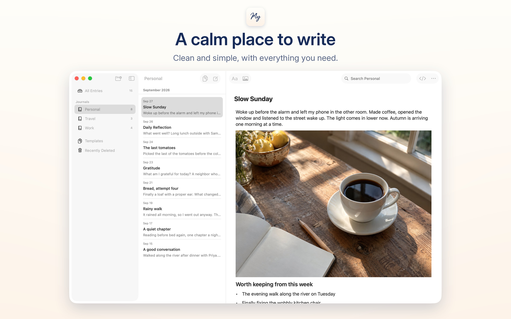
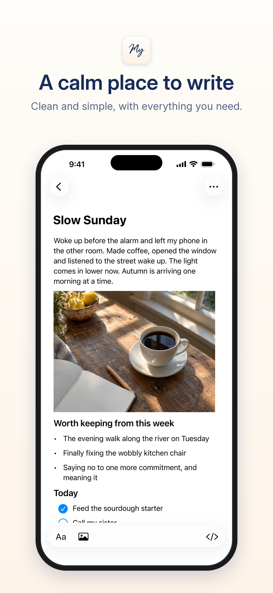
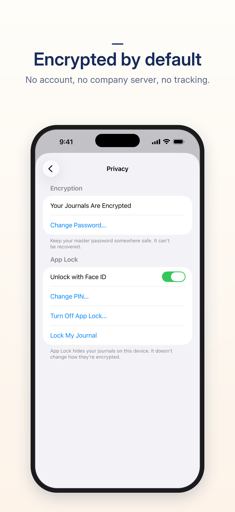
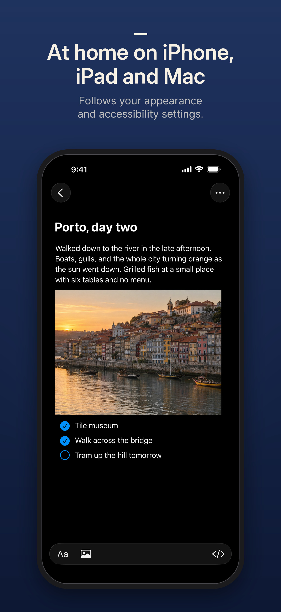

<p align="center">
  
</p>

<h1 align="center">My Journal</h1>

<p align="center">
  A private, end-to-end encrypted journal app for Mac, iPhone and iPad.<br>
  No account and no company server: sync through a server you host yourself, or not at all.
</p>

My Journal is an open-source journal with a clean, simple interface that feels at home on your device. Your journals stay on your devices, encrypted by default, and sync only through a server you run: on your Mac, a home server or a host you choose, privately with Tailscale or over HTTPS. Entries are stored as Markdown in documented formats, and the apps and the server are licensed under Apache 2.0.

<p align="center">
  
</p>
<p align="center">
  
  
  
</p>

**Status: in testing.** The iPhone, iPad and Mac apps are coming to the App Store; there is no public release yet. You can [build them from source](docs/development.md) today. Until the first release, keep an [archive](docs/guide/backups.md) of anything you can’t afford to lose.

## Why My Journal

- **Simple on purpose.** The basics, done well: write, format, add images and find things again, with the controls, menus and shortcuts of your platform.
- **Your data stays yours.** No account, no company server, no analytics or tracking. Encryption happens on your device, and your server can’t read your journals. The formats are documented and the code is open source.
- **Self-hosted sync, or none.** Use your Mac as the server, run the container on a home server or VPS, or keep everything on one device.
- **Insights from your own writing.** Let the AI agent you already use, such as Claude or Codex, read the journals you choose over MCP, through your own sync server (which can be the one built into the Mac app). Access is read-only, per journal and revocable.
- **Pay once, or build it yourself.** One purchase will cover iPhone, iPad and Mac, with no subscription. Building from source is free.

## Features

### Writing

- Rich text with headings, bold, italic, underline, strikethrough, lists, checklists, quotes, code, tables, links and images. Your system’s spelling and correction settings apply.
- Markdown shortcuts as you type, and a source view for the Markdown itself.
- Images with descriptions for VoiceOver. Location data (GPS coordinates and place names) is removed when you add a photo.
- Separate journals, for example for personal and work notes, and editable templates, with a default template for each journal.
- Dated entries: the date is shown in the list and changed with Change Date.
- Search, and Find and Replace within an entry.
- On the Mac, View > Show Editor Only hides the sidebar and entry list for focused writing.

### Privacy and encryption

- End-to-end encryption, on by default. Entries, journal names, templates, images and image descriptions are encrypted on your device with AES-256-GCM, using a key protected by your master password. The server never receives your password or the key.
- Or choose Continue Without Encryption when you start, if you prefer readable files.
- App Lock with Face ID, Touch ID or your device passcode. On iPhone and iPad, journal content is hidden in the app switcher.
- Works offline. Everything is stored on your device, and nothing leaves it unless you set up sync.
- The [security model](SECURITY.md) lists exactly what a server can and can’t see.

### Self-hosted sync

- A small ASP.NET Core server with SQLite. Run it inside the Mac app (macOS 14 or later), as a standalone server on Linux or macOS, or as a non-root container.
- Compose examples for a local container, [Tailscale](docs/self-hosting/README.md#tailscale) and [public HTTPS with Caddy](docs/self-hosting/https.md).
- Add a device by scanning a QR code on a device you already use, by signing in with your master password, or with a pairing code and a check code.
- Servers on your local network can be found with Bonjour, if you turn on the optional announcer.
- If an entry changes on two devices at once, both versions are kept for you to review. Nothing is overwritten silently.
- Server backups and restores with integrity checks.

### History, recovery and backups

- Version History keeps earlier versions of each entry on the device, so you can restore one.
- Recently Deleted brings back deleted entries, journals and templates.
- Export all your journals to an archive, and restore or import it later, on any device.

### Agent access

- Let an AI agent read the journals you choose through your sync server's MCP address, and ask it about a month, a habit or a pattern.
- Read-only, per journal and revocable, with a list of recent activity. No AI service is built in.
- See [agent access](docs/guide/agent-access.md) for what agents can read and what to consider before sharing.

### Native and accessible

- Native SwiftUI apps: three columns on the Mac and iPad, familiar stacked navigation on iPhone.
- Follows your appearance, text size and accessibility settings, and works with VoiceOver and the keyboard.

## How it compares

Apple Notes and Notion are good general tools for notes, documents and shared workspaces. Apple’s Journal app and Day One are made for journaling. My Journal is deliberately smaller, and differs in a few ways:

- **Where your journals live.** Apple Notes and Journal sync through iCloud with your Apple Account; Notion and Day One sync through their own services with an account. My Journal has no account: you choose where sync runs, or don’t sync at all.
- **Who can read them.** Encryption is on by default and happens on your devices. Your server never receives your master password or the key that unlocks your journals.
- **Made for journaling.** Dated entries, separate journals and templates, rather than pages, databases or wikis.
- **Open.** The apps and the server are open source under the Apache License 2.0. Entries are CommonMark Markdown with GitHub-style tables and task lists, and the sync, encryption and archive formats are documented in [protocol](protocol/README.md).
- **Your agents, your terms.** You decide which agent reads which journals, and you can revoke access at any time.

## Get My Journal

| Platform | Status |
| --- | --- |
| iPhone and iPad (iOS and iPadOS 16 or later) | In testing. Coming to the App Store. |
| Mac (macOS 14 or later) | In testing. Coming to the App Store. |
| Sync server (Linux, macOS or a container) | Run it yourself; see [self-hosting](docs/self-hosting/README.md). |
| Windows, Android and Linux | Planned, after the Apple apps. |

- **App Store:** coming soon. One purchase covers iPhone, iPad and Mac, and supports development.
- **TestFlight:** a public beta is planned.
- **Build from source:** free. You need a Mac with Xcode; see [development](docs/development.md).

The Apple apps are the first clients. Apps for other platforms will each follow their own platform’s conventions and use the same open protocol, encryption and data format, so your journals can move with you.

## Run your own sync server

Sync is optional. The simplest setup is your Mac: choose Settings > Sync > Use This Mac… (see [Sync](docs/guide/sync.md)). To run the server in a container on another computer:

```sh
git clone https://github.com/ralphkrauss/my-journal.git
cd my-journal
docker compose -f deploy/compose.yaml up -d --build
docker compose -f deploy/compose.yaml exec journal setup-code
```

Enter the setup code in the app with Connect to a Server…. This container listens on `127.0.0.1:8080` only. To reach it from your other devices, use the [Tailscale](docs/self-hosting/README.md#tailscale) or [public HTTPS](docs/self-hosting/https.md) setup. [Self-hosting](docs/self-hosting/README.md) covers backups, updates and reverse proxies.

## Questions

- **Do I need a server?** No. Without one, your journals stay on the device you write on. A server is only needed to sync between devices.
- **Can the person running the server read my journals?** Not with encryption on. They can see things like how many entries you have, their sizes and when your devices sync; the [security model](SECURITY.md#what-the-server-can-see) lists everything.
- **What if I forget my master password?** Nobody can reset it, and your server never receives it. A device that has your journals keeps opening without it, and you can add devices by pairing; see [troubleshooting](docs/guide/troubleshooting.md#i-forgot-my-master-password).
- **Can I get my entries out?** Yes. Export Archive saves all your journals, images and earlier versions in a [documented format](protocol/archive.md) that other clients can read.

## Using My Journal

The [user guide](docs/guide/README.md) covers:

- [Getting started](docs/guide/getting-started.md): create your journal and choose a master password
- [Sync](docs/guide/sync.md): use your Mac or your own server, and [self-hosting](docs/self-hosting/README.md) for running the server
- [Devices](docs/guide/devices.md): add and remove devices
- [Backups](docs/guide/backups.md): export and restore archives
- [App Lock](docs/guide/app-lock.md) and [agent access](docs/guide/agent-access.md)
- [Updating](docs/guide/getting-started.md#update-my-journal) and [deleting your data](docs/guide/troubleshooting.md#delete-your-data)
- [Troubleshooting](docs/guide/troubleshooting.md)

## Help and feedback

Questions, problems and ideas are welcome. [Open an issue](https://github.com/ralphkrauss/my-journal/issues/new/choose); [SUPPORT.md](SUPPORT.md) says what to include. Issues are public, so never post journal text, passwords, recovery keys or setup codes.

Report security problems privately through the repository’s Security tab, as described in [SECURITY.md](SECURITY.md).

## For developers

- [Development](docs/development.md): build the apps and the server, and run the checks and tests
- [Architecture](docs/architecture.md): components, data flow, storage, sync, encryption and agent access
- [Protocol](protocol/README.md): versioned contracts for encryption, sync, pairing, archives and agent access, with test vectors
- [Contributing](CONTRIBUTING.md), [changelog](CHANGELOG.md) and [all documentation](docs/README.md)

| Path | Contents |
| --- | --- |
| `apps/apple/` | iPhone, iPad and Mac apps (SwiftUI) and the shared JournalCore Swift package |
| `server/` | Sync server (ASP.NET Core, EF Core, SQLite) and its tests |
| `protocol/` | Versioned contracts and test vectors |
| `deploy/` and `packaging/` | Compose files for local, Tailscale and public HTTPS hosting, and package contents |
| `scripts/` | Build, check, packaging and end-to-end test scripts |
| `docs/` | User guide, developer documentation and design records |

## License

© 2026 Ralph Krauss. Licensed under the [Apache License 2.0](LICENSE); see also [NOTICE](NOTICE). Third-party components are listed in [ThirdPartyNotices.txt](apps/apple/JournalApp/Resources/ThirdPartyNotices.txt). See the [Privacy Policy](PRIVACY.md) for how My Journal handles your data.

Apple, iPhone, iPad, Mac, App Store, Face ID and Touch ID are trademarks of Apple Inc., registered in the U.S. and other countries and regions.
