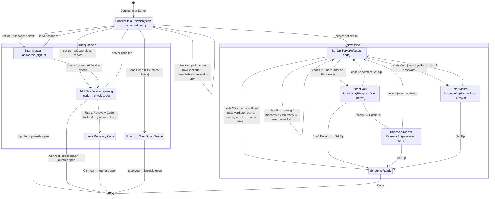

# Connect to a Server: step-by-step onboarding (revision 4)

Supersedes the screen layout of `effortless-connection.md` revisions 1–3. The protocols it describes (discovery,
setup codes, scanned invites, check codes, password sign-in) are unchanged. Only how the steps are presented changes.

## Problems in revision 3

The owner reported these problems while setting up a new server from TestFlight build 4:

1. **The setup code isn't formatted as it's typed.** The field shows exactly what was typed, so `fpjsur35` stays lower case with no hyphen.
2. **It's unclear whether "Master Password" means creating one or entering one.** The same section header and label appear:
   - when a new password is being created for a new server;
   - when a device that already has a journal enters that journal's existing password.

   Nothing says which case applies, or why a password is needed.
3. **A new setup can't skip encryption.** The combined screen always created an encrypted journal.
4. **Set Up stays greyed out with no explanation.** The button is disabled whenever a requirement isn't met, and several requirements are invisible:
   - On a device that already has a journal, "Upload Local Journals" had to be switched on. It defaults to off, and the footer doesn't say it's required.
   - A new password shorter than 12 characters keeps it disabled. The 12-character rule sits in a long footer.
5. **One long form carries every decision:** code, password, upload and encryption. Its contents change depending on hidden state.

## Principles, from the research

The sources are the Apple HIG (onboarding and entering data), NN/g on wizards and disabled buttons, RFC 8628 on user codes, and how Obsidian Sync, Day One, 1Password, Bitwarden and Apple Advanced Data Protection handle end-to-end encryption.

- **One decision per screen, pushed on a navigation stack.**
  - Back keeps what was typed.
  - Buttons are labelled with the action: Continue, Set Up, Sign In.
- **Creating and entering a password are different screens with different titles.**
  - The server's state decides which screen appears, never guesswork.
  - The create screen says why the password is needed and that it can't be reset. It has a Verify field, because there is no reset.
- **Encryption is its own choice, before the password.**
  - End-to-end encryption is preselected.
  - The other option says plainly who can read the journals, and that the choice can't be changed later.
- **A primary button is disabled only while its required field is empty.** Anything else is checked when the button is tapped:
  - the error appears under the field;
  - focus moves to the field;
  - VoiceOver announces the error.
- **Codes use one native text field, never per-character boxes.**
  - Input is forgiving: upper case, hyphens, spaces and pasted text are all accepted.
  - The hyphen is inserted as someone types at the end of the code.

## Flow

### Where busy and failure states live

Busy and failure states always stay on the step where the button was tapped. Nothing is pushed until the work
succeeds.

| Step | Busy row | Failure → primary |
|---|---|---|
| Connect to a Server | spinner on the chosen row or beside Continue | error section · Continue |
| Set Up Server | "Checking…" / "Setting Up…" | error under the field · Continue / Set Up |
| Protect Your Journals | "Setting Up…" (Don’t Encrypt) | error section · Try Again (picker disabled once the journal exists) |
| Choose a Master Password | "Setting Up…" | error under the field, or error section · Try Again |
| Enter Master Password (set up) | "Setting Up…" | "That password isn’t correct." under the field · Set Up |
| Enter Master Password (sign in) | "Signing In…" | error under the field, or error section · Sign In |
| Add This Device | "Waiting for approval…" / "Connecting…" | error section · Get New Code / Try Again |
| Use a Recovery Code | "Connecting…" | "That recovery code isn’t correct or has already been used." under the field · Connect |

- **A journal created here but a server that failed:** the error reads "Your journal is saved on this device, but the server couldn’t be set up. ‹reason›". The primary button becomes "Try Again", and the fields and picker stay disabled, so the choice and password can't change.
- **A failed install, when this device's journals were being copied:** "Couldn’t finish connecting. Your local journals remain on this device. Try again, or cancel to keep writing." The primary button becomes "Try Again".
- **The server changed while connecting:** the sheet returns to the root with the existing message. Choosing the server again checks it afresh.
- **The app locks:** the sheet closes, as now. A locked app opening the sheet shows "Unlock My Journal to connect to a server."

### Once a journal exists

The local journal is created only when Set Up is tapped, just before the server call (`model.start`). Once it exists:

- The Protect Your Journals and Choose a Master Password steps are removed from the path. If the server then rejects the code, the path becomes `[Set Up Server]` with the error under the code. That step's button reads "Set Up" and reuses the password still held in memory, so the person never retypes it.
- Back can never reach a choice that's already fixed.

## Screens

The sheet is a `NavigationStack(path:)` using the existing grouped `Form`.

**iOS**
- Root: Cancel on the leading side and the primary button on the trailing side, as now.
- Pushed steps: the system back button with swipe back, and the primary button on the trailing side. Swiping down dismisses, except while installing.
- When Back is hidden (busy, or a journal was created here), Cancel appears in the leading slot.

**macOS**
- Sheets show no navigation title, so every step starts with its title as a heading row (`.headline`, as today's "Finish on Your Other Device").
- Button order is `[Cancel] … [Back] [Primary]`: Cancel as `.cancellationAction`, and Back as a toolbar button placed before the primary `.confirmationAction`.
- The system back chevron is hidden, and Return triggers the primary button.
- If `NavigationStack` inside a sheet misbehaves on macOS 13, the Mac swaps content on the same step enum instead.

**Busy**
- A status row with a spinner carries the label.
- The primary button stays in the toolbar, disabled, so the toolbar doesn't shift.
- Fields are disabled.

**Errors**
- An error about a field is red callout text directly under that field, in the same section. It is also the field's accessibility hint.
- Focus moves to the field, and then the error is announced.
- Other errors use the existing red section at the bottom.

**Button enabling**
- A primary button is disabled only while a required field is empty, or while busy.
- Everything else is checked when the button is tapped.

**Copy:** the serial comma throughout.

### 1. Connect to a Server (root, unchanged)

- Scan Code (iOS, empty library).
- Servers on This Network.
- Server Address.
- Continue.

Choosing a server checks it, then pushes the step for that server.

### 2. Set Up Server

- **Title:** Set Up Server.
- **Server:** `LabeledContent("Server", host)`.
- **"Setup Code" section:**
  - One `TextField`: monospaced, prompt `XXX-XXX`, `.characters` autocapitalization, autocorrection off, the ASCII keyboard. Not `.oneTimeCode`.
  - **Formatting while typing:**
    - When the text grows at its end (typing or pasting), it is normalized:
      - ASCII upper case;
      - spaces, hyphens, and dashes removed;
      - a hyphen after the third character.
    - Any other edit is left as typed, so the cursor never jumps and nothing typed disappears.
    - The code isn't submitted automatically when it's complete.
  - **Footer:** "Enter the code your server shows when it starts. To see it again, run setup-code on the server." Below it, the link "How to Set Up a Server".
- **Additional footer line,** when this device has journals that upload without a password: "The journals on this device will be uploaded to ‹host›." If they aren't encrypted, it adds: "They aren’t encrypted, so anyone with access to the server can read them."
- **Primary button:** "Continue". It reads "Set Up" when no further step follows: the no-password case above, or a journal already created here.
- **On tap:**
  - **Checked locally:**
    - Not 6 characters: "Enter the 6-character setup code from your server."
    - Another character: "Setup codes use letters and the digits 2–9, without I or O."
  - **Then checked with the server,** with `POST /v1/setup/check` when it advertises `setup-check`. Older servers check the code at Set Up instead.
    - "That setup code isn’t correct. Check the code on your server."
    - "Too many incorrect codes. Try again in a few minutes."
- **Busy:** "Checking…".

### 3. Protect Your Journals

This step appears only when this device has no journal. It has the same title, and the same option wording, as Start a Journal.

- **Intro row (secondary):** "Encryption protects your journals before they leave this device. You can also turn it on later in Settings." (Encryption can be turned on later since enable-encryption.md.)
- **Picker:** `.inline` on iOS, with checkmark rows; `.radioGroup` on macOS. Each label is a title with a secondary subtitle beneath it.
  - **Encrypt** (the default): "Recommended. Only your devices can read your journals."
  - **Don’t Encrypt:** "Anyone with access to your files, server, or backups can read your journals."
- **Primary button:** "Continue" with Encrypt, "Set Up" with Don’t Encrypt.

### 4. Choose a Master Password

Start a Journal uses the same screen, with the same Verify pattern.

- **Intro row:** "Your master password encrypts your journals on this device before they’re sent to ‹host›."
- **Fields:**
  - "Master Password" (`.newPassword`).
  - "Verify" (`.newPassword`).
  - Show Password (a toggle that reveals both).
- **Second section (text only, secondary):** "You’ll use this password to sign in on your other devices, restore backups, and recover your journals if you lose your devices. It can’t be reset, so save it in your password manager."
- **Primary button:** "Set Up". It is enabled when both fields are filled.
- **On tap:**
  - "The passwords don’t match." (Verify)

### 5. Enter Master Password (setting up from a device with journals)

The device keeps only the encrypted key, not the password. Setting up the server needs the password to derive the server's recovery secret, so this step can't be skipped.

- **Title:** Enter Master Password. For older libraries the title and label use the credential name ("Recovery Key", "Access Password").
- **Intro row:** "Enter the master password for the journals on this device. Your other devices will use it to sign in to ‹host›."
- **Field:** "Master Password" (`.password`).
- **Footer:** "The journals on this device will be uploaded to ‹host›."
- **Primary button:** "Set Up".

### 6. Server Is Ready

- **Layout:**
  - Back is hidden. The primary button is "Done", and there is no Cancel.
  - A large `checkmark.circle` (secondary, hidden from VoiceOver) sits above the heading "Server Is Ready" and the text "Your journals will sync with ‹host›."
- **Button:** "Add Another Device…" opens Add Device on this device, in a sheet over this one.
- **Footer,** with encryption only: "You can also sign in on your other devices with your master password."

### 7. Enter Master Password (joining a set-up server)

- **Title:** Enter Master Password, or the older credential name.
- **Intro row:** "Enter the master password you chose when you set up ‹host›."
- **Field:** "Master Password" (`.password`).
- **Footer:**
  - Empty library: "Your journals will download to this device."
  - Otherwise: "The journals on this device will be added to ‹host›. Journals already there are kept." When this device already has its own library, it adds: "This device will then use this master password."
- **Second section:** the "Use a Connected Device Instead…" button.
- **Primary button:** "Sign In".
- **Errors:**
  - "That password isn’t correct."
  - "Too many password attempts on this server. Try again in a few minutes, or use a connected device."
- **The upload toggle is removed** on every join path. The footer states what happens, decided by `libraryIsEmpty`. A library with nothing written in it yet is replaced instead of uploaded.

### 8. Add This Device (pairing code)

- **Title:** Add This Device.
- **Content:** the pairing code, Copy Code, the instructions, and then the check code with Connect (⌘Return). The copy is unchanged.
- **Footer:** the same upload or download line as step 7.
- **Back** cancels the request, replacing "Use Master Password Instead".
- **Passwordless servers:** the root pushes this step directly, and it adds "Use a Recovery Code Instead…".
- **Primary button:** "Connect" while a check code is shown; "Get New Code" or "Try Again" after a failure.

### 9. Use a Recovery Code

- **Title:** Use a Recovery Code.
- **Field:** "Recovery Code".
- **Footer:** "Ask your server administrator for a one-time recovery code." It is followed by the step 7 upload or download line.
- **Primary button:** "Connect".

### Scanned code (unchanged)

"Finish on Your Other Device", with Try Again or Scan Again.

## Add Device on the connected device

The Enter Code step formats the pairing code the same way as the setup code:

- digits in groups of three (`123 456 789`) as they're typed at the end;
- a monospaced font;
- Continue checks for 9 digits: "Enter the 9-digit code from your new device."

## Accessibility

- Every field keeps its label through `headedField`. A field's error is also its accessibility hint, and is announced after focus moves to the field.
- Picker rows read as "‹title›, ‹subtitle›", selected.
- The Server Is Ready checkmark is hidden from VoiceOver.
- Everything works with Dynamic Type and keyboard navigation. Return submits a step, except the check-code Connect, which is ⌘Return.

## Review

- **Revision 4, first pass:** approved with required changes. The changes covered:
  - the path once a journal exists;
  - which screen owns each busy and failure state;
  - wording matched to Start a Journal, with Verify added there too;
  - why the step 5 password is needed;
  - the upload statement on every join path;
  - the macOS button order;
  - an actionable Server Is Ready screen;
  - the setup-code character copy.

  All are incorporated above.

## Not in this revision

A generated recovery key with save or print, as in Apple Advanced Data Protection. The master password stays the only recovery secret, as it is everywhere else in the app.

## Owner decisions after testing (2026-09-29)

- Setup codes are six characters, shown and stored as `XXX-XXX` (32^6 ≈ 1.07 billion codes; SetupAttempts limits
  guessing). An older server's eight-character code is replaced with a new one when the server starts.
- A master password has no minimum length ("This is a journal, not a bank"); only an empty one is refused. The 12
  character rule and its footers are removed from Choose a Master Password, Start a Journal, Change Password and
  Check Your Password. SECURITY.md notes that a short password is easier to guess offline from server data or backups.
- Found while testing: choosing the test server from Servers on This Network, which still ran a server without
  `setup-check`, let a wrong code through until Set Up. Deploying the new server closes this; the flow already
  returns to Set Up Server with the error and reuses the password.

## Code review and owner testing (2026-09-29)

An independent code review found no critical issues. Fixed:

- **A just-installed credential could be revoked.** Access granted by pairing was revoked if the sheet closed while installing finished, even though the library already used it. Now it's revoked only when the library doesn't use it.
- **Add This Device stayed empty after a failure on the previous step.** Errors are now checked per step.
- **Servers not yet updated couldn't be set up.** Without `setup-check`, an eight-character code is still accepted.
- **Connecting a library with journals by typed code uploaded them without asking.** The confirm button now reads "Connect and Upload", replacing the old opt-in toggle as explicit consent. Password sign-in keeps its footer statement.
- **Finishing a pairing didn't require the check code.** Installing now requires a confirmed check code or a scanned code.
- **A server set up by someone else meanwhile made the error loop.** The flow returns to the first screen.
- **Tables could leave the editing flag set.** The flag is now tracked by identity, so a table ends its focus even while it's being torn down.

Owner testing on the Mac found that two confirmation-placed toolbar buttons show only one, so Back replaced Sign In, and that the title appeared twice. The Mac now uses the system back button, and shows the heading row only before macOS 26. Every password field in the flow has Show Password.
