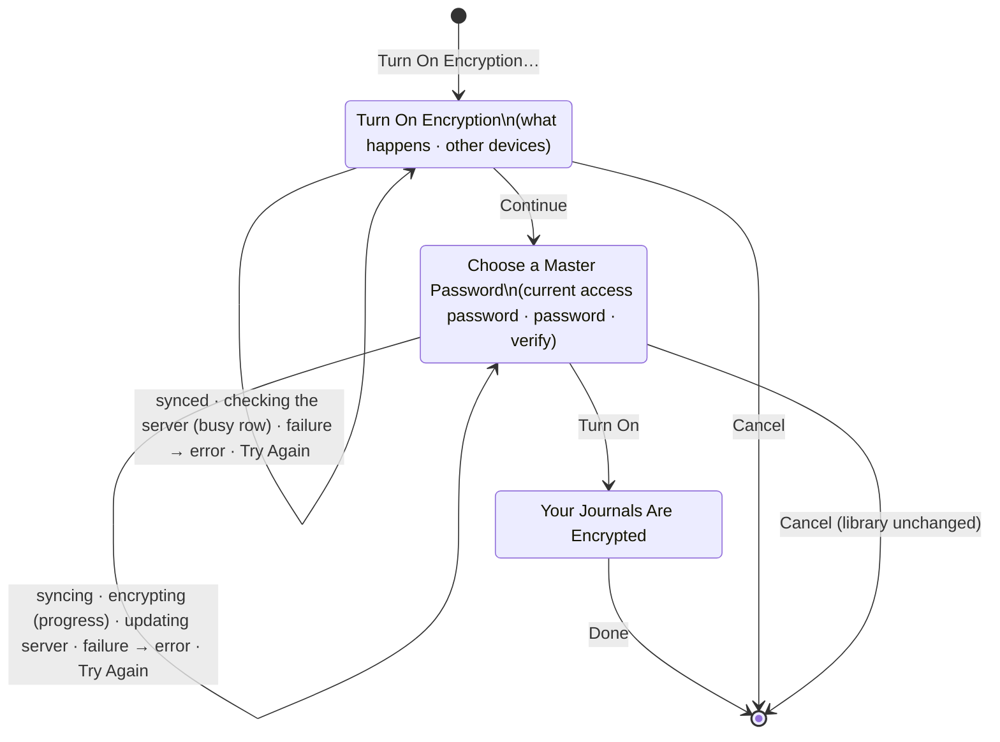

# Turn On Encryption for an existing library (proposal)

Status: implemented (local and synced cases, server capability `encryption-upgrade`). UI design (section 3) approved after independent review.

Owner request: turn on encryption after a library was created without it, with the same clean flow as creating one. Today it's impossible by design: `JournalStore.init` refuses to reopen a store in another mode (Store.swift, `content-protection` setting), the server refuses mode changes (`POST /recovery/password` returns 409 `unsupported_format`), and protocol/README.md says "There is no in-place mode conversion". Settings > Privacy says "Encryption is chosen when a journal library is created." (SettingsView.swift), and onboarding says "You can’t change this later." (ConnectionSteps.swift `protect`).

## 1. What an unencrypted library stores today

Formats 3 (legacy access password) and 4 (no password) use `ContentProtection.plaintext` (Crypto.swift). Everything below is readable by anyone with file access:

- **Local store** (`<data>/vault-<uuid>/journal.sqlite`, WAL): `records`, `outbox`, `conflicts`, `history` (conflict/recovery versions and up to 50 checkpoints per item, StoreCheckpoints.swift) and `reconcile_heads` all hold base64 of the record JSON. `settings` holds the cursor and server identity only.
- **Images:** `attachments/<uuid>`, raw bytes (StoreAttachments.swift, `addAttachment`).
- **Vault key:** a random 32-byte key is still generated and kept in the Keychain (NewVault.swift, `AppModel.load`), but unused for content. Each v4 device has its own; it is never shared.
- **Server** (one vault per server, server/src/Journal.Api/Data/JournalDb.cs): `Records` (current payload), `Changes` (every revision ever, "Changes are never removed"), `Operations` (receipts reference `Changes`; older rows keep a whole `ResponseJson` copy), `Attachments` rows plus immutable image files, `journal.pre-migration.db` (a full copy made before each schema migration), SQLite free pages/WAL, and any admin backups (`--backup`, protocol/server-backup.md) wherever the administrator put them.
- **Other devices:** each holds its own plaintext store, its own local-only Version History, and possibly unsynced edits and images.
- **Archives** made earlier: header version 2, readable database and images (Archive.swift). The app doesn't track where they were saved.

## 2. What turning on encryption must do

Principle: build a complete encrypted copy beside the current library, verify it, switch with the one atomic configuration write the app already uses for connecting and archive import (`switchToServerVault`, `installArchive` in AppModel.swift), and remove the plaintext only after the encrypted copy is safe everywhere it needs to be.

### Local re-encryption (every library)

1. Finish the pending save (`finishPendingSave`), then block changes as connecting does (`vaultReplacement`). Check free space first: the copy needs about the library's size.
2. Generate a **new** vault key and a format-2 envelope from the password (`VaultCrypto.makeRecovery(... formatVersion: 2)`). Don't reuse the old device key.
3. New `JournalStore.reencryptedCopy(to:key:)` in JournalCore: for every row in `records`, `history` (keeping `saved` and `checkpoint`), and `conflicts`, base64-decode the plaintext bytes and seal **those exact bytes** with the same AAD (`recordContext`). Copying bytes rather than re-encoding `JournalItem`s preserves records this version can only read (`preservedJSON`) and avoids normalization. Images are sealed with `attachmentContext` under the **same IDs**. Record and image IDs stay the same, so agent grants (AgentAccess.swift, `journalIDs`), `lastJournalID`/`lastEntryID` and other devices' records still match. Unlike `importAsNewJournals`, nothing is remapped or duplicated.
4. Server state starts over: every record gets revision 0, `dirty=1` and a fresh outbox operation; images are marked to be checked before upload (`uploaded=2`); `reconcile_heads`, the cursor and the server identity aren't copied. The copy is marked for reconciliation, so it compares the server's content before uploading: another device that signed in again first may have sent the same journals and images, which are matched by decrypted content rather than shown for review or refused as a different image (red-team finding SYNC-1). For the same reason, a write refused as stale whose server version decrypts to the same bytes adopts the server's revision.
5. Verify before switching: `validateSchema`, `validateSnapshot` (integrity plus every image authenticates), and a comparison showing that every row's decrypted bytes equal the source bytes.
6. Commit: write the key to a new Keychain account, then one `persistConfiguration()` with the new `recovery`, `storageFolder`, `keyID`, `passwordChecked = true` and `recoveryConfirmed = true`, keeping App Lock settings. The old folder and key go to `supersededLibraries`, which are removed only once the new library opens and, if connected, has synchronized (SupersededLibraries.swift). A crash before the commit leaves the old library untouched. Nothing removes a stray staged folder today, so the staged folder's name is saved in the configuration (the `encryptionUpgrade` marker below) before staging, and the next launch removes it. A crash after the commit opens the encrypted library.

### Synced libraries: the server must purge, so the protocol must change

Re-uploading ciphertext as new revisions would leave every plaintext revision in `Changes` and every plaintext image (immutable) on the server. So the server has to empty and re-key its vault. Proposed capability `encryption-upgrade`, with **POST /v1/recovery/encrypt** (device-authenticated, rate-limited like password changes):

- Request: `operationId`, the new envelope (`salt`, `wrappedKey`, `iterations`, `recoverySecret`, `formatVersion: 2`), `afterCursor`/`afterRecord`/`afterRevision` (the last change this device applied), and `currentRecoverySecret` for format 3 only. Format 4 has no password, so the device credential is the authorization; it already grants full read/write access there.
- Under the write gate, in one transaction: refuse if the vault is already encrypted (409 `unsupported_format`), unless it's the same operation and envelope (idempotent retry → 200). Refuse with 409 `server_changed` if the log advanced past `afterCursor`, meaning another device wrote meanwhile. Otherwise replace the envelope and verifier, set format 2, delete all `Records`, `Changes`, `Operations`, `Attachments` and `PairRequests` rows, **revoke every other device**, assign a new `SyncId`, and set a `PurgePending` flag.
- After the commit: delete image files and `journal.pre-migration.db`, run `wal_checkpoint(TRUNCATE)` and `VACUUM` so deleted pages don't keep plaintext, then clear `PurgePending`. Startup finishes a pending purge. Returns the new `serverId`.
- Revoking the other devices is essential. A device still in plaintext mode must never push plaintext into the encrypted vault or receive ciphertext it would misread.
- The requesting device keeps its credential, so a sync of its unencrypted library must not run across the switch (red-team finding SYNC-2): it would see a new identity, compare everything again and re-upload readable records. Besides the sync gate (client order below), SyncEngine reads GET /recovery whenever the server's identity isn't the one the library last synchronized with, and stops as if signed out when the format implies the other protection mode. The server also refuses a record payload that parses as JSON once the vault is version 1 or 2 (400 `unencrypted_record`). Images can't be told apart from ciphertext, so they rely on the client checks.

Client order for a synced library: (a) sync fully, then hold the library's sync gate, so a sync already running finishes first and none runs again until (e) replaced the library, (b) stage and verify the encrypted copy, (c) save an `encryptionUpgrade` marker in the configuration (staged folder, new key account, envelope, `afterCursor`), (d) call the endpoint, (e) commit as in step 6 and let normal sync upload everything. The device keeps its credential, and the old library is removed only after that upload finishes. On `server_changed`, discard the stage and start over from (a) automatically, once. If the response is lost or the app quits between (d) and (e), the marker resumes at the next launch: GET /recovery/envelope matching the marker's envelope means the server converted, so commit. If the server is still unencrypted, discard the stage and marker; nothing changed.

Offline: a synced library can't be encrypted offline, since that would leave the server plaintext and the devices split. Show an error instead. Local-only libraries work offline.

### Other devices

They can't learn the new key without the password or pairing; there is no per-device key delivery. Each must **sign in once**. After the purge its sync gets 401, and public GET /recovery shows format 2 where the device expected 3/4. The app shows "Enter Master Password" (below) instead of "This device no longer has access." With the password (or with Add This Device from the upgraded device), it:

1. re-encrypts its own whole store with the received key (the same `reencryptedCopy`), so its Version History and unsynced edits are kept;
2. reconciles with the new server identity using the existing rules (SyncReconciliation.swift), with one change: content equality compares **decrypted** bytes, because the two devices' ciphertexts differ. Equal records adopt the server revision, records the server lacks are uploaded, and an offline edit that differs becomes a normal conflict for review. Nothing is duplicated or dropped;
3. removes its plaintext library after that sync.

Today's reconnect path (`recoverServer` with `uploadLocal` → `importAsNewJournals`) would **duplicate every journal**, so this rejoin path must ship with the server endpoint.

### What can't be purged: say so, don't pretend

Earlier archives, admin server backups, Time Machine/iCloud device backups and filesystem snapshots, and deleted blocks on disk. The done screen and SECURITY.md say that backups and archives made earlier aren't encrypted.

### Turning encryption off

Not offered. It would publish decrypted content to the server and backups irreversibly, it isn't requested, and it doubles the migration and test surface. Workaround today: export an archive, then create a library without encryption and import it. Revisit separately if asked.

## 3. UI design (revision 3)

This section replaces the proposal's first sketch of the interface. It follows the step-by-step pattern of Connect to a Server (connection-onboarding.md):

- one decision per screen on a `NavigationStack`;
- busy and failure states on the step where the button was tapped;
- errors under their field;
- the Choose a Master Password screen reused as it is.

The work belongs to the app model, not to the sheet (`EncryptionUpgrade`, owned by `AppModel`). Closing the sheet's window doesn't stop it, and presenting the sheet again shows its current state.

### Where it starts

Settings > Privacy > Encryption, when the library isn't encrypted (formats 3 and 4):

- Row: "Encryption Is Off" (unchanged).
- Button: **"Turn On Encryption…"**. Disabled while locked or while the library is being replaced (connecting, importing).
- Footer: "Anyone with access to your files, server, or backups can read your journals." It replaces "Encryption is chosen when a journal library is created."

**Encryption was turned on from another device** (see "Other devices" below):

- The row reads "Encryption Is Off". "Turn On Encryption…" is replaced by **"Sign In…"**.
- Footer: "Encryption was turned on from another device. Sign in to keep syncing."

**Encrypted libraries** are unchanged: "Your Journals Are Encrypted", Change Password…, and the existing footer. There is no way to turn encryption off.

The button opens a sheet, "Turn On Encryption", with three steps.

- Both platforms use a `NavigationStack(path:)` with the grouped `Form`.
- On the Mac it's sized like Connect to a Server (min 440 × 460, ideal 480 × 560).
- On Macs before macOS 26, each step starts with its title as a heading row, as in Connect to a Server.

### Step 1. Turn On Encryption

Why a first step:

- Before choosing a password, the person learns that encryption can't be turned off.
- When synced, they also learn what their other devices need.
- Onboarding also explains encryption (Protect Your Journals) before Choose a Master Password.

There's no choice to make here, so there's no picker and no icon: as on Protect Your Journals, the icon is kept for the done screen.

- **Title:** Turn On Encryption.
- **Intro row** (secondary text, clear row background):
  - Not synced: "Encryption protects your journals on this device. Only your devices can read them. You can’t turn encryption off later."
  - Synced: "Encryption protects your journals on this device and on ‹host›. Only your devices can read them. You can’t turn encryption off later."
- **Section "Your Other Devices"** (synced only), two text rows:
  - "Before you continue, update My Journal on your other devices and let them sync."
  - "Your other devices will stop syncing until you sign in on each one with your master password. Changes they haven’t synced are kept. Any that conflict are shown for review."
  - "Agents with access to your journals on ‹host› lose it. Give them access again afterward." (Added during implementation at the lead's request: the server removes agent grants with everything else.)
- **Footer, on an empty section:** "You can’t write while your journals are being encrypted. This can take a few minutes if you have many images."
- **Toolbar:** Cancel (`.cancellationAction`), **Continue** (`.confirmationAction`, Return).
- **On Continue:**
  - Not synced: checks free space, then pushes step 2.
  - Synced: shows the busy row "Checking ‹host›…". It checks free space, that the server is reachable, that it supports turning on encryption, and that this device still has access. Then it pushes step 2.
- **Errors** appear in the error section at the bottom. The primary button becomes "Try Again".
  - "Couldn’t reach ‹host›. Check your connection and try again."
  - "‹host› needs an update before you can turn on encryption."
  - "There isn’t enough space to encrypt your journals. Free up ‹size› and try again." ‹size› uses `ByteCountFormatter` (file style).
  - "This device no longer has access to ‹host›. Connect again in Settings > Devices, then try again." (a 401 while the server is still unencrypted).
  - "Encryption was turned on from another device. Sign in to keep syncing." (a 401 with the server already encrypted, or `unsupported_format`). The primary button becomes **"Sign In…"**. It closes this sheet and opens the sign-in described below.

‹host› is the server's host name. For the server this Mac runs itself, it reads "the server on this Mac", and step 1 uses the not-synced intro, since "on this device and on the server on this Mac" would repeat itself.

### Step 2. Choose a Master Password

The same screen as onboarding step 4, with the same fields, Verify, Show Password and footer. There is no minimum length.

- **Title:** Choose a Master Password.
- **Intro row:**
  - Not synced: "Your master password encrypts your journals on this device."
  - Synced: "Your master password encrypts your journals on this device before they’re sent to ‹host›."
- **Format 3 only, first section, header "Current Access Password":**
  - One field, "Current Access Password" (`.password`).
  - It's checked against this device's copy of the access password when Turn On is tapped, before anything starts.
  - Error under the field: "That password isn’t correct."
  - Synced, the server checks it again at the end. If the server has since limited attempts, its error "Too many password attempts on this server. Try again in a few minutes." appears under the field.
- **Section:**
  - "Master Password" (`.newPassword`).
  - "Verify" (`.newPassword`).
  - The toggle "Show Password", or "Show Passwords" when the current access password field is shown; it reveals every field.
- **Footer section:** "You’ll use this password to sign in on your other devices, restore backups, and recover your journals if you lose your devices. It can’t be reset, so save it in your password manager." This is the onboarding copy word for word.
- **Toolbar:**
  - iOS: the system Back button with swipe back. When Back is hidden (busy), Cancel takes the leading slot.
  - Mac: Cancel and the system back button.
  - Primary: **"Turn On"**, enabled when every field is filled. It reads "Try Again" after a failure that isn't about a field.
- **Return order:** Current Access Password → Master Password → Verify → Turn On.
- **On Turn On:**
  - A mismatch shows "The passwords don’t match." under Verify, as in onboarding. It's checked on tap; focus moves to Verify, and the error is announced.
  - A wrong current access password shows its error under that field, and focus moves there.
  - Otherwise the fields are disabled and Back is hidden. VoiceOver announces "Turning on encryption". A busy section appears below the fields:
    1. Synced: "Syncing…" (spinner row), so this device has every change on the server.
    2. "Encrypting your journals…" with a determinate `ProgressView(value:)`, weighted by bytes (records and images). It reads as "Encrypting your journals, ‹n› percent".
    3. Synced: "Updating ‹host›…" (spinner row). VoiceOver announces "Updating ‹host›. You can’t stop this now."
  - Cancel stays enabled during 1 and 2. Tapping it stops the work, removes the partial copy, and closes the sheet. The library is unchanged, and no confirmation is asked.
  - From 3 onwards, Cancel is disabled and interactive dismissal is off, because the server is being changed.
  - When it finishes, the flow pushes step 3, and VoiceOver announces "Your journals are encrypted."
- **Errors after Turn On:** each leaves the library unchanged. Messages go in the error section, the fields are enabled again, the passwords stay, and the primary button becomes "Try Again".
  - "Couldn’t reach ‹host›. Encryption wasn’t turned on. Check your connection and try again."
  - "Your other devices are still syncing. Wait for them to finish, then try again." This appears after one automatic retry also found new changes on the server.
  - "There isn’t enough space to encrypt your journals. Free up ‹size› and try again."
  - iOS, when background time ran out: "Encryption stopped because My Journal was in the background. Keep My Journal open and try again."
  - Anything else: "Encryption wasn’t turned on. Your journals are unchanged."
- **The server changed, but this device couldn't finish** (for example the disk filled while switching):
  - The sheet stays up, with no Cancel and no interactive dismissal. The error reads "Your journals are encrypted on ‹host›, but this device couldn’t finish. Free up space, then try again."
  - The only button is "Try Again".
  - If the app quits anyway, the next launch finishes automatically (the `encryptionUpgrade` marker). If that also fails, the sheet is presented again at launch on every platform, in this same state: the message, Try Again, and no Cancel. Writing stays paused until it succeeds. The Mac pause notice shows the same message, with "Show Progress".

### Step 3. Your Journals Are Encrypted

This step is laid out like Server Is Ready.

- **Toolbar:** no navigation title, and Back is hidden. The primary button is **Done**, and there is no Cancel.
- **Heading section:** `lock.shield` (secondary, 48 pt, hidden from VoiceOver), the heading "Your Journals Are Encrypted" (`.title2.bold()`, header trait), and "Only your devices can read your journals."
- **Synced only, section "Your Other Devices":**
  - Text: "On each of your other devices, choose Sign In and enter your master password, or add it from this device."
  - Button: "Add Another Device…", which opens Add Device in a sheet over this one, as on Server Is Ready.
- **Footer:** "Archives and backups made before now aren’t encrypted. Anyone who has them can still read them."

After Done, Settings > Privacy shows "Your Journals Are Encrypted" with Change Password…. When synced, this device then uploads the journals with normal sync, and the Sync Status shows "Saved on this device. Waiting to sync." until the upload finishes. The unencrypted copy on this device is removed once the upload is complete.

### While encrypting

- **iPhone and iPad:** the sheet covers the app, and it can't be swiped away while busy. Background time is requested (BackgroundActivity). Other iPad windows can't edit, since the library is being replaced, as when connecting.
- **Mac:**
  - The journal window shows the existing pause notice with new copy: "Writing is paused while this Mac encrypts your journals."
  - Its button, "Show Progress", brings the Settings window forward on the Privacy tab, as "Show Connection" does now, and presents the sheet in its current state.
  - Closing the Settings window (⌘W or the close button) doesn't cancel. Only the sheet's Cancel does.
  - Editing is blocked as when connecting (`vaultReplacement`).
- **The app locks** (App Lock) before "Updating ‹host›": the work stops, the sheet closes, and the library is unchanged, as with Connect to a Server. Once the server step has started, it finishes, and the result is shown after unlocking.
- **Relaunching after a crash or force quit:**
  - Before the switch, the partial copy is removed and the old library opens.
  - After the server changed, the switch finishes quietly.
  - No dialog is shown in either case.

### Other devices after the switch

A device whose server was encrypted from another device gets 401. The public recovery parameters then show format 2, while this library is format 3 or 4. That state has its own message and action everywhere a sync problem shows. The message is "Encryption was turned on from another device. Sign in to keep syncing."

- **Sync Status toolbar menu:** the message, and **"Sign In…"** in place of Try Again.
- **Settings > Sync:** the message as the footer, with "Sign In…" under the server address.
- **Settings > Devices:** the message and "Sign In…" replace "This device no longer has access." and "Connect Again…".
- **Settings > Privacy:** as described under "Where it starts".

"Sign In…" opens Connect to a Server with this server already chosen and checked, directly on the existing Enter Master Password step. Its title comes from the server's format 2, so it reads "Enter Master Password", not the local "Access Password". The copy differs:

- **Intro:** "Encryption was turned on from another device. Enter the master password you chose there."
- **Footer:** "The journals on this device will be encrypted too. Changes that haven’t synced are kept."
- "Use a Connected Device Instead…" stays, and adds the device with a pairing code as usual.
- **Busy:** "Signing In…", then "Encrypting your journals…" with the same determinate progress.
- **Errors:** as in onboarding step 7.

This device's journals keep their identities. Anything already on the server is matched, not duplicated. An offline edit that differs from the server becomes a normal "This entry has changes from another device." review.

### Other copy changes

- Onboarding, Protect Your Journals intro: "Encryption protects your journals before they leave this device. You can’t change this later." becomes "Encryption protects your journals before they leave this device. You can also turn it on later in Settings."
- Connect to a Server's upload warning for unencrypted libraries is unchanged.
- Importing an archive made before encryption into this library keeps the library encrypted: the archive's journals are added with this library's key (`importAsNewJournals`). No warning is needed.

### Accessibility

- Every field has a visible label: its title, as on onboarding's Choose a Master Password.
- Field errors are the field's accessibility hint, and they're announced after focus moves to the field.
- The progress row is one element: label "Encrypting your journals", value "‹n› percent".
- These are announced: the start ("Turning on encryption"), the server step ("Updating ‹host›. You can’t stop this now."), completion, and errors.
- Icons are hidden from VoiceOver. Nothing relies on colour: errors are text, with red as a secondary cue.
- **Dynamic Type:** every text row wraps (`fixedSize(horizontal: false, vertical: true)`). The heading and icon scale.
- **Keyboard:** Return submits each step. Escape and ⌘. cancel on the Mac. Tab moves between fields.
- There is no animation beyond system navigation, so Reduce Motion needs nothing extra.

### Design review

- **Revision 1, independent review:** APPROVED WITH REQUIRED CHANGES. Revision 2 addresses all nine required changes:
  1. A server that changed while this device couldn't finish no longer leaves the person stuck. The sheet stays with Try Again, and the same message appears in Settings and the Mac notice.
  2. A 401 now leads somewhere. A revoked device is told to connect again. A server already encrypted from another device leads to Sign In, in step 1 and in Privacy.
  3. The format-3 current password is checked locally before encrypting starts.
  4. The copy no longer says "while your journals are encrypted", which read as a permanent state.
  5. Step 1 says other devices stop syncing and that conflicts are shown for review.
  6. The other-device message is now "Encryption was turned on from another device…". The sign-in title comes from the server's format.
  7. The done footer states that earlier archives and backups stay readable, and no longer gives advice the app can't back up.
  8. VoiceOver announces the start and the server step, and the label claim is corrected.
  9. Closing the Mac Settings window doesn't cancel, and Show Progress reopens the sheet in its current state.

  Optional suggestions adopted:
  - no icon on step 1;
  - one sync, after Turn On;
  - an actionable "still syncing" error;
  - progress weighted by bytes;
  - "Show Passwords" when there are three fields;
  - the ‹host› wording for this Mac's own server;
  - the upload-after-Done behaviour stated;
  - archive import stays encrypted.
- **Revision 2, re-review:** APPROVED WITH REQUIRED CHANGES. The one required change: iOS had nowhere to explain a failed finish after relaunch. Revision 3 presents the sheet again at launch in its failed state on every platform.

  Optional suggestions adopted:
  - the not-synced intro for this Mac's own server;
  - "Turning on encryption" as the first announcement;
  - "You can’t stop this now." instead of "cancelled";
  - step 3's other-devices text naming both ways.

  This is a single, localized change, so there was no further review. The design is approved for implementation.

## 4. Plan

Both cases ship together (owner decision): the local-only case first, then the server endpoint, the client marker and resume, and the other-device rejoin with decrypted-content reconciliation, protocol and SECURITY docs.

Tests that earn their place:

- **JournalCore, real SQLite:** convert a plaintext store with journals, entries, templates, checkpoints, a conflict, a permanent-deletion marker, an unreadable newer-client record and images. Every row and image decrypts to the original bytes; the new database and image files contain no plaintext canary string; the store refuses to open as plaintext; every record is queued at revision 0. Cancellation midway leaves the source untouched and removes the stage.
- **Restoration:** an archive exported afterwards restores only with the password; an archive made before still restores.
- **App crash points:** failure before the configuration write leaves the old library opening; after it, the new one opens. The marker with the server already converted commits; with it unconverted, it rolls back.
- **Server, real SQLite:** the endpoint removes every row and image, the pre-migration copy and the canary from the raw database file (after `VACUUM`). It revokes other devices, rotates the identity, is idempotent on retry, returns `server_changed` on a stale cursor, refuses already-encrypted vaults, and requires the current secret for format 3. A `PurgePending` flag set before a crash finishes at startup.
- **One end-to-end lane** (scripts/test-sync.sh): devices A and B on a format-4 server, with an offline edit on B. A turns on encryption, B signs in, and B's edit survives as a pending change or review with no duplicate journals. Server payloads are no longer readable JSON.

## 5. Risks and owner decisions

1. **Other devices must sign in again** (or be added with a code). Alternative: a new per-device key-delivery protocol, which is much larger. Recommended: accept this.
2. **Older app versions** on other devices would reconnect through the upload path and duplicate journals. Accept (pre-release; update all devices first), or have the server refuse joins that upload into an upgraded vault. Recommended: accept, and state it in release notes.
3. **Offline edits on other devices** become reviews rather than merging silently. Avoiding that needs extra protocol metadata (old revision numbers). Recommended: accept, since it's rare.
4. **A stolen format-4 device credential** could encrypt the server under an attacker's password and sign out the owner's devices. Their local copies survive, and that credential could already read and change everything. Recommended: accept for format 4 and require the current password for format 3.
5. **Writing is blocked** while encrypting (minutes for large image libraries). Recommended: accept, with determinate progress and Cancel.
6. **Phase 1 alone** (local-only) versus waiting for both phases before shipping anything.
7. **Turning encryption off** stays unavailable (recommended).

### Owner decisions (2026-09-29)

1. Accepted: other devices must sign in again (password or a connected device).
2. The app tells the person to update their other devices first (step 1, synced).
3. Accepted: offline edits elsewhere become conflicts for review.
4. Only libraries with an older access password (format 3) enter it first; format 4 relies on the device credential.
5. Accepted: writing pauses, with progress and Cancel.
6. Both the local-only and the synced case are built, local first.
7. Turning encryption off isn't offered. Archives and backups made earlier stay readable, and the done screen says so.
8. No minimum password length: password, Verify and Show Password exactly as onboarding's Choose a Master Password.

### Implementation notes (2026-09-29)

- **One error message added.** The server deletes every image it holds, so a synced library first downloads every image. If the server still has images this device hasn't downloaded, the flow stops with "Some images haven’t downloaded to this device yet. Keep My Journal open for a moment, then try again."
- **Agent grants.** The server removes agent access granted through it in the same transaction (coordinated with the server-based agent access work). Step 1 says so for synced libraries.
- **Verified:**
  - iOS UI test with screenshots of every step except progress. Encrypting an empty library finishes too fast to capture, so the progress row, the synced variants and the Mac sheet weren't seen on screen.
  - Tests: JournalCore copy and rejoin, app lifecycle on iOS and Mac, and the server endpoint with purge, rejection, rate limit and restart.
