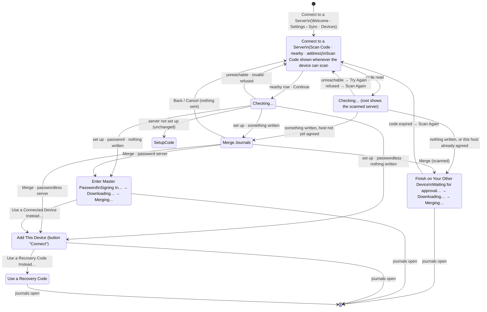

# Connect a device that already has journals (revision 3)

Status: revision 3, approved for implementation (see Review). Amends [connection-onboarding.md](connection-onboarding.md) (revision 4).
Everything that document says still applies unless this one changes it.

## Owner request

After the Mac was set up and connected to the server, the owner added an iPhone that already had a journal from
trying the app. On that iPhone the flow lost its conveniences: no Scan Code, and the server address had to be typed.
Trying the app first and connecting later is common. It should go through roughly the same flow as a new device, and
work really well. "This flow is quite exceptional so I would prefer that we do something simple and make it work
really well compared to having something half assed."

## Owner decisions (2026-09-30)

- **Same-name journals are combined into one.** The exception is the agent-access case in 2.3.
- **Templates:**
  - an identical template (same name and same content) isn't imported;
  - a template with the same name but different content goes through the existing conflict review.
- **Encrypted device, unencrypted server:** stays refused, with better copy.
- **Keep it simple.** Anything that isn't needed is cut.

## 1. Research

### 1.1 Current behavior

Evidence comes from the code, and from the build installed on the "Journal Test iPhone 17" simulator (built
2026-09-29 22:10, newer than every connection source file), with one journal and one entry, via Settings > Sync >
Connect to a Server…. The test server wasn't contacted.

- **The trigger.** `AppModel.libraryIsEmpty` (AppModel.swift:722) is
  `store == nil || (connection == nil && items.allSatisfy { $0.kind == "journal" })`.
  `NewVault.prepare` (NewVault.swift:31) saves the four built-in templates into every new library. So a library
  is "not empty" the moment Start a Journal finishes. Revision 4's "a library with nothing written in it yet is
  replaced" never happens for a library made with Start a Journal.

| | No library (as designed) | Device with journals (today) |
|---|---|---|
| Entry points | Welcome: Connect to a Server… (RootView.swift:262); Settings > Sync; Devices | Settings > Sync (SettingsView.swift:117); Settings > Devices |
| Scan Code | Shown on iPhone and iPad with a camera | **Hidden:** `canScan = model.libraryIsEmpty && ScanCodeView.available` (ConnectionView.swift:89–91) |
| Servers on This Network, Server Address | Shown | Shown, identical (see 1.2) |
| Sign in footer | "Your journals will download to this device." | "…will be added to ‹host›. Journals already there are kept. This device will then use this master password." |
| Add This Device button | Connect | "Connect and Upload" |
| Scanned code install | Replaces the empty library (ConnectionFlow.swift:419) | Unreachable; would throw "This device already has journals." (AppModel.swift:710) |
| Encrypted device, unencrypted server | n/a | Refused at Continue: "Encryption is off for this server…" (ServerEnvelopeCheck.swift:31), with no way forward |
| Importing | n/a | `importAsNewJournals` (AppModel.swift:831) gives every item a random new identity |
| Same-name journals, built-in templates | n/a | **Duplicated:** two "Default" journals, eight built-in templates |
| Retry after a partial upload | n/a | **Duplicated again:** see 2.1 |

### 1.2 Nearby servers do work

- `deploy/lan/announce.sh` publishes `_myjournal._tcp` with TXT `url=$JOURNAL_URL`.
- From this Mac, `dns-sd -L` resolved "My Journal on server" to `server.local.:18443` with
  `url=https://server.example.ts.net:18443`.
- The iOS target declares `NSBonjourServices` and `NSLocalNetworkUsageDescription`. The simulator listed the server
  within a second, even though its library had journals.

On the owner's iPhone, the likely causes are:

- Local Network access is off (Settings > Privacy & Security > Local Network > My Journal);
- or the phone wasn't on the server's Wi-Fi. mDNS doesn't cross Tailscale or cellular.

No change is proposed for discovery.

### 1.3 How other products handle it

- **Apple iCloud** asks whether to Merge local data when it's turned on
  ([Set up and use iCloud Contacts](https://support.apple.com/HT205754)).
- **Obsidian Sync** warns that existing notes "will be merged before proceeding"
  ([Obsidian Help](https://obsidian.md/help/sync/setup)).
- **1Password** signs a new device in by scanning a code from a signed-in device
  ([1Password community](https://1password.community/discussion/comment/646158)).
- **Signal** asks explicitly whether to transfer message history
  ([Signal Support](https://support.signal.org/hc/en-us/articles/360007320451)).
- **Day One** warns that signing in or out can lose unsynced entries
  ([Day One](https://dayoneapp.com/guides/troubleshooting/sign-in-sign-out-with-day-one-sync/)).
- **Bear** users clean up duplicates by hand after enabling sync
  ([Bear community](https://community.bear.app/t/how-do-i-merge-unintentional-duplicate-notes/14439)).

**Takeaways**

- Keep one way to connect.
- Ask once, plainly, before anything leaves the device. Name the destination, and use Merge as the action.
- Never lose anything.
- Never create duplicates, including on retry.

## 2. Behavior

### 2.1 Merging (every join where this device's vault differs from the server's)

This covers sign in, pairing code, scanned code and recovery code. It doesn't apply when the device already belongs
to that vault (reconnecting after access was revoked, or signing in after encryption was turned on elsewhere). Those
keep today's same-identity paths (`snapshot`, `reencryptForRejoin`).

After a grant is received, the staged library is built in this order, all before the configuration is committed:

1. **Pull.** A plain `synchronize()` of the empty staged store, which has nothing to push yet.
   - Busy label: "Downloading…".
2. **Import.** This device's items are saved into the staged store with the rules in 2.2–2.4. Saving queues them.
   - Busy label: "Merging…".
3. **Push.** `synchronize()` again. There's no separate re-check.
   - If another device moves a combine target to Recently Deleted between steps 1 and 3, the merged entries arrive
     in a journal that is in Recently Deleted. Today's lifecycle already handles this like any offline write into a
     journal someone deleted: the entries show in Recently Deleted with their journal and can be restored.
   - Nothing is lost. Test 3 confirms it.
4. **Commit and remove.** Commit the configuration, then remove the old library after the first sync (as today).

**Identities are derived, so the merge is idempotent.**

- Every imported record and image gets
  `UUID(SHA-256("myjournal-merge-1" ‖ serverIdentity ‖ originalID))`, with the version and variant bits set.
  - `serverIdentity` is the status `serverId`, or the normalized address when an older server doesn't report one.
  - The hash reveals nothing about the original random ID.
- So a retry with a new grant, or a retry after the app was killed between push and commit, produces the same
  identities. The pull in step 1 then brings back whatever the earlier attempt pushed.
- **What an earlier attempt already sent keeps its identity.** When the server has a record with an item's derived
  identity, that identity is used before any name matching, so a journal or template edited or renamed between
  attempts is an ordinary edit of it, not a combine or a review.
- **When an imported record's identity is already on the server:**
  - Same content: nothing is imported.
  - Different content, when the server's copy is a version an earlier attempt from this library queued: the local
    content is saved as an ordinary edit on the server's revision. Before anything is sent, each attempt records in
    the device's library a digest of every payload it queued (setting `merge-queued`, by derived identity), and the
    next attempt compares the server's payload with those.
  - Different content otherwise (another device changed it meanwhile, or another device with a copy of this library,
    such as one restored from its backup, merged first): it becomes a change to review, exactly as a template does
    in 2.4. The revision alone can't tell these apart: two copies of one library derive the same identities.
- **Images with derived IDs never upload directly.**
  - They're stored in the existing "verify" state (`uploaded = 2`, `attachmentsToVerify`). Sync asks
    `server.hasAttachment(id)` first and uploads only when the server lacks it.
  - This matters because the server refuses to overwrite an image ID. A direct re-upload on retry would be refused,
    and the entry would wait forever.
  - An image already in the staged store (downloaded in step 1) is used as is.
  - Only images that something imported uses are staged: a record, an earlier version or a version awaiting review.
    An image only a left-out template uses isn't uploaded.
  - An image whose file is gone from this device is left out, as synchronizing does; the entries that use it are still
    merged.
- **Nothing is left out without a trace.** Earlier versions and versions awaiting review of a combined journal or a
  template the server has go to the server record's Version History. A built-in template with earlier versions or a
  change awaiting review is imported like any template the person made. The old library is removed only after that.
- **A server restore that changes `serverId` between attempts** produces new derived identities. Restoring a backup
  taken before the attempt leaves everything once. One taken after part of the attempt can leave a second copy of
  what that part sent. That's rare and acceptable: nothing is lost, and the extra copies can be deleted.
- Archive import keeps random identities (`importAsNewJournals`). Only merging uses derived ones.

### 2.2 Journals

- **Matching.** A local journal whose title matches a server journal is combined with it.
  - The match trims spaces and ignores case.
  - Only server journals that aren't in Recently Deleted count.
  - If several match, the oldest is used.
- **Combining.** The local journal's entries (including archived and Recently Deleted ones) get the server journal's
  ID as `journalID`. The server journal keeps its name and settings.
- **Everything else** is added as its own journal, numbered ("Default 2") when its name is taken
  ([journal-name-uniqueness.md](journal-name-uniqueness.md) §4.5, which amends this section).
- **Agent-access exception.**
  - A server journal an agent was given with Selected Journals is never a combine target. The local journal is added
    separately, with a number. Agents with All Journals don't count: they read the journal either way.
  - Checked after the grant with `ServerClient.journalsAgentsCanRead`, whose result goes to `importMerging` as it
    is. That function belongs to agent access and follows its options.
  - When it returns nil (it isn't known which journals agents read), no journal is combined. That's the conservative
    choice.
- **Agents on This Mac** (local agent connections) were removed from the app by a later owner decision, so the Merge
  step no longer mentions them.

### 2.3 Templates

A local template is handled by the first rule that applies:

1. **Built-in and never edited, with no earlier versions or change awaiting review:** not imported. The person
   didn't write it, and the server has its own. This holds even when the server's copy was edited. *Amended
   2026-10-04 by [no-built-in-templates-2026-10-04.md](no-built-in-templates-2026-10-04.md): only when the server has
   a template of that name; if it has one only in Recently Deleted, the built-in goes there too (unless that copy has
   the same text), and otherwise it's added, since new libraries no longer have built-ins.*
   - "Never edited" means its title and text equal an entry in `BuiltInTemplates.shipped`: literal title and Markdown
     text pairs, only ever appended to, so a later wording change can't make an old untouched template look edited.
     Text is compared as Markdown lines without blank ones, so a template read back as Markdown still matches.
2. **In Recently Deleted:** imported as a deleted template, without matching.
3. **Same name and the same content as a server template** (the name trimmed and case-insensitive; the document
   equal): not imported.
4. **Same name, different content, one template of that name on each side:** becomes a change to review on the
   server's template (2.4). When either side has more than one template of that name, every one of them is added as
   its own template.
5. **Otherwise:** added as a new template.

A local journal's default template follows its template:

- to the server template, if it was skipped or became a review;
- to its derived ID, if it was added;
- to none, if it was an unmatched unedited built-in (since 2026-10-04 such a built-in is added, and the default
  follows it).

When the journal was combined, the server journal's own setting is kept.

### 2.4 A change to review: feasibility

**Verdict: feasible and robust, using the machinery that already handles two devices editing one template offline.**
No new UI is needed, and one sentence of copy changes.

**How it's recorded,** in the staged store, after the pull, for server template `S` at revision `n`:

- `records(S)`:
  - payload: this device's template, with the ID, kind and date of `S`, and this device's title, document and
    modification time;
  - revision `n`;
  - `dirty = 1`;
  - no outbox row.
- `conflicts(S)`:
  - payload: the server's version as pulled;
  - revision `n`;
  - device: the nil UUID, the "unknown device" that `keepChangedVersion` already uses;
  - modified: the server version's modification time.
- The local template's Version History is imported under `S`.

This is exactly the state `apply` produces when a pulled change meets a local edit:

- the outbox join holds back pushes until it's resolved;
- a later server change updates the conflict row and keeps the superseded one in history (`recordConflict`,
  `preserveSupersededConflict`);
- `resolve` checks the revision and both payloads, writes both originals to history, and enqueues the choice based on
  revision `n`. Keep Both adds the server version as a new template.

**What the person sees.** The existing UI:

- the "Changes need review" icon on the template's row in Templates;
- Settings > Sync > Changes to Review;
- `ConflictNotice` in the template's detail view;
- `EntryConflictReview`, which already accepts templates (`ConflictRouting`: any kind except journal), with This
  Device / Other Device, Keep Both, and Keep One Version. "This Device" is this device's template, which is accurate.
  "Other Device" is the server's.

Until the change is resolved, this device shows its own version and other devices keep the server's, as with any
conflict.

**Copy fix, needed now anyway.** EntryConflictReview says "Keep Both saves the versions as separate entries." For a
template it becomes "Keep Both saves the versions as separate templates."

**Risks, and how the tests cover them**

- The seeded row must use the pulled revision, or `resolve` throws `JournalError.conflict`. Test 3 covers this.
- A template matched by name must never also be added. Test 3 covers this.

### 2.5 Encryption

| This device | Server | Outcome | Merge step sentence |
|---|---|---|---|
| Not encrypted | Encrypted | Sealed with the server's key before upload | "They’ll be encrypted before they’re uploaded." |
| Own master password | Another master password | Sealed with the server's key; this device then unlocks with the server's password; App Lock settings are kept | "Afterward, this device uses the same master password as your other devices. Archives you exported earlier still open with the master password you use now." |
| Not encrypted | Not encrypted | Uploaded as is | "They aren’t encrypted, so anyone with access to the server can read them." |
| Encrypted | Not encrypted | **Refused** before any pairing request or grant | Error on the root (3.3) |

### 2.6 Nothing written

`libraryIsEmpty` is renamed `nothingWritten`. It's true only when all of these hold:

- there's no library, or it has exactly one journal, titled "Default", with no default template set and not in
  Recently Deleted;
- there are no entries at all, including Recently Deleted ones;
- every template, if any, is an unedited built-in (per `BuiltInTemplates.shipped`) and none is in Recently Deleted.
  Since 2026-10-04 a new library has no templates, which also counts (no-built-in-templates-2026-10-04.md);
- there are no pending conflicts;
- it isn't connected.

Such a library keeps today's replace path, which loses nothing the person made. There's no Merge step, and the copy
is "Your journals will download to this device." Everything else merges.

### 2.7 Consent and cancelling

- **Nothing that uploads is sent before Merge.**
  - A scanned code is checked (status, `pairing-invite`, envelope), but the pairing request, which asks the connected
    device to approve, is sent only after Merge.
  - On typed and nearby servers, Merge comes before Sign In or the pairing code, so no grant exists before it.
- **Consent holds until installing.** Sign In and Connect check again whether this device has journals to merge with
  a server the person hasn't agreed to (another window may have written meanwhile). If so, Merge Journals comes first
  and nothing is installed.
- **A grant that goes unused is revoked.**
  - A password sign-in's grant is revoked when its attempt fails, since signing in again asks for a new one.
  - A pairing grant and a one-time recovery code's grant can't be asked for again. They're kept, with the staged
    copy, for Try Again (`AppModel.retryGrant`). Leaving the flow (Cancel, Back, the sheet closing) gives them up:
    the grant is revoked and the copy removed (`giveUpRetry`).
- **Nothing is left behind.** When the new configuration can't be saved, the Keychain items written for it are
  removed. A staged `vault-` folder the configuration doesn't name, for example after a crash between sending and
  saving, is removed at a later launch with its Keychain items, once nothing changed in it for an hour, so a join in
  progress in another instance of the app is left alone.
- **Accepted:** when the app is killed while access is kept for Try Again, that access isn't revoked (it was only in
  memory), as with pairing before. The device stays in the Devices list, where another device can revoke it.
- **Cancel during "Downloading…" or "Merging…"** is disabled, as it is while installing today. Failures and Try
  Again are how the flow ends.
- **A failure while merging** says whether sending had started (3.3). Try Again finishes without duplicates (2.1).

## 3. Screens

Only changes are described. Toolbars, the macOS heading row, busy rows, error sections and accessibility follow
revision 4.

### 3.1 Flow

### 3.2 Merge Journals (new step)

**Title:** Merge Journals.

- Before macOS 26, the heading row carries the title. When the step appears, VoiceOver focus moves to it
  (`@AccessibilityFocusState`).

**Layout** (grouped `Form`):

1. **Intro row** (secondary, clear background):
   "The journals on this device will be merged with the journals on ‹host›."
2. **Section:**
   - `LabeledContent("Server", host)`, with text selection enabled.
   - `LabeledContent("On This Device", summary)`. The summary lists journals, then entries, then templates the person
     made or edited, then recently deleted items. Zero counts are left out, except journals and entries. Examples:
     - "1 journal, 1 entry"
     - "3 journals, 42 entries, 2 templates, 3 recently deleted"
3. **Footer** (secondary callout), in this order, each sentence only when it applies:
   - "Journals already on the server are kept. A journal with the same name as one there is combined with it, unless
     you chose that journal for an agent. Then yours is added with a number, such as “Default 2”." (amended by
     journal-name-uniqueness.md)
   - The encryption sentence from 2.5.
   - "To leave something out, cancel and delete it first, including from Recently Deleted."
   - "Merge only if ‹host› is your server."

**Toolbar:**

- iOS: system Back, and "Merge" as `.confirmationAction`.
- macOS: `[Cancel] … [Merge]`, using the system back button.
- Merge is ⌘Return, never plain Return, like Approve and Connect. On the Mac it has the help tag "Merge (⌘Return)"
  and the accessibility hint "Press Command-Return to merge."

**Interactions**

- **Merge on a typed or nearby server:** pushes Enter Master Password or Add This Device. Nothing is sent.
- **Merge on a scanned code:** the host is recorded as agreed for this sheet session. The pairing request is sent,
  and Finish on Your Other Device is pushed, with Back hidden and Cancel shown.
- **Back:** returns to the root. For a scanned code, the code is forgotten. **Cancel or swipe down** closes the
  sheet. Neither sends anything.
- **Rescanning within the same sheet session:**
  - A new code for the agreed host skips Merge.
  - A code for another host shows Merge again.
- **The summary updates** if the library changes while the step is open. The merge uses what's saved when joining
  starts (`flush`).
- **The app locks:** the sheet closes.

**States:**

- The step appears only after a successful check, so it has no loading or offline state of its own.
- Later failures show on the step doing the work (3.3).

**Accessibility**

- Rows read as "Server, ‹host›" and "On This Device, 3 journals, 42 entries".
- The footer is read in order.
- Dynamic Type wraps the rows, and the footer uses `fixedSize(horizontal: false, vertical: true)`.

### 3.3 Changes to existing screens

- **Root:**
  - Scan Code is shown whenever `ScanCodeView.available`; its footer is unchanged.
  - After a scan, the root shows the scanned server with the busy row "Checking…" until the check ends.
- **Enter Master Password, Add This Device, Use a Recovery Code:**
  - When Merge was shown, the upload footers are removed. The download footer stays for "nothing written".
  - The check-code button is always "Connect"; "Connect and Upload" is removed.
  - Busy labels: "Signing In…" or "Connecting…", then "Downloading…", then "Merging…".
- **Finish on Your Other Device:**
  - Pushed with the title "Connect to a Server"; "Finish on Your Other Device" is the heading of its instruction, as on
    the first screen before. The long title was cut off beside Cancel and Scan Again (found on the simulator).
  - Busy labels: "Waiting for approval…", "Downloading…", "Merging…".
  - An expired code shows the existing "This code has expired. Show a new code on your connected device." with Scan
    Again.
- **Failure while merging,** on any step:
  - after sending started: "Couldn’t finish connecting. Your journals are still on this device, and some may already
    be on ‹host›. Try again, or cancel to keep writing."
  - before (downloading or merging on this device): "Couldn’t finish connecting. Your journals are still on this
    device. Try again, or cancel to keep writing."
  - The primary button is Try Again, including on Use a Recovery Code, whose code was spent.
  - Content saved by a newer version can't be merged: "Update My Journal to merge the journals on this device. Some
    of them were saved by a newer version."
- **Refusal (encrypted device, unencrypted server),** on the root:
  "The journals on this device are encrypted, but ‹host› doesn’t use encryption. Turn on encryption in Settings >
  Privacy on a connected device, then try again."
  - For a scanned code, the primary button is Scan Again, since the connected device shows a new code afterward.
  - The generic `encryptionOff` text stays for other callers.
- **Set Up Server path:** unchanged. The server is empty, so there's nothing to merge.
- **Add Device on the connected device:**
  - Below the code: `LabeledContent("Server", host)`, so the host can be compared with Merge Journals.
  - The instruction becomes "On your iPhone or iPad, choose Connect to a Server, then Scan Code. If it already has
    journals, Connect to a Server is in Settings > Sync."
- **EntryConflictReview:** for a template, "Keep Both saves the versions as separate templates."

## 4. Security

- **Someone else's code** can no longer make this device upload without the Merge step:
  - it names the host that the TLS certificate proves;
  - the connected device's Add Device screen shows the same host;
  - it ends "Merge only if ‹host› is your server.";
  - it needs ⌘Return;
  - nothing that uploads is sent before it.
- **Nearby rows** are unauthenticated announcements, so they get the same step.
- **Encrypted journals** are never sent to an unencrypted server.
- **Agents** never gain access to merged entries by combining (2.2).
- **Grants** that aren't used are revoked (2.7).

## 5. Tests (useful tests only)

Which test covers which case. Core tests use real isolated stores and an in-memory server that follows the
protocol's revision, log and immutable-image rules. App tests use `FakeJournalServer`. The E2E checks use a
disposable real server.

| Case | Test |
|---|---|
| A trial library counts as nothing written; a renamed or extra journal, an entry in Recently Deleted, an edited or deleted built-in, or a review doesn't | `MergeTests.testOnlyAnUntouchedNewLibraryCountsAsNothingWritten` |
| The same after the app is opened again (templates read back as Markdown) | `MergeTests.testAReopenedNewLibraryStillCountsAsNothingWritten` |
| Same-name journals combine, keeping the server's settings; archived and deleted entries and images arrive | `MergeTests.testMergingCombinesSameNameJournalsAndReviewsOnlyDifferentTemplates` |
| A journal an agent reads isn't combined | same test (`readByAgents` passed as the app passes it); `AgentProbe` checks `journalsAgentsCanRead` on a real server |
| Unknown agent access combines nothing | `MergeTests.testUnknownAgentAccessCombinesNoJournal` |
| Identical templates and unedited built-ins aren't imported; a different same-name template goes to review; Keep Both, This Device and Other Device each resolve it, leaving nothing unsent | `MergeTests.testMergingCombinesSameNameJournalsAndReviewsOnlyDifferentTemplates` |
| Unencrypted device into an encrypted server: the server gets ciphertext only, records and images | `MergeTests.testAnUnencryptedLibraryIsEncryptedWithTheServersKey` |
| A device's own key merged into another key's server | every `MergeTests` scenario, and `MergeProbe` with recovery formats 1 and 2 |
| An encrypted device is refused by a server without encryption before anything is sent | `MergeJoinTests.testEncryptedJournalsAreRefusedByAServerWithoutEncryptionBeforeAnythingIsSent`; `ServerEnvelopeTests` |
| Failure while downloading, uploading images, after images but before records, part way through sending, or after sending but before commit (the app killed): no loss, no duplicates, no image sent again under its identity, nothing left waiting | `MergeTests.testEveryInterruptedAttemptRecoversWithoutLossOrDuplicates`; `MergeProbe` on a real server |
| Retry with a new grant | same tests: each attempt uses a new staged copy, as a new grant does |
| Offline mid-flow | the download and sending interruptions above use a lost connection |
| Edited after a failed attempt: an ordinary edit at revision 1, a review when another device changed it | `MergeTests.testChangesAfterAnInterruptedAttemptAreEditsOrReviews` |
| Two copies of one library (a device and one restored from its backup), each edited, merged one after the other: the second's version is reviewed against the first's | `MergeTests.testCopiesOfOneLibraryMergedFromTwoDevicesKeepBothVersions` |
| The target journal moved to Recently Deleted meanwhile: entries restorable with it | `MergeTests.testEntriesMergedIntoAJournalDeletedMeanwhileCanBeRestored` |
| The server restored between attempts (records, log and images of a backup from before, or from after part of the attempt, under a new identity) | `MergeTests.testARestoredServerBetweenAttemptsLosesNothing` |
| A large library across pages, interrupted part way | `MergeTests.testALargeLibraryMergesCompletely` |
| Template rules 2.3: Recently Deleted, several of a name, an unedited built-in whose server copy was edited, default templates following, an image in a reviewed template | `MergeRuleTests.testTemplateRulesFromTheDesign` |
| A template or journal edited or renamed after an interrupted attempt: an ordinary edit, not a review or combine | `MergeRuleTests.testEditsAfterAnInterruptedAttemptAreOrdinaryEdits` |
| An image missing on this device doesn't stop the merge | `MergeRuleTests.testAMissingImageDoesNotStopTheMerge` |
| Versions of a combined journal and a built-in with a change to review are kept | `MergeRuleTests.testVersionsOfWhatIsntImportedAreKept` |
| An image only a left-out template uses isn't uploaded | `MergeRuleTests.testImagesOnlyLeftOutTemplatesUseAreNotUploaded` |
| `BuiltInTemplates.shipped` is pinned and append-only | `MergeRuleTests.testShippedBuiltInTemplatesArePinned` |
| Content from a newer version is refused with merge copy | `MergeRuleTests.testContentFromANewerVersionIsExplainedForMerging` |
| A recovery code's access is kept for Try Again (no second code), the failure copy says whether sending started, and leaving the flow revokes it and removes the copy | `MergeRetryTests.testARecoveryCodeJoinKeepsItsAccessForTryAgainUntilTheFlowIsLeft` |
| A pairing grant waits for Try Again and is revoked with its copy when the flow is left | `MergeRetryTests.testAPairingGrantWaitsForTryAgainAndIsGivenUpWhenTheFlowIsLeft` |
| Writing after the server was checked still asks to merge before anything is sent | `MergeRetryTests.testWritingAfterTheServerWasCheckedStillAsksToMerge` |
| A configuration that can't be saved leaves no Keychain items | `MergeRetryTests.testAConfigurationThatCantBeSavedLeavesNoSecretsBehind` |
| A staged copy left by a crash is removed at launch; folders the configuration names and recent ones are kept | `MergeRetryTests.testACopyLeftByAnInterruptedJoinIsRemovedAtLaunch`, `testOnlyOldUnnamedCopiesAreRemoved` |
| An image that can't be read fails the merge instead of being lost | `MergeRuleTests.testAnImageThatCantBeReadFailsTheMergeInsteadOfBeingLost` |
| A template differing only in paragraphs is reviewed, not skipped | `MergeRuleTests.testATemplateThatDiffersOnlyInParagraphsIsReviewedNotSkipped` |
| Nothing asked of the other device before Merge; a new code for the agreed host skips Merge; another host asks again | `MergeJoinTests.testAScannedCodeAsksToMergeBeforeTheConnectedDeviceIsAsked`; `MergeUITests` |
| A trial library joins by scan without Merge | `MergeJoinTests.testANewLibraryWithNothingWrittenJoinsWithoutMerging` |
| A failed merge gives up its access, removes its staged copy and keeps the journals editable | `MergeJoinTests.testAMergeThatFailsGivesUpItsAccessAndKeepsTheJournals`; `MergeProbe` (revoked access stops working) |
| Cancel while a pairing grant waits for Try Again | `ConnectionRetryTests.testLibraryCannotChangeWhileAFailedConnectionWaitsForTryAgain` (existing) |
| End to end: a written iPhone scans, merges and ends with one "Default" holding both devices' entries | `MergeUITests.testMergeLocalJournalsWithAScannedCode` (native pairing lane) |

**Not automated, checked on the simulator:** the expired code after Merge (the connected device stops showing a code,
and the request ends after its five minutes), and the labels and layouts in section 3.

**Not tested:** copy, labels, plural wording, and view composition.

## 6. Cut from revision 1

- The "merge rules apply to nothing-written libraries" variant. The strict definition in 2.6 makes replacing safe.
- The optional nearby-list line "Or scan a code from a connected device". Scan Code sits directly above it.
- Open questions: both were decided by the owner.

## Review

**Revision 1 review: approved with required changes.** All are incorporated in revision 2:

1. Idempotent re-import, with derived identities (2.1) and tests 4.
2. No combining into a journal an agent can read (2.2). The note about local Mac grants was later removed with Agents
   on This Mac.
3. A stricter "nothing written", and a shipped-version list instead of today's text (2.6, 2.3).
4. The pull, import, re-check and push order, targets by ID, targets deleted meanwhile, and progress labels (2.1,
   3.3).
5. Recently deleted items in the summary (3.2).
6. The copy for the intro, archives and refusal.
7. Code expiry after Merge, and rescans in the same session (3.2, 3.3).
8. The cancel and revoke guarantee (2.7), with test 6.

Also:

- VoiceOver focus on the macOS heading row.
- Adopted optional items: the server host on Add Device, the "Merging…" label, and the "To leave something out…"
  line.
- Not adopted: the nearby-list scan hint (section 6).

**Owner decisions:** recorded above. The template conflict review was checked against Store.swift (`apply`,
`recordConflict`, `resolve`), ConflictRouting.swift and EntryConflictReview.swift, and is feasible (2.4).

**Revision 2 re-review: approved with required changes, applied in revision 3 without a further review:**

1. The re-check pull was dropped. `synchronizeOnce` pushes before it pulls and the import queues on save, so the
   order is: pull, import, `synchronize()`, commit. A target moved to Recently Deleted meanwhile is covered by the
   existing lifecycle, which test 3 confirms.
2. Images with derived IDs go through the verify path (`uploaded = 2`), never a direct upload. Test 4 covers this.
3. The Merge footer was shortened. The agent clause and the template sentence were removed.

Also adopted:

- a record whose server copy is at revision 1 imports as an ordinary edit;
- the shorter failure copy;
- template rule 4 without the extra branch;
- the note about `serverId` changing after a server restore.

The owner confirmed implementation and asked for extensive functional and design testing (section 5).

## Implementation (2026-09-30)

- **Found while checking the simulator:**
  - After the app was opened again, stored built-in templates read back as Markdown, so a trial library showed
    "4 templates" and counted as written. Templates are now compared as text
    (`JournalDocument.sameText`). `testAReopenedNewLibraryStillCountsAsNothingWritten` guards this.
  - The title "Finish on Your Other Device" was cut off beside Cancel and Scan Again. The step's title is now
    "Connect to a Server", with the heading inside (3.3).
- **Checked on an iPhone 17 simulator against a disposable server:**
  - a trial library scanning without Merge;
  - a written library scanning, then Merge, "Downloading…", "Merging…", and one "Default" with every entry;
  - the typed path: Merge (light, dark, largest text), Enter Recovery Key without footer, going offline while
    merging (failure copy, Try Again), then success;
  - the refusal for an encrypted device;
  - an expired code with Scan Again;
  - the Add Device server row;
  - a template review ("separate templates"), resolved with Keep Both.
- **Checked on the Mac:** only with off-screen renderings of the Merge and Finish steps (`MergeJoinTests` with
  JOURNAL_CAPTURE_DESIGN=1). The live Mac sheet and VoiceOver were not driven.

**Implementation review (2026-09-30): no silent data loss in the main path.** Its findings were fixed, each with a
test in section 5:

1. A recovery-code Try Again spent a new code. The code's access is now kept for Try Again.
2. Consent is now checked again when installing.
3. An edit made between attempts is now an ordinary edit, not a false review.
4. A missing image no longer stops the merge.
5. Versions of what isn't imported are now kept.
6. Nothing is left behind: Keychain items after a failed save, and abandoned staged folders.
7. The shipped template list is now literal.
8. The failure copy now says whether sending started, and newer content gets merge copy.
9. No orphan images are uploaded.

The Mac Connect to a Server sheet now fits the 528 pt Settings window (ideal height 340 pt, the steps scroll); checked in the real window with Merge Journals, and its Cancel and Merge buttons are inside the window.

**Follow-up review:** five regressions from those fixes were fixed.

- Only a missing image file is skipped; any other read failure fails the merge.
- Rule 3 compares the whole Markdown.
- The pin test checks the shipped texts too.
- Launch cleanup skips recently changed folders.
- Killing the app while a retry grant is held is accepted and documented.

**Red-team finding (2026-10-01):** two copies of one library, such as a device and one restored from its backup,
derive the same identities. When both were edited and merged, the second merge found the first one's version at
revision 1 and replaced it as an ordinary edit. An ordinary edit now needs proof that this library queued the
server's version in an earlier attempt (2.1); anything else is reviewed. The same holds for something an earlier
attempt sent that the server moved to Recently Deleted since (journal-name-uniqueness.md §4.5, rule B): this device's
differing content stays an ordinary change only when the server's content, apart from the deletion, is what this
library queued.
`MergeTests.testCopiesOfOneLibraryMergedFromTwoDevicesKeepBothVersions` guards this.
