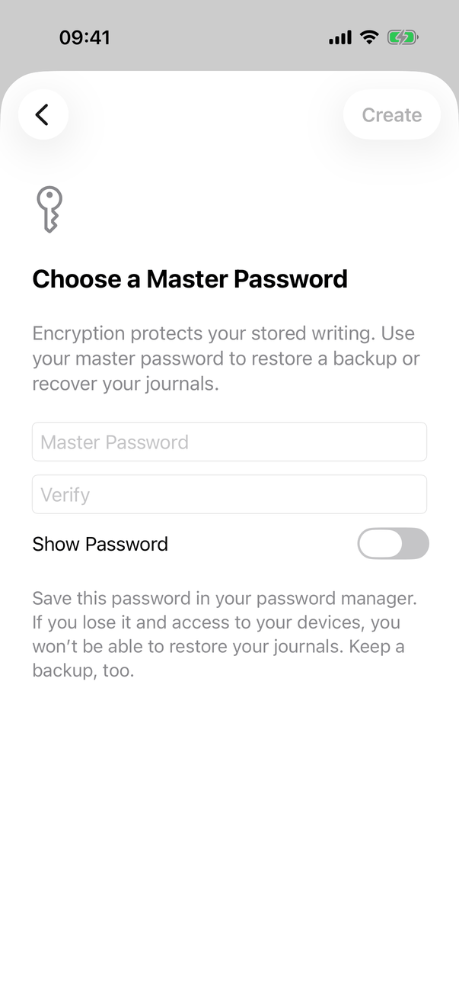
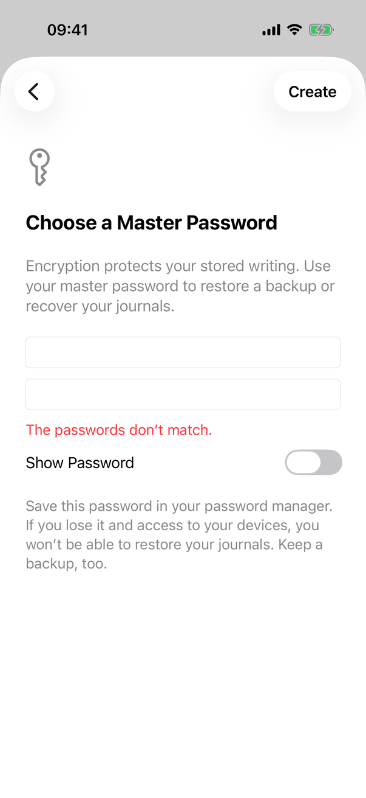
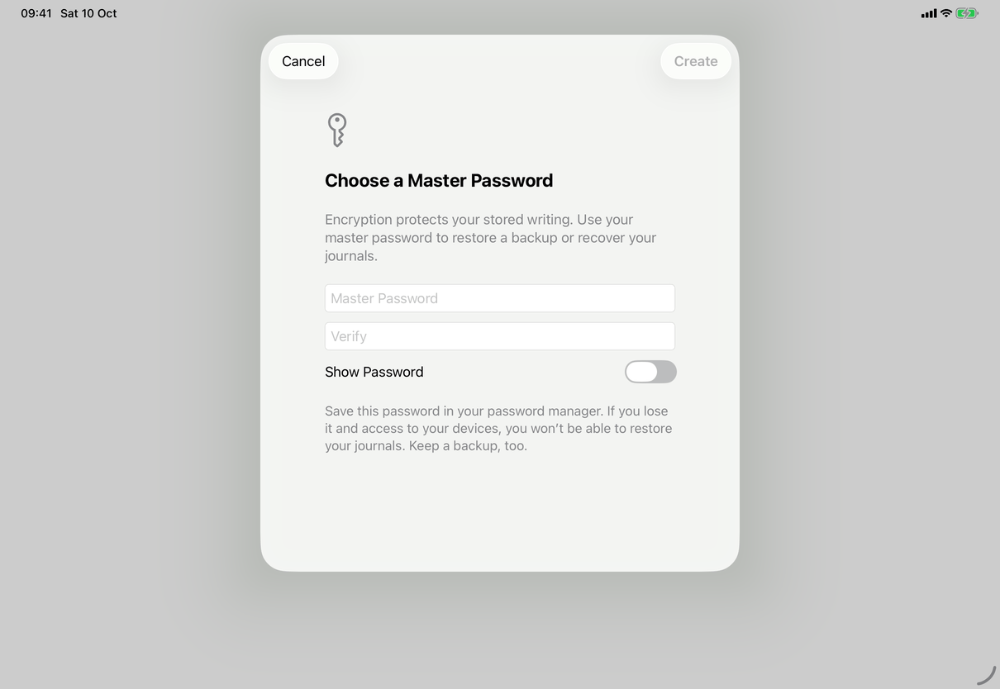
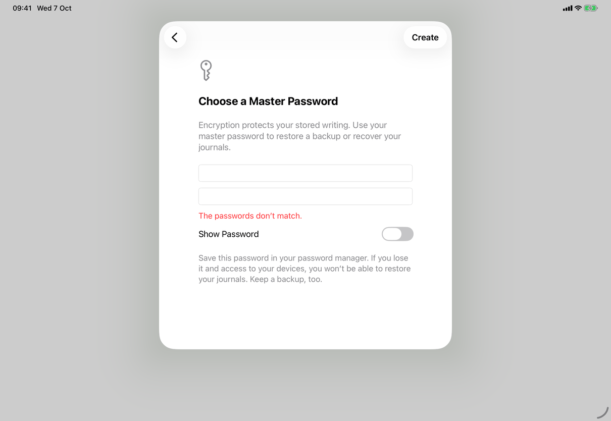

# Create a library (Apple)

Implements [flows/create-library](../../../flows/create-library.md), opened from Start a Journal on [screens/welcome](../screens/welcome.md). The view holds the English text as literals; the copy keys named here are the spec's keys for the same text.

## Controls

- **Presentation.** `RootView` presents `.sheet(isPresented: $creatingLibrary) { CreateJournalView() }`. While `creatingLibrary` is true the window's general error alert is suppressed, so a failure shows only inside the sheet.
- **Container.** `CreateJournalView` (`Views/CreateJournalView.swift`) is a `NavigationStack` with `.interactiveDismissDisabled(busy)` and one screen (1.1). `choosingPassword`, `pushesPasswordStep` and `create(encrypted:)` are gone; iPhone and iPad no longer push a page and the Mac no longer has Back.
- **The step.** A `ScrollView` with a left-aligned `VStack(spacing: 24)`, `.padding(28)`, `.frame(maxWidth: 480, alignment: .leading)` inside a full-width frame, `.disabled(busy)` and `.navigationTitle("")`, so the navigation bar and the Mac sheet header carry no title. Contents: a `.largeTitle` secondary `key` symbol (hidden from accessibility); the heading in `.title2.bold()` (`common.chooseMasterPassword`); secondary `Text` `library.createLibrary.explanation`.
- **Fields.** `MasterPasswordFields` (same file): two fields, Master Password (`common.masterPassword`) and Verify (`common.verify`), as `SecureField`, or `TextField` while the `Toggle` `common.showPassword` is on; `.passwordAutofill(creating: true)` on both (the `.newPassword` content type; whether the system then offers a strong password for an app without associated domains is unverified, open question D61), `.autocorrectionDisabled()`, `.textFieldStyle(.roundedBorder)`, and `.textInputAutocapitalization(.never)` on iOS. Return in Master Password focuses Verify; Return in Verify runs `create()` when `canCreate`. A red `.callout` `Text` shows `problem` (`messages.connection.passwordsDontMatch`); any edit to either field clears it. Below the fields: `.callout` secondary `Text` `library.createLibrary.advice`. The first field takes focus when the sheet appears, requested through the `focusRequest` binding and taken 400 ms later (`.task(id:)`).
- **When present.** The model's error as plain red `Text` (`model.error`, for example `messages.password.enterMaster` from `NewVault.prepare`, which the interface never reaches because Create is disabled for an empty field) and `ProgressView("Creating…")` (`library.createLibrary.creating`) while `busy`.
- **Toolbar.** Cancel (`.cancellationAction`, `role: .cancel`, `common.cancel`): clears both fields and dismisses; disabled while busy. Create (`.confirmationAction`, `common.create`), `.disabled(!canCreate)` where `canCreate` is not busy and both fields non-empty. No `.keyboardShortcut` is set.
- **Create.** `create()` compares the two fields; a difference sets `problem`, requests focus on Verify and calls `announceForAccessibility`, and nothing is created. There is no minimum length. Otherwise it sets `busy`, clears `model.error`, and awaits `model.start(password:)`; when `model.error == nil` and `model.store != nil` it clears the fields and dismisses. The comparison happens only on Create, not while typing.
- **Model.** `AppModel.start(password:)` (`Model/AppModel.swift`) takes a password only and does nothing if a configuration, a start in progress or a library problem exists. `NewVault.prepare(in:password:)` (`Model/NewVault.swift`) generates the vault key, makes the recovery envelope (`VaultCrypto.makeRecovery`, `Task.detached`), creates a `JournalStore` in a new `vault-<uuid>` folder, and saves one journal titled "Default" (`library.createLibrary.defaultJournalName`) and no templates. `start` stores the key in the Keychain under an account `master-<uuid>`, writes the configuration (`recoveryConfirmed` is true), sets `store` and `selectedJournalID` and refreshes; on a configuration write failure it removes the Keychain item and the staged files, and any failure sets `model.error` through `Error.shown(.saving)`. `RootView` then shows the library window on that journal.
- **States.** Busy: the step is `.disabled(busy)`, swipe-to-dismiss is blocked, the progress row shows. Error: the red `model.error` text in the step; nothing is left behind.

## Layout

- **iPhone.** A full-height sheet with Cancel at the left and Create at the right. The column fills the width up to the 28-point padding.
- **iPad.** The regular-width system sheet (a centred card about 580 points wide, screenshots); the 480-point column sits inside it. In compact widths the system presents the iPhone form.
- **Mac.** `.frame(width: 520, height: 580)` under `#if os(macOS)`, a sheet on the journal window. The header strip is empty (empty title). Cancel and Create are toolbar items shown at the bottom trailing edge of the sheet, as in other Mac sheets.
- **Dynamic Type.** The `ScrollView` scrolls and the text wraps; the Mac frame is fixed, so large text scrolls inside it.

## Commands and shortcuts

None of the spec's command ids belong to this flow: Start a Journal, Create and Cancel have no id in [commands.md](../commands.md). Keyboard behaviour: Return in Master Password moves to Verify; Return in Verify creates when enabled; Cancel carries `role: .cancel` and no `.keyboardShortcut`, so Escape is whatever the system gives a sheet, which is blocked by `.interactiveDismissDisabled` while busy (not verified at runtime). The first password field takes focus when the sheet appears; Verify takes focus after a mismatch.

## Copy differences

None.

## Accessibility

- The symbol is `accessibilityHidden(true)`. The heading is `Text` with a title font and the header trait.
- The mismatch is announced with `announceForAccessibility("The passwords don’t match.")` and focus moves to Verify. The model's error text (`model.error`) is plain red `Text` and is not announced.
- Fields are labelled by their placeholder text; there is no `accessibilityHint`.

## Differences between iPhone, iPad and Mac

- None in behaviour. The Mac sheet has a fixed size (520 by 580 points); iPhone and iPad take the size of the system sheet.
- `.textInputAutocapitalization(.never)` applies to iOS only (it is iOS API).

## Screenshots

| Device | State |
| --- | --- |
| iPhone |  Key symbol, two empty fields, Show Password off, advice; Create (dimmed). Captured before 1.1, when this was step 2 (it still shows a back chevron where Cancel now is).  Both fields filled, the red message under Verify, Create enabled. |
| iPad |  The same sheet, centred over the dimmed window.  |
| Mac | None captured for the one-step sheet. The 1.0 capture of the first step (Protect Your Journals) is gone with that step. |

Screenshots are refreshed by the capture script when the owner says ready.

## Source files

- View: `Views/CreateJournalView.swift` (sheet, steps, `MasterPasswordFields`), `Views/RootView.swift` (presents the sheet, suppresses the alert), `Views/PasswordAutofill.swift`.
- Model: `Model/AppModel.swift` (`start(password:)`), `Model/NewVault.swift` (`NewVault.prepare`), `Model/FailureMessage.swift` (error text).
- Core: `Sources/JournalCore/Crypto.swift` (`VaultCrypto.generateKey`, `makeRecovery`, `minimumPasswordLength`), `JournalStore` in JournalCore.
- Design: [1-1-encryption-and-passwords.md](../../../../docs/design/1-1-encryption-and-passwords.md), [markdown-writing-revision.md](../../../../docs/design/markdown-writing-revision.md), [no-built-in-templates-2026-10-04.md](../../../../docs/design/no-built-in-templates-2026-10-04.md), [getting-started.md](../../../../docs/guide/getting-started.md).

## Open questions

See [open-questions.md](../../../open-questions.md).
