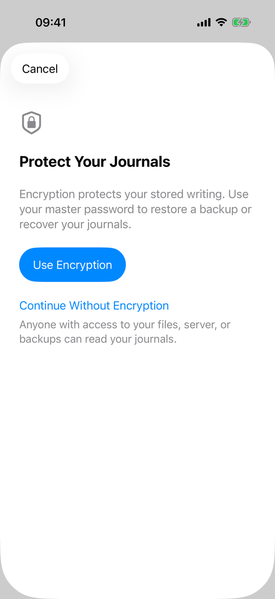
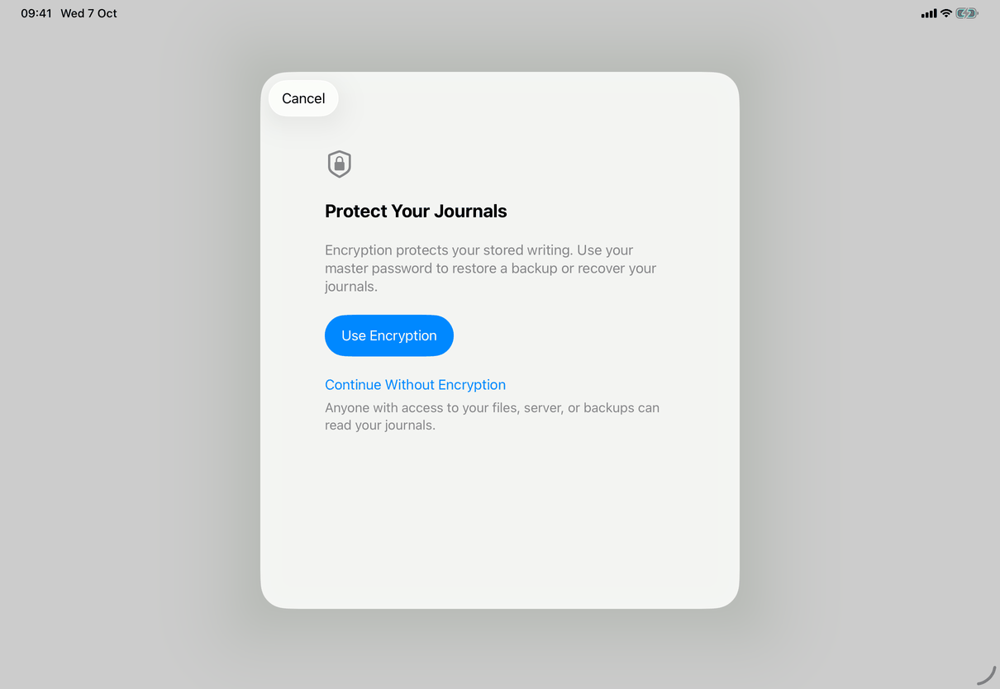
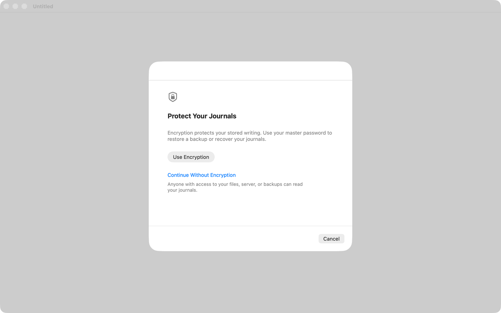

# Create a library (Apple)

Implements [flows/create-library](../../../flows/create-library.md), opened from Start a Journal on [screens/welcome](../screens/welcome.md). The view holds the English text as literals; the copy keys named here are the spec's keys for the same text.

## Controls

- **Presentation.** `RootView` presents `.sheet(isPresented: $creatingLibrary) { CreateJournalView() }`. While `creatingLibrary` is true the window's general error alert is suppressed, so a failure shows only inside the sheet.
- **Container.** `CreateJournalView` (`Views/CreateJournalView.swift`) is a `NavigationStack` with `.interactiveDismissDisabled(busy)`. On iOS the first step is the root and the password step is pushed with `.navigationDestination(isPresented: $choosingPassword)`, its back button hidden while `busy`. On the Mac one `step(choosingPassword:)` view is swapped in place (the constant `pushesPasswordStep` is true on iOS only).
- **A step.** A `ScrollView` with a left-aligned `VStack(spacing: 24)`, `.padding(28)`, `.frame(maxWidth: 480, alignment: .leading)` inside a full-width frame, `.disabled(busy)` and `.navigationTitle("")`, so the navigation bar and the Mac sheet header carry no title. Contents: a `.largeTitle` secondary symbol (`lock.shield` on step 1, `key` on step 2, hidden from accessibility); the heading in `.title2.bold()` (`common.protectYourJournals` or `common.chooseMasterPassword`); secondary `Text` `library.createLibrary.explanation`.
- **Step 1.** A `.borderedProminent`, `.controlSize(.large)` Button `library.createLibrary.useEncryption`; it sets `choosingPassword` and `focusRequest = .password`. Below, a `VStack` with a `.plain` tint-coloured Button `library.createLibrary.continueWithout` (creates at once, no confirmation: `create(encrypted: false)`) and a `.callout` secondary `Text` `common.unencryptedWarning`.
- **Step 2.** `MasterPasswordFields` (same file): two fields, Master Password (`common.masterPassword`) and Verify (`common.verify`), as `SecureField`, or `TextField` while the `Toggle` `common.showPassword` is on; `.passwordAutofill(creating: true)`, `.autocorrectionDisabled()`, `.textFieldStyle(.roundedBorder)`, and `.textInputAutocapitalization(.never)` on iOS. Return in Master Password focuses Verify; Return in Verify runs `createEncrypted()` when `canCreate`. A red `.callout` `Text` shows `problem` (`messages.connection.passwordsDontMatch`); any edit to either field clears it. Below the fields: `.callout` secondary `Text` `library.createLibrary.advice`. Focus is requested through the `focusRequest` binding and taken 400 ms later (`.task(id:)`), because a pushed step has focus of its own.
- **Both steps, when present.** The model's error as plain red `Text` (`model.error`, for example `messages.password.enterMaster` from `NewVault.prepare`, which the interface never reaches because Create is disabled for an empty field) and `ProgressView("Creating…")` (`library.createLibrary.creating`) while `busy`.
- **Toolbar.** Cancel (`.cancellationAction`, `role: .cancel`, `common.cancel`): clears both fields and dismisses; shown on step 1 and, on the Mac, on step 2; disabled while busy. Mac step 2 also has Back (`common.back`, a `ToolbarItem` with default placement) returning to step 1, disabled while busy. Create (`.confirmationAction`, `common.create`) on step 2 only, `.disabled(!canCreate)` where `canCreate` is not busy and both fields non-empty. No `.keyboardShortcut` is set.
- **Create.** `createEncrypted()` compares the two fields; a difference sets `problem`, requests focus on Verify and calls `announceForAccessibility`, and nothing is created. Otherwise `create(encrypted:)` sets `busy`, clears `model.error`, and awaits `model.start(password:encrypted:)`; when `model.error == nil` and `model.store != nil` it clears the fields and dismisses. The comparison happens only on Create, not while typing.
- **Model.** `AppModel.start(password:encrypted:)` (`Model/AppModel.swift`) does nothing if a configuration, a start in progress or a library problem exists. `NewVault.prepare(in:password:encrypted:)` (`Model/NewVault.swift`) generates the vault key, makes the recovery envelope (`VaultCrypto.makeRecovery`, `Task.detached`) for a password or `.unprotected` for no encryption, creates a `JournalStore` in a new `vault-<uuid>` folder, and saves one journal titled "Default" (`library.createLibrary.defaultJournalName`) and no templates. `start` stores the key in the Keychain under an account `master-<uuid>`, writes the configuration (`recoveryConfirmed` is true for both paths), sets `store` and `selectedJournalID` and refreshes; on a configuration write failure it removes the Keychain item and the staged files, and any failure sets `model.error` through `Error.shown(.saving)`. `RootView` then shows the library window on that journal.
- **States.** Busy: the step is `.disabled(busy)`, swipe-to-dismiss and Back are blocked, the progress row shows. Error: the red `model.error` text in the step; nothing is left behind.

## Layout

- **iPhone.** A full-height sheet; step 2 is pushed with the system back chevron at the left (in Cancel's place) and Create at the right, as in Connect to a Server. The column fills the width up to the 28-point padding.
- **iPad.** The regular-width system sheet (a centred card about 580 points wide, screenshots); the 480-point column sits inside it. In compact widths the system presents the iPhone form.
- **Mac.** `.frame(width: 520, height: choosingPassword ? 580 : 420)` under `#if os(macOS)`, a sheet on the journal window. The header strip is empty (empty title). Cancel (and Back and Create on step 2) are toolbar items shown at the bottom trailing edge of the sheet, as in other Mac sheets.
- **Dynamic Type.** The `ScrollView` scrolls and the text wraps; the Mac frame is fixed, so large text scrolls inside it.

## Commands and shortcuts

None of the spec's command ids belong to this flow: Start a Journal, Use Encryption, Continue Without Encryption, Create, Back and Cancel have no id in [commands.md](../commands.md). Keyboard behaviour: Return in Master Password moves to Verify; Return in Verify creates when enabled; Cancel carries `role: .cancel` and no `.keyboardShortcut`, so Escape is whatever the system gives a sheet, which is blocked by `.interactiveDismissDisabled` while busy (not verified at runtime). The first password field takes focus after Use Encryption; Verify takes focus after a mismatch.

## Copy differences

None.

## Accessibility

- Symbols are `accessibilityHidden(true)`. The two headings are `Text` with a title font and no heading trait set in this file.
- The mismatch is announced with `announceForAccessibility("The passwords don’t match.")` and focus moves to Verify. The model's error text (`model.error`) is plain red `Text` and is not announced.
- Fields are labelled by their placeholder text; there is no `accessibilityHint`.

## Differences between iPhone, iPad and Mac

- iPhone and iPad push step 2 with the system back button and swipe-back, as Connect to a Server does; the Mac swaps the content inside one fixed-size sheet (the push is `#if os(iOS)` only) and so has an explicit Back toolbar item.
- The Mac sheet has a fixed size per step; iPhone and iPad take the size of the system sheet.
- `.textInputAutocapitalization(.never)` applies to iOS only (it is iOS API).

## Screenshots

| Device | Step 1 | Step 2 | Mismatch |
| --- | --- | --- | --- |
| iPhone |  Shield, heading, explanation, Use Encryption, Continue Without Encryption and its warning; Cancel only. |  Key symbol, two empty fields, Show Password off, advice; back chevron and Create (dimmed). |  Both fields filled (their placeholders are gone), the red message under Verify, Create enabled. |
| iPad |  The same step in the centred sheet over the dimmed window. |  |  |
| Mac |  A 520 by 420 point sheet over the inactive journal window; empty header strip, Cancel at the bottom right. | Not captured. | Not captured. |

## Source files

- View: `Views/CreateJournalView.swift` (sheet, steps, `MasterPasswordFields`), `Views/RootView.swift` (presents the sheet, suppresses the alert), `Views/PasswordAutofill.swift`.
- Model: `Model/AppModel.swift` (`start(password:encrypted:)`), `Model/NewVault.swift` (`NewVault.prepare`), `Model/FailureMessage.swift` (error text).
- Core: `Sources/JournalCore/Crypto.swift` (`VaultCrypto.generateKey`, `makeRecovery`, `minimumPasswordLength`), `JournalStore` in JournalCore.
- Design: [markdown-writing-revision.md](../../../../docs/design/markdown-writing-revision.md), [no-built-in-templates-2026-10-04.md](../../../../docs/design/no-built-in-templates-2026-10-04.md), [getting-started.md](../../../../docs/guide/getting-started.md).

## Open questions

See [open-questions.md](../../../open-questions.md).
