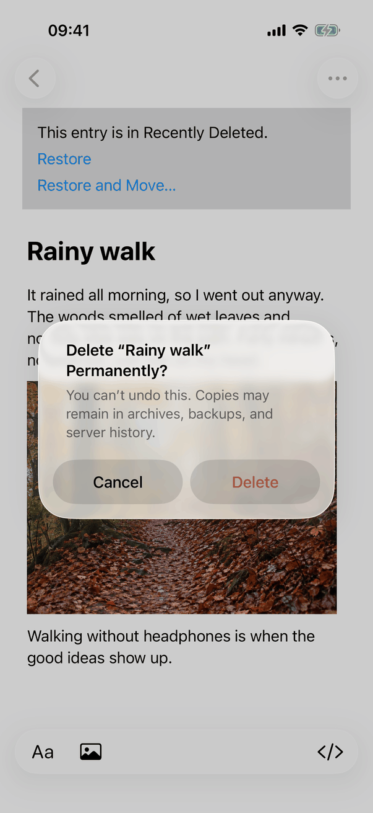
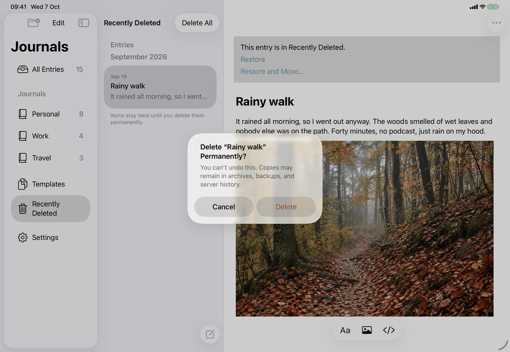

# Delete, restore and delete permanently (Apple)

Maps [flows/delete-and-restore.md](../../../flows/delete-and-restore.md). The flow has no view of its own. It is a set of row actions, alerts and model operations spread over `RootView`, three prompt modifiers and the `AppModel` extensions named below. The screens it ends in are [recently-deleted](../screens/recently-deleted.md), [restore-journal](../screens/restore-journal.md) and [move-entry](../screens/move-entry.md).

## Controls

**Delete an entry or template (no confirmation).**
- Entry points: the row's context menu and Entry Actions, item `library.entryActions.deleteEntry` or `library.entryActions.deleteTemplate`, destructive, trash symbol, last, after a separator (`entryActionCatalog` in `RootView.swift`); the trailing swipe `common.delete` (`swipeActions(edge: .trailing)`, `role: .destructive`); on the Mac Delete and ⌘⌫ with the list focused (`.onDeleteCommand` and `CommandDeleteKey`, then `deleteSelectedFromList`). A template is offered Delete Template; an entry in an unavailable journal is not offered either one (`AppModel.offersDelete` requires a journal in use).
- `RootView.delete(_:)`: takes the row out of every list in one update, `withAnimation(reduceMotion ? nil : .default) { model.removeFromLists(id, selectingNext:) }`, with `selectingNext` true on iPad and Mac (the entry below, or above at the end, opens in the same update) and false on iPhone (stacked navigation: `leaveDeletedEntry` pops the entry's page at once). A swipe expects its row gone at once, so the row does not wait for storage.
- Storage then follows in a queued `Task` (`deletionTask`, so quick deletions run in order): `AppModel.deleteListed` waits until the row's removal animation has settled (`Duration.listRemoval`, 450 ms; zero with Reduce Motion), saves the item with `deletedAt` set, and reads the library again once. If saving fails the row comes back (`showInLists`) and the generic alert shows the error.
- Undo: `registerDeletionUndo` registers an `UndoManager` step named `library.entryActions.deleteEntry` or `library.entryActions.deleteTemplate`, taken from `@Environment(\.undoManager)`. Undo runs `AppModel.restore`; Redo (`repeatDeletion`) selects and deletes again. A step that no longer applies (the entry moved meanwhile) cancels the remaining steps. On iPhone Undo is reached by shaking the device or the system three-finger gestures; iPad and Mac also have Edit ▸ Undo (⌘Z) and Redo (⇧⌘Z).

**Delete a journal.** The action `library.journalActions.deleteJournal` is in Journal Actions (the "…" in the list toolbar on iPhone and iPad via `JournalMoreMenu`, the toolbar menu on the Mac) and in the journal's context menu in the sidebar (`JournalSidebarView`). `.journalDeletionPrompt` (`JournalDeletionPrompt.swift`) first calls `AppModel.prepareJournalDeletion`, which saves the open entry and asks the store to check the journal and its entries; then a standard `.alert`: title `library.deleteJournal.title`, message `library.deleteJournal.noEntries` or `library.deleteJournal.message`, buttons `common.delete` (destructive) and `common.cancel`. Delete hides the journal row at once (`hideInLists`) and runs `deleteJournal`; the journal's entries are marked as deleted with it. `commitJournalResolution` clears the selection when the open entry or journal was the deleted one. The spec says another journal is shown afterwards; that choice was not traced in the source for this page. A journal with changes to review gets the Review Changes alert (below) instead. There is no Undo step for it.

**Restore.**
- `common.restore` in the leading swipe, context menu, Entry Actions and recovery notice: `AppModel.restore(item)`; a template goes to `restoreTemplate` (shows the template in Templates), an entry to `moveEntry(_:to:restoring: true)` into its own journal through `JournalStore.restoreAndMoveEntry`, then the journal is shown with the entry open. No confirmation. Offered only when the entry's journal is in use and the entry was not deleted with its journal by an earlier version (`canRestoreDirectly`).
- Entry whose journal is also deleted: `library.recoveryNotice.restoreWithJournal` opens the sheet of [restore-journal](../screens/restore-journal.md) (`JournalLifecycleView` with an entry id).
- Entry into another journal: `library.recoveryNotice.restoreAndMove` opens [move-entry](../screens/move-entry.md) in its restoring form.
- Journal: `library.recentlyDeleted.restoreJournal` in the deleted journal's detail opens the same sheet for a journal.

**Delete permanently.** One item: `library.entryActions.deletePermanently` (context menu, Entry Actions, trailing swipe `common.delete`, Delete or ⌘⌫ on the Mac, deleted journal's detail) goes through `.permanentDeletionPrompt` (`PermanentDeletionView.swift`): the item is checked and the open entry saved before the alert, which is a standard `.alert` with `common.delete` (destructive) and `common.cancel`. Everything: Delete All (`DeleteAllPrompt.swift`), described in [recently-deleted](../screens/recently-deleted.md). The deletion syncs like any record; the alert text `library.deletePermanently.retention` says copies may remain elsewhere.

**Refusals and failures.** A changed or already-restored item shows `messages.generic.deleteChanged`, a newer-version item `messages.generic.deleteNeedsUpdate`, in the generic alert. An item or journal with changes to review gets `DeletionConflictAlert`: a second standard alert, title “name” Can’t Be Deleted (no copy key), a one-sentence message, Review Changes and Cancel; Review Changes opens `ConflictReview` as a sheet. A missing or already deleted item is ignored without a message. A stored change that cannot be shown is `messages.refresh.itemDeleted`, `messages.refresh.itemsDeleted` or `messages.refresh.journalDeletedView`.

**States.** Locked: every prompt modifier cancels its task, closes its alerts and returns swiped rows (`onValueChange(of: model.locked)`); nothing already stored is undone. Removed by a sync while open: `reconcileDraftLocation` (`JournalNavigation.swift`) closes the open entry when it no longer belongs in the list being shown, unless it has unsaved edits, which keep it open.

## Layout

- **iPhone (stacked navigation):** swipes and the entry page's "…" menu; deleting the open entry pops back to the list. The alert is a centered system alert (screenshot).
- **iPad:** list column and detail side by side; swipes, context menus and the editor's "…" menu; the next entry opens after a delete. In a compact-width or accessibility-size window the iPad uses the iPhone behaviour (`usesStackedNavigation`).
- **Mac:** context menu and Entry Actions in the toolbar, Delete and ⌘⌫ in the list, File ▸ Delete All in Recently Deleted…; alerts are the system's window alerts.
- Dynamic Type does not change the flow; alerts use the system layout.

## Commands and shortcuts

| Command | Placement | Shortcut | Enabled when |
| --- | --- | --- | --- |
| `delete-entry` | Context menu, Entry Actions, trailing swipe | Mac: Delete or ⌘⌫ with the list focused | Item editable and not deleted; entries need a journal in use |
| `undo`, `redo` | Edit menu (Mac and iPad with a keyboard); shake and gestures on iPhone | ⌘Z, ⇧⌘Z | A deletion step is registered |
| `delete-journal` | Journal Actions, sidebar context menu | none | Always (the check may then refuse) |
| `restore` | Leading swipe, context menu, Entry Actions, recovery notice | none | In Recently Deleted, journal in use |
| `restore-with-journal` | Recovery notice | none | Journal deleted, editable, no review pending |
| `restore-and-move` | Recovery notice | none | Item editable |
| `restore-journal` | Deleted journal's detail | none | Journal editable, not being replaced |
| `delete-permanently` | Context menu, Entry Actions, trailing swipe in Recently Deleted, deleted journal's detail | Mac: Delete or ⌘⌫ with the list focused | In Recently Deleted, not being replaced |
| `delete-all-recently-deleted` | Bar button (iPhone, iPad), bar button and File menu (Mac) | Mac: ⇧⌘⌫ | `AppModel.canDeleteAll` |

Placements not given are as in [commands.md](../commands.md). Delete and ⌘⌫ act only while the Mac list has focus, never in the editor. The alerts follow the system's keys.

## Copy differences

- `library.recentlyDeleted.deleteAll`: "Delete All" on iPhone and iPad, "Delete All…" on the Mac.
- `library.menu.file.deleteAll` is the Mac File menu's longer name.
- Undo names (`library.entryActions.deleteEntry`, `library.entryActions.deleteTemplate`) appear in the Edit menu on the Mac and iPad; on iPhone they appear in the system's undo prompt.

## Accessibility

- Destructive Buttons use `role: .destructive`; alerts are SwiftUI `.alert`s read by the system.
- After Cancel on a swiped row, the row returns and VoiceOver focus goes to it (`returnedRow`). After a deletion the next entry on iPad and Mac opens in the same update, so focus is not left on a removed row.
- Reduce Motion: rows leave and return without animation, and storage runs without the 450 ms wait.
- Delete All empties the list without an announcement; VoiceOver finds the empty text.

## Differences between iPhone, iPad and Mac

- Deleting the open entry opens the next one on iPad and Mac and goes back on iPhone, because only iPhone shows the list and the entry as separate pages.
- A destructive swipe on iPhone and iPad hides the row before asking and shows it again on Cancel, because SwiftUI cannot keep a swipe open behind an alert.
- Delete and ⌘⌫ in the list and the File menu item exist only on the Mac, which has a focusable list and a menu bar; iOS offers the same actions in swipes, menus and a bar button.
- Undo on iPhone is by shake or gesture, on the Mac and iPad with a keyboard by the Edit menu.

## Screenshots

| Device | Screenshot | State |
| --- | --- | --- |
| iPhone |  | A deleted entry (Rainy walk) open with the recovery notice (Restore, Restore and Move…); the Delete Permanently alert asks about "Rainy walk" with Cancel and Delete (red); the page behind is dimmed |

No other step of the flow has its own screenshot; the list, the journal's detail, Delete All and the two sheets are in [recently-deleted](../screens/recently-deleted.md), [restore-journal](../screens/restore-journal.md) and [move-entry](../screens/move-entry.md).

-  iPad: the Delete Permanently alert for an entry in Recently Deleted.

## Source files

View: `Views/RootView.swift` (delete, swipes, menus, Delete key), `Views/JournalDeletionPrompt.swift`, `Views/PermanentDeletionView.swift`, `Views/DeleteAllPrompt.swift`, `Views/DeletionConflictAlert.swift` (the alerts), `Views/EntryRecoveryNotice.swift`, `Views/DeletedJournalView.swift` (the restore entry points), `Views/JournalMoreMenu.swift` and `Views/JournalSidebarView.swift` (Delete Journal…).

Model: `Model/EntryDeletionOperations.swift` (hiding rows, deleting, Undo and Redo, template restore), `Model/EntryRestorationOperations.swift` (restore, restore with journal), `Model/PermanentDeletionOperations.swift` (checks, Delete All), `Model/JournalOperations.swift` (journal delete and restore, move), `Model/JournalNavigation.swift` (what the open entry does when it leaves).

Core: `JournalLifecycle.swift`, `EntryRestoration.swift`, `StoreDeletion.swift`; protocol records `protocol/journal-lifecycle.md` and `protocol/permanent-deletion.md`.

Design records: `docs/design/recently-deleted-2026-09-30.md`, `docs/design/ios-delete-all-and-settings-2026-10-03.md`, `docs/design/journal-lifecycle-ui.md`, `docs/design/permanent-deletion.md`, `docs/design/owner-decisions-2026-09-25.md`.

## Open questions

See [open-questions.md](../../../open-questions.md), D15. The conflict alert for deletions has no copy key and is not in the spec (reported to the owner).
