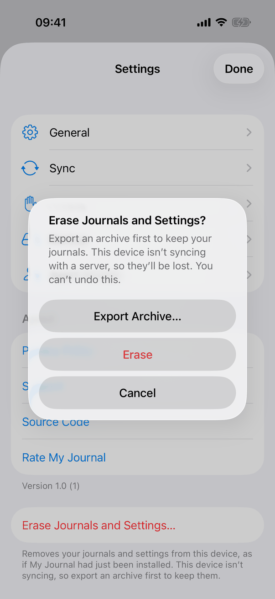
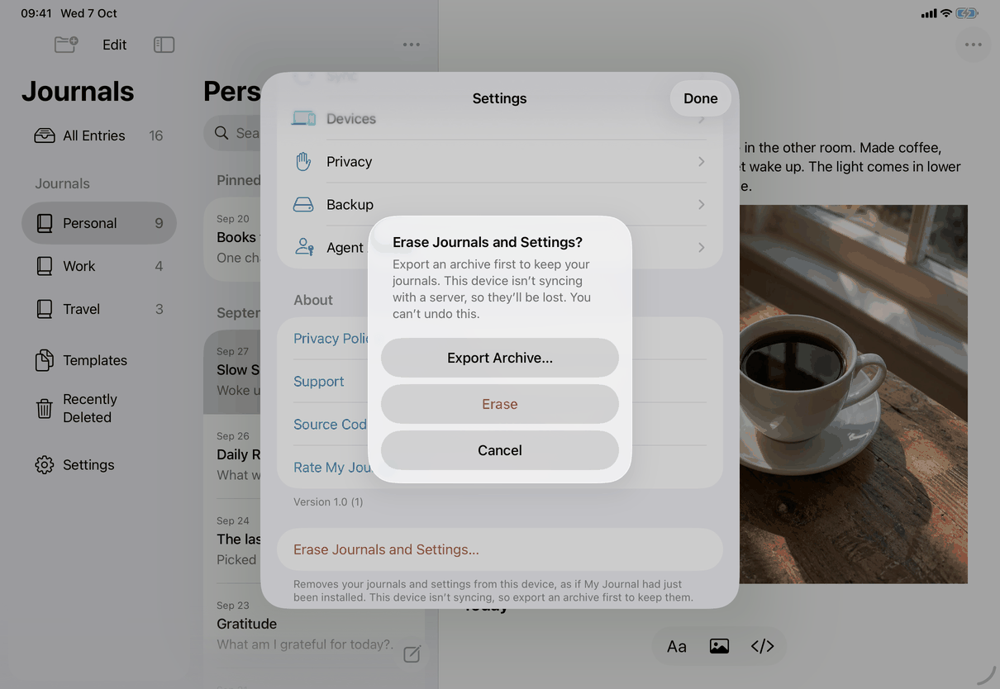

# Erase journals and settings (Apple)

Neutral spec: [flows/erase.md](../../../flows/erase.md). The screen is `settings-erase` ([screens/settings-erase.md](../../../screens/settings-erase.md)); this page records the sequence the code runs and where the platforms differ. Conventions: [platform.md](../platform.md#17-app-data-backups-and-erasing), [platform.md](../platform.md#8-alerts-and-confirmations).

## Controls

The flow has one control sequence: the Erase button, a warning alert, an optional Export Archive sheet, an optional authentication panel, a failure alert, and then the first-launch screen. The code is `EraseSection` (view) and `AppModel` extensions in `Model/EraseOperations.swift` and `Model/LocalErasure.swift`; the controls are described on `settings-erase`. In order:

1. **Button** (`settings.erase.button`): `check()` starts a `Task` that calls `model.eraseWarning()`. That returns nil without a store or while locked; otherwise it awaits `flush()` (saves the open entry) and `currentEraseWarning()`. The warning is chosen from `store.unsentItemCount()`, `model.connection` and sync health: not connected gives `nothingWritten` or `notSyncing`; connected needs a healthy sync (`syncHealth == nil`, `!syncFailed`, `syncActivity.lastSynced != nil`) to give `onServer` or `unsent`, otherwise `unconfirmed`. In a debug build the environment variable `JOURNAL_UI_TEST_ERASE_WARNING` can substitute a warning so each alert can be seen without a server; Erase still checks the real state.
2. **Warning alert**: one of the five messages (`settings.erase.alert.*`); the three cases that lose journals add the Export Archive… button (`export-archive`). The sixth case, `unopened`, belongs to the library problem screen and the missing-key lock screen (`UnopenedEraseButton`).
3. **Export Archive sheet** (`ArchiveExportSheet`), presented 350 ms after the alert closes. Closing it returns to the Settings pane; the person presses the Erase button again.
4. **Authentication** at Erase, only when `model.appLockOn`: `authenticateDeviceOwner(reason:)` with `settings.erase.authReason`. Cancelled or failed: `.cancelled`, nothing happens and nothing is said. For `unopened` it runs before the warning, not at Erase.
5. **Erase** (`eraseLibrary(shown:)`), in order:
   1. Guard: not locked, a configuration and a store exist, `eraseBlock == nil`; otherwise `.cancelled`.
   2. `vaultReplacement = true` pauses writing and syncing; `flush()` saves the open entry again.
   3. `currentEraseWarning()` recounts; `warning.isCovered(by: shown)`. A case that loses nothing is always covered; `unsent` is covered when the count is not larger and the host is the same; otherwise `.changed(current)`, writing resumes (`vaultReplacement = false`) and the alert is shown again with the current case.
   4. `erasureList(configuration)`: the library's folder and keychain accounts (and earlier copies), every movable entry of the data folder, the Export Archive dialog copies in the temporary folder, and, when `sweepsKeychain` is on, swept keychain accounts. Not included (`LocalErasure.isMovable`): the configuration, an erase's own folder, names starting with the former-server prefix, hidden names.
   5. Commit: `LocalErasure.commit` creates an `erased-<uuid>` folder holding `erasure.json` (the list) and moves `configuration.json` into it with one rename. A throw logs a message without private details, resumes writing and returns `.failed` (failure alert).
   6. `finishErasing`: remove the listed keychain accounts first; `clearErasedLibrary()` forgets everything in memory (cancels tasks, clears the pasteboard through `SensitivePasteboard.clear()`, drops the connection, store, keys, selection and drafts, bumps the lock count); close the store; move the listed names into the erased folder; remove the `formatMarkdownAsYouType` default and the rating usage default (`ReviewUsageStore.defaultsKey`) from `UserDefaults`; `erasingLibrary = false`.
   7. Background: `LocalErasure.delete` runs detached at utility priority, deletes the folder's contents and, once the keychain items are gone, the folder itself (after three launches the rest is left); a `Task` asks the server to revoke this device's access with the token only the saved connection holds, ignoring failures.
6. `.erased`: the closure runs `closeAfterErasing()` (see `settings`): Mac opens a journal window if none is open; iPhone and iPad schedule a screen-changed notification 600 ms later; then `dismiss()`. The window then shows the first-launch screen because `model.store` and `model.configuration` are nil.
7. **Interrupted erase**: `finishEarlierErasures()` runs at launch before the configuration is read: for each `erased-` folder it either removes a folder that never committed, or finishes the committed one from its list, never touching the names and accounts of the current library. If the current configuration exists but cannot be decoded, nothing is finished.

Error and busy states: `eraseBlock` (see `settings-erase`); the failure alert (`settings.erase.failed.title`, `settings.erase.failed.message`) after `.failed`; the alert shown again after `.changed`; locking closes the alert and the export sheet and stops checking but not a running erase.

## Layout

Not applicable beyond `settings-erase`: the flow has no screen of its own. The alert is the system's: centred on iPhone and iPad (screenshots), attached to the Settings window on the Mac. The Export Archive sheet is the system's sheet on iPhone and iPad and a window sheet (minimum width 460, minimum height 220) on the Mac; see `export-archive`.

## Commands and shortcuts

| Command | Placement | Shortcut | Enabled when |
| --- | --- | --- | --- |
| `erase-device` | as in [commands.md](../commands.md) | none | a library exists, nothing else is changing it, not checking |
| `erase-confirm` | the destructive button of the warning | none | always once the warning is shown |
| `export-archive` | a button of the warning, for the three journal-losing cases | none | the warning loses journals |

Keyboard: system alert keys; this alert declares no default button and no key equivalents.

## Copy differences

- `settings.erase.authReason` has a `mac` variant (lower-case first letter) for the system sentence "My Journal is trying to ...".
- Messages with `{host}` name the server host from `connectionHost`; `unsent` uses the plural forms.
- No other differences. The unopened message is `settings.erase.alert.unopened` with its parts (`.reasonCantOpen`, `.reasonNeedsKey`, `.serverKnown`, `.serverUnknown`).

## Accessibility

- The warning's message begins with what to do ("Export an archive first...") in the three journal-losing cases.
- After the erase, iPhone and iPad post a screen-changed notification after 600 ms, so VoiceOver lands on the first-launch screen.
- The authentication panel and alerts are the system's.

## Differences between iPhone, iPad and Mac

- Keychain sweep: iOS removes all accounts of the app's service, because a reinstall changes the container path and so the folder's hash, leaving orphans; the Mac removes only this data folder's and the old `agent-` ones, because development copies share the team's keychain group.
- The former-server files (Mac) are never removed; the footer says so.
- A journal window is opened by the Mac when none is open; iOS has a single window.
- The authentication panel is Face ID, Touch ID or passcode on iOS and Touch ID, Apple Watch or the login password on the Mac (`LAPolicy.deviceOwnerAuthentication`).

## Screenshots

| Device | State |
| --- | --- |
| iPhone |  The warning for a device that is not syncing, with journals written: the "Export an archive first..." message and Export Archive…, Erase and Cancel buttons, over the Settings list. |
| iPad |  The same warning over the scrolled Settings sheet; the Erase row and its footer are visible behind the alert. |

No Mac capture of the alert exists.

## Source files

View:
- `apps/apple/JournalApp/Views/EraseSection.swift`: button, alerts, `check()`, `erase(_:)`, message text.
- `apps/apple/JournalApp/Views/UnopenedEraseButton.swift`: erasing journals that cannot be opened.
- `apps/apple/JournalApp/Views/SettingsView.swift`: `closeAfterErasing()`.

Model and core:
- `apps/apple/JournalApp/Model/EraseOperations.swift`: warnings, the commit sequence, `finishEarlierErasures()`.
- `apps/apple/JournalApp/Model/LocalErasure.swift`: the erased folder, deletion, leftovers.
- `apps/apple/JournalApp/Model/AppModel.swift`: `clearErasedLibrary()`.
- `apps/apple/JournalApp/Model/AppLockOperations.swift`: `authenticateDeviceOwner`, `authenticationReason`.

Design records: `docs/design/erase-device-2026-10-04.md`, `client-only-mac-lists-markdown-2026-10-05.md`, `build-18-fixes-2026-10-06.md`.

## Open questions

See [open-questions.md](../../../open-questions.md), C12. The `unopened` warning is now in the neutral flow ("Erasing journals that can't be opened"). **Screenshots pending:** the unopened warning (see [settings-erase](../screens/settings-erase.md)).
