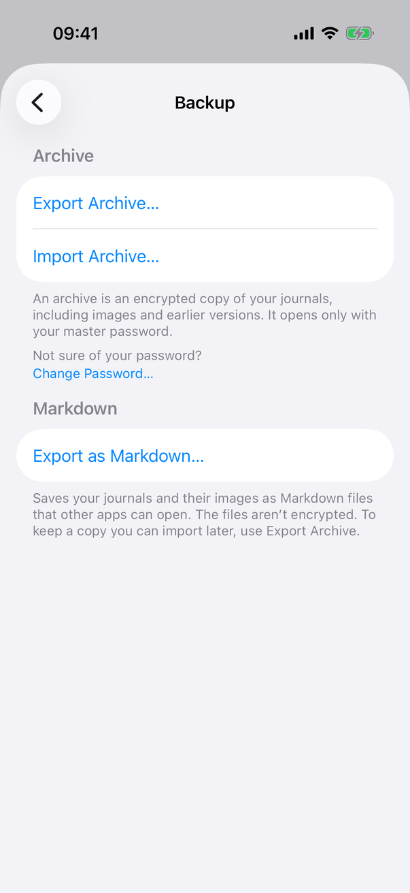
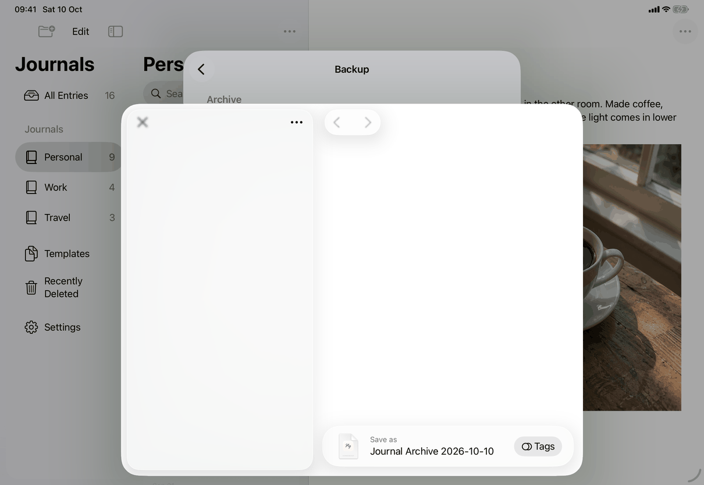
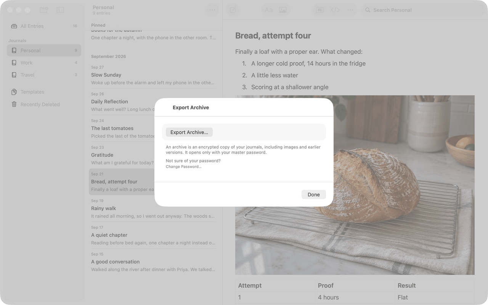

# Export an archive (Apple)

Neutral spec: [flows/export-archive.md](../../../flows/export-archive.md). The surfaces are on `settings-backup`; this page records the sequence and the system dialogs. Conventions: [platform.md](../platform.md#16-files-pickers-and-document-types).

## Controls

Entry points: the Export Archive… button of Settings ▸ Backup (all devices), File ▸ Export Archive… (Mac, iPad with a keyboard; opens `ArchiveExportSheet`), and the Erase warning's Export Archive… button (opens the same sheet). All three show `ArchiveExportControls` (`Views/ArchiveView.swift`), so the behaviour is identical.

Steps, with the code that does each:
1. **Button press** (`common.exportArchive`). Ignored when `export.busy` (preparing or the save dialog open) or the password check sheet is showing. If `model.passwordCheckPending` (a master-password library, not connected to a server, `passwordChecked != true`) the check sheet opens; otherwise `export.start(with: model)`.
2. **Password check sheet** (`PasswordCheckView`, a `.sheet` on the controls): a `NavigationStack` with a `Form`: the intro `settings.passwordCheck.intro`, a `SecureField` `common.masterPassword` with password autofill, error label `settings.passwordCheck.wrong` (also posted as an accessibility announcement), a small `ProgressView` while checking. Toolbar: cancellation action `settings.passwordCheck.notNow` (Escape) and confirmation action `settings.passwordCheck.check` (Return, disabled until a password is typed); title `settings.passwordCheck.title` (large title on iOS). After a wrong try, `settings.passwordCheck.forgot` ("Forgot Password?") is offered when `canSetPasswordWithoutCurrent` and the device can authenticate its owner; it authenticates the owner (`authorizePasswordReset`, system reason "set a new password for your journals") and switches the sheet to a new-password form (`settings.passwordCheck.setNew.*`). The sheet is not dismissible by gesture while checking. On the Mac it is 440 points wide. When the sheet reports `proceed` (right password, new password set, or Not Now) the export continues after the sheet has gone (`onDismiss`), so the save dialog is never presented over it. A right password calls `markPasswordChecked()` so it is not asked again.
3. **Preparing** (`ArchiveExport.prepare`). If App Lock is on and the library is not encrypted, the device owner authenticates first (see `settings-backup`). A 0.3 second timer then shows the small indicator (`settings.backup.preparingArchive`). `model.prepareArchive()` awaits `finishPendingSave()`; if the open entry cannot be saved it throws the message `messages.save.before.goBack`; otherwise `VaultArchive.export(store:recovery:key:to:)` writes a package `export-<uuid>.journalarchive` into the app's data folder. Locking or a new vault session (connecting, importing) cancels it and removes the package.
4. **Save dialog**: `.fileExporter(isPresented: $export.presenting, document: JournalFile, contentType: .journalArchive, defaultFilename:)`. The suggested name is `settings.backup.archiveFilename` with the date formatted `yyyy-MM-dd` in the POSIX locale (digits 0 to 9, Gregorian). `JournalFile.fileWrapper` hands the system the package with that preferred name. A cancelled dialog is `CocoaError.userCancelled` and is not an error; any other failure sets `messages.export.archiveSaveFailed`. Success shows nothing.
5. **Clean-up**: `discard()` removes the package and the dialog's leftover copy `Journal Archive <date>.journalarchive` in the temporary folder when the dialog closes; `ArchiveExportLeftovers.removeAtLaunch` removes anything left by a quit, matching only the app's own names, directories only, no symbolic links.

Errors (red, selectable `Text` under the button, cleared when the next export starts): `messages.save.before.goBack` (thrown as `JournalError.saveRequired`), `messages.export.archiveNoSpace` (`NSFileWriteOutOfSpaceError` or `ENOSPC`), `messages.export.archiveFailed` (anything else), `messages.export.archiveSaveFailed` (dialog result). A failed device authentication shows `settings.backup.verifyFailed` ("Couldn’t verify it’s you. Try again.").

Models: `AppModel`, `ArchiveExport`, `JournalFile`.

## Layout

The flow's surfaces: the Settings pane (see `settings-backup`), the File-menu sheet (a window sheet on the Mac with minimum 460 by 220 points, a system sheet on iPad), and the system save dialog:
- iPhone: the Files browser as a bottom sheet over the Settings sheet; the screenshot shows it while it is still appearing.
- iPad: the Files browser as a centred sheet with its sidebar, "Save as" field and Tags button.
- Mac: the File-menu sheet with the button, footer and Done; the save panel then appears over the window.

## Commands and shortcuts

| Command | Placement | Shortcut | Enabled when |
| --- | --- | --- | --- |
| `export-archive` | as in [commands.md](../commands.md) | none | library open, unlocked, nothing exporting |
| `password-check` | the sheet's Check button | Return | a password is typed |
| `password-check-not-now` | the sheet's Not Now button | Escape | not while checking |
| `export-sheet-done` | Done in the File-menu sheet | Escape | always |

Keyboard: Return in the Master Password field checks it when a password is typed (`onSubmit`, `submitLabel(.done)`).

## Copy differences

The authentication reason for an unencrypted library's archive (when App Lock is on) is `settings.backup.archiveReason`, lower-cased on the Mac by `AppModel.authenticationReason` (it has a `mac` variant).

## Accessibility

- The indicator is labelled `settings.backup.preparingArchive`. A wrong password is announced (`announceForAccessibility`). Archive errors are shown in the pane but, unlike Markdown errors, not announced; a porter should announce them.
- The save dialog and authentication panel are the system's.

## Differences between iPhone, iPad and Mac

- Dialog: Files browser on iOS (the exported package keeps a copy under its suggested name in the temporary folder until `discard()`), save panel on the Mac.
- Menu entry: File menu on the Mac and an iPad with a hardware keyboard only; iPhone reaches the flow from Settings.
- The Mac keeps the app unlocked while the package is being prepared (`keepsUnlockedWhile`); iOS has no inactivity lock.
- The password-check sheet is 440 points wide on the Mac; on iOS the system sizes it.

## Screenshots

| Device | State |
| --- | --- |
| iPhone |  The Files bottom sheet appearing over Settings ▸ Backup. |
| iPad |  The Files save dialog with "Journal Archive 2026-10-07" and the Tags button. |
| Mac |  The File-menu sheet: the Export Archive… button, the encrypted-archive footer and Done. |

## Source files

View:
- `apps/apple/JournalApp/Views/ArchiveView.swift`: `ArchiveExportControls`, `ArchiveExportSheet`.
- `apps/apple/JournalApp/Views/ExportView.swift`: `JournalFile`, `UTType.journalArchive`, `archiveFilename`.
- `apps/apple/JournalApp/Views/PasswordCheckView.swift`: the check sheet and new-password form.

Model:
- `apps/apple/JournalApp/Model/DocumentTransferOperations.swift`: `ArchiveExport`, `prepareArchive()`, `ArchiveExportLeftovers`.
- `apps/apple/JournalApp/Model/PasswordCheckOperations.swift`: `passwordCheckPending`, `checkPassword`, `authorizePasswordReset`.

Core:
- `apps/apple/Packages/JournalCore/Sources/JournalCore/Archive.swift`: `VaultArchive` (the package format; see `docs/design/archives.md`).

Design records: `docs/design/archives.md`, `export-operation-lifetime.md`, `pre-release-ui-2026-09-27.md`, `build-18-fixes-2026-10-06.md`.

## Open questions

See [open-questions.md](../../../open-questions.md), A29 and B43. D2 (device authentication before an archive) is resolved: the code authenticates and the spec now says so.
