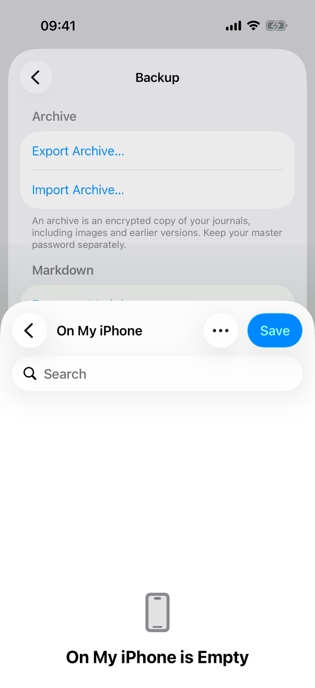
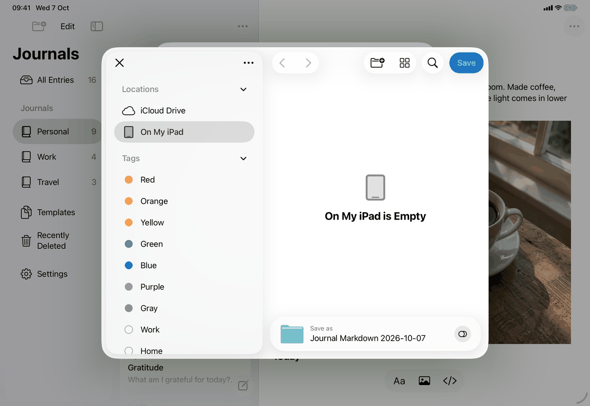
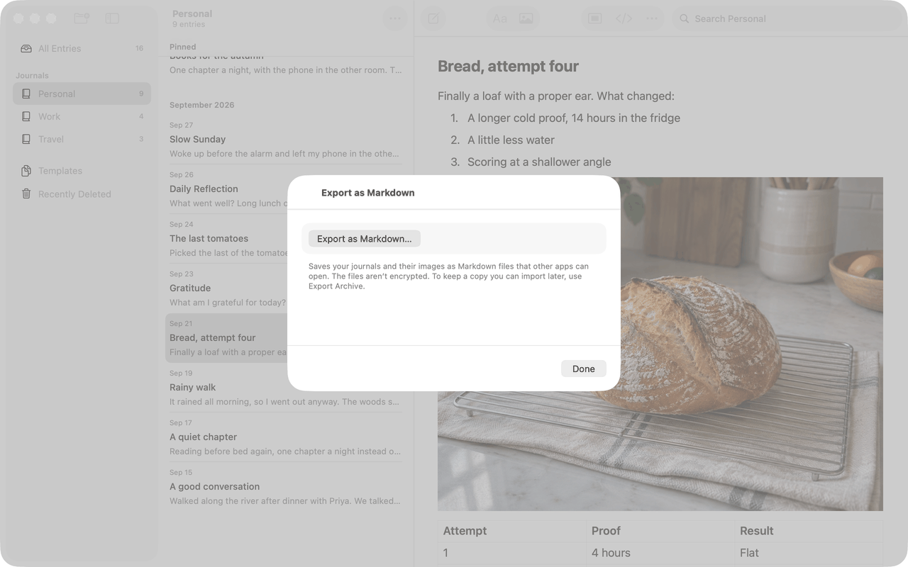

# Export journals as Markdown (Apple)

Neutral spec: [flows/export-markdown.md](../../../flows/export-markdown.md); folder format in [protocol/markdown-export.md](../../../../protocol/markdown-export.md). The surfaces are on `settings-backup`. This export mirrors `export-archive` in structure, so the two share the same classes of behaviour. Conventions: [platform.md](../platform.md#16-files-pickers-and-document-types).

## Controls

Entry points: the Export as Markdown… button of Settings ▸ Backup, and File ▸ Export Journals as Markdown… (Mac, iPad with a keyboard; opens `MarkdownExportSheet`). Both show `MarkdownExportControls` (`Views/MarkdownExportView.swift`), driven by `MarkdownExportController` (`Model/MarkdownExportOperations.swift`).

Steps:
1. **Button** `settings.backup.exportMarkdown`; `export.start(with:)` returns at once when an export is running (`busy`: preparing or the dialog open). The button is disabled while the indicator shows and when `model.store == nil`.
2. **Authentication**, only when `model.appLockOn`: `checkDeviceOwner(reason: model.markdownExportReason)`. The reason is `settings.backup.markdownReason`; the Mac lower-cases it through `AppModel.authenticationReason`. Cancelled: nothing happens and nothing is said. Failed: the red line `settings.backup.verifyFailed` ("Couldn’t verify it’s you. Try again."), shared with the archive export.
3. **Preparing**: a 0.3 second timer shows the indicator (`settings.backup.preparingFiles`). `prepareMarkdownExport()` awaits `finishPendingSave()` (failure: `messages.save.before.goBack`), then `MarkdownExport.write(store:to:)` (JournalCore) writes into `markdown-<uuid>` inside the app's data folder and the folder is marked `isExcludedFromBackup`. It returns a `MarkdownExportSummary` of what was left out. Locking or a new vault session cancels and removes the folder.
4. **Save dialog**: `.fileExporter(isPresented: $export.presenting, document:, contentType: .folder, defaultFilename:)`; the suggested name is `settings.backup.markdownFolderName` (`Journal Markdown yyyy-MM-dd`, `MarkdownExport.folderName()`). Success: `note = summary.flatMap(Self.note)`; cancelled (`CocoaError.userCancelled`): nothing; other failures: `messages.export.markdownSaveFailed`.
5. **The note**, a secondary selectable `Text` under the button, built from `settings.backup.markdownNote.imagesNotDownloaded`, `settings.backup.markdownNote.imagesUnreadable`, `settings.backup.markdownNote.itemsUnreadable` and `settings.backup.markdownNote.otherVersions` (singular and plural forms), in that order, joined with a space, each only when its count is above zero. It stays until the next export starts.
6. **Clean-up**: `discard()` removes the temporary folder and the dialog's leftover copy `Journal Markdown <date>` in the temporary folder when the dialog closes; `ArchiveExportLeftovers.removeAtLaunch` removes `markdown-<uuid>` folders and dialog copies left by a quit, by exact pattern.

Errors (red selectable `Text`, announced): `messages.save.before.goBack`, `messages.export.markdownNoSpace`, `messages.export.markdownFailed`, `messages.export.markdownSaveFailed`. Error and note changes call `JournalAccessibility.announce`.

Leaving the pane or sheet while preparing cancels; while the dialog is open the export continues. On the Mac `keepsUnlockedWhile(export.busy && !export.presenting)` holds off the inactivity lock.

## Layout

Same surfaces as `export-archive`:
- iPhone: the Files browser as a bottom sheet over the Settings sheet, showing a "Save" button at the top right and the current location ("On My iPhone").
- iPad: the Files browser as a centred sheet, with sidebar, a "Save as" field showing the folder name and the New Folder, view and Search buttons; it shows the empty "On My iPad" location.
- Mac: the File-menu sheet (`.frame(minWidth: 460, minHeight: 240)`) with the button, the Markdown footer and Done; the folder save panel follows.

## Commands and shortcuts

| Command | Placement | Shortcut | Enabled when |
| --- | --- | --- | --- |
| `export-markdown` | as in [commands.md](../commands.md): "Export as Markdown…" in Settings, "Export Journals as Markdown…" in the File menu | none | library open, unlocked, not preparing |
| `export-sheet-done` | Done in the File-menu sheet (cancellation action) | Escape | always |

Keyboard: no page-specific keys.

## Copy differences

- `settings.backup.markdownReason`: lower-case first letter on the Mac (`mac` variant), because the system dialog reads "My Journal is trying to {reason}".
- The Settings button and the menu item differ ("Export as Markdown…" and "Export Journals as Markdown…"); see [open-questions.md](../../../open-questions.md), B13.

## Accessibility

- The indicator label is `settings.backup.preparingFiles`; errors and the note are announced when they appear.
- The red and secondary lines are selectable text.
- The save dialog and the authentication panel are the system's.

## Differences between iPhone, iPad and Mac

- Folder dialog: Files sheet on iOS, save panel on the Mac. iOS keeps a copy of the exported folder under its suggested name in the temporary folder if the dialog is cancelled; `MarkdownExportController` removes it before the next export.
- File-menu sheet on the Mac and iPad with a keyboard only.
- The Mac holds off the inactivity lock while preparing; iOS has none.

## Screenshots

| Device | State |
| --- | --- |
| iPhone |  The Files bottom sheet with Save, over Settings ▸ Backup. |
| iPad |  The Files dialog with "Journal Markdown 2026-10-07" as the folder to save. |
| Mac |  The File-menu sheet: the Export as Markdown… button, the footer for encrypted journals and Done. |

## Source files

View:
- `apps/apple/JournalApp/Views/MarkdownExportView.swift`: `MarkdownExportControls`, `MarkdownExportSection`, `MarkdownExportSheet`.
- `apps/apple/JournalApp/Views/ExportView.swift`: `JournalFile` as the `FileDocument` for the folder.

Model:
- `apps/apple/JournalApp/Model/MarkdownExportOperations.swift`: `MarkdownExportController`, `prepareMarkdownExport()`, the note and error text.
- `apps/apple/JournalApp/Model/DocumentTransferOperations.swift`: `ArchiveExport.progressDelay`, `verificationFailure`, `ArchiveExportLeftovers`.

Core:
- `apps/apple/Packages/JournalCore/Sources/JournalCore/MarkdownExport.swift`: `MarkdownExport.write`, `folderName`, `MarkdownExportSummary`.

Design record: `docs/design/client-only-mac-lists-markdown-2026-10-05.md`; format: `protocol/markdown-export.md`.

## Open questions

See [open-questions.md](../../../open-questions.md), B13.
