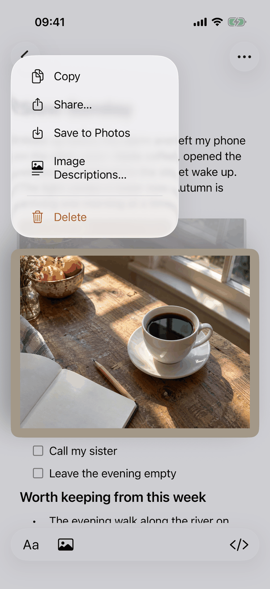
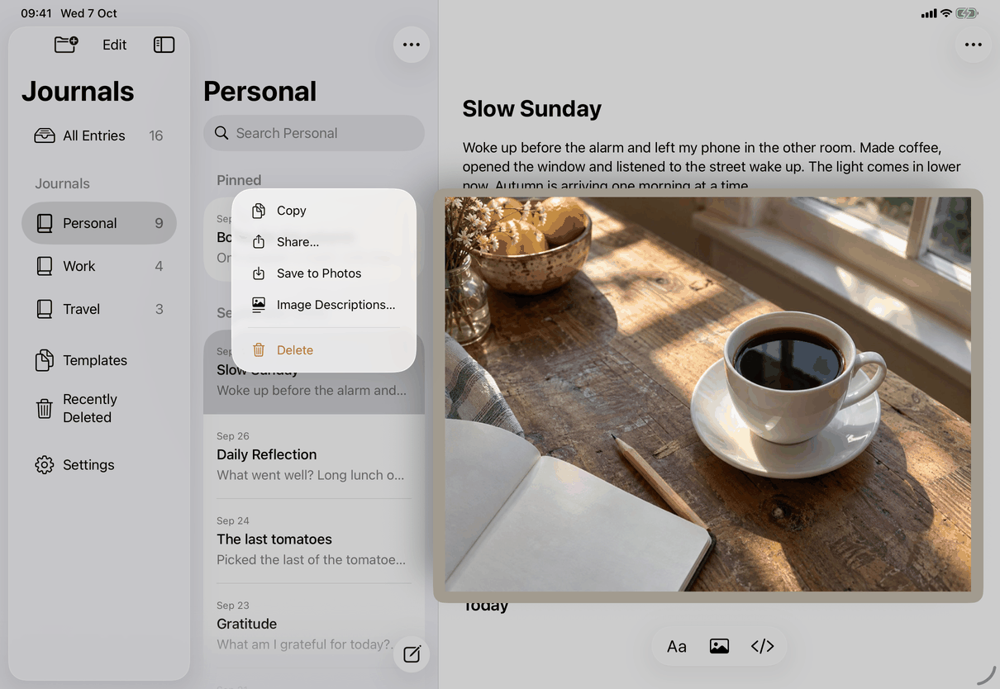

# Act on a picture (Apple)

How the spec's [Act on a picture](../../../flows/image-actions.md) is built. Pictures in the text are attachment characters in the entry's `JournalTextView`; `ImageItem` (shared, `ImageItems.swift`) finds the picture at a text index, says what its stored original is (`type(of:)`), where deleting it cuts (`deletionRange`) and what other apps get (`pasteboardRepresentations`: the original under its own type, plus a JPEG copy at quality 0.9 for HEIC and HEIF).

## Controls

Both platforms build the menu from one rule, `imageActions(for:)`: Copy, Share and Save only while the picture is shown (its bytes are in `parent.images`); Image Descriptions only when the entry is editable and `ImageActionSupport.describe` is set (`model.canDescribeImages`); Delete only when the entry is editable. `ImageActionSupport` (built in `RootView.imageActions(for:)`) gives the editor the stored original (`store.attachment`), the failure reporter (`model.error = ...`, the app's error alert) and the Image Descriptions opener (sets `imageDescriptionsEntry`, which presents [image-description](../screens/image-description.md) once written).

| Part | iPhone and iPad | Mac |
| --- | --- | --- |
| Start | Long press. iOS 17 and later: `textView(_:menuConfigurationFor:defaultMenu:)` returns `UITextItem.MenuConfiguration(preview: .default, menu:)`, so the system lifts the picture and shows the menu beside it. Returns nil (no menu) when nothing is offered. On iOS 16 the system's own menu stays (the app's deployment target is iOS 16) and VoiceOver actions give the full set | Right-click or Control-click: `JournalTextView.menu(for:)` lets the text view select the clicked picture first, then returns `pictureMenu(for:)` if the click is inside the picture's rectangle; a click on text keeps the standard text menu. Menu key or VoiceOver Show Menu with one picture selected: `showPictureMenu` pops the menu up at the picture |
| Menu | `UIMenu` of `UIAction`s with SF Symbols: `doc.on.doc` Copy, `square.and.arrow.up` Share…, `square.and.arrow.down` Save to Photos, `text.below.photo` Image Descriptions…, then Delete (`trash`, `.destructive`) in an inline `UIMenu` of its own, which draws the separator | `NSMenu` titled Image: Cut, Copy, Paste (system selectors on the text view, with symbols), a separator, the system Share item (`NSSharingServicePicker.standardShareMenuItem`), Save Image As…, a separator, Image Descriptions…, a separator, Delete (destructive). `PictureMenuItems` removes the AutoFill and Services items the system adds and any trailing separator. Cut and Paste are listed only when editable; Copy always |
| Copy | `copy` in the picture's menu; `JournalTextView.copy` also routes a selection of exactly one picture to `copySelected`, which adds the entry's own Markdown type and no text | `JournalTextView.copy` and `cut` check `selectedPicture`: `.ready` copies at once, `.pending` waits for the read without blocking (`awaitSelectedPicture`), `.none` copies as text. The original is read as soon as one shown picture is selected (`prepareSelectedPicture`, on every selection change) |
| Share | `UIActivityViewController` with `ImageShareItem` (the bytes in memory, the original's type, the title Image plus extension), presented from the top view controller; on iPad its popover is anchored at the picture's rectangle (`imageRect`) | Share item with an `NSItemProvider` whose suggested name is Image plus extension; the data is read when a service asks (`shareProvider`). VoiceOver's Share shows the picker relative to the picture |
| Save | Save to Photos: `PHPhotoLibrary.requestAuthorization(for: .addOnly)`, then `PHAssetCreationRequest`. If access is not granted (neither authorized nor limited) a `UIAlertController` titled by `editor.image.photosOff.title` with `editor.image.photosOff.message`, buttons `common.openSettings` (opens `UIApplication.openSettingsURLString`) and `common.cancel` | Save Image As…: `NSSavePanel` as a sheet on the window, name from `editor.image.fileName` plus the type's extension, `allowedContentTypes` the one type; the bytes are written off the main thread |
| Cut, Paste | Not in the picture's menu (the text view's edit menu cuts and pastes text) | Cut: copies, then `delete(nil)`, action name Cut. Paste: the text view's paste, which `pasteJournalContent` routes to the entry's Markdown or image import |
| Delete | `deleteImage`: the text view takes focus (so shake and ⌘Z reach the step), the range is replaced with nothing as one undo step named Delete Image, VoiceOver gets `layoutChanged` on the text, then 0.3 s later `editor.announce.imageDeleted` | The same, with `makeFirstResponder` and `focusedUIElementChanged` |
| Selection look | None added; the system lift preview stands in | `JournalImageCell.draw` tints a selected picture 18 percent and outlines it 3 points in `selectedContentBackgroundColor` (a grey when the window is not key or the text is not focused), because the text selection is drawn behind the picture |
| VoiceOver | One `PictureAccessibilityElement` per picture (`UIAccessibilityElement`, trait image) added to `JournalWritingView.accessibilityElements` after the text, tables and checkboxes. Its frame is computed on demand, `accessibilityElementDidBecomeFocused` scrolls it into view, and `accessibilityActivate` returns true and does nothing | The picture's `JournalImageCell` (an `NSTextAttachmentCell`) returns `accessibilityCustomActions`; `accessibilityPerformShowMenu` shows the menu. The label is the `NSImage.accessibilityDescription` set in `ImagePresentation` |

Failures (the original cannot be read, the share or save fails) call `ImageActionSupport.report`, which sets `model.error`: the generic alert, with the message keys `editor.image.copyFailed`, `editor.image.shareFailed`, `editor.image.saveToPhotosFailed` (iPhone, iPad) and `editor.image.saveFailed` (Mac). An action for a picture that is no longer at that index does nothing (`ImageItem.at(item.index, in:) == item`). A lock or leaving the entry closes the menu, share sheet or panel and forgets the read: `leavingWindow` runs `dismissImagePresentations` (iOS) or `dismissPicturePresentations` (Mac), and iOS also closes the menu when the scene enters the background (`enteringBackground`).

Dragging a selected picture to another app (Mac): `writeSelection` writes the original's types when the read is ready, otherwise only the entry's Markdown; `draggingSession(_:sourceOperationMaskFor:)` allows copy only outside the app. iPhone and iPad keep the system's drag for pictures; the design record leaves it out of scope.

## Layout

- The menu is a system menu or context menu, so its placement is the system's: on iPhone above or below the lifted picture, on iPad as a popover beside it, on the Mac at the pointer or, from the keyboard, at the picture's lower left corner (`NSPoint(x: rect.minX, y: rect.maxY)`).
- The Share sheet is full width on iPhone and a popover anchored at the picture on iPad. The Mac picker is relative to the picture.
- Item titles wrap in the iPhone menu (Image Descriptions… takes two lines in the capture); Dynamic Type enlarges the system menu.
- Nothing in the editor's layout changes: the picture keeps its place; a lifted preview is the system's.

## Commands and shortcuts

Placement is as in [commands.md](../commands.md) (Editor-only controls, picture rows).

| Command | Placement | Shortcut | Enabled when |
| --- | --- | --- | --- |
| `image-copy` | First item on iPhone and iPad; after Cut on the Mac | ⌘C on the Mac and iPad with a keyboard when one picture is selected | The picture is shown. The Mac lists it always and acts only when shown |
| `image-cut` | Mac only | ⌘X | Editable; one shown picture selected |
| `image-paste` | Mac only | ⌘V | Editable |
| `image-share` | `common.share` (iPhone, iPad); the system Share item (Mac) | none | Shown |
| `image-save-to-photos` | iPhone and iPad only | none | Shown |
| `image-save-as` | Mac only | none | Shown |
| `image-delete` | Last item, destructive | none; ⌘Z undoes | Editable |
| `image-descriptions` | Before Delete | none | Editable and the entry offers descriptions |

The picture's menu has no key equivalents of its own on iPhone and iPad. On the Mac the three edit items carry ⌘X, ⌘C, ⌘V through their selectors. A VoiceOver user reaches every action as a custom action; the Mac menu opens from the keyboard with the menu key or VoiceOver's Show Menu.

## Copy differences

None in wording. The Mac menu says Save Image As… and the iPhone and iPad menu says Save to Photos; Share… has an ellipsis on iPhone and iPad (`common.share`) and is the system's item on the Mac. VoiceOver action names drop the ellipsis: `editor.image.shareSpoken`, `editor.image.saveImageAsSpoken`, `editor.image.describeSpoken`. The source holds these as literal English.

## Accessibility

- Label of a picture: the description, else `editor.image.accessibilityLabel`; while loading, unavailable or remote, `editor.image.loadingAccessibility`, `editor.image.unavailableAccessibility` or `editor.image.remoteAccessibility` followed by the description (`ImagePresentation.attachment`, `PictureAccessibilityElement.configure`). The placeholder text itself is drawn into an image (`editor.image.loading`, `editor.image.unavailable`, `editor.image.remote`), so the label is what VoiceOver reads.
- Custom actions: Copy, Share, Save to Photos or Save Image As, Image Descriptions, Delete, in that order, each acting without moving the selection (`ImageActionsTests`).
- After Copy: `editor.announce.copied`. After Save to Photos: `editor.announce.savedToPhotos`. After Delete: focus to the text, then `editor.announce.imageDeleted`.
- On the Mac a selected picture is outlined with the selection colour as well as tinted, so the selection does not depend on colour alone.

## Differences between iPhone, iPad and Mac

- Cut, Copy and Paste lead the Mac menu because a Mac text view offers them for an attachment (TextEdit, Notes, Pages); the design record chose that over Safari's read-only style. On iPhone and iPad the lifted-picture menu follows Photos and Messages (copy, share, save, then the destructive item) and the text view's edit menu already cuts and pastes.
- Save Image As exists only on the Mac, where saving a file is a save panel. Adding to Photos on the Mac is the system Share menu's own service, so the app asks for no photo library permission there. Save to Photos exists only on iPhone and iPad and needs the add-only permission (`editor.permission.photosAdd`).
- The Mac menu is built by the app (`NSMenu`, with the system Share item); the iPhone and iPad menu is a `UIMenu` that the system shows with a lifted preview, from iOS 17. iOS 16 keeps the system's menu.
- Copying a selected picture on the Mac waits on a read started when the picture is selected, so that ⌘C is immediate; on iPhone and iPad the read starts when Copy is chosen.
- On iPhone and iPad a tap selects the picture and starts writing, and the edit menu's Copy and ⌘C then copy the picture itself (`JournalTextView.copy` calls `copySelected`). On the Mac a click selects it and Copy, Cut and ⌘C or ⌘X act on it the same way.
- VoiceOver on iPhone and iPad has separate elements for the pictures after the text; on the Mac the picture cells inside the text view carry the actions.
- Dragging a picture out to another app is customised only on the Mac; iPhone and iPad keep the system's drag.
- A picture inside a line of text (shown small) gets the same menu as one on its own line; Delete removes only the picture then (`ImageItem.inline`, `deletionRange`).

## Screenshots

| Device | Capture | State |
| --- | --- | --- |
| iPhone |  | Long press on the coffee picture in the entry Slow Sunday: the lifted picture, the rest dimmed, and the menu with Copy, Share…, Save to Photos, Image Descriptions…, then Delete in red below a separator |
| iPad |  | The same menu as a popover beside the lifted picture, over the three-column layout |

No Mac capture: the picture menu is a pop-up that the capture script does not take. The Mac items are read from `ImageActionsMac.swift`.

## Source files

View:

- `apps/apple/JournalApp/Editor/ImageActionsIOS.swift`: the iOS menu, VoiceOver elements, copy, share, save, delete and the Photos alert.
- `apps/apple/JournalApp/Editor/ImageActionsMac.swift`: the Mac picture menu, the original read, the selected-picture look, copy, share, save panel and delete.
- `apps/apple/JournalApp/Editor/NativeTextView.swift`: `copy`, `cut`, `writablePasteboardTypes`, `menu(for:)` and the drag mask on the Mac; `copy` and `cut` on iOS.
- `apps/apple/JournalApp/Editor/ImagePresentation.swift`: picture attachments, placeholders and their labels.

Model:

- `apps/apple/JournalApp/Views/RootView.swift`: `imageActions(for:)`, which supplies the original, the error report and the Image Descriptions opener.

Core:

- `apps/apple/JournalApp/Editor/ImageItems.swift`: `ImageItem` and `ImageActionSupport`, shared by the three devices.

Design records: `docs/design/image-actions-ios-2026-10-03.md`, `docs/design/image-actions-mac-2026-10-03.md`. Tests: `apps/apple/JournalTests/ImageActionsTests.swift`.

## Open questions

None.
