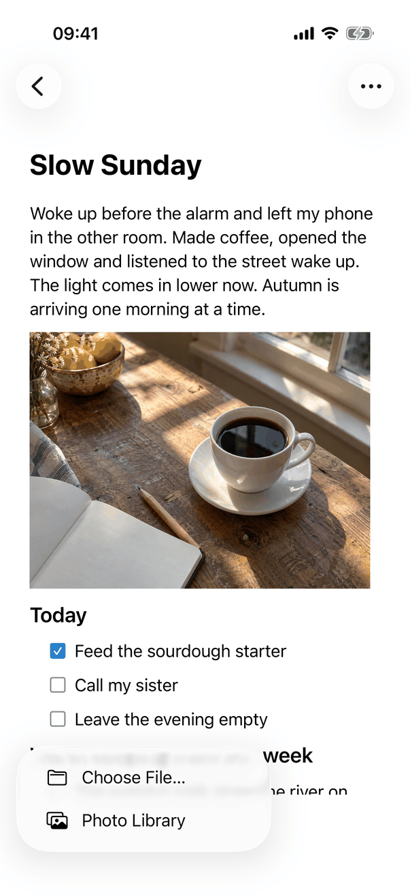

# Insert an image (Apple)

How the spec's [Insert an image](../../../flows/insert-image.md) is built. The rules for where an inserted image lands (IM-1 to IM-9, PA-11, PA-12) are in [editing-rules.md](editing-rules.md).

## Controls

Insert Image is a request, not a view: `EditorActions.insertImage(from:)` records the image source and captures the editor's formatting session (`captureFormatting`, which keeps the selection), then sets `requestImage`. `RootView` answers it (it watches the `requestImage` flag): it ends any earlier import, creates an `ImageInsertionSession` (nil when the entry cannot be edited), and presents the picker for the recorded `imageSource`. The model for the stored result is `AppModel.importImage` (`ImportedImage.swift`); the entry itself receives each image as an `EditorCommand.image` through the captured session.

| Part | iPhone and iPad | Mac |
| --- | --- | --- |
| Control | `InsertImageMenu`: a SwiftUI `Menu` labelled Insert Image with the `photo` symbol, shown icon-only in the `ReadingBar` capsule at the bottom of the entry and, while writing, in `WritingAccessory` (the keyboard accessory, a `UIInputView` hosting `WritingAccessoryBar`). Disabled when the entry cannot be edited | A toolbar button (`NSToolbarItem` made in `JournalToolbarController`, label Insert Image, `photo` symbol), enabled with `configuration.canEdit`; Format ▸ Insert ▸ Image… (`AppCommands.swift`); Formatting popover ▸ Insert ▸ Image… |
| Menu items | In source order: Photo Library (`photo.on.rectangle`), Take Photo (`camera`, only if `CameraPicker.isAvailable`), Choose File… (`folder`). Keys `editor.insertImage.photoLibrary`, `editor.insertImage.takePhoto`, `editor.insertImage.chooseFile` | None: the control opens the open panel directly |
| Picker | `ImagePickerPresenter`: `.photosPicker` (`maxSelectionCount: nil`, `selectionBehavior: .ordered`, `matching: .images`); `CameraPicker` (`UIImagePickerController`, source camera) in `.fullScreenCover`; `.fileImporter(allowedContentTypes: [.image], allowsMultipleSelection: true)` | `.fileImporter` with the same arguments, which is the system open panel. Whatever the recorded source says, the Mac presents the open panel |
| Format menu on iPad | Format ▸ Insert ▸ Image… calls `insertImage(from: .photos)`. From the Formatting panel, `finishPresentation` also uses `.photos` | Format ▸ Insert ▸ Image… calls `insertImage(from: .files)` |
| Camera denied | `ImagePickerPresenter` shows an `.alert` (`CameraPicker.isDenied`): `editor.insertImage.cameraOff.title`, `editor.insertImage.cameraOff.message`, buttons `common.openSettings` and `common.cancel`. A restricted camera hides Take Photo | None |
| Progress | `ImageImportNotice`, above the whole editor (above the title header), under the conflict notice | The same view, between the title and the text |
| Result | `ImageInsertionSession.insert` | The same |

Session (`ImageInsertionSession`, the same on all devices):

- `insert(_:into:)` reads the chosen images through `OrderedImageReading.read(width: 2)`: at most two at a time, handed over in the order chosen. Each goes to `AppModel.importImage`, which refuses more than `ImportedImage.maximumBytes` (25 MB less 28 bytes), removes location metadata (`ImportedImage.prepare`), stores the bytes (`store.addAttachment`) and returns an image block. With one image the editor gets the picture at once (`showing: total == 1`); several are read back by the image loader after insertion.
- After 0.5 s without finishing, `progress` is set and `ImageImportNotice` appears with a small `ProgressView`, `editor.imageImport.adding` or `editor.imageImport.addingSeveral` and a Stop button (`editor.imageImport.stop`). Stop calls `cancelImageImport()`, which ends the session with `cancel()` (quiet: no message).
- When every image is read and the session is still current (`isCurrent`: same entry, same library, same lock generation, entry editable), the blocks are sent to the captured formatting session in order (`command(.image(block))`), the editor makes them one undo step, and VoiceOver announces `editor.announce.imageAdded` or `editor.announce.imagesAdded`.
- A single failed image sets `model.error` (the generic alert; `messages.image.tooLarge`, `messages.image.unreadable`, `messages.image.unavailable`). Several images with failures produce one message from `problemMessage`: `editor.imageImport.someFailed` or `editor.imageImport.allFailed` plus one `editor.imageImport.cause.*` sentence.
- Leaving the entry (`cancelImageImport(leaving: true)` when `selectedID` changes) ends the session with `leave()`, and the image count decides between the singular and plural of `editor.imageImport.left`. A lock, another Insert Image, or a library change cancel quietly. A session whose entry is still open but can no longer be changed says the entry "can’t be changed right now" (`unchangeableMessage`); that sentence is not in `copy/en.json` (see Open questions).
- A camera photo is stored as JPEG at quality 0.9 (`CameraPicker`, `jpegData(compressionQuality: 0.9)`). A photo-library item the picker cannot provide is reported as `ImportedImage.Problem.unavailable`.

Paste and drop use `PastedImages` and not the session:

- Mac: `JournalTextView.paste` and `readSelection` call `PastedImages.images(on: NSPasteboard)`; image files come from file URLs, photos keep their own bytes in the order `heic, heif, jpeg, png, gif`, and a TIFF is encoded once (`encode(image:)`: JPEG at 0.9 if opaque, else PNG). `performDragOperation` places a drop where the pointer is (`characterIndexForInsertion`) before importing.
- iPhone and iPad: `JournalTextView.paste` calls `PastedImages.images(on: UIPasteboard)`. There is no custom drop handling on iPhone and iPad in the source (not verified at runtime); the system text view's drop applies.
- Both: when the pasteboard also holds text (rtf, rtfd, html, or a string that is not just a web address) there are no images and the text is pasted. `EditorSession.receiveImages` captures the formatting session first, then imports each picture one by one through the `imageHandler` closure (`AppModel.addImage`) and inserts each where it was put. A failure sets the generic alert with the single-image message.

Placeholders (all devices, `ImagePresentation.attachment`): a picture with no bytes yet is an image drawn with the text of `editor.image.loading`, `editor.image.unavailable` or `editor.image.remote` in secondary colour at the body size and the text width, so it is not a text view paragraph. When the bytes arrive the attachment is replaced in place (`refreshImages`) without moving the selection. Pictures are decoded at the size they are shown (`ImageThumbnails`).

## Layout

- The notice is a full-width bar (`.background(.quaternary)`), laid out as the conflict notice: side by side, stacked at accessibility text sizes (`dynamicTypeSize.isAccessibilitySize`), where Stop goes below the text.
- iPhone and iPad: the notice sits above the entry, title included, so it stays in view whatever the scroll position (the title is part of the scrolling text view). Mac: it sits between the title and the text view.
- The Photo Library picker is the system sheet, the camera a full-screen cover, the file importer a document picker (iPhone, iPad) or the open panel (Mac). The Insert Image menu opens upward from the bottom bar on iPhone and iPad.
- The detail column is at most 760 points wide on all devices, so a picture is at most the text width minus 20 points (`imageLayout`); smaller pictures keep their size.
- Dynamic Type: the bottom bar buttons keep a 44 point minimum size (`ReadingButtonStyle`); the notice wraps.

## Commands and shortcuts

Placement is as in [commands.md](../commands.md) (Editor-only controls).

| Command | Placement | Shortcut | Enabled when |
| --- | --- | --- | --- |
| `insert-image` | Mac: toolbar button, Format ▸ Insert ▸ Image…, Formatting ▸ Insert ▸ Image…. iPhone, iPad: the Insert Image menu; iPad menu bar Format ▸ Insert ▸ Image… | none | The entry can be edited |
| `insert-image-choose-file` | Mac: the toolbar button itself. iPhone, iPad: last item of the Insert Image menu | none | as above |
| `insert-image-photo-library` | iPhone and iPad: first item of the Insert Image menu; iPad menu bar | none | as above |
| `insert-image-take-photo` | iPhone and iPad: middle item, only on a device with a camera that is not restricted | none | as above |
| `edit-text` | Edit ▸ Paste and the text edit menu paste pictures | ⌘V | The entry can be edited |

The open panel, the photo picker and the camera follow the system's keys (Return opens or chooses, Escape cancels). The notice's Stop is reachable with Full Keyboard Access on the Mac and iPad.

## Copy differences

None. The Insert Image label is the same on all devices (`library.toolbar.insertImage`; on iPhone and iPad it is the accessibility label of the icon-only menu). The source writes all strings as literal English.

## Accessibility

- The notice's progress row is one element (`.accessibilityElement(children: .ignore)`): label `editor.imageImport.addingAccessibility` or `editor.imageImport.addingSeveralAccessibility`, value `editor.imageImport.progressValue`; the spinner is hidden from VoiceOver. Stop is a separate button.
- The notice appears with a slide from the top and a fade, and without motion when Reduce Motion is on (`.transition(reduceMotion ? .identity : ...)`).
- The result is announced (`JournalAccessibility.announce`): `editor.announce.imageAdded` or `editor.announce.imagesAdded`; nothing for a cancelled import.
- The Insert Image menu items have symbols and text. The icon-only bottom bar button is labelled by its `Label`.
- Focus: the person's caret, keyboard and scroll position stay where they are when images arrive after they moved on; if they did not move, on iPhone and iPad `revealCaretAfterImage` keeps the caret above the keyboard and the writing controls for a moment.

## Differences between iPhone, iPad and Mac

- Mac has one source (files, through the open panel) and no camera or photo library menu, on purpose: the design record leaves a Photos picker on the Mac as a possible follow-up, so the toolbar button needs no menu. iPhone and iPad offer three sources in a menu, photo library first, as in Notes.
- The iPad menu bar's Format ▸ Insert ▸ Image… opens the photo picker, the Mac's opens files; the source states no reason beyond matching each device's first choice in the Insert Image menu.
- Take Photo is hidden on a device without a camera or when Screen Time or device management restricts it; a denied camera gets the Camera Access Is Off alert.
- The notice sits above the title on iPhone and iPad and below it on the Mac, because on iPhone and iPad the title scrolls with the text.
- Drops are handled by the app on the Mac only.

## Screenshots

| Device | Capture | State |
| --- | --- | --- |
| iPhone |  | The entry Slow Sunday with the Insert Image menu open from the bottom bar. Only Choose File… and Photo Library are listed: the capture device has no camera, so Take Photo is hidden. The list is drawn nearest-the-button first, so it reads bottom-up compared with the source order |

No iPad or Mac capture: the picker sheets and the open panel are system UI, and the progress notice shows only after 0.5 s of reading.

## Source files

View:

- `apps/apple/JournalApp/Editor/WritingAccessory.swift`: `InsertImageMenu` and the keyboard accessory (iPhone, iPad).
- `apps/apple/JournalApp/Views/ImagePickerPresenter.swift`: the photo picker, camera, camera-denied alert and file importer.
- `apps/apple/JournalApp/Views/ImageImportNotice.swift`: progress and Stop.
- `apps/apple/JournalApp/Views/Mac/JournalToolbarController.swift`: the Mac toolbar button.
- `apps/apple/JournalApp/Views/RootView.swift`: starts and ends sessions, places the notice, receives the result.
- `apps/apple/JournalApp/AppCommands.swift`: Format ▸ Insert ▸ Image….

Model:

- `apps/apple/JournalApp/Editor/ImageInsertionSession.swift`: reading in order, progress, messages, one insertion.
- `apps/apple/JournalApp/Model/ImportedImage.swift`: size limit, location removal, media type, the problems.
- `apps/apple/JournalApp/Editor/FormattingSessions.swift`: the captured selection and the exception that lets an image arrive after the person moved on.
- `apps/apple/JournalApp/Editor/PastedImages.swift`, `EditorSession.swift`, `NativeTextView.swift`: paste and drop.
- `apps/apple/JournalApp/Editor/ImagePresentation.swift`: placeholders and picture attachments.

Core: none specific; the image block and attachment store are in JournalCore (`DocumentImages.swift`, `StoreAttachments.swift`).

Design records: `docs/design/several-photos-2026-10-03.md`, `docs/design/image-insertion-ownership.md`, `docs/design/imported-image-type.md`.

## Open questions

See [open-questions.md](../../../open-questions.md), B25. The code has moved on: when the entry stays open but can no longer be changed, `ImageInsertionSession.unchangeableMessage` shows "The image wasn’t added because this entry can’t be changed right now." (one and several), and `editor.imageImport.left` is only for leaving the entry. That sentence has no key in `copy/en.json`.
