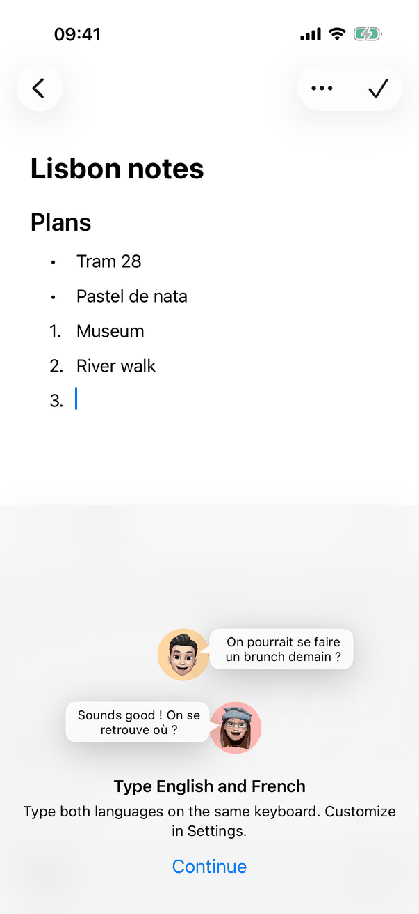
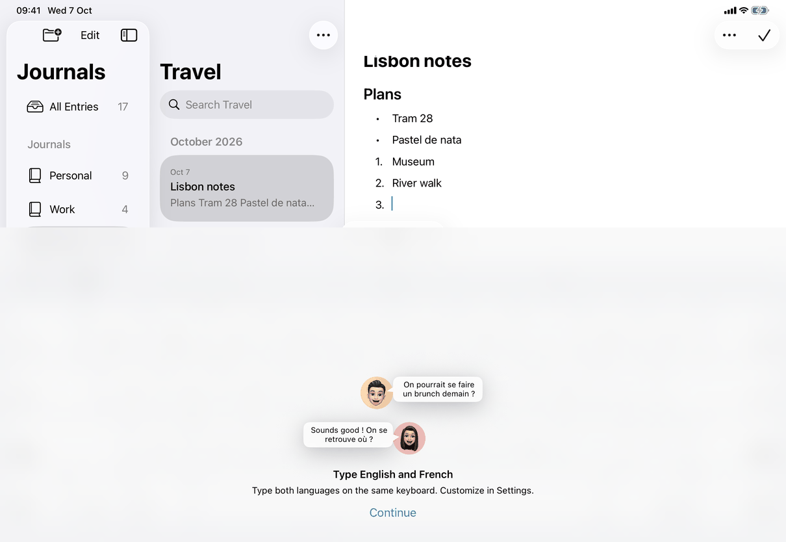

# Markdown as you type (Apple)

How the spec's [Markdown as you type](../../../flows/markdown-as-you-type.md) is built. The rules (K-1 to K-6, N-12) are in [editing-rules.md](editing-rules.md). There is no view of its own: the behaviour lives in the entry's text view delegate, and the only control is a Settings toggle ([settings-general.md](../screens/settings-general.md)).

## Controls

- Setting: a SwiftUI `Toggle` in the Settings `Form` (`.formStyle(.grouped)`) with a footer, bound with `@AppStorage(MarkdownShortcuts.settingKey)` (the user default `formatMarkdownAsYouType`, default true). It is in the Writing pane on iPhone and iPad and in the General tab of the Settings window on the Mac (`SettingsView.generalSettings`). Copy keys: `settings.general.formatAsYouType` and `settings.general.formatAsYouType.footer`. Erase Journals and Settings removes the stored value, so the default applies again.
- Reading the setting: `MarkdownShortcuts.enabled` reads `UserDefaults` each time, so a change applies to the next key press with no editor restart.
- Matching: `MarkdownShortcuts.style(forMarker:)` maps a typed prefix with its space to a paragraph kind (`- `, `* `, `+ ` bullet; `[ ] `, `[] ` task; `[x] `, `[X] ` checked; `> ` quote; `#` to `######` plus a space, headings 1 to 6; 1 to 9 ASCII digits plus `.` or `)` plus a space, numbered starting at the number). `MarkdownShortcuts.block(forLine:)` maps a whole line to a rule (`---`, `***`, `___`) or a code fence (three backticks plus letters, digits or `+-_#.`).
- Where it applies: `MarkdownShortcuts.plainParagraph` accepts only a paragraph of kind `paragraph` that is not a table, in preview (`MarkdownEditing.isSource` false). Headings, items, quotes, code blocks and table cells are other kinds; table cells are separate text views and never reach this code.
- Hooks: both platforms call `markdownShortcutShouldChange(in:replacement:)` from the text view delegate's should-change method for every change the text view is about to make. Mac: `textView(_:shouldChangeTextIn:replacementString:)`; iPhone and iPad: `textView(_:shouldChangeTextIn:replacementText:)`. The conversion of a space is done in that call and the call returns false, so the text view never types the space itself.
- Return: Mac `textView(_:doCommandBy:)` handles `insertNewline` through `convertLineOnReturn`; iPhone and iPad do the same in `shouldChangeTextIn` when the replacement is a line break. It needs an empty selection and the caret at the end of the line.
- Backspace straight after a conversion: `shortcutRevert` holds the converted range, the typed original, the caret and the text length. It is used by the same should-change call (a one-character deletion ending at the converted caret, with the length unchanged) and, at the very start of the text where the text view does nothing, by `removeItemFormattingAtStart`. That is reached from `doCommandBy` `deleteBackward` on the Mac and the `deleteBackward` override of `JournalTextView` on iPhone and iPad. Any other edit clears it (`shortcutRevert = nil` on the next change).
- Never while an input method composes (`hasMarkedText` on the Mac, `markedTextRange != nil` on iPhone and iPad), when `parent.editable` is false, and not for the editor's own replacements (`replacingText`).
- Undo: `convertShortcut` makes two undo steps with `beginOwnUndoStep`: the typed space (action name Typing), then the conversion (action name the style, such as Bulleted list or Heading 1). On the Mac `breakUndoCoalescing` also stops typing from merging into them. The snapshots restore text, selection and typing attributes (`DocumentUndo.swift`).
- Announcement: `MarkdownShortcuts.announcement(_:)` text is posted with `UIAccessibility.post(notification: .announcement)` (iPhone, iPad) or `NSAccessibility.post(element: view, notification: .announcementRequested)` at medium priority (Mac). The spoken text equals `editor.announce.bulletedList`, `editor.announce.numberedList`, `editor.announce.checklist`, `editor.announce.blockQuote`, `editor.announce.heading`, `editor.announce.horizontalRule` and `editor.announce.codeBlock`; checked items announce Checklist.
- Typing continues in the new style: the conversion sets `typingAttributes` to the new block's attributes, not the marker's.

A burst of keys (N-12) works because the conversion happens inside the should-change call, not on a later run loop turn: keys already queued then arrive after the caret has moved into the new block (`MarkdownShortcutTests.testABurstOfKeystrokesKeepsEachLetterInItsItem`).

## Layout

Not applicable: the behaviour has no layout of its own. The Settings toggle is a row of the Writing or General pane; its footer wraps with the text size. After a conversion on iPhone and iPad `replace` reveals the caret above the keyboard and the writing controls (`revealCaretAfterEdit`); on the Mac `revealOnTheMac` calls `revealCaretAfterKey`, which keeps the typing room below the line (`EntryScrollView`).

## Commands and shortcuts

| Command | Placement | Shortcut | Enabled when |
| --- | --- | --- | --- |
| `toggle-format-as-you-type` | Settings ▸ Writing (iPhone, iPad), Settings ▸ General (Mac), as in [commands.md](../commands.md) | none | Settings is open (not while locked) |
| `undo` | Edit menu; ⌘Z on a hardware keyboard; shake or the keyboard's undo on iPhone and iPad | ⌘Z | The entry has focus. First Undo gives back the typed marker and space, the second removes the space |
| `redo` | Edit menu | ⇧⌘Z | as above |

Keys: Space completes a marker, Return completes a rule or fence, Backspace takes a conversion back. They are the same with the on-screen keyboard and a hardware keyboard: the code reads the changes the text view is about to make, not key codes.

## Copy differences

- `settings.general.formatAsYouType` has a `mac` variant: the Mac toggle reads "Format Markdown as you type" (lower-case "you type"); iPhone and iPad read "Format Markdown as You Type". The footer is the same on all devices. Reason: macOS settings labels use sentence case, iOS uses title case (`#if os(macOS)` in `generalSettings`).
- The undo menu name after a conversion is the style's announcement text (Bulleted list, Numbered list, Checklist, Block quote, Heading n, Paragraph), in sentence case, while Typing is the name of the first step. These names are literal strings in `MarkdownShortcuts`, not copy keys (see [open-questions.md](../../../open-questions.md), B16).

## Accessibility

- Every conversion is announced, because nothing else tells VoiceOver that the line changed. The announcement does not move focus.
- A conversion to a list item or quote sets the paragraph's accessibility attributes (`ListAccessibility`), so VoiceOver then reads the item as a bullet, number, checkbox or quote.
- Backspace and Undo give back the typed marker, and VoiceOver reads the text as it was.
- With Dynamic Type at accessibility sizes nothing changes in the behaviour; the footer wraps.

## Differences between iPhone, iPad and Mac

- The Return and Backspace hooks differ because the two text systems send them differently: AppKit calls `doCommandBy` for editing commands, UIKit sends a line break through `shouldChangeTextIn` and has `deleteBackward` as the override for the start of the text. The rules are the same.
- The Mac stops typing from merging into the undo steps with `breakUndoCoalescing`; iPhone and iPad close the undo group (`beginOwnUndoStep`).
- The announcement is posted on the text view element on the Mac and globally on iPhone and iPad.
- The Mac setting label is lower case after "Markdown as" (see Copy differences).

## Screenshots

| Device | Capture | State |
| --- | --- | --- |
| iPhone |  | An entry Lisbon notes: a heading, two bulleted items and a numbered list with the caret in a new third item, the state after typing a marker and a space. The lower part is the system keyboard's language-setup panel from the simulator, not part of the app |
| iPad |  | The same entry in the three-column layout with the on-screen keyboard open, the writing controls (Formatting, Insert Image, View Source) floating above it and the checkmark (Done) in the top right |

No Mac capture was made for this page. The setting itself is shown on the Settings pages.

## Source files

View:

- `apps/apple/JournalApp/Views/SettingsView.swift`: the toggle and its footer (`generalSettings`).

Model:

- `apps/apple/JournalApp/Editor/MarkdownShortcutEditing.swift`: the should-change hook, the conversion on Space, the conversion on Return, Backspace take-back and the announcements.
- `apps/apple/JournalApp/Editor/NativeEditor.swift`: the two delegate methods that call it (Mac `doCommandBy` and `shouldChangeTextIn`, iOS `shouldChangeTextIn`) and the iOS `deleteBackward` hook.
- `apps/apple/JournalApp/Editor/NativeTextView.swift`: the iOS `deleteBackward` override on `JournalTextView`.
- `apps/apple/JournalApp/Editor/DocumentUndo.swift`: the snapshot undo steps.

Core (the app's shared editor code, not the JournalCore package):

- `apps/apple/JournalApp/Editor/MarkdownShortcuts.swift`: marker tables, the plain-paragraph test, the conversion and the revert record.

Design records: `docs/design/owner-decisions-2026-09-25.md` (section 4), `docs/design/editor-fixes-2026-10-04.md`. Tests: `apps/apple/JournalTests/MarkdownShortcutTests.swift`.

## Open questions

See [open-questions.md](../../../open-questions.md), B16 (undo step names). Not verified at runtime: a pasted lone space on the Mac passes the `replacingText` guard (the paste is an adopting replacement through `shouldChangeText`), so it may convert a marker before it; the spec says paste never converts.
