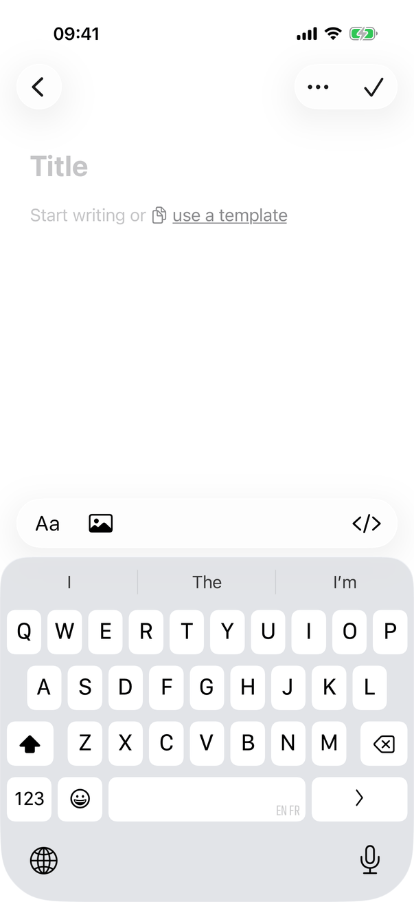
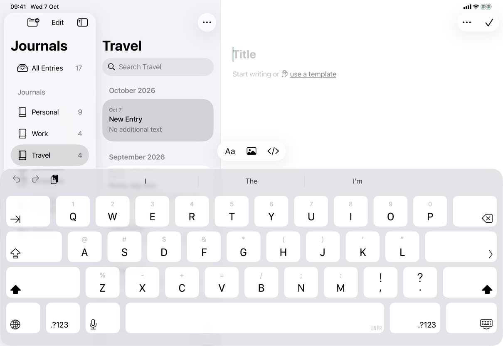

# New entry (Apple)

Implements [flows/new-entry](../../../flows/new-entry.md): one operation, `AppModel.newEntry()`, which always makes an empty entry, reached from several controls. The controls differ by device; the operation does not. Related pages: [template-chooser](../screens/template-chooser.md), [templates](../screens/templates.md), [library-window](../screens/library-window.md) and [journals](../screens/journals.md) (New Journal when there is no journal).

## Controls

**Entry points and what each calls**

| Entry point | Control | Calls |
| --- | --- | --- |
| Mac toolbar | New Entry `NSToolbarItem` (`square.and.pencil`) in the editor's section of `JournalToolbarController`; action `RootView.newEntryFromToolbar()` | `model.newEntry()`; with no journal in use it sets `createAfterJournal` and `model.newJournalRequested` instead |
| iPhone Journals page | Bottom-bar button from `EntryCreationActions(global: true)` | `activate(defaultJournalID)`: switches the list to the Default Journal, then `model.newEntry()` |
| iPhone and iPad lists | The same view with `global: false` in the list's bottom bar (iPad: bottom of the list column) | `start()`: `model.newEntry()` |
| File ▸ New Entry (⌘N) and File ▸ Use a Template… | `Button`s in `JournalCommands` (`CommandGroup(replacing: .newItem)`), Mac and iPad | `model.newEntry()`, and `model.templateChooserPresented = true` for the open entry, each inside `inJournalWindow`, which reopens the Mac window if it was closed. ⇧⌘N is not used |
| Empty list | `Button("New Entry")` (`library.menu.file.newEntry`) in `emptyListState`; `common.newJournalEllipsis` when no journal exists | `model.newEntry()`; New Journal |
| "use a template" in an empty entry | `TemplateSuggestionView` over the placeholder | `TemplateChooserView` ([template-chooser](../screens/template-chooser.md)), then `fillEmptyEntry(with:)` on the open entry |

The iOS button is `Button { ... } label: { Label("New Entry", systemImage: "square.and.pencil") }` with `.labelStyle(.iconOnly)` (the label stays its accessibility label), `.iconHelp("New Entry")` (the pointer tooltip) and `.disabled(busy || !model.isReady || model.locked || model.replacingVault)`. `busy` is local state set while the creation task runs, so a double tap does not create two entries; `.onDisappear` cancels the task. Tapping it first sets `model.editingJournals = false` (starting an entry ends the Journals edit mode). The Mac toolbar item is enabled by `isReady && !locked && !replacingVault`; the File menu items by `model.canCreateEntry`, which also needs a journal (`newEntryJournal != nil`), and New Entry from Template… also needs at least one template.

**The operation, step by step** (`AppModel.newEntry`):

1. *Which journal.* `newEntryJournal` is the shown journal when the destination is a journal (`selectedJournal`), otherwise `defaultJournal`: the journal chosen in Settings (`configuration.defaultJournalID`) when it is in use, else the oldest journal in use (smallest date, then identifier). The journal shown before All Entries, Templates, Recently Deleted or Unavailable Journals does not count.
2. *No journal.* The bars and toolbar call New Journal first: `createAfterJournal = true` and the New Journal alert opens; when its Create succeeds and `model.error` is nil, `RootView` calls `model.newEntry()`. The File menu items are disabled instead.
3. *Save first.* `guard await flush(), isCurrent()`: the open entry is saved; if that fails nothing is created and the general error alert explains (`saveFailure`).
4. *Switch the list.* When the list is not already on the target (a different journal, Templates, Recently Deleted, Unavailable Journals) the model clears the other collection flags, selects the journal, and closes what was open, in one step. From All Entries the list stays on All Entries.
5. *Contents.* Always an empty document: a journal record's stored `defaultTemplateID` from an earlier version is not read. The entry is a new `JournalItem(kind: "entry", journalID:, document:)` dated now; the store saves it before anything is shown.
6. *Show it.* The search is cleared, the library is read again, then `initialInsertion` (an `InitialEditorInsertion`, which tells the editor the entry is new and whether it came from a template) and `titleFocus` (an `InitialTitleFocus`) are set, `selectedID` and `draft` point at the new entry, and `rememberSelection()` stores it. `EntryHeaderView` (iOS) and `EntryTitleEditor` (both) read `titleFocus` and take keyboard focus. On iPhone `RootView`'s `.onValueChange(of: model.selectedID)` sets `navigationPath = [.collection(destination), .entry(id)]` when a title focus is pending, so Back goes to the list of the journal it was filed in. Nothing is announced and no message appears.
7. *Template into the empty entry.* Afterwards, `fillEmptyEntry(with:)` fills the open empty entry in place with a chosen template and refuses a body that is no longer empty (the chooser then reports `library.templateChooser.entryChanged`); nothing here creates an entry.

`isCurrent()` guards the whole operation: it compares an `entryCreationID`, the store, the lock and replacement state, and the selection and collection captured at the start. Choosing another collection or entry meanwhile calls `endEntryCreation()` (inside `select`, `switchJournal`, `showCollection`), so a slow creation does not take over a navigation the person chose; once the entry is stored, a later `isCurrent(cancellable: false)` still shows it.

**Empty entry.** The new entry's body is empty, so the editor draws "Start writing or use a template" when an editable template exists ([template-chooser](../screens/template-chooser.md)). The empty entry is kept in the list as "New Entry" with "No additional text" (see the iPad screenshot).

## Layout

- **Mac.** New Entry is the first item of the editor's toolbar section (see [library-window](../screens/library-window.md)); ⌘N works with no window open and reopens it.
- **iPhone.** The bottom bar of the Journals page and of every list holds search and New Entry, icon only. The new entry opens as a page pushed on the list's page; the keyboard opens with the caret in the title (screenshot).
- **iPad.** The bottom bar of the list column holds New Entry; the new entry shows in the editor column, the sidebar selects the journal, the list shows the entry at the top of its month.
- **Dynamic Type.** The bar button is an icon and keeps its size; the empty entry's placeholder wraps with the body font.

## Commands and shortcuts

| Command | Placement | Shortcut | Enabled when |
| --- | --- | --- | --- |
| `new-entry` | as in [commands.md](../commands.md) | ⌘N (Mac, iPad) | Toolbar and bars: ready, unlocked, not replacing (the bar button also not while creating); File menu: also a journal in use |
| `use-a-template` | File menu (Mac, iPad) and the link in an empty entry | none | Empty editable body and an editable template (the menu item is dimmed otherwise) |
| `empty-new-entry` | The empty list | none | `canCreateEntry` |
| `new-journal` | The first step when no journal exists | ⌥⌘N | Library open and unlocked |

Keyboard: ⌘N creates from anywhere in the window, also while typing. After creation the title has keyboard focus; Return in the title moves focus to the body (the title editor's `submit` asks the editor object to focus).

## Copy differences

None.

## Accessibility

- Keyboard focus, and so VoiceOver's, moves to the new entry's title field; nothing is announced.
- The bar button's accessibility label is the label text `library.menu.file.newEntry`, with the symbol hidden by `.iconOnly`; the Mac toolbar item has the label and tooltip "New Entry".
- Pointer: the iOS button has a help tooltip; the `use a template` link has a hover effect on iPad.
- Reduce Motion: the creation itself has no animation; the list insertion follows the list's own settings ([entry-list](../screens/entry-list.md)).

## Differences between iPhone, iPad and Mac

- **Where the control is.** Mac: one toolbar button over the editor, as in Notes; iPhone and iPad: a bottom-bar button, as in Notes. The reason is the platform's convention, not a different operation.
- **From the iPhone Journals page**, New Entry first opens the Default Journal's list so that Back from the entry shows where it was filed; iPad and Mac have no such page (the Journals sidebar has no New Entry button).
- **File menu items and ⌘N** exist on Mac and iPad (a menu bar, with a hardware keyboard on iPad; the iPad ⌘-hold overlay lists New Entry, New Journal… and Use a Template…); iPhone has the bar button only.
- **Use a Template… (File)** shows a sheet on Mac and iPad; "use a template" shows a popover or a sheet by width ([template-chooser](../screens/template-chooser.md)).
- **Reopening the window** is Mac only (the app can run with no window).

## Screenshots

The captures show a newly created, empty entry in the journal Travel.

| iPhone | iPad |
| --- | --- |
|  |  |

No Mac capture of this flow exists; the Mac toolbar button is visible on every Mac capture of the [library window](../screens/library-window.md).

## Source files

View:
- `apps/apple/JournalApp/Views/EntryCreationActions.swift`: the iPhone and iPad button.
- `apps/apple/JournalApp/Views/Mac/RootView+MacWindow.swift`, `JournalToolbarController.swift`: the Mac toolbar item and `newEntryFromToolbar`.
- `apps/apple/JournalApp/AppCommands.swift`: the File menu items and `inJournalWindow`.
- `apps/apple/JournalApp/Views/RootView.swift`, `CompactJournalNavigation.swift`: the empty-list button, New Journal first, the iPhone stack after creating.
- `apps/apple/JournalApp/Views/EntryHeaderView.swift`: the title that takes focus (iOS).

Model:
- `apps/apple/JournalApp/Model/AppModel.swift`: `newEntry`, `endEntryCreation`, `flush`.
- `apps/apple/JournalApp/Model/JournalNavigation.swift`: `newEntryJournal`, `defaultJournal`, `canCreateEntry`.
- `apps/apple/JournalApp/Model/TemplateSuggestion.swift`: filling an empty entry.

Core: `JournalItem`, `JournalDocument` in `apps/apple/Packages/JournalCore`.

Design records: `docs/design/default-journal.md`, `docs/design/new-entry-template-suggestion.md`, `docs/design/template-journal-choice-2026-10-03.md`.

## Open questions

None.
