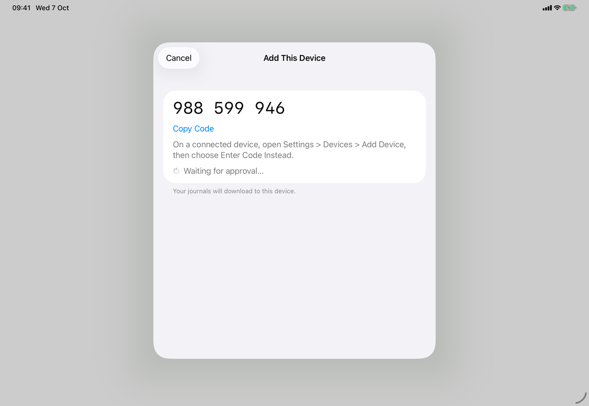
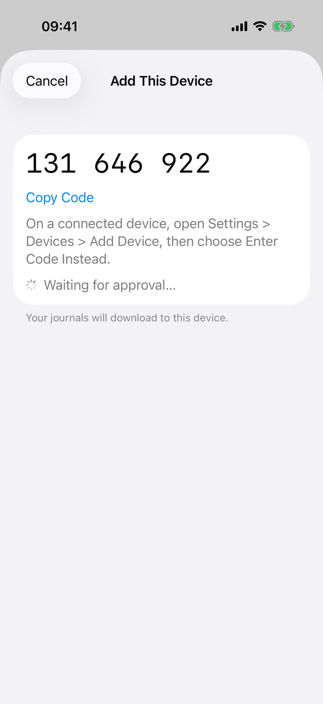

# Pair a new device (Apple)

Two cooperating views implement the flow of [pair-device](../../../flows/pair-device.md): the connected device runs `AddDeviceView` ([add-device](../screens/add-device.md)); the new device runs `ConnectionFlow` and its Add This Device and Finish on Your Other Device steps ([connect-to-server](../screens/connect-to-server.md), flow mechanics in [connect-to-server](connect-to-server.md)). They share nothing in memory: everything passes through the server. QR codes and Add Device conventions: [platform.md](../platform.md#29-qr-codes-and-add-device).

## Controls

**Connected device (`AddDeviceView`).** A private `Step` enum: `preparing`, `showingCode`, `entry`, `waiting(PairingChallenge, scanned:)`, `confirm(PairingApproval, scanned:)`, `finished`.

- *Scanned code.* `start()` asks `connectedClient().status()` whether the server supports `PairingInvite.feature` and `PairingInviteHost(server:)` accepts the address (HTTPS origin; loopback HTTP in debug builds). `showNewCode()` creates a `PairingInviteHost` (`current`), whose `invite.text` is rendered by `PairingCodeImage`, and starts `watchForNewDevice`, a loop that every 4 seconds calls `pairingCandidate(code:)` for the current code and the one it replaced (`replaced`, watched 30 more seconds). A code lives 120 seconds, a session 600. When a candidate answers, `answer(_:host:)` consumes both codes and requires `host.verifies(candidate)` (the HMAC proof that the device read this code); otherwise it declines the request (`declinePairing`), sets `expired` and shows `settings.addDevice.error.unverified`. A verified candidate goes to `prepare(host.challenge(candidate), scanned: true)`.
- *Typed code.* `lookUp()` checks `CodeEntry.pairingCodeIsComplete`, calls `pairingCandidate(code:)` with the normalised digits, then `prepare(PairingChallenge(candidate), scanned: false)`.
- `prepare(_:scanned:)` sets `.waiting` and calls `preparePairingApproval(challenge)`, which posts the connected device's one-time key (`/challenge`), then polls every second (doubling to 16 seconds when rate limited) until the new device reveals its key, and checks it against the commitment the new device made first (`PairingError.insecureCandidate` on a mismatch, `noResponse` when the request expires). Success gives `.confirm(approval, scanned:)`.
- `.confirm`: for a scanned code the name and `settings.addDevice.addQuestion`; for a typed code the six-digit check code (`PairingCheck`). `approve(_:)` authenticates the owner (`LAContext`, `.deviceOwnerAuthentication`, reason `settings.addDevice.authReason`; skipped when the device has no passcode), then `model.approveDevice(approval)` sends the journals' key wrapped for the new device (`approvePairing(_:masterKey:recoveryVersion:)`). A scanned, verified request starts `approve` by itself when `confirmationIsDeliberate` (a passcode, password or Touch ID; not Face ID; not with VoiceOver running).
- Errors map in `show(_:scanned:)`: `PairingError.deviceOutdated` goes to `.finished`; `insecureCandidate`, `expired` and `noResponse` clear the code and return to `.entry`; everything else (rate limited, unavailable, unanswered, unknown code) leaves the step as it is. Plain network errors use `NetworkFailureMessage`. A `URLError` after approval was sent goes to `.finished` with `settings.addDevice.error.unconfirmed`, so the sheet never offers to approve twice. A scanned device that goes away mid-request restarts with a new code and the notice `settings.addDevice.stoppedConnecting`.
- Leaving (`cancel()`, locking, `onDisappear`) cancels the work and declines a request that is waiting or confirmable (`declinePending()`); a request already being approved is left to finish.

**New device (`ConnectionFlow`).** For a typed code, `beginPairing()` asks the server for a ticket (`beginPairing(deviceName:publicKey:)`, with the key commitment) and shows the nine digits; `awaitApproval` polls every second (doubling to 16 seconds when rate limited, until `request.pollingDeadline`). When the poll carries the approver's key it reveals its own key (`revealPairing`), computes the check code, and posts `settings.connect.checkCode.announcement` (not after a scanned code). `awaitingConfirmation` (check code shown, not yet confirmed) shows Connect with Command-Return; `confirm()` sets `confirmed` and, if the grant already arrived, `resumeImport()` runs `finishImport()`. Nothing from the other device is installed before `confirmed` (or a scanned `invite`). For a scanned code, `join(_:)` sends the pairing request with the invite's proof after the Merge Journals check, sets `confirmed = true`, and requires the poll's approver key to equal the key the invite named (`invite.names(approverKey:)`), else `PairingError.insecureGrant`.

Server calls are `ServerClient` methods in `Packages/JournalCore/Sources/JournalCore/Pairing.swift` and `ServerClient.swift`; the check code is `PairingCheck.code(pairingID:devicePublicKey:approverPublicKey:)` (SHA-256 of both one-time keys and the request id, first four bytes modulo one million).

## Layout

- The connected side is one sheet on every device ([add-device](../screens/add-device.md)); the new side is the Connect to a Server sheet ([connect-to-server](../screens/connect-to-server.md)). Nothing in the flow differs by size class.
- Mac: the connected device's sheet is excluded from screen capture; the Mac has no scanner, so on the new-device side only typed-code pairing exists.
- iPad: both sheets are centred form sheets about 580 points wide, as the capture shows.

## Commands and shortcuts

| Command | Placement | Shortcut | Enabled when |
| --- | --- | --- | --- |
| `add-device` | Settings ▸ Devices, Server Is Ready, Turn On Encryption: opens the connected side | none | connected, unlocked |
| `add-device-enter-code` | Connected device, code step | none | showing a code |
| `add-device-look-up` | Connected device, typed-code step | Return in the field | code not empty |
| `add-device-approve` | Connected device, confirmation | Command-Return | a request is confirmable |
| `add-device-cancel` | Connected device | Escape | not while approving |
| `connect-copy-code` | New device, pairing code | none | a code is shown |
| `connect-confirm-check-code` | New device, Connect | Command-Return | check code shown, not confirmed |
| `connect-new-code` | New device, Get New Code | none | after a failure with nothing received |

Placements and the rest are in [commands.md](../commands.md). Approve and Connect never respond to Return alone, so neither can be triggered before the codes are read.

## Copy differences

`settings.addDevice.authReason` is lower-case on the Mac ("add “{device}” to your journals") because the system's prompt reads "My Journal is trying to …". Nothing else differs between devices. Two new-device strings have no catalog key ("New code." announcement; "That code was used. Enter a new one.").

## Accessibility

- The check code is a single element on both devices: label `settings.connect.checkCode.label`, value read digit by digit. The new device announces it when it appears (`announceForAccessibility`), typed-code pairing only.
- With VoiceOver running, a scanned request is not approved automatically; the person chooses Add Device first.
- The incomplete-code error on the connected side is announced; other errors are shown in red text in the sheet, and the new device announces every error it shows.
- Command-Return on both approving buttons; on the Mac they carry a tooltip and accessibility hint on the new device (`settings.connect.addThisDevice.connectHelp`, `settings.connect.addThisDevice.connectHint`).

## Differences between iPhone, iPad and Mac

- Scanning: the new device can scan only on iPhone and iPad ([scan-code](../screens/scan-code.md)); every device can show the QR code, including the Mac.
- Screen capture: the connected device's sheet is excluded on the Mac only.
- Idle timer: iPhone and iPad keep the screen awake while a code is shown.
- Code visibility: iPhone and iPad hide the QR code whenever the app is not active; the Mac only in the background ([add-device](../screens/add-device.md)).
- Authentication wording: system prompts differ (Face ID or passcode versus Touch ID or login password).

## Screenshots

| Device | State | Capture |
| --- | --- | --- |
| iPad | The new device's side of typed-code pairing: Add This Device with the nine-digit code (grouped 957 832 285), Copy Code, instructions, "Waiting for approval…", "Your journals will download to this device." and a Cancel button; no Use a Recovery Code Instead… row (that row appears only when `flow.passwordless` is true, which it is not for this capture) |  |

The connected side is captured under [add-device](../screens/add-device.md) (iPhone, iPad; the Mac sheet is hidden from capture). The check-code, confirmation and finished states were not captured.

-  iPhone: Add This Device on the new device, showing its pairing code while it waits for approval.

## Source files

View:
- `apps/apple/JournalApp/Views/AddDeviceView.swift`: the connected side end to end.
- `apps/apple/JournalApp/Views/ConnectionSteps.swift`: the new device's Add This Device and Finish on Your Other Device pages.

Model:
- `apps/apple/JournalApp/Model/ConnectionFlow.swift`: `beginPairing`, `join`, `awaitApproval`, `confirm`, `finishImport`, `abandon`.
- `apps/apple/JournalApp/Model/DeviceOperations.swift`: `approveDevice(_:)`.

Core:
- `apps/apple/Packages/JournalCore/Sources/JournalCore/Pairing.swift`: `PairingError`, `PairingCheck`, key agreement, approval and grant.
- `apps/apple/Packages/JournalCore/Sources/JournalCore/PairingInvite.swift`: scanned code, proof and origin rules.

Design records: [effortless-connection.md](../../../../docs/design/effortless-connection.md), [sync-security-2026-09-24.md](../../../../docs/design/sync-security-2026-09-24.md), [pre-release-ui-2026-09-27.md](../../../../docs/design/pre-release-ui-2026-09-27.md); protocol: [protocol/README.md](../../../../protocol/README.md).

## Open questions

See [open-questions.md](../../../open-questions.md). A9 there (the system's own error text on network failures) appears fixed in the source: `AddDeviceView.show(_:scanned:)` uses `NetworkFailureMessage`, whose offline and certificate texts have no copy key.
