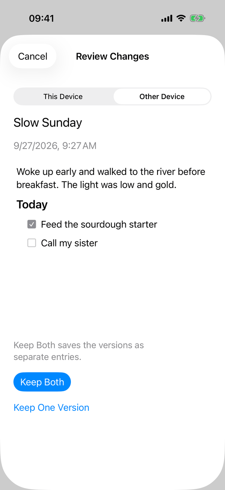
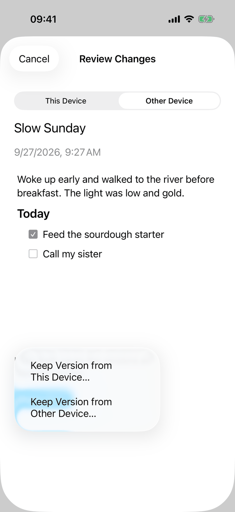
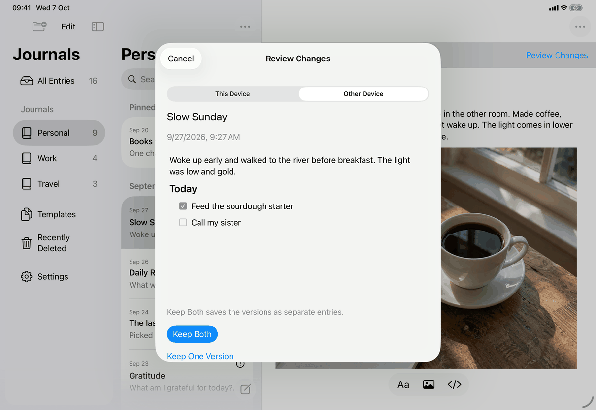
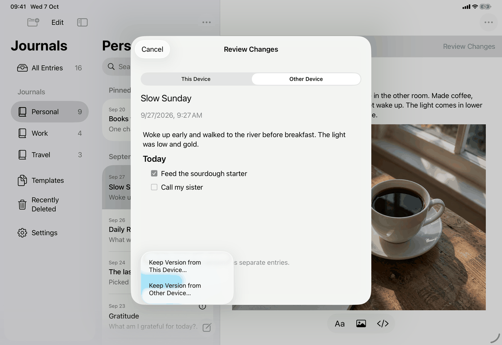

# Resolve changes to review (Apple)

Implements [flows/resolve-conflict.md](../../../flows/resolve-conflict.md) on iPhone, iPad and the Mac. The screens it moves through are [screens/conflict-review.md](../screens/conflict-review.md) (signals, routing, journal, deletion and unsupported forms) and [screens/entry-conflict.md](../screens/entry-conflict.md) (entry and template form); read them for controls and layout. This page records how the flow is wired: where conflicts come from in the code, which function commits each choice, and what the app does to its own state afterwards. Sheet and alert conventions: [platform.md](../platform.md#9-sheets-popovers-and-notices). Sync behaviour: [platform.md](../platform.md#30-sync-lifecycle-and-background).

## Controls

Flow step by step, with the control and the code behind it. The model type throughout is `AppModel` (`@MainActor`) over the `JournalStore` actor in JournalCore.

**How a conflict comes to exist** (core, not UI)

- A remote change arrives for a record that is dirty here, or that already has a pending review, or that is a permanent-deletion marker being replaced by live content: `JournalStore.recordConflict` writes one row to the `conflicts` table (remote payload, server revision, device id, modification time). One row per record: a newer remote version replaces the row and the replaced one goes to history (`preserveSupersededConflict`). `SyncReconciliation` also records one when a library joins a server by identity and the contents differ; a record that merely lacks the server's version is re-uploaded instead.
- This device saves over a version that changed after the saved copy was read: `keepChangedVersion` stores the stored version as the other side, with the all-zero device id standing for an unknown device, so the review never overwrites it. Typing over a change that arrived but was not shown is covered by `StaleDraftTests`.
- Merging journals (`StoreMerge.swift`) inserts a `conflicts` row when the same record exists in two different versions, and an archive imported as new journals carries the archive's unresolved conflicts over with new ids (`Store.importHistory`).
- The library record (pins and journal order) never becomes a review; it is reconciled field by field.
- `AppModel.conflicts` is filled from each refresh's snapshot. Setting it invalidates the derived lists and calls `reviewRequests.noteProblem()`, so no rating request appears while any exist.

**1. Open the review.** The notice, row, Settings and other buttons are listed in [conflict-review.md](../screens/conflict-review.md). The notice's button calls `model.flush()` and `model.refresh()` first; if the flush fails nothing opens. `ConflictReview` then picks the form on each render. Every sheet is a SwiftUI `.sheet`; nested ones (from Move Entry, Merge Into…, Version History) stack another sheet on top of the host sheet.

**2a. Entry or template** (`EntryConflictReview`)

- Keep Both: `AppModel.finishPendingSave()`, then `JournalStore.resolve(conflict, choice: .keepBoth)`. In one write transaction: both originals go to history, the pending outbox row and the conflict row are removed, the record keeps this device's version (with a new modification time) at the remote revision, and the other version is inserted as a new record with a fresh id and queued for upload with revision 0.
- Keep One Version: the same call with `.local` or `.remote`; the chosen version is stamped with the current time, the other stays only in history. For `.remote` the confirmation message first says what moves, re-dates or archives the entry (built by `ConflictPlacement.outcome`).
- The store re-reads the row inside the transaction and throws `JournalError.conflict` if the remote revision or either payload differs from the snapshot the view holds, if either side is permanently deleted (`PermanentDeletionError.permanentlyDeleted`) or not editable (`JournalError.unsupportedFormat`). The view maps `JournalError.conflict` to a refresh, never to a retry.
- Outcome: `committed = true`, then `model.refresh`, select the resolved entry if nothing else is open, dismiss.

**2b. Journal** (`JournalMetadataConflictReview`)

- Keep Version…: `AppModel.resolveJournalConflict` (guards: kind is journal, not locked, library not being replaced; `finishPendingSave()` or throws text `messages.save.before.goBack`), then `store.resolve(conflict, choice:)` inside `commitJournalResolution` -> `commitMutation`. `commitMutation` runs the store call and the in-memory reconcile in one unstructured `Task`, so a lock or a closed sheet after the commit cannot undo it; afterwards it refreshes and returns whether that worked (false gives `messages.conflict.journal.savedNotDisplayed`). The store rejects `.keepBoth` for a journal.
- Reconcile: if the chosen journal is deleted, a draft inside it and the selection are cleared.

**2c. Deletion** (`DeletionConflictView`)

- Prepare: `AppModel.prepareDeletionConflict` (`deletionStoreAfterSaving`: save, then `JournalStore.prepareDeletionConflict`, which returns the two versions and what earlier history exists). The sheet refreshes and loads the edited version's images.
- Commit: `AppModel.resolveDeletionConflict` -> `commitDeletionMutation` with `DeletionConflictChoice`: `.keepEntry(journalID:)`, `.keepEntryAsCopy(journalID:)`, `.keepTemplate`, `.keepJournal`, `.keepDeletion`. The reconcile step navigates the app to the result: a kept entry is selected in its journal (search cleared, Recently Deleted, Templates and Unavailable Journals closed); a kept template opens in Templates; a kept journal is selected; a permanent deletion closes the open item and journal if they were the deleted ones.
- Keep Deletion's second sheet is a `DeletionSheet` with the destructive `Delete Permanently` button; there is no undo.

**2d. Unsupported.** `ArchiveExportControls`; the export runs `ArchiveExport` and a `.fileExporter`, after the one-time password check if `model.passwordCheckPending`. See `screens/settings-backup`.

**3. When something changes meanwhile.** Entry form: `refreshReview` (generation counter, scroll and VoiceOver focus). Journal form: `reload()` reads `store.conflicts()` again and calls `model.refresh()`. Deletion form: `handle(_:)` clears the confirmation and offers `prepare()` again. Locking cancels the running `Task`, clears confirmations, previews and images, and dismisses; `JournalMetadataConflictReview` also drops its `conflict` value.

**After the flow.** While a record has changes to review it can still be opened and edited: autosave writes the local version, and the sync outbox skips any record that has a `conflicts` row (the `LEFT JOIN conflicts` in `Store.pending`), so nothing is sent until the review is resolved. A journal with a conflict cannot be renamed or given a default template (`AppModel.editJournal` returns early), its Rename…, Default Template and Merge Into… actions are disabled by `AppModel.journalActions`, `JournalLifecycleSnapshot` (JournalCore) locates its entries as `.unavailable(.conflict)`, which lists them under Unavailable Journals with `common.journalNeedsReview`, and `TemplateSuggestion` refuses to start an entry from a template that has a conflict (`messages.generic.templateNeedsReview`).

## Layout

The flow has no layout of its own; each step's layout is on the screen pages. What the flow adds:

- **iPhone and iPad**: every step is a sheet over the library; the person never leaves the entry list. After a commit the model selects the kept result behind the sheet (`AppModel.selectedID`, `draft`).
- **Mac**: the sheet is attached to the library window or, for Settings ▸ Sync ▸ Changes to Review, to the Settings window. Nothing is selected in the library window until the sheet closes.
- Dynamic Type changes the notice and the entry form's version control (menu at accessibility sizes); no step changes order.

## Commands and shortcuts

| Command | Placement | Shortcut | Enabled when |
| --- | --- | --- | --- |
| `review-changes` | Starts the flow; as in [commands.md](../commands.md) | None | Unlocked |
| `export-archive` | Export Archive… in the unsupported forms | None | As in commands.md |

Keep Both, Keep Version…, Keep Entry…, Keep Deletion… and Delete Permanently have no command ids and no shortcuts, so a destructive choice is never one key press. The sheet's Cancel/Done is the Escape key on the Mac and with a hardware keyboard; the journal form has no Escape binding.

## Copy differences

None. All keys are the same on iPhone, iPad and Mac; no `mac` variants.

## Accessibility

- No success announcement: closing the sheet and opening the entry is the confirmation. Errors in the journal and deletion forms are announced with `JournalAccessibility.announce`; the entry form moves VoiceOver focus to its status line after a refresh.
- Destructive steps are marked `role: .destructive`; Delete Permanently needs a second sheet.
- Locking mid-review dismisses the sheet; VoiceOver then lands on the lock screen as for any lock (see [platform.md](../platform.md#13-device-authentication-and-app-lock)).

## Differences between iPhone, iPad and Mac

- The same code path and the same results on all three. Only presentation differs (see the screen pages): sheet chrome (navigation bar on iPhone and iPad, hand-built title and footer on the Mac) and the Escape key.
- The Mac Changes to Review section lives in a Settings window tab; on iPhone and iPad it is in the Sync pane of the Settings sheet.

## Screenshots

Only the entry or template form is captured; journal, deletion and unsupported-in-flow states are not (the sample library has no such records), so this page stays a draft until they are. The two `default` images are the same files as the other device captures of [screens/entry-conflict.md](../screens/entry-conflict.md); the keep one images show the Keep One Version menu open. No Mac capture exists for this flow.

| Device | Image | State |
| --- | --- | --- |
| iPhone |  | Review of Slow Sunday with Other Device selected |
| iPhone |  | The Keep One Version menu open with its two items (each leads to a confirmation) |
| iPad |  | The same, as a card sheet |
| iPad |  | The menu open as a popover over the card |

## Source files

Core:

- `JournalCore/Store.swift`: `conflicts()`, `resolve` (keep both, this device, other device), `recordConflict`, `keepChangedVersion`, import of conflicts.
- `JournalCore/SyncReconciliation.swift`: when a remote version becomes a conflict.
- `JournalCore/DeletionConflict.swift`, `JournalCore/StoreDeletion.swift`: deletion choices, prepare and resolve.

Model:

- `Model/AppModel.swift`: `conflicts`, `commitMutation`, `finishPendingSave`, `flush`.
- `Model/JournalOperations.swift`: `resolveJournalConflict`. `Model/PermanentDeletionOperations.swift`: deletion prepare and resolve, navigation after commit.

View:

- `Views/ConflictRouting.swift`, `Views/EntryConflictReview.swift`, `Views/JournalConflictView.swift`, `Views/DeletionConflictView.swift`.

Design records: [stale-conflict-recovery.md](../../../../docs/design/stale-conflict-recovery.md), [journal-conflicts.md](../../../../docs/design/journal-conflicts.md), [permanent-deletion.md](../../../../docs/design/permanent-deletion.md), [entry-conflict-accessibility.md](../../../../docs/design/entry-conflict-accessibility.md).

## Open questions

See [open-questions.md](../../../open-questions.md), C24: the spec says "Keep Both ... the other device's version becomes a new entry where that device had it"; the store writes the copy with the current time as its modification time and keeps its own journal and date fields, which matches, but the spec does not say the copy's modification time changes.
