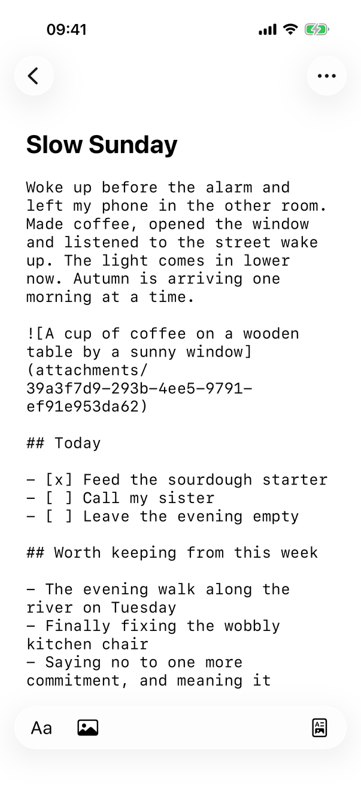
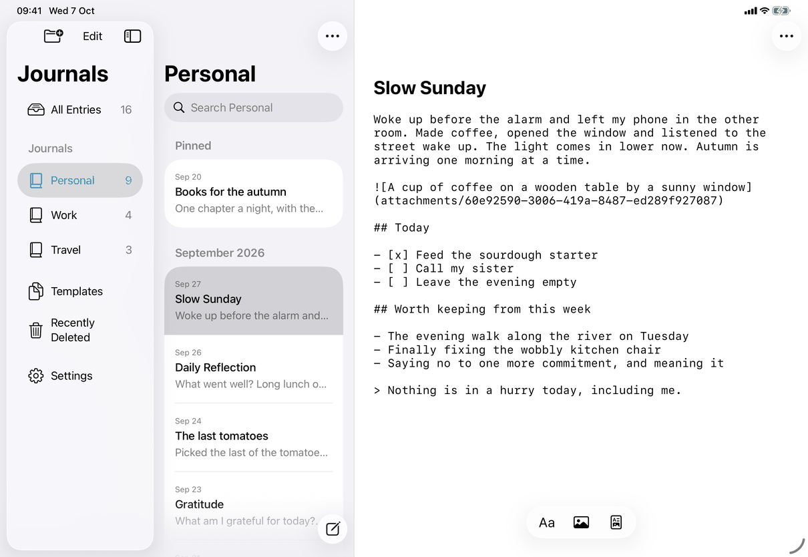
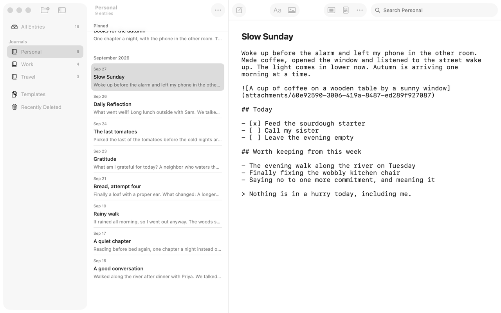

# View Source and View Preview (Apple)

How the Apple apps implement the spec's [source-view](../../../flows/source-view.md). Source view is not a second editor: it is the entry editor's own text view ([entry-editor](../screens/entry-editor.md)) with its whole text replaced by the stored Markdown, in the same `UITextView` (iPhone, iPad) or `NSTextView` (Mac). The title field above it does not change. Conventions for text input and spelling are in [platform.md](../platform.md), section 25.

## Controls

The switch has four entry points; all call `EditorActions.toggleSourceMode()`, which closes any Formatting surface and runs the coordinator's `perform(.source)`.

| Where | Control | Notes |
| --- | --- | --- |
| Mac toolbar | `NSToolbarItem` identifier "sourceMode" in `JournalToolbarController`, image `chevron.left.forwardslash.chevron.right` (View Source) or `doc.richtext` (View Preview), label and tooltip the action it performs | Tooltip `common.previewUnavailable` and disabled for a source-only entry. Sits between Editor Only and Entry Actions. |
| iPhone, iPad reading bar | `Button` built by `RootView.sourceModeButton` inside `ReadingBar` (the floating capsule, a `safeAreaInset(edge: .bottom)` of the detail view), same two symbols, `.labelStyle(.iconOnly)` | The last control of the capsule: on iPhone `Spacer` pushes it to the far end, on iPad the capsule fits its contents. `.iconHelp` gives the pointer help. Disabled when the entry can't be edited or is source-only. |
| iPhone, iPad keyboard accessory | The same button inside `WritingAccessoryBar` (the capsule above the keyboard while writing, or at the screen bottom with a hardware keyboard) | Not disabled for a source-only entry: pressing View Preview there has no effect, because `MarkdownEditing.edit` refuses when the text can't be shown as preview. |
| Menu bar | View ▸ View Source / View Preview, ⌥⌘U (`AppCommands.swift`) | Mac, and the iPad menu bar with a hardware keyboard. Disabled when `!model.canEdit` or the document requires Markdown source. |

Labels: `library.menu.view.viewSource`, `library.menu.view.viewPreview`; the same literal strings in the toolbar, the bars and the menu. The state is `EditorActions.sourceMode`, kept in step with the coordinator's `showsSource`.

What the switch does, in the order of the spec's Steps:

1. View Source: `MarkdownEditing.edit(.source ...)` returns the document's Markdown rendered as monospaced system text at the body size (`PlatformFont.monospacedSystemFont`) with the attribute `journalSource`, replacing the whole storage as one undo step named "View Source" (`editor.undo.viewSource`; the name is a literal). The selection is mapped by `MarkdownSelection.toSource`, and `ModeSwitchViewport` (`caretViewportOffset`, `restoreCaretViewportOffset`) puts the caret's line back at the same height in the window. The undo snapshot includes the view mode, so Undo returns to the preview.
2. Typing in source: each change is stored as the Markdown text (`MarkdownEditing.read` with `source: true` replaces the document's Markdown with the text). Markdown as you type is off (`!editingSource` guards in `MarkdownShortcutEditing`), Return, Tab and the structural keys keep their plain meaning (`StructuredKeyboard`'s guard), and the Formatting surface edits syntax (below).
3. View Preview: `MarkdownEditing.edit` parses the text with `document.replacingMarkdown`; if the result `requiresMarkdownSource` it returns nil and nothing changes. Otherwise it renders the blocks and maps the selection back (`MarkdownSelection.toPreview`).
4. The announcement is `ModeSwitchViewport.announceMode`: "Source" or "Preview" (`editor.announce.source`, `editor.announce.preview`) as `UIAccessibility.post(.announcement)` on iPhone and iPad, and as an `NSAccessibility` `announcementRequested` notification at high priority on the Mac.

Source-only entries: `render` sets `showsSource = ... || document.requiresMarkdownSource`, and `RootView` sets the editor actions' `sourceMode` from the same flag whenever the selected entry changes, so the entry opens in source. `EntryEditingNote` shows `messages.unavailable.markdownSource` under the title (iPhone, iPad: in the scrolling header; Mac: under the title field). Source view is per visit: switching to another entry resets to the preview unless the entry is source-only (`showsSource = !newItem && showsSource || ...`).

Spelling and substitutions are off (spec SP-1): `NativeEditor.Coordinator.applySubstitutions` treats source like code. On iPhone and iPad it sets the text view's `smartDashesType`, `smartQuotesType`, `autocorrectionType` and `spellCheckingType` to `.no` and `autocapitalizationType` to `.none`, and reloads the input views; on the Mac it applies `TextChecking.literal` to the `NSTextView` and puts the person's own Edit ▸ Substitutions and Spelling choices back when the caret leaves code or source.

## Layout

- The entry keeps the editor's layout; only the font changes. Long lines wrap in the text container, so the text width is the same as in the preview (max 760 pt, centred, 24 pt margins; see the entry editor page).
- iPhone and iPad: the reading bar or the keyboard accessory keeps its place; View Source changes only its last button's symbol. The mode can change while reading without bringing up the keyboard (`if !changingMode || wasEditing { view.becomeFirstResponder() }`).
- Mac: the toolbar item changes its symbol and label in place; the text view takes keyboard focus (`makeFirstResponder`).
- Dynamic Type and Zoom: the monospaced text follows the same body size as the preview (`parent.fontSize`).

## Commands and shortcuts

| Command | Placement | Shortcut | Enabled when |
| --- | --- | --- | --- |
| `view-source` | As in [commands.md](../commands.md): View menu, Mac toolbar, the reading bar and the keyboard accessory | ⌥⌘U (Mac, and the View menu on iPad) | Entry editable; View Preview also needs Markdown that can be previewed (the menu and the toolbar and reading-bar buttons enforce it; the keyboard accessory button does not) |
| `format-*` | Format menu and the Formatting surface | As in [commands.md](../commands.md) | Edit syntax in source view; see below |
| `insert-link`, `insert-image`, `insert-table`, `insert-code-block`, `insert-horizontal-rule` | As in [commands.md](../commands.md) | As in [commands.md](../commands.md) | Insert Markdown at the selection (`SourceFormatting`) |
| `format-increase-indent`, `format-decrease-indent`, `exit-code-block` | Format menu, Formatting surface | As in [commands.md](../commands.md) | Not in source view: `updateCaretState` leaves `caretIndentation` at its default, so the menu items are disabled and the Formatting buttons are dimmed |
| `format-mark-checked` | The Formatting surface | None in source | The surface shows Mark as Checked or Unchecked when the lines touched are checklist lines (`FormattingState.readSource`); the Format menu item and its shortcut are disabled because `caretTaskChecked` is nil in source |

Keyboard: Return and Tab are the text view's own; on iPhone and iPad `JournalTextView.keyCommands` registers the structural Tab, Shift-Tab and Down Arrow commands only when `showsSource` is false. Source formatting follows the spec's table; the code is `SourceFormatting.change`, tested by `SourceFormattingTests`. An Add Link in source is always Add Link, never Edit Link: `linkAtSelection` is nil in source, and Remove Link is disabled.

## Copy differences

None. The labels and tooltips are the spec's and no `mac` variant applies. The undo action names ("View Source", "View Preview") and the announcements are literals equal to the catalog text.

## Accessibility

- The toolbar, reading-bar and accessory buttons are labelled with the action they perform (`View Source` or `View Preview`), so VoiceOver reads the verb, and the label changes with the mode. Their glyphs are icons only (`.labelStyle(.iconOnly)`); Voice Control uses the label.
- Mode changes are announced: iPhone and iPad at default priority, Mac at high priority (the spec's rule for the computer).
- The Mac tooltip gives the reason when preview is unavailable (`common.previewUnavailable`); the iPad pointer help does the same through `.iconHelp`. The keyboard accessory button has no such hint and is not dimmed (see Open questions in the report).
- The source text is a plain text view, so VoiceOver reads the Markdown characters as typed; the list, quote and checkbox accessibility attributes of the preview are absent in source.

## Differences between iPhone, iPad and Mac

- Reading bar and keyboard accessory (iPhone, iPad) against a toolbar item and menu (Mac): the writing controls are a capsule on touch devices, a window toolbar on the Mac.
- Switching while reading does not raise the keyboard on iPhone and iPad (the person may only be looking at the Markdown); the Mac always focuses the text.
- Spelling and substitutions are switched off through UIKit text traits on iPhone and iPad, and through the saved and restored `TextChecking` flags on the Mac, because the two text views expose different settings; the person's own Mac choices are restored.
- The announcement priority is high on the Mac and the default on iPhone and iPad: the spec asks for high priority on the computer; the source records no further reason.
- ⌥⌘U exists in menus (Mac and iPad); on iPhone with a hardware keyboard whether it works is not established.

## Screenshots

| Device | State |
| --- | --- |
| iPhone |  The sample entry in source view while reading: the title still large and bold, the body in monospaced text (a blank line between blocks, `` for the picture, `## Today`, `- [x]` and `- [ ]` items, `>` for the quote); the capsule shows Aa, Insert Image and, at the far end, the View Preview glyph. |
| iPad |  The same entry in the detail column of the split view; the capsule fits its three buttons and is centred at the bottom. |
| Mac |  The same entry; the toolbar's source item now shows the View Preview glyph. The window is not the key window in the capture, so the toolbar is dimmed. |

The attachment identifier in the picture's reference differs between captures.

## Source files

View:
- `apps/apple/JournalApp/Views/RootView+Toolbar.swift`: the reading-bar button (`sourceModeButton`), iPhone and iPad.
- `apps/apple/JournalApp/Editor/WritingAccessory.swift`: the same button in the keyboard accessory.
- `apps/apple/JournalApp/Views/Mac/JournalToolbarController.swift`: the Mac toolbar item.
- `apps/apple/JournalApp/AppCommands.swift`: View ▸ View Source.
- `apps/apple/JournalApp/Views/EntryEditingNote.swift`: the source-only note.

Model:
- `apps/apple/JournalApp/Editor/RichText.swift`: `EditorActions.sourceMode` and `toggleSourceMode`.
- `apps/apple/JournalApp/Editor/NativeTableIntegration.swift`: `applyMarkdownEdit` (the switch, undo name, focus, announcement) and `applySubstitutions` (spelling off).
- `apps/apple/JournalApp/Editor/MarkdownEditing.swift`: rendering the source, reading it back, source or preview edits.
- `apps/apple/JournalApp/Editor/SourceFormatting.swift`: every Format command in source view.
- `apps/apple/JournalApp/Editor/MarkdownSelection.swift`, `ModeSwitchViewport.swift`: selection mapping, caret height, announcement.
- `apps/apple/JournalApp/Editor/FormattingState.swift`: the Formatting surface's reading of source syntax.

Core: the Markdown parser and writer (`JournalDocument` in JournalCore) decide what can be previewed.

Design records: `docs/design/markdown-writing-revision.md`, `docs/design/notes-alignment-revision.md`.

## Open questions

None recorded in [open-questions.md](../../../open-questions.md). One code finding is in the report: the keyboard accessory's View Preview button is not disabled for a source-only entry, unlike the reading bar, toolbar and menu.
