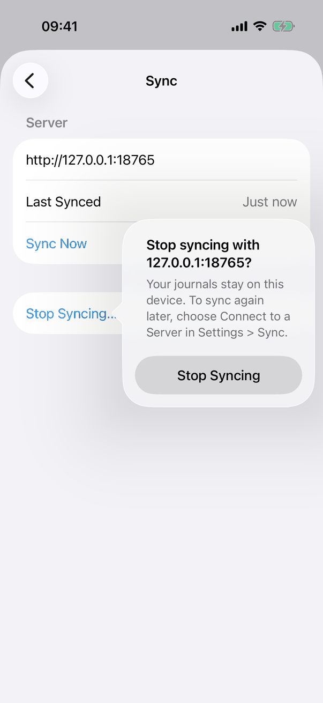
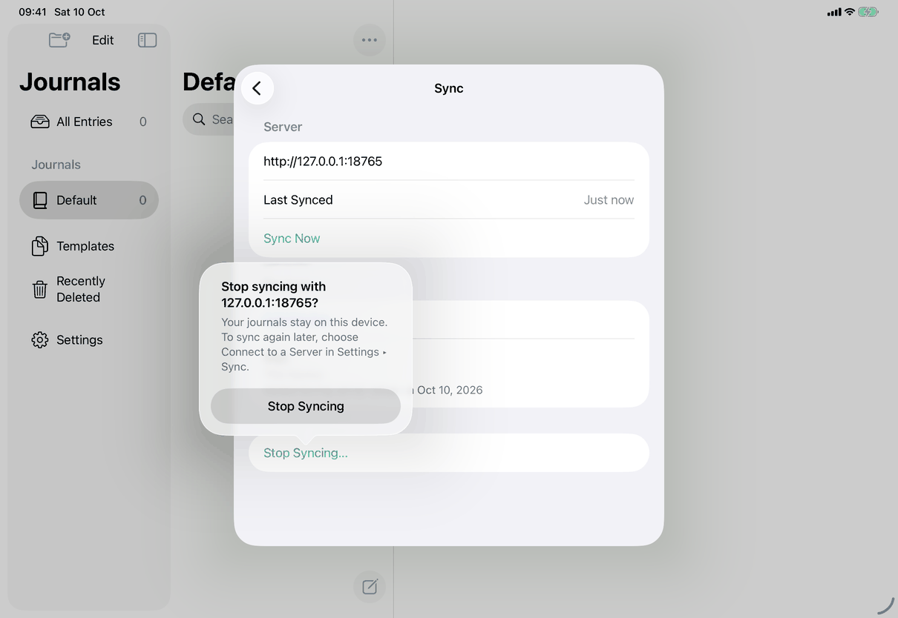
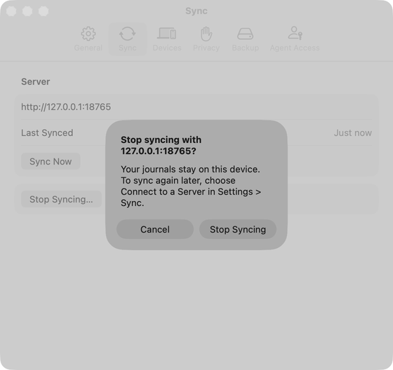

# Stop syncing (Apple)

The Stop Syncing… row and its confirmation are `StopSyncingSection` in `Views/SyncNowRows.swift`, shown in Settings ▸ Sync while connected ([settings-sync](../screens/settings-sync.md)). The work is `AppModel.stopSyncing(revoking:)` in `Model/SyncHealthOperations.swift`. Spec: [stop-syncing](../../../flows/stop-syncing.md). Alerts and confirmations: [platform.md](../platform.md#8-alerts-and-confirmations).

## Controls

1. **Entry.** A `Section` containing `Button` `settings.sync.stopSyncing`, plain role (not destructive, as nothing is deleted), `.disabled(model.replacingVault)`, shown only when `model.connection != nil`.
2. **Confirmation.** `.confirmationDialog(_:isPresented:titleVisibility: .visible)` on that section. Title `settings.sync.stopSyncing.title` with `model.connectionHost` (host, plus port when not the default). Message `settings.sync.stopSyncing.message`; when `activity.pendingItems > 0`, a space and `settings.sync.stopSyncing.messageUnsent` ("1 item that isn’t" or "n items that aren’t"). Buttons: `settings.sync.stopSyncing.confirm` (no role; calls `model.stopSyncing()`) and `common.cancel` with `role: .cancel`.
3. **From Encrypt Your Journals (1.1).** The form's Stop Syncing… (no access, server too old, access password wrong or limited) opens the same `.confirmationDialog` with `library.encrypt.stopSyncing.message` in place of `settings.sync.stopSyncing.message` and then runs `stopSyncing`; the form becomes variant A. On the unfinished notice the confirmation uses `library.encrypt.adopt.message` and a separate adopt operation in `Model/EncryptionOperations.swift` (one bounded `serverAdopted` check, then commit or discard the staged copy and drop the connection), because `stopSyncing` returns while `replacingVault`. Neither entry point promises that connecting again continues by identity: the library is encrypted next and a server without encryption refuses it.
4. **The action** (`stopSyncing(revoking: true)`), in order: returns if there is no connection or `replacingVault`; removes the connection's keychain item (`Keychain.remove(configuration?.connectionKeyID ?? keyAccount + "-connection")`); sets `connection = nil`, whose `didSet` calls `syncActivity.connectionChanged(nil)` (Last Synced is forgotten); `configureSync()` (no engine, `resetSyncHealth()`, `resetWatcher()`, agent copies stopped); cancels the sync waiting for a writing pause; sets `syncActivity.pendingItems = 0` and `encryption.turnedOnElsewhere = false`; then, in an unstructured `Task`, asks the server to revoke this device (`ServerClient(address:token:).revoke(deviceID)`, errors ignored). The library, its identity and its unsent changes are untouched; the app does not erase anything. Reconnecting to the same server later joins by identity ([reconnect-to-server](reconnect-to-server.md)).
5. **Result.** The pane re-renders on `model.connection == nil`: the Connect to a Server… button and the not-connected footer (`settings.sync.footer.notConnected`, `settings.sync.footer.howToSetUp`). The Stop Syncing section, Last Synced, Not on Server Yet, and (Mac) Sync Status's toolbar place disappear because they depend on `connection`.
6. **Former Mac server** (Mac only, `Model/FormerMacServer.swift`, `#if os(macOS)`). `retireFormerMacServer()` runs from `LibraryOpening` when the library opens, before the first sync. If the file local-server.json exists in the data folder, the marker file named local-server-retired does not, and `encryptionUnfinished` is false, and the connection's address is `http://127.0.0.1:46371`, it calls `stopSyncing(revoking: false)` (nothing answers at that address) and, once `connection` is nil, sets `configuration.stoppedSyncingWithFormerMacServer = true` and saves it. It always then writes the marker (`Data().write(to:options: .withoutOverwriting)`; a failure is logged), so reconnecting to that address later never stops syncing again. `ServerJoining.commitConnection` clears the flag when any new connection is saved. `SettingsView.notConnectedFooter` shows `settings.sync.footer.formerMacServer` and the link `settings.sync.footer.learnMore` while the flag is set. The old server's files stay, including after Erase (`formerMacServerFilesExist`, `EraseSection`).

Model types: `AppModel` (`connection`, `replacingVault`, `connectionHost`, `configuration`), `SyncActivity.pendingItems`, `Keychain`, `ServerClient`.

## Layout

- **iPhone:** in the captured iOS 26 build the confirmation is a small popover anchored to the Stop Syncing… row (title, message and one Stop Syncing button; no visible Cancel; dismissed by tapping outside). `confirmationDialog` presents as an action sheet on earlier iPhone systems (the app supports iOS 16 and later); that form was not captured.
- **iPad:** the same popover, with its arrow pointing at the row, over the form sheet.
- **Mac:** a modal dialog on the Settings window with the title, the message and two buttons, Cancel and Stop Syncing.
- Dynamic Type: system dialog and popover; the text wraps.

## Commands and shortcuts

| Command | Placement | Shortcut | Enabled when |
| --- | --- | --- | --- |
| `stop-syncing` | Own section at the end of Settings ▸ Sync, as in [commands.md](../commands.md) | none | connected, not `replacingVault` |

The dialog's buttons and keys are the system's; the app adds no key handling.

## Copy differences

None. One set of strings on all devices.

## Accessibility

- The dialog's title is visible and read first (`titleVisibility: .visible`).
- The button is a standard row, titled for what it does, with an ellipsis because a confirmation follows.
- The app posts no announcement after confirming; the pane simply re-renders with Connect to a Server….

## Differences between iPhone, iPad and Mac

- Presentation of the confirmation differs by platform control: popover on iPhone and iPad in the iOS 26 captures, window-modal dialog on the Mac (`confirmationDialog` adapts to the platform; the app does not choose).
- The former-Mac-server step exists only on the Mac, because only Mac builds before 17 ran a server ([docs/design/client-only-mac-lists-markdown-2026-10-05.md](../../../../docs/design/client-only-mac-lists-markdown-2026-10-05.md)).
- Everything else, including what is kept, is shared code.

## Screenshots

Sample library, connected to a local development server (`http://127.0.0.1:18765`); the library window behind the iPad capture is empty. The captures show no unsent items, so the "n items that aren’t on the server yet" sentence is not shown.

| Device | State | Capture |
| --- | --- | --- |
| iPhone | Confirmation popover over Sync: title, message, Stop Syncing |  |
| iPad | Confirmation popover anchored to the row, over the Settings form sheet |  |
| Mac | Dialog with Cancel and Stop Syncing over the dimmed Sync tab |  |

Not captured: the result (not-connected pane, shown in the Settings ▸ Sync captures), the unsent-items sentence, the former-server footer.

## Source files

View:
- `apps/apple/JournalApp/Views/SyncNowRows.swift`: `StopSyncingSection`, the dialog and its message.
- `apps/apple/JournalApp/Views/SettingsView.swift`: places the section; the former-server footer.

Model:
- `apps/apple/JournalApp/Model/SyncHealthOperations.swift`: `stopSyncing(revoking:)`.
- `apps/apple/JournalApp/Model/FormerMacServer.swift`: `retireFormerMacServer()`, marker and file names (Mac only).
- `apps/apple/JournalApp/Model/SyncSchedule.swift`: `SyncActivity.connectionChanged`.

Design records: [sync-health-and-recovery.md](../../../../docs/design/sync-health-and-recovery.md), [client-only-mac-lists-markdown-2026-10-05.md](../../../../docs/design/client-only-mac-lists-markdown-2026-10-05.md).

## Open questions

See [open-questions.md](../../../open-questions.md), C16 (the spec says the confirmation is "an action sheet on phone"; the iOS 26 capture shows an anchored popover) and C17 (Stop Syncing also forgets Last Synced).
