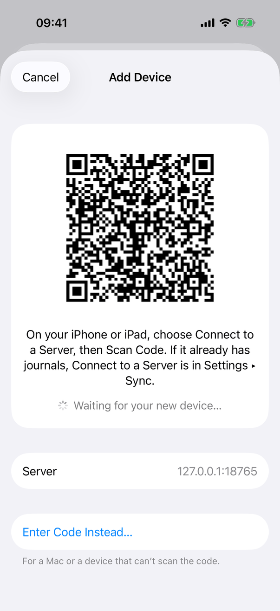
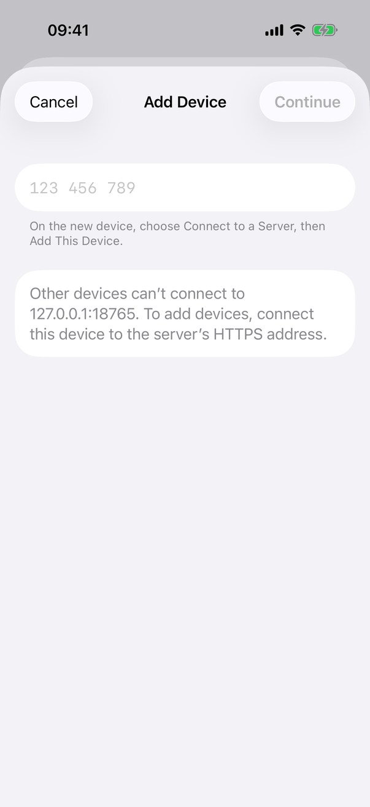
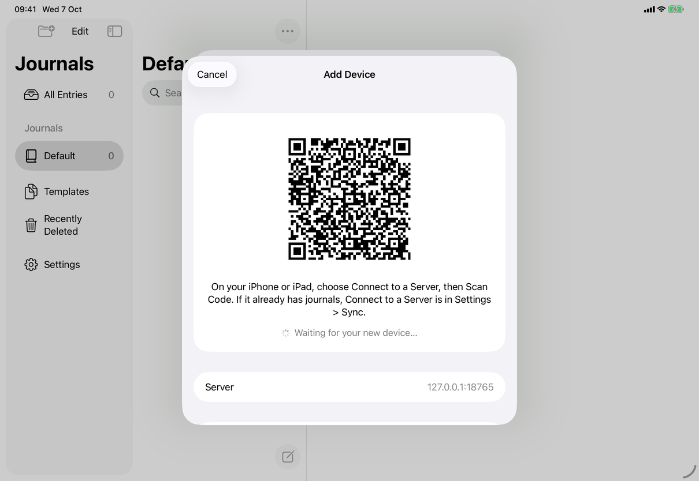
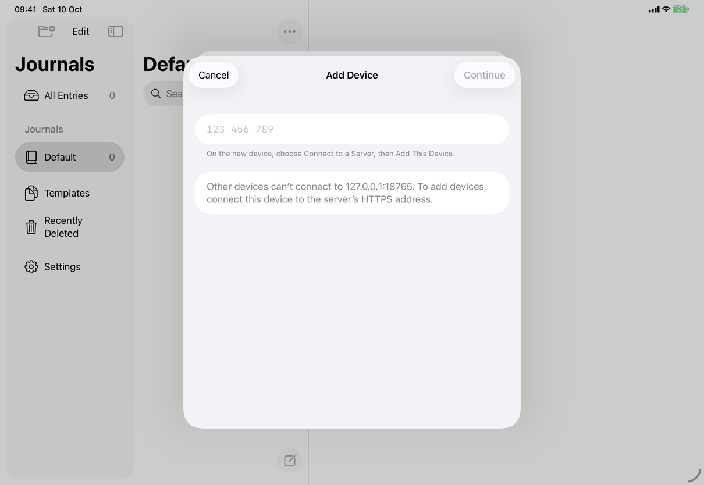

# Add Device (Apple)

`AddDeviceView` in `AddDeviceView.swift`: the approving side of pairing. It is the same view on iPhone, iPad and Mac, presented as a sheet. The new device's side is [connect-to-server](connect-to-server.md) (Scan Code, Add This Device); the two sides together are in [pair-device](../flows/pair-device.md). Spec: [add-device](../../../screens/add-device.md). QR codes and Add Device conventions: [platform.md](../platform.md#29-qr-codes-and-add-device).

## Controls

Root: `NavigationStack { Form { ... } .formStyle(.grouped) .navigationTitle("Add Device") }` (`settings.addDevice.title`, inline on iOS). The view is presented with `.sheet` from three places: `DevicesView` (`.sheet(isPresented:onDismiss:)`), `ConnectionStepView` (the Add Another Device… row of Server Is Ready) and the Turn On Encryption sheet. State is a private `Step` enum plus `@State` (`code`, `busy`, `error`, `notice`, `current`, `replaced`, `expired`, `unreachable`); the server calls are `model.connectedClient()` and `model.approveDevice(_:)` ([settings-devices](settings-devices.md)).

Toolbar: `.cancellationAction` is a `Button(role: .cancel)` titled `common.cancel`, or `settings.addDevice.dontAdd` while a scanned request is being confirmed, hidden in `.finished`, disabled while approving. `.confirmationAction` is the step's primary (below).

Locked: `Text` `settings.addDevice.locked`, and `onValueChange(of: model.locked)` calls `cancel()`, which declines a waiting request and dismisses.

Steps, from `content`:

1. **Preparing** (`.preparing`): a centred `ProgressView` while `start()` asks the server whether it supports `PairingInvite.feature` and whether the server address has an HTTPS origin. If either fails, the sheet goes to the typed-code step instead.
2. **Showing a code** (`.showingCode`). Three parts:
   - `codeSection`: a `Section` with a centred `VStack(spacing: 16)`: the notice (callout, e.g. `settings.addDevice.stoppedConnecting`); the QR code, or `settings.addDevice.expired` (headline, 40 points of vertical padding) once expired, or a placeholder; `settings.addDevice.scanInstructions`; and the status line `settings.addDevice.waiting` with a small `ProgressView` (callout, secondary), replaced after three failed checks by `settings.addDevice.unreachable`; no status once expired.
   - The QR code is `PairingCodeImage` (`PairingCodeImage.swift`): a Core Image `CIFilter.qrCodeGenerator` (correction level M) of `current.invite.text` (`MYJOURNAL1.` plus base64url data), drawn with `.interpolation(.none)` in a fixed 220-point square with 16 points of padding on a white rounded rectangle (corner radius 16, continuous). Fixed size, so it does not grow with Dynamic Type, and always black on white, so it scans in Dark Mode. One accessibility element labelled `settings.addDevice.qrLabel` with the `.isImage` trait.
   - The placeholder that replaces the QR code is a 252-point `RoundedRectangle` filled with `.quaternary`, hidden from accessibility. It shows when `showsCodeImage` is false: on iPhone and iPad whenever `scenePhase != .active` (so the app switcher snapshot never holds a code); on the Mac only when `scenePhase == .background`, so another window in front does not blank the code while a phone is held up to the screen (comment in `showsCodeImage`).
   - `LabeledContent("Server", value: host)` (`settings.connect.server`, selectable), so the person can match the name on the new device's Merge Journals.
   - A `Section` with `Button` `settings.addDevice.enterCodeInstead` and footer `settings.addDevice.enterCodeInstead.footer`.
   - Primary: `Button` `settings.addDevice.showNewCode` only once `expired`.
3. **Entering a code** (`.entry`, also the first step when scanned codes are unavailable): a `TextField` labelled `settings.addDevice.codeField` with prompt `settings.addDevice.codePlaceholder`, `.font(.body.monospaced())`, no autocorrection, `.keyboardType(.numberPad)` on iOS. `onValueChange(of: code)` re-formats through `CodeEntry.pairingCode` ("123 456 789"); Return calls `lookUp()` when the code is non-empty. Footer `settings.addDevice.codeFooter`. The field has no `@FocusState`, so it does not take focus on its own (the iPhone and iPad captures show no keyboard). Then, when the connection's address has an HTTPS origin (`PairingInvite.origin(of:)`): a `Section` with `LabeledContent` `common.serverAddress` (full address, selectable) and `Button` `settings.addDevice.copyAddress` (writes `NSPasteboard.general` or `UIPasteboard.general`); otherwise a `Section` with `settings.addDevice.httpOnly` in secondary text. Primary: `Button` `common.continue` disabled when empty or busy; while looking up, a small `ProgressView` in its place. An incomplete code (not 9 digits) sets the error `settings.addDevice.error.incomplete` and announces it.
4. **Waiting** (`.waiting`): `HStack` of a small `ProgressView` and `settings.addDevice.waitingFor` with the cleaned device name, hidden once `error != nil`. Primary after an error with a typed code: `common.tryAgain`.
5. **Confirming** (`.confirm`). Scanned: a `VStack` with `settings.addDevice.addQuestion` (headline) and `settings.addDevice.addDetail`; primary `settings.addDevice.add`; the cancel button reads `settings.addDevice.dontAdd`. Typed: `settings.addDevice.checkQuestion` (headline), the check code in `.system(.largeTitle, design: .monospaced)` grouped by `PairingCheck.grouped` with accessibility label `settings.connect.checkCode.label` and the digits as accessibility value (separated by spaces), and `settings.addDevice.checkDetail`; primary `settings.addDevice.approve`; cancel `common.cancel`. Both primaries carry `.keyboardShortcut(.return, modifiers: .command)`. While approving, a `ProgressView` replaces the primary and Cancel is disabled.
6. **Finished** (`.finished`): no content; the error row and `Button` `common.done` as primary. Used for a new device that needs an update (`messages.pairing.deviceOutdated`) and for `settings.addDevice.error.unconfirmed`.
7. **Error row:** a `Section` with the error `Text` in red `.callout` at the end of the form (not announced, except the incomplete-code message).

Device names come through `AddDeviceView.displayName(_:)`: control and format (direction-changing) characters removed, trimmed, `settings.addDevice.newDevice` when empty, at most 60 characters (59 plus "…").

**Approving.** `approve(_:)` calls `confirmOwner(adding:)` first: an `LAContext` with `.deviceOwnerAuthentication` (Face ID, Touch ID or passcode/password) and the reason `settings.addDevice.authReason`; when the device has no passcode (`canEvaluatePolicy` false) approval continues without it. A scanned request that verified goes straight to `approve` when `confirmationIsDeliberate` (a passcode, password or Touch ID can authenticate; false for Face ID and whenever VoiceOver is running, so the Add Device button is used first). On success `step = .finished` then `dismiss()`. A `URLError` after sending shows `settings.addDevice.error.unconfirmed` in `.finished`; other failures return to the step with the message (`failure.shown(.saving)`), or, for a scanned device, start a new code with the notice `settings.addDevice.stoppedConnecting`. Network errors use `NetworkFailureMessage` ("You’re offline. Check your connection.", the certificate message, or "Couldn’t reach the server. Check your connection."), not the system's text.

**Timing and lifecycle** (constants on the type): `codeLifetime` 120 seconds, `replacedCodeGrace` 30 seconds, `sessionLifetime` 600 seconds. `watchForNewDevice` asks the server every 4 seconds (`pairingCandidate(code:)` for the current and the replaced code); three failures in a row set `unreachable`; a rate-limited answer only slows. Entering the background (`scenePhase == .background`) cancels the watch and drops the codes; becoming active again calls `showNewCode()`. Face ID or Control Center making the app inactive does nothing. On iOS `UIApplication.shared.isIdleTimerDisabled` is true while the sheet shows codes (set in `start()`, cleared on expiry and in `onDisappear`). `onDisappear` cancels the work and declines a pending request.

## Layout

- **iPhone:** a sheet over the Settings sheet (or over Connect to a Server). Cancel on the leading side, the step's primary on the trailing side; the form scrolls.
- **iPad:** the same sheet as a centred form sheet (about 580 points wide in the captures); no size-class branches in this view.
- **Mac:** a sheet on the Settings window with `.frame(minWidth: 400, idealWidth: 460, minHeight: 440, idealHeight: 540)` and `.background(ScreenCaptureExclusion())`, an `NSViewRepresentable` whose `viewDidMoveToWindow` sets `window?.sharingType = .none`, so the sheet's window is blank in screen sharing, recordings and screenshots.
- Dynamic Type: text wraps (`fixedSize(horizontal: false, vertical: true)`); the QR code and its placeholder do not scale.
- The code section is a single grouped row, so on a short iPhone the Server row and Enter Code Instead… are reached by scrolling.

## Commands and shortcuts

| Command | Placement | Shortcut | Enabled when |
| --- | --- | --- | --- |
| `add-device` | Entry point only: this sheet is what it opens, see [commands.md](../commands.md) | none | n/a |
| `add-device-enter-code` | Row in the second section of the code step | none | showing a code |
| `add-device-look-up` | Continue in the toolbar; Return in the field | Return in the field | code not empty, not busy |
| `add-device-new-code` | Show New Code in the toolbar | none | session expired |
| `add-device-copy-address` | Row under the address (HTTPS only) | none | HTTPS address |
| `add-device-approve` | Add Device or Approve in the toolbar | Command-Return, not Return | a request is confirmable, not busy |
| `add-device-cancel` | Cancel or Don’t Add, leading | Escape (cancellation action) | not while approving |
| `add-device-try-again` | Toolbar after an error with a typed code | none | after an error |
| `add-device-done` | Toolbar in the finished step | none | finished |

Keyboard: Return in the code field looks the code up; Escape cancels; Command-Return approves (the app's rule that approving must not respond to Return alone, [commands.md](../commands.md)). Hardware keyboard on iPad behaves the same; there is no other focus handling.

## Copy differences

- `settings.addDevice.authReason` has a `mac` variant, used for the system's authentication prompt. On the Mac the prompt completes "My Journal is trying to …", so the text starts in lower case (`confirmOwner` compiles the Mac string under `#if os(macOS)`).
- Everything else is the same on all devices. `settings.addDevice.scanInstructions` says "On your iPhone or iPad" on every device, including the Mac, and `settings.addDevice.enterCodeInstead.footer` mentions "a Mac".

## Accessibility

- The QR code is one image element (`settings.addDevice.qrLabel`); the placeholder is hidden from VoiceOver.
- Check code: label `settings.connect.checkCode.label`, value read digit by digit.
- Waiting rows (`settings.addDevice.waiting`, `settings.addDevice.waitingFor`) combine into one element.
- The incomplete-code error is also announced (`announceForAccessibility`); other errors are only text.
- With VoiceOver running, scanned requests are never approved automatically; the person chooses Add Device first, which gives VoiceOver time to read the name.
- Command-Return is explicit on both approving buttons.
- Reduce Motion: no animation of its own.

## Differences between iPhone, iPad and Mac

- Mac only: the sheet is excluded from screen capture and sharing (its code lets a device join); nothing equivalent is set on iPhone or iPad. The `.frame` sizes the Mac sheet.
- Mac: the code stays visible unless the app is in the background; iPhone and iPad hide it whenever the app is not active, because their app-switcher snapshot is taken in the inactive state ([platform.md](../platform.md#20-screen-capture-and-app-switcher-privacy)).
- iPhone and iPad: the idle timer is disabled while a code shows, so the screen does not dim while the other device scans.
- The Mac shows a QR code like the others but is described by the spec as unable to scan; scanning exists only on the new device ([scan-code](scan-code.md)).
- Authentication wording: "Face ID, Touch ID or the passcode" on iOS, "Touch ID or the login password" on the Mac, supplied by the system; the app's own reason string differs in case only.

## Screenshots

Sample library. The captures come from a debug build against a local server (`http://127.0.0.1:18765`): debug builds accept loopback HTTP in a code, which is why a QR code shows, and why the typed-code step shows the plain-HTTP notice rather than Copy Address. A release build offers codes only for HTTPS addresses.

| Device | State | Capture |
| --- | --- | --- |
| iPhone | Showing a code: QR code, instructions, "Waiting for your new device…", Server row, Enter Code Instead… with footer |  |
| iPhone | Entering a code: empty field with the 123 456 789 prompt, Continue dimmed, plain-HTTP notice |  |
| iPad | Showing a code, in the form sheet (the Server row is partly below the sheet's fold) |  |
| iPad | Entering a code |  |
| Mac | No capture: the sheet's window is excluded from screen capture on purpose (it comes back black), so the capture script skips it | none |

Not captured: expired, unreachable, waiting for a device, confirming (scanned or typed), finished, errors, locked.

## Source files

View:
- `apps/apple/JournalApp/Views/AddDeviceView.swift`: every step, authentication, timing, the Mac capture exclusion.
- `apps/apple/JournalApp/Views/PairingCodeImage.swift`: QR rendering.

Model:
- `apps/apple/JournalApp/Model/DeviceOperations.swift`: `connectedClient()`, `approveDevice(_:)`.
- `apps/apple/JournalApp/Model/NetworkFailureMessage.swift`: network errors in plain words.

Core:
- `apps/apple/Packages/JournalCore/Sources/JournalCore/PairingInvite.swift`: code text format, origin rules (HTTPS only; loopback HTTP in debug builds), proof.
- `apps/apple/Packages/JournalCore/Sources/JournalCore/Pairing.swift`: challenge, approval, check code.
- `apps/apple/Packages/JournalCore/Sources/JournalCore/CodeEntry.swift`: typed-code formatting and validation.

Design records: [effortless-connection.md](../../../../docs/design/effortless-connection.md), [sync-security-2026-09-24.md](../../../../docs/design/sync-security-2026-09-24.md), [pre-release-ui-2026-09-27.md](../../../../docs/design/pre-release-ui-2026-09-27.md), [build-18-fixes-2026-10-06.md](../../../../docs/design/build-18-fixes-2026-10-06.md) (section 3.3, hiding the code while inactive).

## Open questions

See [open-questions.md](../../../open-questions.md): A9 and A32 were fixed in build 18 (`NetworkFailureMessage`; on the Mac the code hides only in the background) and are marked resolved there, and the spec's Content text now says so. Still open: A31.
