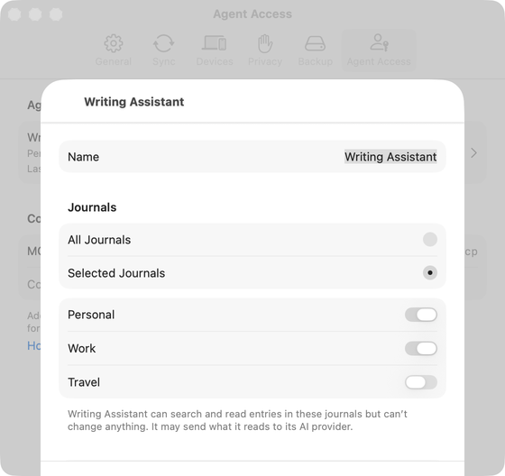

# Agent detail and Recent Activity (Apple)

Implements [screens/agent-detail.md](../../../screens/agent-detail.md): one agent's name, journals, end of access, usage, recent tool use, and revoking it. It opens from an agent row of [settings-agent-access.md](settings-agent-access.md). The journals choice is the shared control described in [allow-agent.md](allow-agent.md). Sheet and alert conventions: [platform.md](../platform.md#9-sheets-popovers-and-notices). An agent has to exist on a server for this screen to be captured, so it was captured on the Mac only; the iPhone and iPad behaviour is from the source.

The view is `ServerAgentDetailView(controller:agentID:)`, with `AgentActivityView` pushed from it. It follows the live agent with `controller.agent(agentID)` (falling back to the copy it first showed), edits through `ServerAgentsController.change` and `revoke`, which call `AgentCopyPublisher` (JournalCore). There are no Save buttons.

## Controls

A `Form` with `.formStyle(.grouped)`, `.navigationTitle(Text(verbatim: agent.name))`. Sections in order:

1. **Revoked**: when the controller has loaded and the agent is no longer listed (or was never found), a single `Section` with `settings.agentDetail.revoked`.
2. **Status** (only when one applies): a `Section` with a `Text`. `settings.agentDetail.status.ended` when the end date has passed, `settings.agentDetail.status.connecting` when the server state is pending, `settings.agentDetail.status.reconnect` when it needs to reconnect. The client's name in these sentences goes through `ServerAgentText.displayName`.
3. **Settings unreadable**: when `agent.settings == nil` (for example, made by a newer version), `settings.agents.detailsUnavailable` in secondary text replaces controls 4 to 6; Last Used, Added, Recent Activity and Revoke remain, so such an agent can still be revoked.
4. **Name**: a `TextField` titled `common.name`, `.disabled(expired)`. Saved on Return (`onSubmit`) and when focus leaves (`@FocusState`, `onValueChange(of: nameFocused)`). On iOS the section has a header `common.name`; on the Mac the field's own title is the row label and the header is omitted.
5. **Journals**: `AgentJournalsSection(keepsOne: true)`, `.disabled(expired)`: the inline picker (iOS) or radio group (Mac) of All Journals and Selected Journals, and the journal switches. With `keepsOne` the switch of the only chosen journal is disabled and gets the accessibility hint `settings.agentDetail.lastJournalHint`. When Selected Journals has none switched on, a warning `Label` says "Choose a journal. Until you do, {name} can still read all journals." and it is announced; nothing is saved in that state (not in the spec or `copy/en.json`, see Open questions).
6. **Access Ends**: a `Picker` titled `settings.agentDetail.ends` with `.pickerStyle(.menu)` (a pop-up button on the Mac), `.disabled(expired)`. Options: `common.never`, the current end date (only when one is set; abbreviated date), `settings.agentDetail.ends.thirty`, `settings.agentDetail.ends.ninety`. The 30 and 90 day choices are computed from the moment of saving (`Calendar.current.date(byAdding: .day, ...)`).
7. **Usage rows**: `LabeledContent` `settings.agentDetail.lastUsed` (relative, `.relative(presentation: .named)`, or `common.never`), `LabeledContent` `settings.agentDetail.added` (abbreviated date), and a `NavigationLink` `settings.agentDetail.activity` to `AgentActivityView`.
8. **Revoke**: a `Button` with `role: .destructive`, `common.revokeAccess` or, when access has ended, `settings.agentDetail.remove`; `.disabled(working)`. For Revoke Access a `.confirmationDialog` is attached to this button (`titleVisibility: .visible`; title `common.revokeAccessFor`, message `settings.agentDetail.revoke.message`, buttons destructive `common.revokeAccess` and `common.cancel`); attaching it to the button makes the iPad popover point at the button. Remove has no confirmation. While working a `connectionStatus` row shows `settings.agentDetail.revoking` or `settings.agentDetail.removing`. An error appears as red `Text`.

Before macOS 26 (`#unavailable(macOS 26)`) the Mac adds a first `Section` with the agent's name as a `.headline` row.

**Recent Activity** (`AgentActivityView`): a `Form` with one `Section`, title `settings.agentDetail.activity`. A `LabeledContent` per `AgentActivityEvent`: the tool name from `ServerAgentText.activity` (`settings.agentDetail.tool.search`, `.read`, `.list`, `.other` for search_entries, read_entry, list_journals and anything else) and `date.formatted(date: .abbreviated, time: .shortened)`. Otherwise `settings.agentDetail.activity.empty`, `settings.agentDetail.activity.failed` (in secondary text) or `connectionStatus` with `settings.agents.loading`. Footer `settings.agentDetail.activity.footer`. Loaded in `.task` through `controller.activity`.

**Saving** (`commit`, `scheduleSave`, `save`): scope, selection and Access Ends changes call `scheduleSave`, which waits 500 ms (`Task.sleep`) and replaces any pending wait; Return or leaving the name field saves at once. `commit` returns without saving when access has ended, when Selected Journals has nothing chosen, or when nothing differs from the saved settings. The name is trimmed and must be 1 to 80 characters; otherwise the saved name is kept. `AgentCopyPublisher.change` seals the new settings, removes from the server the copy of any journal the agent no longer reads (so narrowing takes effect on the server at once), sends the revision it read so the server refuses the change if another device changed the agent first, and publishes journals it now reads. `AgentCopyError.settingsChanged` reloads the list, applies the latest settings and shows `settings.agentDetail.error.changedElsewhere`; any other failure applies the saved settings again and shows `settings.agentDetail.error.saveFailed`. Every error is announced.

Revoking (`revoke`): cancels a pending save, `controller.revoke` (the publisher remembers the revocation so a restored server cannot bring the agent back), announces `settings.agentDetail.revokedAnnouncement` and calls `dismiss()`; failure shows `common.couldntRevokeAccess` or `settings.agentDetail.error.removeFailed`. Locking the app dismisses the screen (`onValueChange(of: model.locked)`); the controller clears its lists.

## Layout

- **iPhone (compact)**: a page pushed in the Settings `NavigationStack` (a `NavigationLink` in the agent row), inline title with the agent's name, system back button. No Done button.
- **iPad (regular)**: the same pushed page inside the Settings card sheet.
- **Mac**: a sheet over the Settings window, presented by `ServerAgentsPresentation` with `.sheet(item: $controller.selected)` and its own `NavigationStack`, `.frame(minWidth: 440, idealWidth: 480, minHeight: 420, idealHeight: 560)`; a Done button as `.confirmationAction` toolbar item (`#else` of `#if os(iOS)`), disabled while revoking. Recent Activity is pushed inside that sheet's stack.
- Dynamic Type: the form wraps; there is no custom layout.

## Commands and shortcuts

| Command | Placement | Shortcut | Enabled when |
| --- | --- | --- | --- |
| `rename-agent` | Name field | Return saves | Access not ended, settings readable |
| `change-agent-journals` | Journals picker and switches | None | Access not ended, settings readable |
| `change-agent-expiry` | Access Ends menu | None | Access not ended, settings readable |
| `revoke-agent` | Destructive button at the end | None | Not while working |
| `agent-detail-done` | Done, Mac sheet | Return | Not while revoking |

Placement as in [commands.md](../commands.md). Keyboard: Tab goes through Name, the journal choice, the switches, Access Ends, the Recent Activity link and the destructive button (Full Keyboard Access on iPad and iPhone; Tab on the Mac). Return in Name saves. The confirmation dialog takes its default and Escape keys from the system.

## Copy differences

None. The only per-platform text difference is structural: the Name header exists on iPhone and iPad only (the Mac labels the field), and the Mac before macOS 26 repeats the name in a heading row.

## Accessibility

- The last chosen journal's switch is disabled and carries the hint `settings.agentDetail.lastJournalHint` so VoiceOver explains that revoking is the way to stop all access.
- Errors, "Access revoked." and the empty-choice notice are announced through `announceForAccessibility`. The page does not move focus after saving: changes apply quietly.
- The status line, the unavailable-details line and error lines are plain text in the order of the form.
- Once access has ended the Name, Journals and Access Ends controls are `.disabled` (dimmed and not actionable); the Remove button stays available.
- The destructive confirmation names the agent: the title is `common.revokeAccessFor` with the agent's name, and the name is shown with `Text(verbatim:)`.

## Differences between iPhone, iPad and Mac

- Pushed page on iPhone and iPad, sheet with Done on the Mac: a Settings tab on the Mac has no navigation stack of its own.
- Name header on iPhone and iPad; label beside the field on the Mac (Mac forms show the label in the row).
- Journals choice: inline list on iPhone and iPad, radio group on the Mac (single choice idiom of each).
- Access Ends is a menu on iPhone and iPad and a pop-up button on the Mac (the same `.menu` picker style).
- The confirmation is an action sheet on iPhone and a popover on iPad (anchored on the button) and a dialog on the Mac.

## Screenshots

Mac only (an agent exists only after an MCP client has connected to a server).

| Device | Image | State |
| --- | --- | --- |
| Mac |  | Sheet for an agent named Writing Assistant: the Name row with its text selected, the Journals radio group on Selected Journals, switches for Personal and Work on and Travel off, and the read-only footer; Access Ends, the usage rows and Revoke Access are below the capture's crop, as is the Done button |

## Source files

View:

- `Views/ServerAgentsView.swift`: `ServerAgentDetailView`, `AgentActivityView`, `AgentJournalsSection`; `ServerAgentsPresentation` presents the Mac sheet.

Model:

- `Model/ServerAgentsController.swift`: `change`, `revoke`, `activity`, `agent(_:)`, `ServerAgentText` (activity names, status).

Core:

- `JournalCore/AgentCopyPublisher.swift`: `change` (narrowing and revision check), `revoke`, `activity`; `LibraryAgent`.
- `JournalCore/AgentCopyClient.swift`: `AgentCopyError`, `AgentActivityEvent`.

Design record: [agent-access-simplified.md](../../../../docs/design/agent-access-simplified.md), sections 7.3 and 10.3.

## Open questions

See [open-questions.md](../../../open-questions.md). Found while writing: the view cancels a pending debounced save when the page disappears (`onDisappear`), so a journals or Access Ends change made less than half a second before leaving the page (Done on the Mac, back on iPhone and iPad) may not be saved, while the spec says changes are saved half a second after the last change; the empty-choice sentence is not in the spec or `copy/en.json`.
