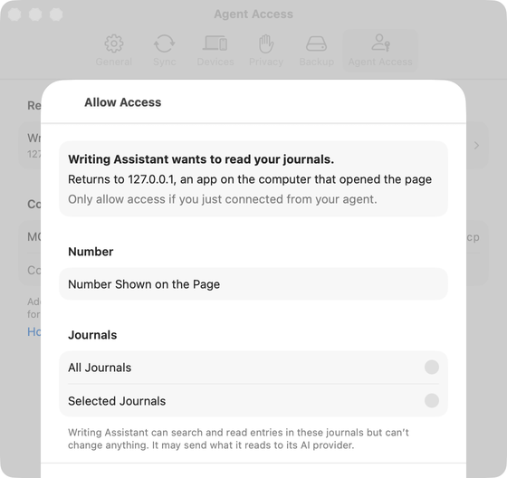

# Allow Access (agent request) (Apple)

Implements [screens/allow-agent.md](../../../screens/allow-agent.md): the sheet that shows who is asking to read the journals, takes the number from the agent's sign-in page and the journals to share. It opens from a request row of [settings-agent-access.md](settings-agent-access.md); the steps around it are in [flows/allow-agent.md](../flows/allow-agent.md). Sheet conventions: [platform.md](../platform.md#9-sheets-popovers-and-notices). The Allow Access sheet can only be captured with an agent client making a request, so it is captured on the Mac only; the iPhone and iPad behaviour below is from the source.

The view is `AllowAgentView`. It gets the `AgentRequest` summary from the row, loads the full request with `ServerAgentsController.request(_:id:)` (`client.agentRequest(id)`), and allows, reconnects or declines through `ServerAgentsController`, which calls `AgentCopyPublisher` (JournalCore).

## Controls

The sheet is `NavigationStack { Form }` with `.formStyle(.grouped)`, `.navigationTitle` `settings.allowAgent.title` (`navigationBarTitleDisplayMode(.inline)` on iOS), presented by `ServerAgentsPresentation` with `.sheet(item: $controller.reviewing)`. On the Mac before macOS 26 a first `Section` with a `.headline` `Text` repeats the title (`#unavailable(macOS 26)`).

- **Toolbar**: `.cancellationAction` `Button` `settings.allowAgent.dontAllow` (disabled while `busy`) and `.confirmationAction` `Button` `settings.allowAgent.allow`, replaced by a small `ProgressView` while allowing. `canAllow` is: the request loaded, not busy, exactly two digits, not at the limit, and for a new agent either All Journals or Selected Journals with at least one journal that exists on this device; a reconnect needs only the two digits.
- **Loading**: when nothing has loaded and there is no error, `connectionStatus` (`ProgressView` and `settings.agents.loading`).
- **Couldn't load**: the error `Text` in red, `common.couldntReachHost` (any error other than the request being gone). Allow stays disabled; Don't Allow still works (it declines the summary the row passed in).
- **Request ended**: `AgentCopyError.requestNotFound` while opening sets `ending`, shown as `.alert` (title `settings.allowAgent.ended.title`, message `settings.allowAgent.ended.message`, button `common.ok` that dismisses the sheet).
- **Request details** (`details(_:)`), in order:
  1. A `Section` with one `VStack` (`.accessibilityElement(children: .combine)`): a `.headline` `Text` of `settings.allowAgent.wants` (client name through `ServerAgentText.displayName`) or, for a reconnect, `settings.allowAgent.wantsReconnect` with the agent's name; `ServerAgentText.returns` (`settings.allowAgent.returns`, or `settings.allowAgent.returnsLocal` when `request.returnsToLoopback`) at body weight; then, in secondary style, `settings.allowAgent.identified` when `identifiedAs` is set and the request does not return to loopback, `settings.allowAgent.cantConfirm` when it is identified but returns to loopback, and `settings.allowAgent.limit` at the limit or else `settings.allowAgent.onlyIfYou`. A reconnect is detected by `controller.reconnectTarget(request)`: the agent named by `request.reconnectCandidate`, only if its settings can be read here.
  2. **Number**: `Section` with header `settings.allowAgent.number.header` and a `TextField` titled `settings.allowAgent.number.field`. `.autocorrectionDisabled()`, `.keyboardType(.numberPad)` on iOS, `@FocusState`. `onValueChange` keeps only ASCII digits and at most two, and sets the focus to false when two are in (the keyboard closes so the journals show). `.onSubmit` allows when `canAllow`. The prompt is the field title on iOS and nil on the Mac (the row's label shows the title there). The field also has an explicit accessibility label of the same text. Focus goes to the field after the request loads (`numberFocused = true` in `open()`).
  3. **Journals**: for a new agent `AgentJournalsSection` (shared with the detail): a `Picker` titled `common.journals` with the two tags `settings.agents.allJournals` and `settings.agents.selectedJournals`, labels hidden, `.pickerStyle(.inline)` on iOS and `.radioGroup` on the Mac, with no initial choice (`scope` is nil); while nothing is chosen the section footer carries the read-only text. After a choice a second `Section` lists every journal in `model.journals` as a `Toggle` (All Journals: all on and disabled, as a reminder; Selected Journals: bound to the selection), with `settings.agents.unknownJournals` only when the agent's saved selection has journals missing here, and the footer: `settings.agents.includesLater` (All Journals only), `settings.agents.readOnly`, `settings.agents.aiProvider`. When Selected Journals has nothing switched on, a `Label` with `exclamationmark.triangle` (hidden from accessibility) says "Choose a journal to allow {name}." and the same text is announced; this sentence is in the source and not in `copy/en.json` (see Open questions). For a reconnect the section is `common.journals` with the agent's journal names as text and footer `settings.agents.readOnly`.
  4. An error `Section` with the message in red.
- **Alerts**: `settings.allowAgent.mismatch.title` and `.message` (`AgentCopyError.numberMismatch`; the request is forgotten, "Request declined." is announced, OK closes the sheet).

Errors under the form (`allow()`): `AgentCopyError.limit` gives `settings.allowAgent.limit`, `ServerRateLimited` gives `settings.allowAgent.error.tooManyAttempts`, a `URLError` other than cancelled gives `common.couldntReachHost`, a cancellation is ignored, anything else `settings.allowAgent.error.failed`. Each error is announced.

What Allow does: `controller.approve` (new agent) or `controller.reconnect`. `approve` names the agent after the client (`defaultName`: the cleaned client name, or "Name 2", "Name 3" when taken), calls `AgentCopyPublisher.approve` (seals the settings and a per-agent key with the vault key, sends the number and wrapped key), removes the request from the list, starts the first-copy upload in a task that outlives the sheet (on iOS wrapped in `UIApplication.beginBackgroundTask` so switching back to the agent does not stall it; the Mac has no such wrapper) and reloads the list. The publisher lets approval continue after 15 seconds even if the first upload is still running. The sheet then announces `settings.allowAgent.allowedAnnouncement` and calls `dismiss()`. Don't Allow cancels the running task, sends the decline in a detached `Task` (failures ignored), announces `settings.allowAgent.declinedAnnouncement` and dismisses without waiting. `.onValueChange(of: model.locked)` cancels and dismisses; `.onDisappear` cancels the running operation.

The sheet is `.interactiveDismissDisabled(true)`: swipe-down does nothing; the only ways out are the two buttons (and Escape on the Mac).

## Layout

- **iPhone (compact)**: a full-height sheet; Don't Allow at the leading end of the navigation bar, Allow at the trailing end; inline title; the form scrolls; when two digits are typed the number pad closes so the journals are visible.
- **iPad (regular)**: the same sheet as the system's centered card; same toolbar.
- **Mac**: a sheet over the Settings window with `.frame(minWidth: 440, idealWidth: 480, minHeight: 420, idealHeight: 540)`. The number field shows its title as a row label. Pre-macOS 26 shows the extra heading row.
- The switch is `#if os(macOS)` / `#if os(iOS)` for the frame, heading row, number prompt, keyboard type and picker style. Larger Dynamic Type sizes wrap all text (`fixedSize(horizontal: false, vertical: true)` on the details); the form stays one column.

## Commands and shortcuts

| Command | Placement | Shortcut | Enabled when |
| --- | --- | --- | --- |
| `allow-agent` | Allow, toolbar confirmation action | Return | Two digits, a journal choice (new agent), under the limit, request loaded, not busy |
| `decline-agent` | Don’t Allow, toolbar cancellation action | Escape (Mac) | Not while allowing |

Placement as in [commands.md](../commands.md). Keyboard: the number field is focused when the sheet opens; Return in the field allows when enabled (the iPhone number pad has no Return key, so there the Allow button is the way; a hardware keyboard's Return submits); Return is also the default button of a Mac sheet. Tab moves from the number to the journal choice, the journals and the buttons (Full Keyboard Access on iOS). Escape on the Mac is the cancel action: Don't Allow.

## Copy differences

- `settings.allowAgent.number.field` is a prompt (placeholder) on iPhone and iPad and a row label on the Mac, because the Mac form shows labels beside fields; there is no `mac` variant of the text.
- Mac before macOS 26 repeats the title as a heading row; later versions show only the navigation title.

## Accessibility

- The request's details are one combined element read in order (who, where, how identified, what to do).
- The number field has an explicit accessibility label because it shows as a placeholder on iOS; the keyboard is a number pad.
- Allowed, declined and every error are announced through `announceForAccessibility` (`UIAccessibility.post` on iOS, `NSAccessibility` `announcementRequested` at high priority on the Mac) because the person is often looking at the agent's page, not this screen.
- "Choose a journal to allow {name}." is both shown and announced when it appears.
- The sheet cannot be swiped away, so Don't Allow and Allow in the navigation bar are the only exits, and both stay reachable by VoiceOver.
- Colours: errors are red text and also announced; the warning has an icon and text.

## Differences between iPhone, iPad and Mac

- Number field: label on the Mac, prompt elsewhere; number pad and keyboard dismissal after two digits are iOS only (the Mac has no software keyboard).
- Journal choice: an inline list of two rows on iPhone and iPad (the pattern of Photos and Contacts access in iOS Settings), a radio group on the Mac (the Mac idiom for a single choice among a few).
- Sheet size: fixed minimum and ideal sizes on the Mac only; iPhone and iPad take the system presentation.
- Background upload time after Allow exists on iOS only, since the person usually switches back to the agent's app or browser there; on the Mac the app keeps running.
- Escape declines on the Mac only.

## Screenshots

Mac only; iPhone and iPad captures do not exist (an agent client is needed to create a request).

| Device | Image | State |
| --- | --- | --- |
| Mac |  | Sheet over the Agent Access tab: heading "wants to read your journals", the loopback return line, the secondary reminder, the Number field with its label, and the Journals radio group with nothing chosen and the footer showing. The sheet's toolbar buttons are below the capture's crop (the capture is the Settings window's size) |

## Source files

View:

- `Views/ServerAgentsView.swift`: `AllowAgentView` and `AgentJournalsSection`; `ServerAgentsPresentation` presents it.

Model:

- `Model/ServerAgentsController.swift`: `request`, `approve`, `reconnect`, `decline`, `forget`, `reconnectTarget`, `defaultName`, `ServerAgentText`, `UploadActivity` (iOS background time).

Core:

- `JournalCore/AgentCopyPublisher.swift`: `approve`, `reconnect`, `decline`, `firstCopy`, `maximumAgents`.
- `JournalCore/AgentCopyClient.swift`: `AgentRequest`, `AgentCopyError`.

Design record: [agent-access-simplified.md](../../../../docs/design/agent-access-simplified.md), section 10.2.

## Open questions

See [open-questions.md](../../../open-questions.md). Found while writing: the two journal-choice notices ("Choose a journal to allow {name}." and, in the detail, "Choose a journal. Until you do, {name} can still read all journals.") are in the source but not in the spec or `copy/en.json`.
