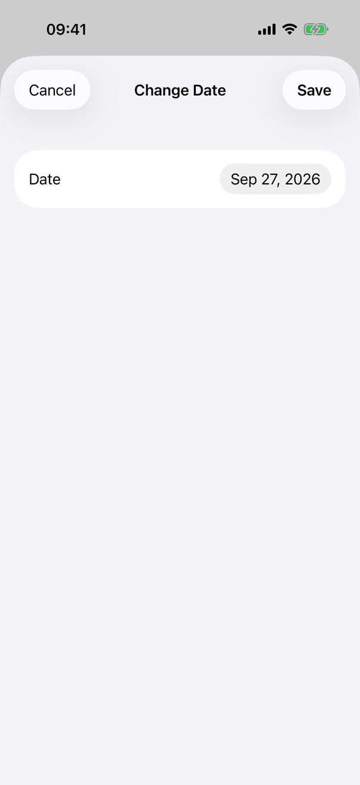
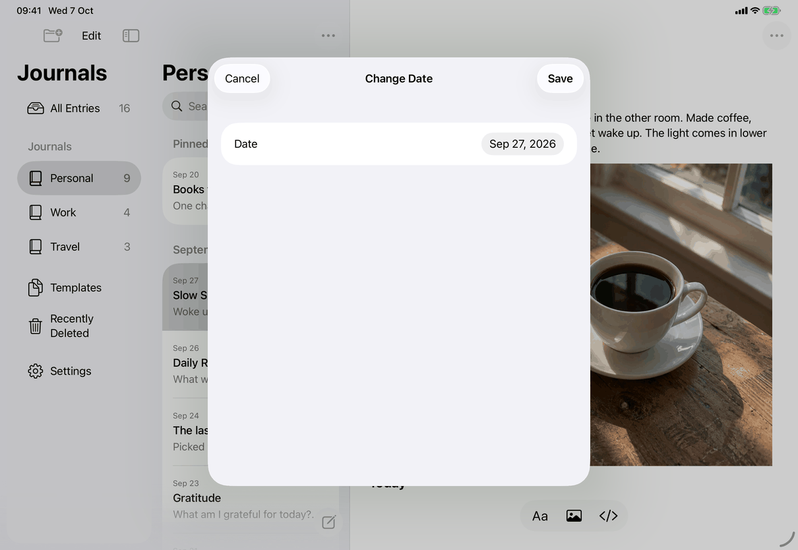
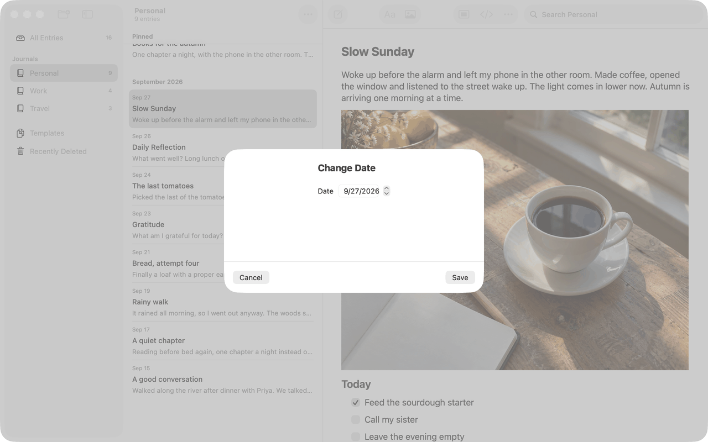

# Change Date (Apple)

Maps [screens/change-date.md](../../../screens/change-date.md). One small view, `EntryDateView(entry:)` in `Views/EntryDateView.swift`, with two layouts selected by `#if os(iOS)`.

## Controls

**Where it opens.** `RootView` keeps `entryToDate` and presents `.sheet(item: $entryToDate) { EntryDateView(entry: $0) }`. The command `change-date` ("Change Date…", symbol `calendar`) is in the row's context menu and in Entry Actions (`entryActionCatalog`), offered only for an editable entry in a journal in use (`AppModel.offersDelete`). It runs `performRowAction`, which selects the entry and saves the open writing first, then sets `entryToDate` to the open draft. The date is shown in the entries list and changed only here; there is no date control in the editor (AGENTS.md).

**State.** `date` (`@State`, starts as `entry.date`), `busy`, `error`, `operation` (the save `Task`). Model: `AppModel.changeEntryDate(_:expectedDate:to:)` in `Model/EntryActionOperations.swift`; storage: `JournalStore.changeEntryDate` in JournalCore, which writes the new date only if the stored date still equals `expectedDate`, the entry is live in an editable journal and neither record has a conflict.

**Elements.**
- Title `library.changeDate.title`: the inline navigation title on iOS; a `Text` in `.title2.bold()` at the top of the content on the Mac.
- Date picker, label `library.changeDate.date`: `DatePicker("Date", selection: $date, displayedComponents: [.date])`, default style, so it is the compact picker row inside a grouped `Form` on iPhone and iPad (a capsule showing the date) and the field-with-stepper picker on the Mac (screenshots). Disabled while `busy`. Only the day is edited; the time of day is not displayed.
- Error text: `Text(error)` in red, `fixedSize(horizontal: false, vertical: true)`: the footer of the form's section on iOS, a line under the picker on the Mac. Messages: `messages.entry.dateChanged` (the stored date differs from the one the sheet opened with), `messages.save.before.changeDate` (the open entry's autosave has not settled), `messages.entry.unavailableForEditing` (entry gone, deleted, moved or not editable), or the failure text of `FailureMessage` for a storage error. Announced when it appears.
- Buttons `common.cancel` (`role: .cancel`, `.keyboardShortcut(.cancelAction)`, disabled while `busy`) and `common.save` (`.keyboardShortcut(.defaultAction)`, disabled while `busy` or while `model.saveFailure` is true). On iOS they are `ToolbarItem(placement: .cancellationAction)` and `.confirmationAction`; on the Mac an `HStack` in a bar under a `Divider`, Cancel leading and Save trailing.

**Result.** Save runs `save()`: `busy = true`, then `changeEntryDate`, then `dismiss()`. The model stores the date with a new `modifiedAt` and replaces the open draft with the saved item, so the list rebuilds and the entry takes its new place (another month, or within Pinned). No message. If the change was stored but the library could not be read again, `AppModel.error` is set to `messages.refresh.dateSaved` and the generic alert shows it over the window after the sheet closes.

**Closing by itself.** `onValueChange(of: model.locked)` cancels the task and dismisses; `onValueChange(of: model.selectedID)` does the same when another entry becomes the open one. `.interactiveDismissDisabled(busy)` stops a swipe-down while saving. A cancelled save shows no error (`CancellationError` is ignored; errors after locking or after the selection changed are dropped).

There is no empty, loading or offline state. A save failure of the entry is the one state that disables Save.

## Layout

- **iPhone:** the default sheet (large card with a gap at the top), a grouped `Form` with one row: "Date" and the compact picker at the trailing edge. Cancel at the top left, Save at the top right.
- **iPad (regular width):** the same form as a centered card (about 580 by 650 points in the screenshot) over the dimmed window. In a compact-width window the system presents it like the iPhone.
- **Mac:** a window-attached sheet with `.frame(idealWidth: 360, idealHeight: 260)`: title, the picker row, Divider, then Cancel (leading) and Save (trailing).
- **Dynamic Type, accessibility sizes (`dynamicTypeSize.isAccessibilitySize`):** the picker row becomes a `VStack`: a visible `Text("Date")` above the picker, with the picker's own label hidden and its accessibility label set to "Date" (so the label is read once). On the Mac the bottom bar becomes a vertical stack with Save first, then Cancel. On iOS the toolbar buttons stay in the navigation bar.

## Commands and shortcuts

| Command | Placement | Shortcut | Enabled when |
| --- | --- | --- | --- |
| `change-date` | Opens the sheet from the row's context menu and Entry Actions ("…" in the editor bar); on iPhone and iPad also by long press on a row | none | An editable entry in a journal in use, as in [commands.md](../commands.md) |

Keyboard: Return chooses Save (`.defaultAction`) and Escape chooses Cancel (`.cancelAction`), both when not busy; Save also needs no failed save. The modifiers are not platform-conditional, so a hardware keyboard on iPad uses them as well.

## Copy differences

None. The sheet's text is the same on every device.

## Accessibility

- The error is announced (`JournalAccessibility.announce`) when it appears, skipped while locked.
- At accessibility sizes the visible "Date" label is hidden from VoiceOver and the picker carries the label instead; otherwise the picker's own label is used.
- The picker is the system `DatePicker`, so VoiceOver, Voice Control and Full Keyboard Access use its standard adjustable and calendar behaviours.
- There is no custom focus handling after Save; the sheet closes and focus returns to where it was in the window.

## Differences between iPhone, iPad and Mac

- Cancel and Save are in the navigation bar on iPhone and iPad and in a bottom bar on the Mac, where a sheet has no navigation bar; Return and Escape are wired on both, but are habitual only with a hardware keyboard (always on the Mac).
- The picker is a compact capsule that opens the system calendar on iOS, and a field with a stepper on the Mac, the default `DatePicker` style of each platform.
- The error sits in the form footer on iOS and under the picker on the Mac, following each layout's structure.
- At accessibility sizes the Mac stacks its buttons with Save first (the condition is the `dynamicTypeSize` environment value, as on iOS).

## Screenshots

| Device | Screenshot | State |
| --- | --- | --- |
| iPhone |  | One "Date" row with the compact picker (Sep 27, 2026); Cancel and Save at the top |
| iPad |  | The same form as a centered card over the dimmed list and entry |
| Mac |  | Sheet with the title, "Date" and the field with a stepper (9/27/2026), Cancel and Save at the bottom; the window behind is dimmed |

## Source files

View: `Views/EntryDateView.swift` (the sheet), `Views/RootView.swift` (`entryToDate`, the menu item, `performRowAction`).

Model: `Model/EntryActionOperations.swift` (`changeEntryDate`, `offersDelete`, `selectEntryForAction`).

Core: `EntryDate.swift` (the three error cases and their text), `Store.swift` (`changeEntryDate`).

## Open questions

None.
