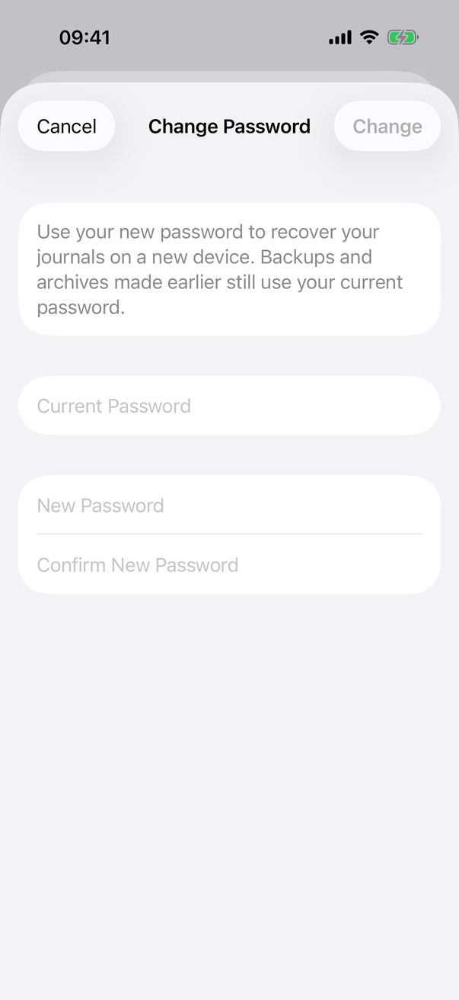
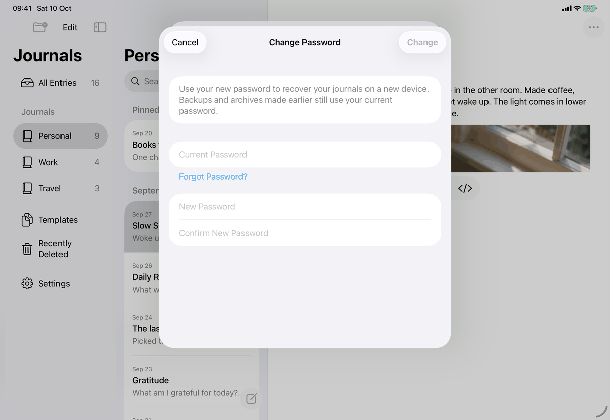
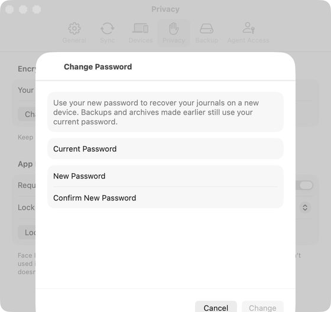

# Change Password (Apple)

Implements [screens/change-password](../../../screens/change-password.md); the step-by-step behaviour is in [flows/change-password](../flows/change-password.md). The views hold the English text as literals (there is no string catalog); the copy keys named here are the spec's keys for the same text.

## Controls

- **Entry row.** `ChangePasswordButton` in `Views/ChangePasswordView.swift` is the Settings ▸ Privacy ▸ Encryption row (`settings.privacy.changePassword`), placed by the Encryption section of `SettingsView.privacySettings`. It draws nothing unless `configuration.recovery.formatVersion == 2` (a master-password library), is `.disabled(model.locked)`, and attaches `.sheet(isPresented:)` with `ChangePasswordView`.
- **Sheet.** `NavigationStack` around a `Form` with `.formStyle(.grouped)`, `.navigationTitle` (`settings.changePassword.title`), `.navigationBarTitleDisplayMode(.inline)` on iOS. The whole form is `.disabled(busy || unsaved != nil)` and the sheet has `.interactiveDismissDisabled(busy || unsaved != nil)`.
- **Intro.** A `Section` holding secondary `Text` (`settings.changePassword.intro`).
- **Forgot Password? (1.1, was the Set New Password page of Check Your Password).** In the Current Password section's footer, under the wrong-password label and left aligned, a `.plain`-style borderless `Button` `settings.changePassword.forgot`, shown when `ForgotPasswordOperations` says the journals exist only on this device (`canSetPasswordWithoutCurrent`) and the device can authenticate its owner (`canAuthenticateDeviceOwner`), and not while busy. It asks the system to authenticate (`LAContext` through `AppModel.authorizePasswordReset`, reason `AppModel.passwordResetReason` (`settings.changePassword.authReason`), lower case on the Mac), cancelled or failed does nothing and says nothing. On success the view switches to a forgot mode held in `@State`: the Current Password section is replaced by secondary `Text` `settings.changePassword.forgotIntro`, focus is requested for New Password (and the screen change announced), and Change calls `setPasswordWithoutCurrent` instead of `preparePasswordChange`. The authorization lasts five minutes and one use (`authorizePasswordReset` / `setPasswordWithoutCurrent` check and consume it) and is forgotten when the sheet closes; connecting, locking or replacing the library meanwhile sets nothing. A failure shows `settings.changePassword.error.reset` (also announced). New and Confirm are new-password fields (`.passwordAutofill(creating: true)`); there is no minimum length.
- **Current Password.** `SecureField` (`settings.changePassword.current`) with `.passwordAutofill()` (`textContentType(.password)`, see `Views/PasswordAutofill.swift`), `.submitLabel(.next)`; Return moves focus to New Password. Section footer: after a wrong password a `Label` with the `exclamationmark.circle` symbol in red (`messages.password.incorrect`), shown while the stored failure is `incorrectPassword`.
- **New and Confirm.** Two `SecureField`s (`settings.changePassword.new`, `settings.changePassword.confirm`) with `.passwordAutofill(creating: true)` (`.newPassword`; macOS 13 falls back to `.password`). Return in New moves to Confirm (`.next`); Return in Confirm (`.done`) changes when `canChange` holds. Footer is a `VStack` of, in this order: the mismatch label (`messages.connection.passwordsDontMatch`) when `showsMismatch`; the error label for any other message; a small `ProgressView` titled `settings.changePassword.busy` while working. All error labels are the same red `Label` with `exclamationmark.circle`.
- **Toolbar.** `.cancellationAction`: `Button("Cancel", role: .cancel)` (`common.cancel`), disabled while busy or while a local save is pending (`unsaved != nil`) unless the retry already failed. `.confirmationAction`: `settings.changePassword.change`, disabled until `canChange` (not busy, unlocked, Current non-empty, New at least `VaultCrypto.minimumPasswordLength` = 1 character, New equals Confirm); replaced by `common.tryAgain` while `unsaved != nil`. No explicit `.keyboardShortcut` is set on either button.
- **States.** Working: `busy` (form disabled, busy footer). Wrong current password: `failure == .incorrectPassword`, focus returned to Current, `message` cleared. Server has the new password but this device did not save it: `unsaved` holds the envelope, message `messages.password.notSavedLocally`; after a failed retry `retryFailed` and message `settings.changePassword.error.notSavedRetry`. Other failures set `message` (see the flow page). Nothing clears `failure` or `message` while typing; the next Change attempt resets them.
- **Model.** `AppModel.preparePasswordChange(current:new:)` and `savePasswordChange(_:)` in `Model/PasswordOperations.swift`; `VaultCrypto.changePassword` in JournalCore; the server call is `ServerClient.changePassword`.
- **Mismatch rule.** `showsMismatch` = Confirm non-empty, differs from New, and (Confirm was left once, tracked by `confirmationVisited` through `onValueChange(of: focus)`, or Confirm has at least as many characters as New).

## Layout

- **iPhone.** A standard sheet over Settings (Settings is itself a sheet on iPhone), full width; inline title in the centre of the navigation bar, Cancel left and Change right, both as the system's bar-button capsules.
- **iPad.** The same `.sheet` (Settings is a sheet on both iPhone and iPad) with the system's regular-width presentation: a centred card about 580 points wide over the dimmed window (see the screenshot). In compact widths (Slide Over, narrow Stage Manager window) the system presents it like the iPhone sheet; nothing in this view switches on size class.
- **Mac.** A sheet on the Settings window's Privacy tab: `.frame(width: 440)` and `.frame(minHeight: 400)` under `#if os(macOS)`. The title sits at the leading edge of the sheet header and Cancel and Change sit at the bottom trailing edge (toolbar items in a macOS sheet), unlike iOS where they are in the top bar.
- **Dynamic Type.** The `Form` scrolls; the intro and footers wrap. No layout switch.

## Commands and shortcuts

| Command | Placement | Shortcut | Enabled when |
| --- | --- | --- | --- |
| `change-password` | as in [commands.md](../commands.md) | as in commands.md | master-password library and unlocked (`.disabled(model.locked)`) |
| `change-password-submit` | as in commands.md | Return in Confirm (`onSubmit`) | as `canChange` above |
| `change-password-retry` | as in commands.md | none | `unsaved != nil` and not busy |
| `forgot-password` | the borderless button in the Current Password footer | none | journals only on this device, owner authentication available, not busy |
| `change-password-cancel` | as in commands.md | Escape comes from the system's sheet dismissal, not from a `.keyboardShortcut` in this file; not verified | not busy, and not while a local save is pending unless the retry failed |

Focus order: Current, New, Confirm, driven by `@FocusState` and `onSubmit`. On iPad with a hardware keyboard Return follows the same chain.

## Copy differences

`settings.changePassword.authReason` has a `mac` variant (lower case): the Mac's authentication dialog reads “My Journal is trying to set a new password for your journals”; iPhone and iPad show the default text.

## Accessibility

- Focus starts in Current Password (`onAppear { focus = .current }`) and returns there after a wrong password. After Forgot Password? authenticates, focus moves to New Password and the change of screen is announced.
- Every failure that goes through `show(_:)` and the failed retry calls `announceForAccessibility`, which posts a high-priority announcement on both platforms (`Views/ConnectionView.swift`). The confirmation mismatch is announced when it first appears in 1.1 (A38, resolved).
- Fields use their placeholder text as the accessibility label. Error labels are plain `Label`s with no custom hint.
- Reduce Motion, Increase Contrast and Reduce Transparency: nothing page specific.

## Differences between iPhone, iPad and Mac

- Bar buttons are in the top bar on iPhone and iPad and at the bottom of the sheet on the Mac, because that is where each system puts toolbar items of a sheet.
- The Mac sheet has a fixed width and minimum height (`#if os(macOS)`) because a Mac sheet does not size itself to a window; iPhone and iPad get their size from the system sheet.
- Autofill: the Mac uses `.newPassword` only on macOS 14 and later.

## Screenshots

| Device | State |
| --- | --- |
| iPhone |  Empty form; Change dimmed. Captured before 1.1: no Forgot Password? button yet. |
| iPad |  Same state in the centred sheet over the library window. |
| Mac |  Same state over the Settings window's Privacy tab; the capture is cropped at the bottom of the window, so Cancel and Change are partly cut off. |

Screenshots are refreshed by the capture script when the owner says ready.

## Source files

- View: `Views/ChangePasswordView.swift` (row and sheet), `Views/PasswordAutofill.swift` (content types), the Encryption section of `SettingsView.privacySettings` places the row.
- Model: `Model/PasswordOperations.swift` (prepare, save), `Model/ForgotPasswordOperations.swift` (eligibility, authorization, `setPasswordWithoutCurrent`), `Model/FailureMessage.swift` (text of other failures).
- Core: `Sources/JournalCore/Crypto.swift` (`VaultCrypto.changePassword`, `PasswordChangeError`), `Sources/JournalCore/ServerClient.swift` (`changePassword`).
- Design: [sync-security-2026-09-24.md](../../../../docs/design/sync-security-2026-09-24.md), [connection-onboarding.md](../../../../docs/design/connection-onboarding.md).

## Open questions

See [open-questions.md](../../../open-questions.md), A38 (resolved), D61 (strong-password offer).
