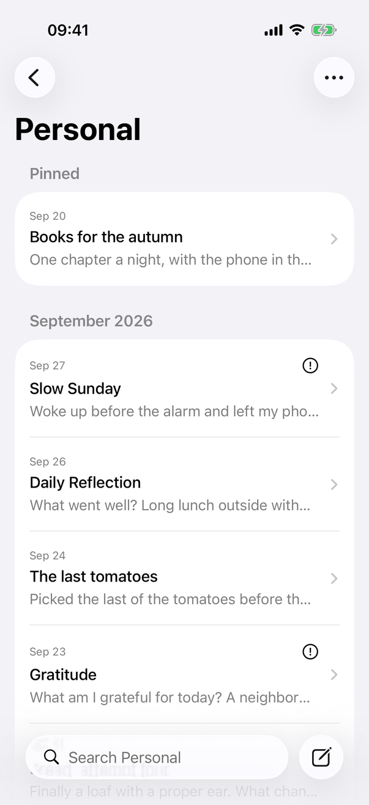
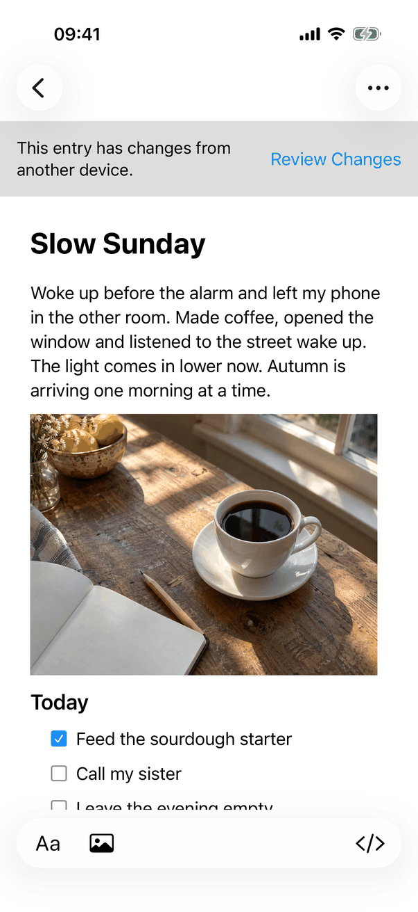
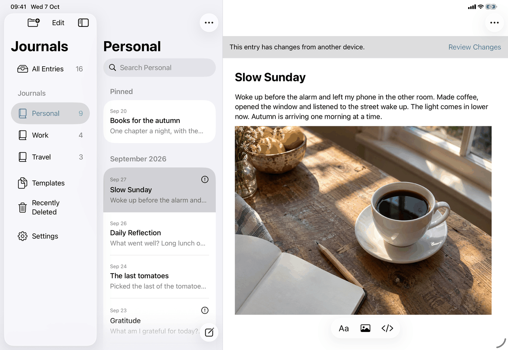
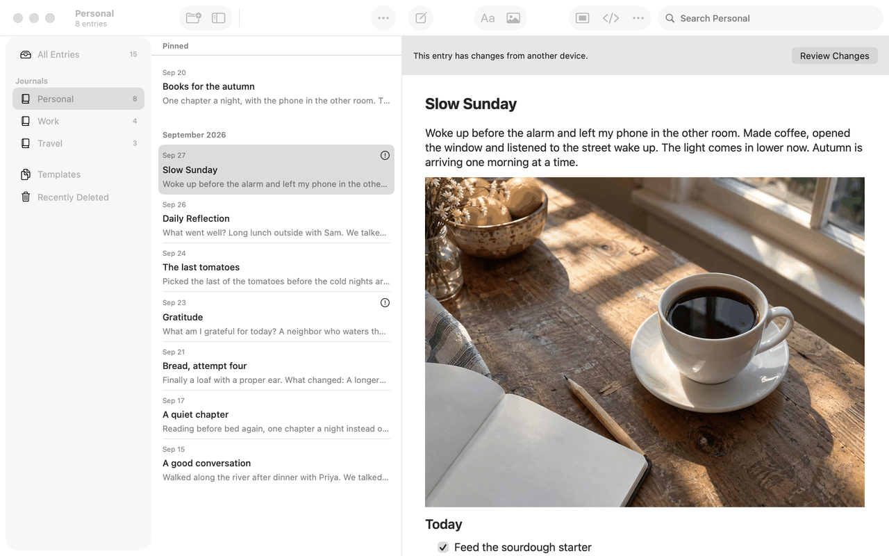

# Review Changes (conflicts) (Apple)

Implements [screens/conflict-review.md](../../../screens/conflict-review.md): where changes to review are signalled, the Changes to Review list in Settings, and the Review Changes sheet with its journal, deletion and unsupported forms. The entry and template form is in [entry-conflict.md](entry-conflict.md); the steps and outcomes are in [flows/resolve-conflict.md](../flows/resolve-conflict.md). Sheet, alert and notice conventions are in [platform.md](../platform.md#9-sheets-popovers-and-notices).

The model is `AppModel.conflicts`, an array of `ConflictVersion` (record id, this device's `local` item, the received `remote` item, the remote revision, the recorded device id) read from the store's `conflicts` table by `JournalStore` and republished after every refresh. Every entry point below reads it; none caches a conflict across a lock.

## Controls

**Signals and entry points** (order of the spec's Entry points table)

- **Notice above the writing**: `ConflictNotice` (in `SettingsView.swift`), shown by `RootView.detailContent` when `model.conflicts` holds the open item. A `Text` (`.callout`, key `messages.conflict.entryNotice`) and a plain `Button` (`common.reviewChanges`) in an `HStack` with a `Spacer`, on a `.quaternary` background. At accessibility Dynamic Type sizes it becomes a `VStack` (`AnyLayout` switch on `dynamicTypeSize.isAccessibilitySize`). The button runs `model.flush()` (saves the open writing); only if that succeeds it calls `model.refresh()` and presents `ConflictReview` as a `.sheet`. If the save fails nothing opens and the save-failure alert/notice shows (see `flows/save-failure`). The notice has no `replacingVault` check of its own; the sheet closes itself when a library replacement starts.
- **Entries list row**: `RootView.entryConflictIndicator` puts `Image(systemName: "exclamationmark.circle")` with accessibility label `messages.conflict.needsReview` at the trailing end of the row's first line (date line). At accessibility sizes the date line is a `VStack` and the symbol sits beside the date. It is not a button; the row's own selection opens the entry.
- **Settings ▸ Sync ▸ Changes to Review**: `ConflictSettingsSection`, a `Section` at the end of the Sync pane's `Form` (`.formStyle(.grouped)`), shown only when `!model.locked` and `model.conflicts` is not empty. Header `messages.conflict.settingsSection`. Each row is a `VStack` of the title (wrapping `Text`; `DeletionConflictView.deletedTitle` for a permanently deleted record, keys `messages.conflict.deletion.deletedTitle.entry`, `.template`, `.journal`), the date (`Text(_, format: .dateTime)`, secondary) and a `Button` `common.reviewChanges` whose accessibility label is `common.reviewChangesFor` with the title. The pane owns a `@State var reviewingConflict` and presents `ConflictReview` with `.sheet(item:)`; the sheet is dropped when the app locks.
- **A deleted journal** (`DeletedJournalView`): `common.reviewChanges` button beside Restore Journal, `.disabled(model.replacingVault)`.
- **An entry of a journal with changes to review** (`EntryRecoveryNotice`, `.conflict` case): `common.journalNeedsReview` and `common.reviewChanges`, listed under Unavailable Journals.
- **A journal's Version History** (`JournalHistoryView`) shows `common.reviewChanges` in its recovery actions in place of restoring while a conflict exists. Move Entry (`MoveEntryView`), Merge Into… (`MergeJournalView`) and the journal lifecycle sheet (`JournalLifecycleView`) show the same button when a conflict blocks them and present `JournalConflictView` or `ConflictReview` nested.
- **Context menus**: `AppModel.journalActions` (sidebar row context menu and the Mac Journal Actions menu) passes `enabled: !conflicted` for Rename…, Default Template and Merge Into…; a disabled `MenuAction`, not a hidden one.
- **Alert when deleting**: deleting a journal or permanently deleting a record that has a conflict does not open a deletion sheet. `.deletionConflictAlert` (`DeletionConflictAlert.swift`) shows a standard `.alert` with buttons Review Changes and Cancel (`role: .cancel`); Review Changes presents `ConflictReview` in a `.sheet(item:)`. The alert title is built in code as `messages.deleteConflict.title` (name shortened in the middle past 40 characters, `common.untitledJournal`, `library.entryList.untitledTemplate` or `library.entryList.untitledEntryInAlert` when blank) and its message is `messages.deleteConflict.record` (records) or `messages.deleteConflict.journal` (journals). The alert closes when the app locks. **Screenshots pending:** the alert on iPhone, iPad and Mac (conflict-review-delete-alert).

**The Review Changes sheet** is `ConflictReview` (`ConflictRouting.swift`), a `Group` that re-decides its form on every render from `model.conflicts` (the table in the spec). In order: locked shows plain text `messages.conflict.locked` (the child views close the sheet themselves when `model.locked` becomes true; this text only shows if the sheet renders while locked); the entry form `EntryConflictReview` when neither version is permanently deleted, neither carries preserved JSON from a newer version, both documents are `isEditable` and the kind is not `journal`; `DeletionConflictView` when either is permanently deleted; the unsupported form when either has preserved JSON or is not editable; `JournalMetadataConflictReview` for a journal; and when the conflict is no longer in `model.conflicts`, a completed `DeletionSheet` with `messages.conflict.resolved`. `@State entryReviewStarted` keeps the entry form on screen while a committed entry choice removes its conflict from the model, so the sheet does not flip to the resolved text before it closes itself.

All forms except the journal form are wrapped in `DeletionSheet` (`PermanentDeletionView.swift`): title `common.reviewChanges`, a `ScrollView` of 24 pt padding, and a Cancel button (`role: .cancel`, `.keyboardShortcut(.cancelAction)`) that reads `common.done` once `completed`. `.interactiveDismissDisabled(busy)` stops swipe-down and the Cancel button is `.disabled(busy)`.

**Journal form** (`JournalMetadataConflictReview`, `JournalConflictView.swift`; core call `JournalStore.resolve` through `AppModel.resolveJournalConflict`)

1. A segmented `Picker` (`common.version` as its hidden label) with `common.thisDevice` and `messages.conflict.version.otherDevice`, `.disabled` while working or confirming. Unlike the entry form it does not switch to a menu at accessibility sizes.
2. A `VStack`: `Text` heading (`.headline`) with the version name, its modification date (`.dateTime`), and for Other Device a `DisclosureGroup` (`messages.conflict.journal.details`) holding the lower-case device id, `.textSelection(.enabled)`, accessibility label `messages.conflict.journal.deviceIDLabel` (the label uses the upper-case UUID).
3. `JournalMetadataSummary`: three `VStack` fields, each `.accessibilityElement(children: .combine)`: `common.name`, `common.defaultTemplate` (template title, `common.blankEntry`, or `messages.conflict.journal.value.unavailableTemplate`) and `messages.conflict.journal.field.location` (`common.journals` or `common.recentlyDeleted`); values are selectable.
4. `Button` `messages.conflict.journal.keepVersion`, `.borderedProminent`, opens a `.confirmationDialog` with `titleVisibility: .visible`, title `messages.conflict.journal.confirmThisDevice` or `.confirmOtherDevice`, message `messages.conflict.journal.confirmMessage` (date from `formatted(date: .abbreviated, time: .standard)`), buttons `messages.conflict.keepVersion` and `common.cancel`. There is no Keep Both; the store throws if asked.
5. `ProgressView` labelled `messages.conflict.journal.loading` (Reload) or `messages.conflict.savingChanges`.
6. Error `Text` (secondary, selectable, accessibility label `messages.conflict.journal.errorLabel`) with a `Button` `messages.conflict.journal.reloadChanges`, or `messages.conflict.journal.reload` once `completed`. `messages.conflict.updatedReviewAgain` is the message for `JournalError.conflict`; `messages.conflict.journal.savedNotDisplayed` when the choice was saved but `AppModel.refresh` failed.
7. After a saved choice `messages.conflict.journal.saved`, and the close button reads `common.done`.
8. If its versions are not editable, the form shows `messages.conflict.updateToReview`, `ArchiveExportControls` and, while `model.saveFailure`, `messages.save.before.goBack`.

**Deletion form** (`DeletionConflictView`, loaded by `AppModel.prepareDeletionConflict` and committed by `resolveDeletionConflict`; core `StoreDeletion` and `DeletionConflict.swift`)

1. `.task { await prepare() }` first saves the open entry (`deletionStoreAfterSaving`; failure surfaces as `JournalError.saveRequired`, text `messages.save.before.goBack`), reads the confirmation, refreshes, and loads the edited version's attachments into `images`. `ProgressView` `common.pleaseWait` shows while `busy`.
2. Two `event` blocks (`.accessibilityElement(children: .combine)`): headline title, then three secondary lines: `common.onThisDevice` or `messages.conflict.deletion.receivedVersion`, `messages.conflict.deletion.unknownDevice`, and the date.
3. With an edited version: an entry or template shows its title and a read-only preview, `NativeEditor(editable: false)` with `.frame(minHeight: 260)` (an `NSTextView` in an `NSScrollView` on the Mac, a `UITextView` wrapper on iPhone and iPad), font size `@ScaledMetric(relativeTo: .body)`; a journal shows `JournalMetadataSummary`. Choices are plain `Button`s each followed by a secondary `Text` with its explanation (keys in the spec). `messages.conflict.deletion.keepDeletion` is `role: .destructive`.
4. Keep Entry… and Keep Entry as Copy… replace the choices with `destinationChoices`: heading `common.chooseJournal`, one `Button` per journal in `model.journals` that has no conflict (checkmark `Image` `.accessibilityHidden(true)` and `.isSelected` trait on the chosen one; names disambiguated by `destinationName` with date and shortest id prefix), `common.newJournalEllipsis` (presents `RecoveryJournalView` in a nested `.sheet`), then `messages.conflict.deletion.selectedJournal` and the confirm button, and `common.back`.
5. Keep Deletion… sets `deleting` and presents a second `DeletionSheet` (nested `.sheet`) with the confirmation: title built from `messages.conflict.deletion.confirmDeleteEdited.*` or `.confirmKeepDeleted.*`, the three `DeletionConsequences` lines (keys `messages.conflict.deletion.consequence.sync`, `.copies`, `.noUndo`), the destructive `messages.conflict.deletion.deletePermanently` button and `messages.conflict.deletion.deleting` progress.
6. Errors map in `handle`: `HistoryRecoveryError.destinationUnavailable` and `JournalError.conflict` set `messages.conflict.deletion.journalUnavailable` with `common.reloadJournals`; `PermanentDeletionError.changed` sets `messages.conflict.updatedReviewAgain` with `messages.conflict.deletion.reviewAgain`; `PermanentDeletionError.unsupported` sets `messages.conflict.deletion.updateToReview` with `ArchiveExportControls`; anything else is `error.shown(.saving)`. A saved choice whose refresh fails sets `messages.conflict.deletion.savedNotDisplayed` and does not dismiss; otherwise the sheet calls `dismiss()`.

**Unsupported form** is inline in `ConflictReview`: `DeletionSheet` with `messages.conflict.updateToReview` and `ArchiveExportControls` (the Export Archive… button of Settings ▸ Backup, including the one-time password check sheet). Nothing else is offered.

Empty/loading/error states: loading is the `ProgressView`s above; the offline-like and error states are the error `Text`s with their reload buttons; there is no empty state (the section and notice are simply not shown).

## Layout

- **iPhone (compact width)**: every form is a full-height `.sheet` with a `NavigationStack`, inline title and the Cancel/Done button in `.cancellationAction` (leading). The notice sits between the navigation bar and the writing and is full width; the entry marker is in the list row. At accessibility sizes `DeletionSheet` repeats the title as a heading inside the scroll content (iOS only).
- **iPad (regular width)**: the same `.sheet` is the system's centered card (about 580 pt wide in the capture); there are no detents. The notice is full width above the editor in the detail column. Entry markers show in the middle (entries) column.
- **Mac**: the notice is the first element of the detail column (above the title, below any recovery notice). Sheets are not a `NavigationStack`: `DeletionSheet` is a `VStack` of a centered `.title2.bold()` title, the scroll content, a `Divider` and a footer row with Cancel/Done at the leading edge; frame `minWidth 360, idealWidth 480, minHeight 400, idealHeight 600` (the journal form: 360, 460, 400, 540). Settings ▸ Sync is a tab of the Settings window (`TabView`, 560 pt wide), which presents the sheet itself.
- The switch is `#if os(iOS)` / `#else` inside `DeletionSheet` and `JournalMetadataConflictReview`, and `dynamicTypeSize.isAccessibilitySize` for the notice stacking. Dynamic Type enlarges all text; only the notice and the sheet title change structure.

## Commands and shortcuts

| Command | Placement | Shortcut | Enabled when |
| --- | --- | --- | --- |
| `review-changes` | Notice above the entry, Settings ▸ Sync ▸ Changes to Review and the other buttons listed in Controls; as in [commands.md](../commands.md) | None | Unlocked; the notice and journal buttons are not disabled for anything else except the journal buttons while `model.replacingVault` |
| `export-archive` | Export Archive… inside the unsupported forms | None | Not while an export is preparing (`export.showsProgress`) |

Keyboard: in `DeletionSheet` Cancel/Done is the cancel action, so Escape closes it on the Mac and a hardware keyboard on iPad (not while busy). The journal form's close button has no `.keyboardShortcut`, so Escape is not bound there by the app. Confirmation dialogs take their default and Escape keys from the system. Tab order follows the view order; Full Keyboard Access reaches every button.

## Copy differences

None. Keys with a `mac` variant do not appear here. Several strings in these views are written inline in Swift (the alert in `DeletionConflictAlert.swift`, some error texts) and match `copy/en.json` except those noted in Open questions.

## Accessibility

- Errors in the journal and deletion forms are announced with `JournalAccessibility.announce` when set (not while locked). The entry form's status uses focus instead; see [entry-conflict.md](entry-conflict.md).
- The marker is a labelled image (`messages.conflict.needsReview`); the notice text and button are separate elements.
- Each Changes to Review row is a `VStack` of title, date and button; the button's label names the record (`common.reviewChangesFor`) so VoiceOver and Voice Control can tell the rows apart.
- Deletion `event` blocks and journal summary fields are combined into one element each; the destination checkmark is hidden and the row carries the selected trait.
- The notice stacks its text above the button at accessibility sizes; the preview follows the body size through `@ScaledMetric`.

## Differences between iPhone, iPad and Mac

- The notice button is plain text on iPhone and iPad and a bordered button on the Mac (system rendering of `Button` in a Mac window); same control.
- Sheet chrome differs: `NavigationStack` with a Cancel button in the bar (iPhone, iPad) against a title, footer and divider built by hand (Mac), because a Mac sheet has no navigation bar; the Mac footer places Cancel at the leading edge and gives the sheet a minimum size.
- iPad shows a centered card sheet where iPhone is full height; both are the system presentation of `.sheet` for the size class.
- The Settings entry is a pushed pane of the Settings sheet on iPhone and iPad and a tab of the Settings window on the Mac; the section is the same.
- Escape closes every form on the Mac except the journal form; touch devices have no Escape.

## Screenshots

The sheet itself is shown in [entry-conflict.md](entry-conflict.md); these captures show the signals. The journal, deletion and unsupported forms of the sheet, and the Changes to Review section, are not captured (they need records in those states; the sample library only has two conflicting entries).

| Device | Image | State |
| --- | --- | --- |
| iPhone |  | Entries list of Personal; Slow Sunday and Gratitude each carry the exclamation-mark-in-a-circle marker at the trailing end of the date line |
| iPhone |  | The open entry Slow Sunday with the grey notice and the Review Changes button below the navigation bar |
| iPad |  | Three columns: the markers in the list and the notice above the editor |
| iPad |  | Same state as above (identical capture); the notice text and Review Changes on one line |
| Mac |  | Window in the background: markers in the list and the notice above the title, with a bordered Review Changes button |

## Source files

View:

- `Views/ConflictRouting.swift`: `ConflictReview` (form routing), `ConflictSettingsSection`, `JournalConflictView`.
- `Views/EntryConflictReview.swift`: the entry and template form and `ConflictPlacement`.
- `Views/JournalConflictView.swift`: journal form and `JournalMetadataSummary`.
- `Views/DeletionConflictView.swift`: deletion form, journal choices, nested confirmation.
- `Views/DeletionConflictAlert.swift`: the Can’t Be Deleted alert with Review Changes.
- `Views/PermanentDeletionView.swift`: `DeletionSheet` (the sheet frame), `DeletionConsequences`.
- `Views/SettingsView.swift`: `ConflictNotice` and where the section is placed. `Views/RootView.swift`: the row marker and notice placement.
- `Views/DeletedJournalView.swift`, `Views/EntryRecoveryNotice.swift`, `Views/JournalHistoryView.swift`: the other entry points.

Model:

- `Model/AppModel.swift`: `conflicts`. `Model/JournalOperations.swift`: `resolveJournalConflict`. `Model/PermanentDeletionOperations.swift`: `prepareDeletionConflict`, `resolveDeletionConflict`.

Core:

- `JournalCore/Store.swift`: `ConflictVersion`, `ConflictChoice`, `conflicts()`, `resolve`. `JournalCore/DeletionConflict.swift` and `StoreDeletion.swift`: the deletion confirmation and choices. `JournalCore/SyncReconciliation.swift`: where conflicts are recorded.

Design records: [entry-conflict-accessibility.md](../../../../docs/design/entry-conflict-accessibility.md), [stale-conflict-recovery.md](../../../../docs/design/stale-conflict-recovery.md), [journal-conflicts.md](../../../../docs/design/journal-conflicts.md), [permanent-deletion.md](../../../../docs/design/permanent-deletion.md), [unsupported-conflict-review.md](../../../../docs/design/unsupported-conflict-review.md).

## Open questions

See [open-questions.md](../../../open-questions.md), A17 (the journal form has no Escape binding) and A49 (the notice does not check `replacingVault`). The delete-blocked alert (`DeletionConflictAlert.swift`) is C1, resolved in build 18, and is in the spec and the catalog.
