# Connect to a Server (sheet and its steps) (Apple)

The sheet is `ConnectionView` (`Views/ConnectionView.swift`, a thin wrapper around the private `ConnectionSheet`); each later step is a `ConnectionStepView` (`Views/ConnectionSteps.swift`) pushed on its `NavigationStack`. All work and state live in `ConnectionFlow` (`Model/ConnectionFlow.swift`), an `ObservableObject` created per sheet. The decision tree, with every error, is in the flow note [connect-to-server](../flows/connect-to-server.md); reconnecting is [reconnect-to-server](../flows/reconnect-to-server.md). Spec: [connect-to-server](../../../screens/connect-to-server.md). Sheets, notices and local-network conventions: [platform.md](../platform.md#9-sheets-popovers-and-notices), [platform.md](../platform.md#32-local-network-and-servers).

## Controls

**Presentation.** `ConnectionView()` is presented with `.sheet` from these places: Settings ▸ Sync (`SettingsView`, `.sheet(item: $connect)` with a fresh `ConnectionRequest` per tap), Settings ▸ Agent Access (`ServerAgentsView`), the first-launch screen's Connect to a Server… link (`RootView`, `$connect`), and Sync Status's Reconnect… (over the journal window). On the Mac a sheet opened from Settings sits on the Settings window.

**Sheet-level modifiers** (`ConnectionSheet.body`): `NavigationStack(path: $flow.path)`, `Form` with `.formStyle(.grouped)`, inline title `settings.connect.title`, or `settings.connect.reconnect.title` when the sheet was opened for a reconnect (`ConnectionSheet.reconnecting`, a `@State` set from `model.reconnectsOnConnect` in `init`, so the title is fixed while the sheet is open), on iOS; `.interactiveDismissDisabled(flow.installing)`; `.keepsUnlockedWhile(flow.busy)` (Mac only in effect: holds the inactivity lock); `onDisappear` stops the Bonjour browser and calls `flow.close()`; `onValueChange(of: model.locked)` calls `flow.cancel()`; `onValueChange(of: flow.finished)` dismisses. `onAppear` prefills `flow.address` from `model.connection?.address`, and when `model.reconnectsOnConnect` is true and an address exists, calls `flow.check()` at once, which is how Reconnect… skips page 1.

**Toolbar** (page 1 and every step): `.cancellationAction` `Button(role: .cancel)` `common.cancel` (disabled while `flow.installing`) and `.confirmationAction` the page's primary. On pushed steps the Mac always shows Cancel; iPhone and iPad show it only where `canGoBack` is false (the system back button replaces it otherwise). `canGoBack` is false while `flow.busy`, on Server Is Ready and Finish on Your Other Device, and on Choose a Master Password once `flow.createdJournalHere`. Server Is Ready has only `common.done` (`flow.cancel()`, which closes). Because `busy` is true while a pairing code waits, Add This Device shows Cancel, not Back, as the captures show.

**Common to every step** (`ConnectionStepView.body`): an optional Mac heading row; the step content; a busy row (`ConnectionBusyRow`: `connectionStatus(label)`, an `HStack` of a small `ProgressView` and secondary text combined into one element) when `flow.busy`, except on Add This Device and Finish, which show progress inside their own section; an error `Section` with the message in red `.callout` (`flow.errorMessage(on: step)`, matched by the step on which the error was recorded). Field errors are shown by `fieldError(_:)` inside the field's section, and also set as the field's accessibility hint (`errorHint`).

### Page 1: Choose a server (`ConnectionSheet`)

- Locked: `Text` `settings.connect.locked`, no primary.
- A scanned code in use (`flow.invite != nil`): `scannedServer`: `LabeledContent` `settings.connect.server` with the host, selectable, and a busy row `settings.connect.busy.checking` while checking. Primary after a failure: `common.tryAgain` (`flow.canRetryScannedCode`) or `settings.connect.scanAgain`.
- Otherwise (`chooseServer`):
  1. If `canScan` (`ScanCodeView.available`, iOS only): a `Section` with `Button` `settings.connect.scanCode` (`Label` with `qrcode.viewfinder`) and footer `settings.connect.scanCode.footer`; sets `scanning = true`, which presents `ScanCodeView` with `.fullScreenCover` ([scan-code](scan-code.md)).
  2. `Section("Servers on This Network")` (`settings.connect.nearby.header`): `ForEach(browser.servers)` of plain-style `Button` rows (host, optional secondary name line, a small `ProgressView` on the chosen row), `.disabled(flow.busy)`, accessibility label "host, name". Tapping fills `flow.address` and calls `flow.check()`. Under the rows: `settings.connect.nearby.denied` when `browser.state == .denied`; else, with no servers, `settings.connect.nearby.looking` (busy row) for the first five seconds (`searchedLong`) and then `settings.connect.nearby.none`. `ServerBrowser` runs an `NWBrowser` for `_myjournal._tcp` with TXT records, keeps only HTTPS addresses (`url` and `v == 1`), one row per address, sorted by host; it runs only while `choosing` (unlocked, no scanned code, empty path).
  3. `Section` header `common.serverAddress`, footer `settings.connect.address.footer`: a `TextField` (label and prompt `settings.connect.address.placeholder`, via `headedField`), no autocorrection; on iOS `.textInputAutocapitalization(.never)` and `.keyboardType(.URL)`. Return calls `checkAddress()`. While a typed address is checked: busy row `settings.connect.busy.checking`. The field is not focused automatically.
- Primary: `common.continue`, disabled when busy or the address is empty (`checkAddress()`).
- Error `Section` at the end, in red.

### Steps (`ConnectionFlow.Step`)

Step titles come from `ConnectionStepView.title`; the primary from `primary`.

- **`.setUpServer`** `settings.connect.setUp.title`. `LabeledContent` host (`settings.connect.server`); a `Section` with header `settings.connect.setUp.code` and a `TextField` (prompt `settings.connect.setUp.codePlaceholder`, `.font(.body.monospaced())`, `headedField`, `.focused($focused, equals: .setupCode)`); iOS `.textInputAutocapitalization(.characters)`, `.keyboardType(.asciiCapable)`. Typing is re-formatted through `CodeEntry.setupCode` by an `onValueChange` that lives on the section header (it writes the formatted code back to the field). Footer: `settings.connect.setUp.footer`, a `Link` `settings.sync.footer.howToSetUp` (`ConnectionStepView.setupGuide`, the guide's `#use-your-own-server` anchor), and, when `stepAfterSetupCode == nil && model.store != nil && !createdJournalHere`, `settings.connect.setUp.upload`. Primary `settings.connect.setUp.setUp` when Set Up follows directly, else `common.continue`; disabled while busy or empty. Field errors: `messages.connection.setupCodeLength`, `messages.connection.setupCodeCharacters`, `messages.connection.setupCodeIncorrect`, `messages.connection.setupCodeRateLimited`.
- **`.choosePassword`** `common.chooseMasterPassword`. Reached directly from the setup code when the device has no library (`stepAfterSetupCode` returns `.choosePassword`; the former `.protect` step, `ConnectionFlow.encrypt` and `continueFromProtect` are gone in 1.1). `settings.connect.choosePassword.intro`; `SecureField` or `TextField` (switched by a `Toggle` `common.showPassword`) for `common.masterPassword` and `common.verify`, with `.passwordAutofill(creating: true)` (`.textContentType(.newPassword)`), no autocorrection, Return in the first moves focus to Verify, Return in Verify sets up; footer `settings.password.footer`. The section is disabled while busy or `createdJournalHere`. Primary `settings.connect.setUp.setUp` or `common.tryAgain`; disabled while busy or either field is empty. Verify error `messages.connection.passwordsDontMatch`.
- **`.enterPassword`** `settings.connect.signIn.title` with `flow.existingCredentialName`. `settings.connect.enterExisting.intro` (credential lower-cased), `phraseField`, `Toggle` `settings.connect.showCredential`, footer `settings.connect.setUp.upload`. Primary `settings.connect.setUp.setUp`.
- **`.serverReady`**: no navigation title (`""`). A centred block on a clear row background: `Image(systemName: "checkmark.circle")` at 48 points (accessibility hidden), `settings.connect.ready.title` (`.title2.bold()` with the header trait), `settings.connect.ready.message`; a `Section` with `Button` `settings.connect.ready.addDevice`, which presents `AddDeviceView` ([add-device](add-device.md)) with `.sheet`, and footer `settings.connect.ready.footer` when `configuration.requiresPassword`. Toolbar: only `common.done`.
- **`.signIn`** `settings.connect.signIn.title` with `flow.credentialName`. Intro: `settings.connect.signIn.introRecoveryKey` for a format 1 envelope, else `settings.connect.signIn.intro`. `phraseField` (`SecureField`/`TextField`, `.passwordAutofill()`), `Toggle` `settings.connect.showCredential`; footer `settings.connect.download` (`flow.downloadFooter`). A `Section` with `Button` `settings.connect.signIn.useDevice` (pushes `.addThisDevice`; disabled while busy). Primary `settings.connect.signIn.signIn`, or `common.tryAgain` when `flow.mergeInterrupted` and an error is shown. Busy labels: `settings.connect.busy.signingIn`, then `JoinPhase` labels (`settings.connect.busy.checking`, `settings.connect.busy.downloading`, `common.merging`).
- **`.addThisDevice`** `settings.connect.addThisDevice.title`. `.onAppear` calls `flow.beginPairing()` when there is no ticket, nothing is busy and no error is shown. One `Section` showing, in order of precedence: nothing (an error is shown), the check code (`checkCodeView`), the pairing code (`pairingCodeView`), or a busy row `settings.connect.addThisDevice.gettingCode`. `pairingCodeView`: the nine digits grouped in threes in `.system(.largeTitle, design: .monospaced)`, `.textSelection(.enabled)`, accessibility label `settings.connect.addThisDevice.codeLabel` and the digits as value; `Button` `settings.connect.addThisDevice.copyCode` (pasteboard `string`, digits only); `settings.connect.addThisDevice.instructions`; busy row `settings.connect.waitingForApproval` or the installing label. `checkCodeView`: `settings.connect.checkCode.title`, the six digits (label `settings.connect.checkCode.label`), `settings.connect.checkCode.instructions`, then the installing label or `settings.connect.checkCode.waiting`. Footer `settings.connect.download`. Primary: `common.connect` with `.keyboardShortcut(.return, modifiers: .command)` while `flow.awaitingConfirmation` (Mac adds `.help("Connect (⌘Return)")` = `settings.connect.addThisDevice.connectHelp` and `.accessibilityHint("Press Command-Return to connect.")` = `settings.connect.addThisDevice.connectHint`); after a failure `settings.connect.addThisDevice.getNewCode` (nothing received) or `common.tryAgain`.
- **`.merge`** `settings.connect.merge.title` (`MergeJournalsContent`). `settings.connect.merge.intro`; `LabeledContent` `settings.connect.server` and `common.onThisDevice` with `MergeJournalsContent.summary` (`common.journalCount`, `common.entryCount`, then `common.templateCount` and `settings.connect.merge.recentlyDeleted` when non-zero); footer lines in a `VStack`: `settings.connect.merge.footerKept`, the encryption line (`settings.connect.merge.footerSamePassword`), `settings.connect.merge.footerLeaveOut`, `settings.connect.merge.footerOnlyIf`. Primary `common.merge` with `.keyboardShortcut(.return, modifiers: .command)`; Mac `.help` and `.accessibilityHint` from `settings.connect.merge.help` and `settings.connect.merge.hint`. On the Mac `onAppear` sets `headingFocused = true`, moving VoiceOver to the heading row.
- **`.finish`** (after a scanned code): navigation title `settings.connect.title`; `LabeledContent` host; when no error, a section with `settings.connect.finish.title` (headline), `settings.connect.finish.instructions` and a busy row `settings.connect.waitingForApproval` or the installing label. Primary only after a failure: `common.tryAgain` (`flow.received != nil` or `flow.canRetryScannedCode`) or `settings.connect.scanAgain`.

**Mac heading row.** `#if os(macOS)`, `if #unavailable(macOS 26), step != .serverReady`: a first `Section` with the title as `.headline` and the header trait, because a sheet has no title bar before macOS 26. Page 1 has no such row.

**Mac notice in the journal window.** `ConnectionPauseNotice` (`SaveFailureNotice.swift`, Mac only, shown above the editor by `RootView.detail`): after one second of `serverConnectionPause == .connecting`, `messages.writingPaused.connecting`; when a staged copy waits for Try Again, `messages.writingPaused.connectionFailed`; a button `messages.writingPaused.showConnection` sets `model.settingsPresented = true`. It is an `HStack` that becomes a `VStack` at accessibility text sizes and fades in unless Reduce Motion is on. iPhone and iPad show nothing because the sheet covers the app.

**Failures.** `ConnectionFlow.show(_:)` maps errors to text (`URLError` to `messages.connection.cannotConnect` or `messages.connection.cannotConnectTailscale` for `.ts.net` hosts; `ServerUnavailable` to `messages.server.unavailable`; `PairingError` cases for scanned codes; others through `failure.shown(.saving)`) and announces every message with `announceForAccessibility`. `fail(_:_:)` records a field error, requests focus, and announces after 300 ms. Failure keys are in the flow note.

## Layout

- **iPhone (compact):** a large sheet with inline titles. Page 1 is a grouped list; each step is pushed with the system back button. Scan Code covers the whole screen.
- **iPad:** the same sheet as a centred form sheet; the Set Up Server captures show the sheet moved up above the software keyboard. No size-class branches.
- **Mac:** `.frame(minWidth: 440, idealWidth: 480, minHeight: 300, idealHeight: 340)` so it fits inside the 560-wide Settings window; steps scroll. No Scan Code (`canScan` is false off iOS). Presented from the first-launch screen it sits on the journal window.
- **Dynamic Type:** forms wrap; the pairing and check codes are `.largeTitle`, the check code with `fixedSize(horizontal: false, vertical: true)`; the Server Is Ready checkmark is a fixed 48-point font. At accessibility sizes `ConnectionPauseNotice` stacks vertically.

## Commands and shortcuts

| Command | Placement | Shortcut | Enabled when |
| --- | --- | --- | --- |
| `connect-check-server` | Continue (page 1); a nearby server row | Return in the address field | address not empty, not busy |
| `connect-scan-code` | Scan Code row, page 1 (iPhone and iPad with a scanner) | none | camera scanner supported |
| `connect-set-up` | Set Up or Continue on Set Up Server, Choose a Master Password, Enter {credential} | Return (default button) | code or password not empty, not busy |
| `connect-sign-in` | Sign In | Return (default button) | field not empty, not busy |
| `connect-use-device` | Row on Enter {credential} | none | not busy |
| `connect-copy-code` | Copy Code under the pairing code | none | a code is shown |
| `connect-confirm-check-code` | Connect on Add This Device | Command-Return, not Return | the check code is shown and not confirmed |
| `connect-new-code` | Get New Code in the toolbar | none | after a failure with nothing received |
| `connect-merge` | Merge on Merge Journals | Command-Return, not Return | not busy |
| `connect-retry` | Try Again or Scan Again in the toolbar | none | after a failure |
| `connect-cancel` | Cancel, leading | Escape | not while installing |
| `connect-done` | Done on Server Is Ready | Return (default button) | always on that step |
| `show-connection` | Show Connection in the journal window's notice (Mac) | none | a connection is pausing writing |
| `add-device` | Add Another Device… on Server Is Ready | none | always |
| `open-setup-guide` | Link in the Set Up Server footer | none | always |

Keyboard: Return in a field submits it (`onSubmit` on the address, setup code, passwords and credentials; in Master Password it moves to Verify). Setup and password fields are focused by `ConnectionFlow.focusRequest` 400 ms after a step is pushed. Merge and Connect (check code) use Command-Return so they cannot be triggered before reading ([commands.md](../commands.md)). Sheet defaults (Return for the default button, Escape for Cancel) are as in [commands.md](../commands.md).

## Copy differences

- `settings.connect.nearby.denied` has a `mac` variant (the Mac message names System Settings ▸ Privacy & Security ▸ Local Network); `ConnectionSheet.localNetworkDenied` chooses by `#if os(macOS)`.
- `settings.connect.merge.help`, `settings.connect.merge.hint`, `settings.connect.addThisDevice.connectHelp`, `settings.connect.addThisDevice.connectHint`: tooltip and accessibility hint on the Mac only (the buttons have no tooltip on iPhone and iPad).
- `messages.writingPaused.connecting` and `messages.writingPaused.connectionFailed` say "this Mac"; they exist only on the Mac.
- Field labels are hidden on the Mac (`headedField`) because the section header already names the field; VoiceOver still reads the label. iPhone and iPad keep the header and the accessibility label.
- One string is a literal in the source: the VoiceOver announcement `settings.connect.announce.newCode` ("New code.", a replaced pairing code).

## Accessibility

- Every error from `ConnectionFlow.show` is announced when it appears; field errors are announced 300 ms after focus moves to the field, and are also the field's accessibility hint (`errorHint`) while the visible message is hidden from VoiceOver, so it is not read twice.
- Nearby server rows are labelled "host, name". Busy rows are one element each.
- Pairing code: label `settings.connect.addThisDevice.codeLabel`, value digit by digit. Check code: label `settings.connect.checkCode.label`; announced as `settings.connect.checkCode.announcement` when it appears (typed-code pairing only, not after a scan), through `announceForAccessibility`.
- Mac before macOS 26: each pushed step starts with a heading row; Merge Journals moves VoiceOver there (`@AccessibilityFocusState`).
- The Server Is Ready checkmark is decorative; its heading has the header trait.
- Voice Control and Full Keyboard Access: all controls are standard buttons, fields, toggles and a picker; the source adds no custom gestures.
- Reduce Motion: only the Mac notice fades, and not with Reduce Motion.

## Differences between iPhone, iPad and Mac

- Scan Code exists only on iPhone and iPad (`ScanCodeView.available`, which needs `DataScannerViewController` support); a Mac cannot scan, and shows its own QR code only as the approving device ([add-device](add-device.md)).
- Container: a pushed `NavigationStack` in a form sheet (iPhone, iPad) versus a fixed-size sheet over the Settings window (Mac), which also needs the journal window's pause notice because the sheet does not cover writing there.
- Back versus Cancel: iPhone and iPad swap Cancel for the system back button where going back is allowed; the Mac keeps Cancel on every step, with Back as well where it is allowed.
- Heading row on the Mac before macOS 26 (no title bar).
- Local-network permission: iOS asks on first use; the Mac message points to System Settings. Both targets declare `NSLocalNetworkUsageDescription` and `NSBonjourServices` (`_myjournal._tcp`) in `apps/apple/project.yml`; the camera description is iOS only.
- The inactivity lock hold (`keepsUnlockedWhile`) has an effect only on the Mac, where an inactivity lock exists.

## Screenshots

Sample library. Captured on iPhone and iPad from a debug build against a local development server (`127.0.0.1:18765`); the sheet's server host therefore reads like that. The Set Up Server captures show the software keyboard. No Mac captures exist, and page 1 (Choose a server), Merge Journals, Check Code and Finish on Your Other Device were not captured.

iPhone:

| State | Capture |
| --- | --- |
| Set Up Server, empty code field with the XXX-XXX prompt, Continue dimmed | 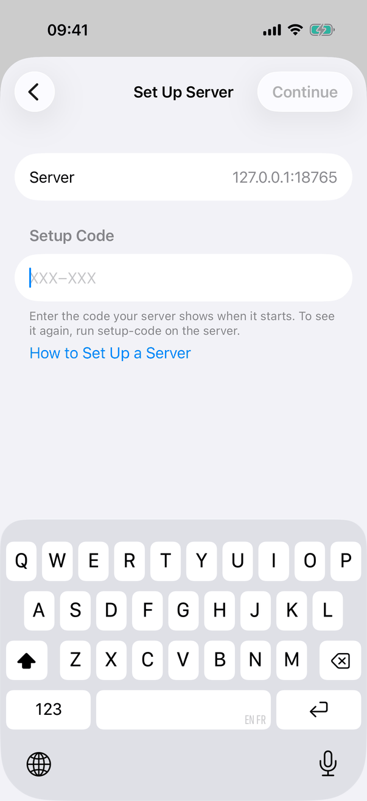 |
| Set Up Server, a short code and the field error | 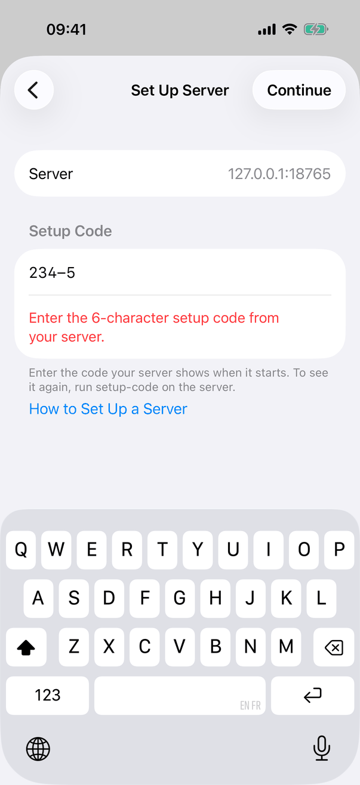 |
| Choose a Master Password, two empty secure fields and Show Password | 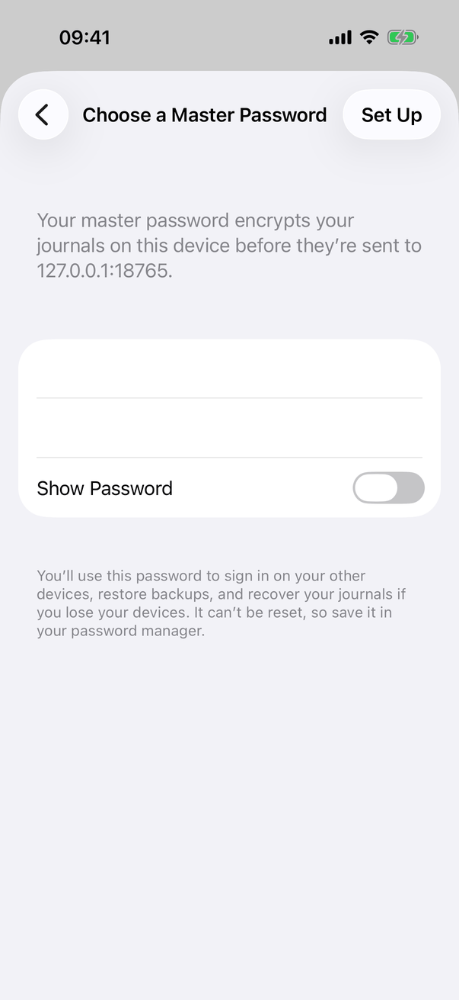 |
| Server Is Ready with Add Another Device… and the footer | 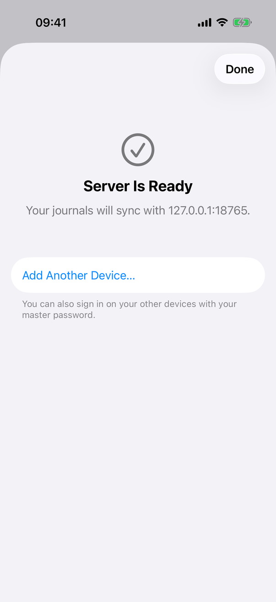 |
| Add This Device, a pairing code waiting for approval (Cancel in place of Back) | 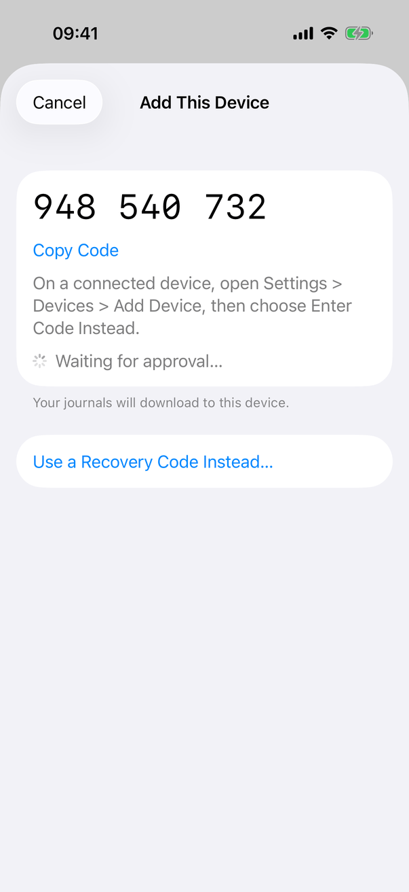 |

iPad (form sheet):

| State | Capture |
| --- | --- |
| Set Up Server | 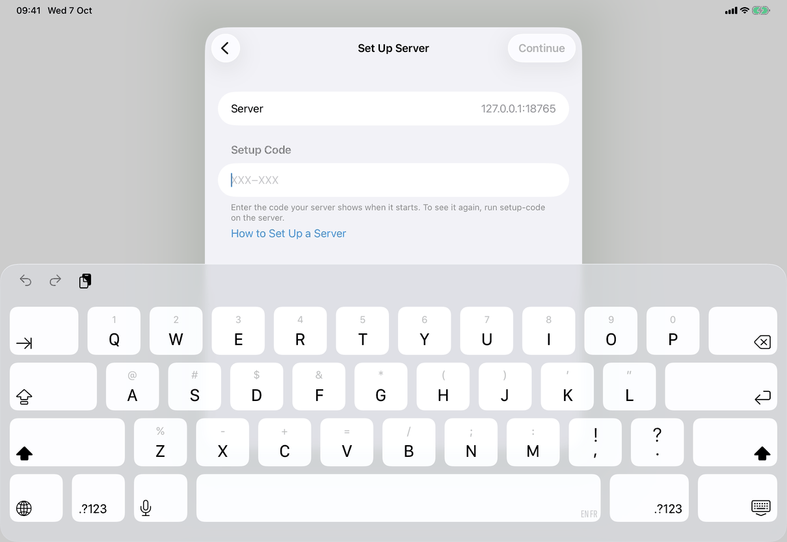 |
| Set Up Server, short code error | 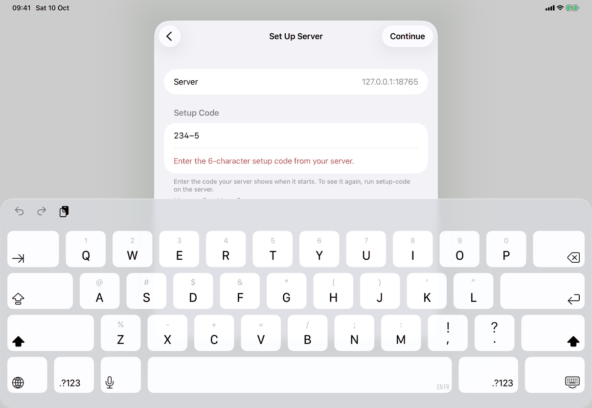 |
| Choose a Master Password | 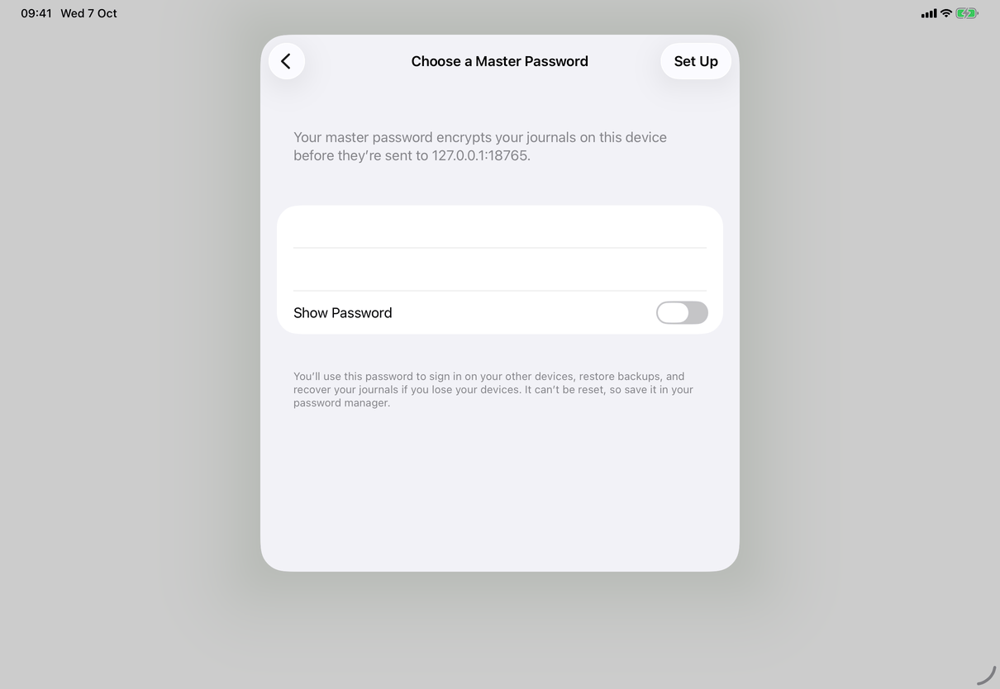 |
| Server Is Ready | 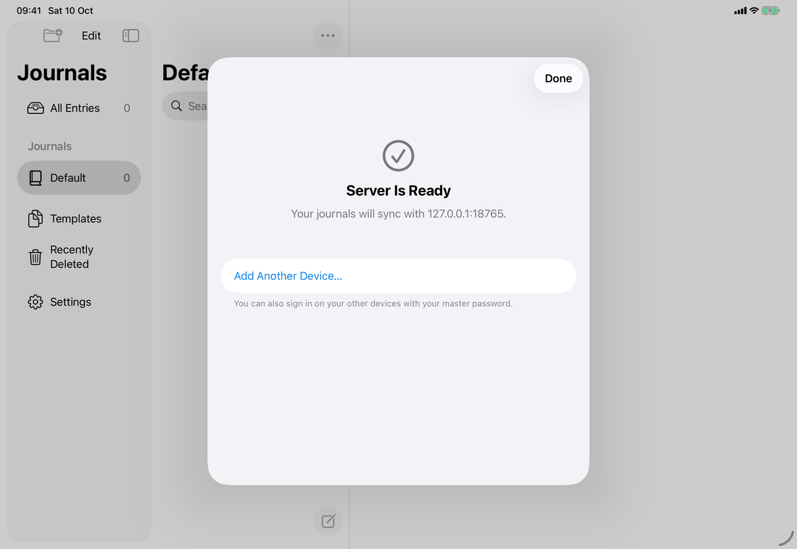 |
| Add This Device | 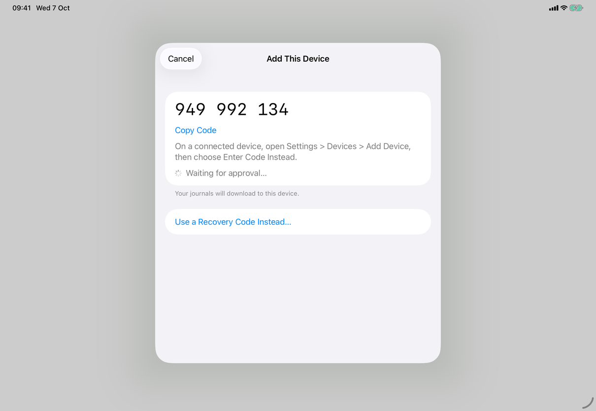 |
| Enter Master Password (sign in), Use a Connected Device Instead… | 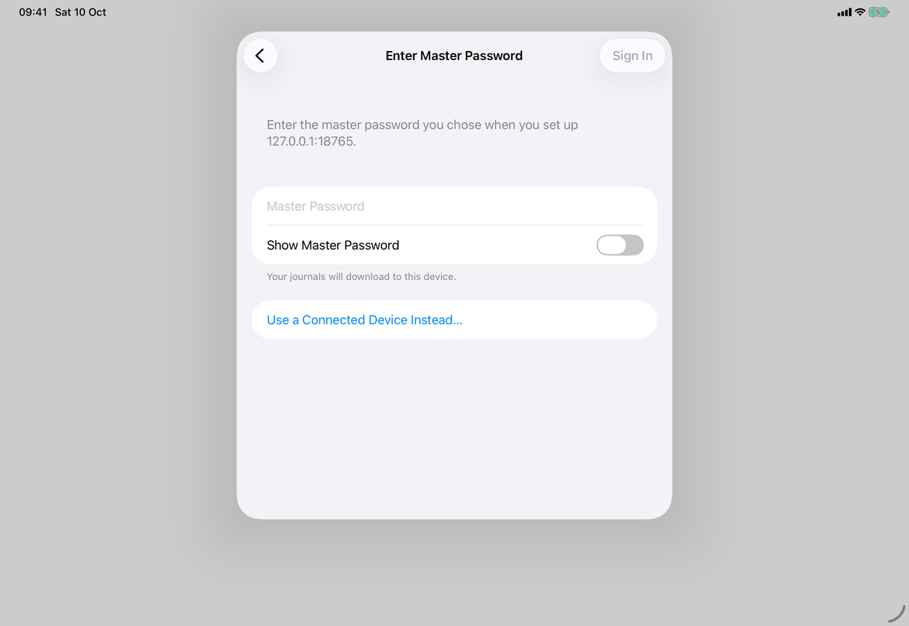 |
| Enter Master Password with the field error "That password isn’t correct." | 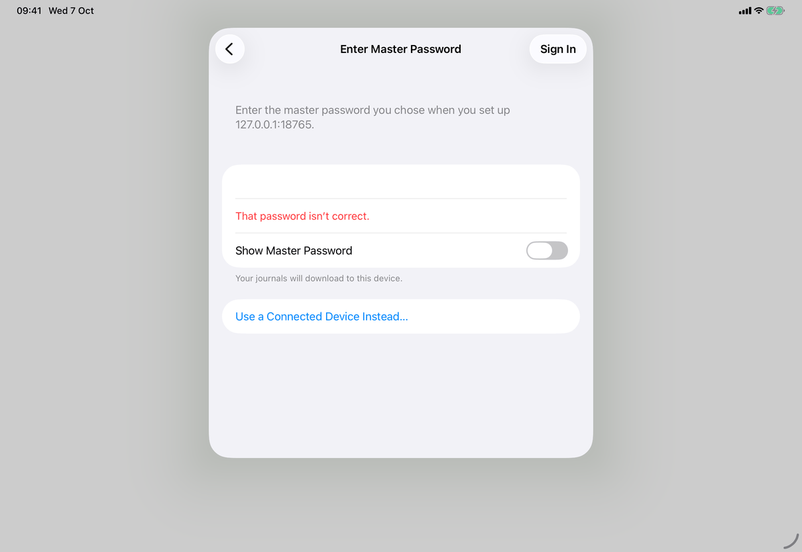 |

- 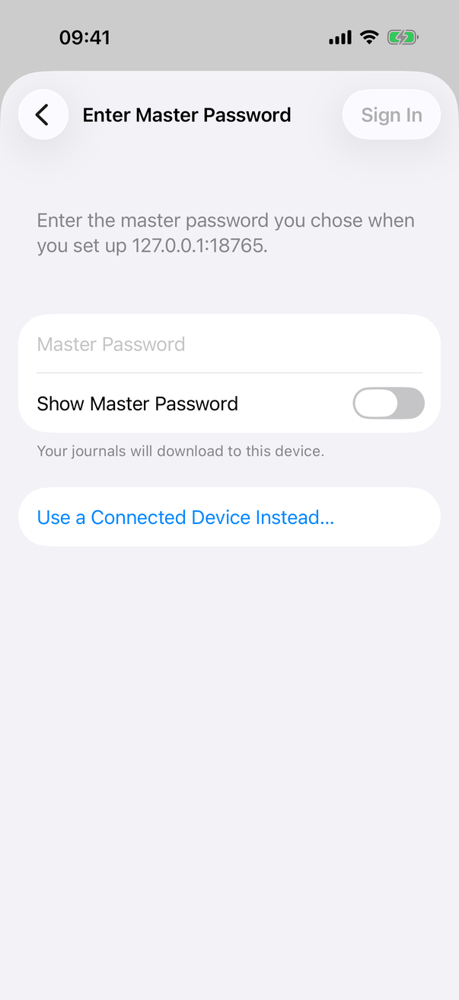 iPhone: Enter Master Password, signing in to a server that already holds journals.

- 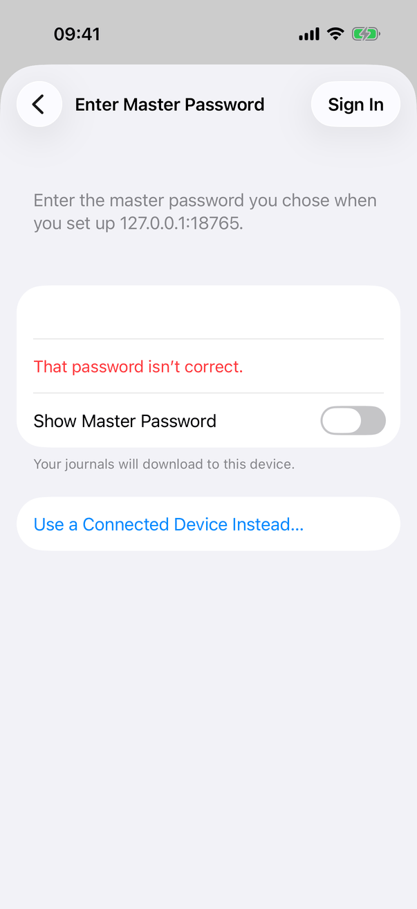 iPhone: the wrong password on sign in, with the footer that says the journals download to this device.

## Source files

View:
- `apps/apple/JournalApp/Views/ConnectionView.swift`: the sheet, page 1, nearby servers, the scanner presentation, `connectionStatus` and `announceForAccessibility`.
- `apps/apple/JournalApp/Views/ConnectionSteps.swift`: every pushed step, toolbar rules, fields, code displays.
- `apps/apple/JournalApp/Views/MergeJournalsView.swift`: Merge Journals content and summary.
- `apps/apple/JournalApp/Views/SaveFailureNotice.swift`: the Mac connection pause notice.

Model:
- `apps/apple/JournalApp/Model/ConnectionFlow.swift`: steps, pairing polling, errors, focus, announcements, leaving and cancelling.
- `apps/apple/JournalApp/Model/ServerJoining.swift`: initialising a server, recovering, installing a vault, merge plan, staged copies, `JoinPhase`.
- `apps/apple/JournalApp/Model/ServerEnvelopeCheck.swift`: refuses a server set up without encryption (recovery format 3 or 4) for every device, with `messages.connection.encryptionOff`, before anything is sent.
- `apps/apple/JournalApp/Model/ServerBrowser.swift`: Bonjour discovery and `ServerAddress.host`.

Core:
- `apps/apple/Packages/JournalCore/Sources/JournalCore/CodeEntry.swift`: setup and pairing code formatting and checks.

Design records: [connection-onboarding.md](../../../../docs/design/connection-onboarding.md), [effortless-connection.md](../../../../docs/design/effortless-connection.md), [join-with-local-journals.md](../../../../docs/design/join-with-local-journals.md), [sync-health-and-recovery.md](../../../../docs/design/sync-health-and-recovery.md), [sync-security-2026-09-24.md](../../../../docs/design/sync-security-2026-09-24.md).

## Open questions

See [open-questions.md](../../../open-questions.md), A46. The page is `draft` because no capture exists for the Mac or for page 1, Merge Journals, Check Code and Finish. Found while writing: the spec says the heading row appears on "each step" of a Mac sheet before macOS 26, but page 1 has none (A46).
