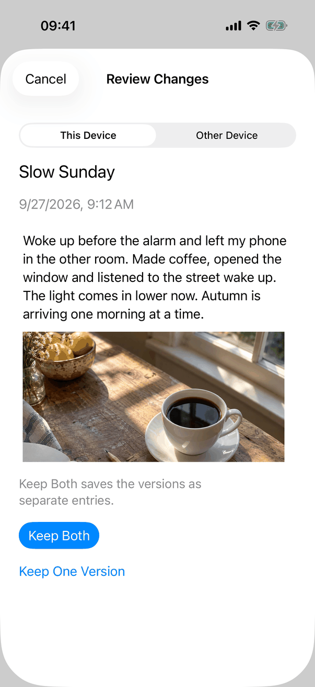
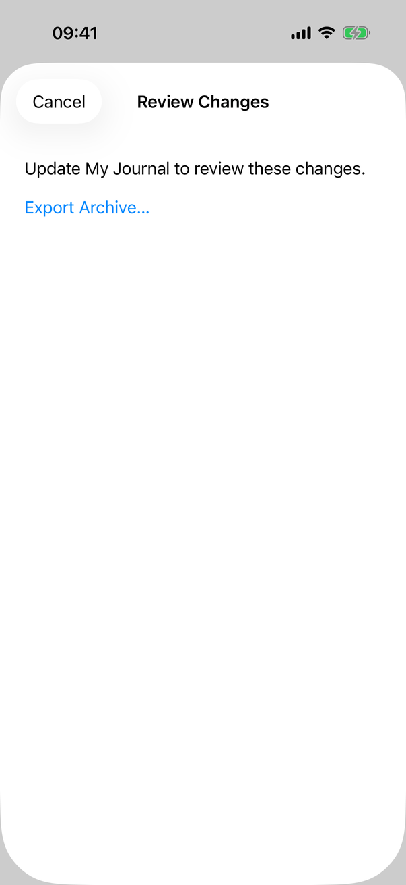
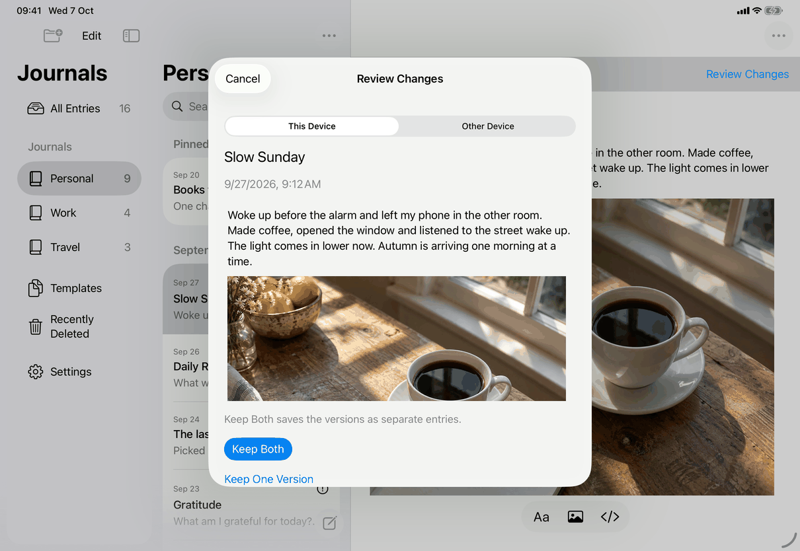
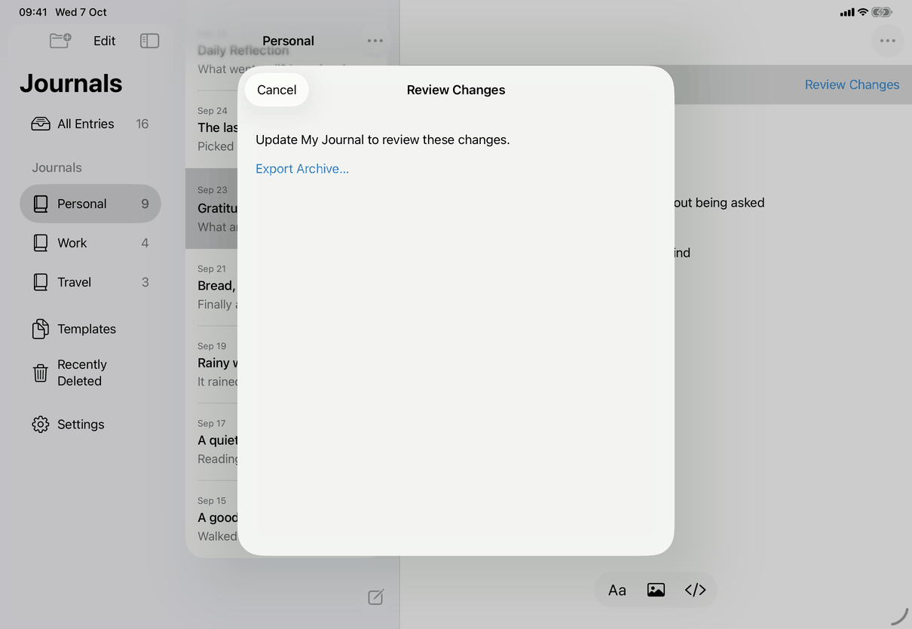
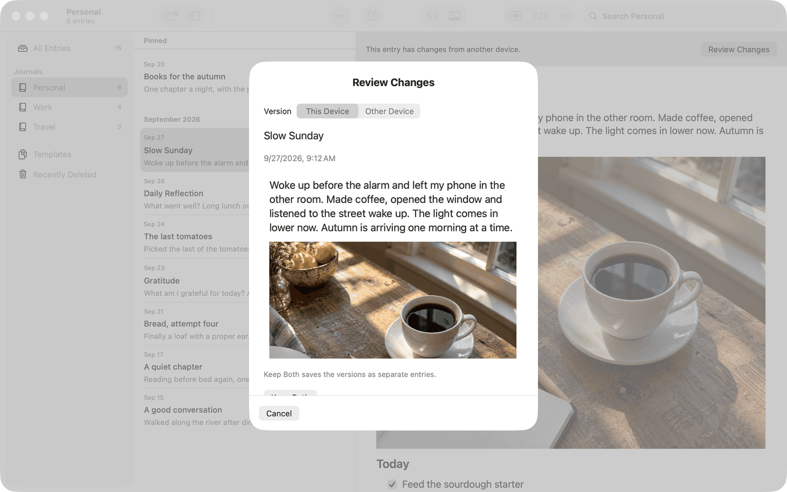

# Review Changes (entry or template) (Apple)

Implements [screens/entry-conflict.md](../../../screens/entry-conflict.md): the form of the Review Changes sheet for an entry or template whose two versions are both readable. How the sheet is reached and how it picks this form is in [conflict-review.md](conflict-review.md); the steps and outcomes are in [flows/resolve-conflict.md](../flows/resolve-conflict.md). Sheet conventions: [platform.md](../platform.md#9-sheets-popovers-and-notices).

The view is `EntryConflictReview` (`Views/EntryConflictReview.swift`), created by `ConflictReview` with the record id. It reads the live conflict with `model.conflicts.first { $0.id == id }` on every render, holds a snapshot of it in the `ResolutionRequest` of the choice being made, and resolves through `JournalStore.resolve(_:choice:)` (`ConflictChoice.keepBoth`, `.local`, `.remote`).

## Controls

Order of the spec's Content section. The whole form is the content of `DeletionSheet(title:busy:completed:)`, so it has the sheet's title (`common.reviewChanges`), the scrolling `VStack` (24 pt padding, 18 pt spacing) and the Cancel/Done button (`common.cancel`, `common.done` once `committed || conflict == nil`).

1. **Status** (`Text`, secondary, `.accessibilityFocused`, scroll id review-status): `reviewStatus` is `messages.conflict.status.refreshFailed` while a refresh is needed and not running, otherwise `error`, which is `messages.conflict.status.updated` or the text of a save error (`error.shown(.saving)`). It is not shown once `committed`.
2. **Version choice**: `versionPicker`. A segmented `Picker` titled `common.version` with `common.thisDevice` (`false`) and `messages.conflict.version.otherDevice` (`true`) bound to `showRemote`; accessibility identifier conflict-version (a test hook). When `dynamicTypeSize.isAccessibilitySize` it is instead a `Menu` whose label is the chosen value and a `chevron.up.chevron.down` image, containing the same `Picker`; `.accessibilityLabel(common.version)` and the value. Disabled while `busy`.
3. **Title, last change, placement**: `Text(item.displayTitle)` in `.title2`, `Text(item.modifiedAt, format: .dateTime)` (secondary), and `ConflictPlacement.line(for:other:journals:)` when the versions differ in place or day. The line is composed in code from the same phrases as the `messages.conflict.placement.*` keys ("In {journal}", "In Recently Deleted", "In Templates", "Archived in {journal}", "Dated {date}", with ", dated {date}" appended when both differ) with the first letter capitalised; journal names come from every journal in `model.items`, deleted ones included, "Untitled Journal" when blank, "Templates" for a template. "Differs" is: other journal, deleted on one side only, archived on one side only (place), or not the same calendar day (date).
4. **Preview**: `NativeEditor(document: .constant(item.document), editable: false, ...)` with `.frame(height: 300)`, `.id(showRemote)` (a new editor on every switch) and `.accessibilityHint` `messages.conflict.version.hintThisDevice` or `.hintOtherDevice`. `NativeEditor` is the app's editor: `NSTextView` in an `NSScrollView` on the Mac, a `UITextView` wrapped by `JournalWritingView` on iPhone and iPad; here it is read-only with the full formatting, tasks, tables and images. Images come from `DocumentImageLoader` (`@StateObject imageLoader`), reloaded by `.task(id: imageRequest)` for the shown version and cleared on cancel, lock and disappear. The font size is `@ScaledMetric(relativeTo: .body)` from 17.
5. **Keep Both note**: `Text` `.callout`, secondary: `messages.conflict.keepBothNote.entries` or `.templates` plus, from `ConflictPlacement.keepBothOutcome`, `messages.conflict.keepBothOutcome.placeAndDate`, `.place` or `.date`.
6. **Keep Both**: `Button` `.borderedProminent`, `.disabled(busy)`.
7. **Keep One Version**: `Menu` (`messages.conflict.keepOne`) with two `Button`s, `messages.conflict.keepThisDevice` and `messages.conflict.keepOtherDevice`, each setting `confirmation`. The confirmation is `.confirmationDialog` (title `messages.conflict.keepOne.title`, default title visibility), one `Button` `messages.conflict.keepVersion`, and a message made by `keepOneMessage`: for Other Device, `ConflictPlacement.outcome(keepingRemote:local:journals:)` (the `messages.conflict.outcome.entry.*` or `.template.*` sentence, built in code: "The entry will move to {journal}.", "... be archived in ...", "... move to Recently Deleted.", "The entry’s date will change to {date}." and the combined forms) followed by `messages.conflict.keepOne.history`; for This Device only `messages.conflict.keepOne.history`. No Cancel button is declared; the system supplies the way to cancel (not verified on the Mac).
8. **Progress**: `ProgressView` labelled `messages.conflict.updatingChanges` while `needsRefresh`, else `messages.conflict.savingChanges`.

States (all in the same scroll content, replacing items 2 to 7):

- **Committed** (`committed`): `messages.conflict.committedNotReloaded` and `common.tryAgain` (`reload()` only reads again; never repeats the choice).
- **Needs refresh** (`needsRefresh`): only the status and `common.tryAgain`.
- **Resolved or gone** (`conflict == nil`): `messages.conflict.resolved`, also the status element and accessibility-focused; the close button reads Done.
- **Locked or library replaced**: `onValueChange` of `model.locked` and `model.replacingVault` cancels the running `Task` and calls `dismiss()`; `messages.conflict.locked` only appears if `ConflictReview` renders while locked.

Model feeding it: `AppModel.conflicts`, `AppModel.finishPendingSave()` (the save before resolving), `AppModel.refresh(forSession:)`, `model.selectedID` and `model.draft` (the entry reopens as stored), `model.vaultSessionID` (every async step checks that the store, session, lock and replacement state are unchanged through `valid(_:session:)`).

Behaviour worth knowing before porting:

- **Resolve** (`resolve`): ignored while busy, committed, refreshing, or when the live conflict differs from the one the choice was made on. It calls `finishPendingSave()` and, if that returns false, shows `messages.save.before.resolveEntryConflict` and changes nothing. It then calls `store.resolve`; `committed = true` is set before the refresh, so a later failure can only offer a reload. The store refuses a stale choice with `JournalError.conflict` (it compares both stored versions and the remote revision inside one transaction); the view then runs `refreshReview`.
- **Refresh** (`refreshReview`): sets `needsRefresh`, clears the confirmation and the images, shows This Device, calls `model.refresh`, and re-points the open draft at the stored entry if it was unchanged. On success the status becomes `messages.conflict.status.updated` (or nothing if the conflict is gone); `refreshGeneration` increases, which scrolls to the status and moves VoiceOver focus to it. On failure `needsRefresh` stays on.
- **After a commit** (`refreshAfterCommit`): refreshes while the entry is still open, because closing it first would close the review and stop the refresh; then selects the resolved entry if nothing else is open, remembers the selection and dismisses.
- **A change while open** (`onValueChange(of: conflict)`): closes any confirmation, shows This Device and sets the updated status (unless a commit already happened).
- **What Keep Both stores**: the record keeps this device's version; the other version is inserted as a new record with a new id and the current time as its modification time, and both are queued for sync; both originals are written to history in the same transaction (`JournalStore.resolve`).

## Layout

- **iPhone (compact width)**: a full-height `.sheet`; `NavigationStack` with inline title and Cancel/Done in `.cancellationAction`. Content is a single scrolling column; with the preview at 300 pt the Keep Both note and buttons may sit below the fold on small screens. At accessibility sizes the title is repeated as a heading in the content and the version control is the menu.
- **iPad (regular width)**: the same `.sheet` as the system's centered card, no detents; Cancel/Done in the bar. Content width is larger, so the preview wraps less.
- **Mac**: `DeletionSheet` builds its own chrome: centered `.title2.bold()` title, the scroll content, a `Divider`, and a footer with Cancel/Done at the leading edge; frame 360 to 480 wide ideal, 400 to 600 high ideal. In the 1280 by 800 capture the Keep Both button is just below the fold, so people scroll to reach it.
- Dynamic Type: text wraps (`fixedSize(horizontal: false, vertical: true)`); the version control becomes a menu at accessibility sizes; the preview stays 300 pt tall and scrolls inside.

## Commands and shortcuts

| Command | Placement | Shortcut | Enabled when |
| --- | --- | --- | --- |
| `review-changes` | Opens this sheet; as in [commands.md](../commands.md) | None | Unlocked |
| `export-archive` | Export Archive… in the unsupported state shown in the iPhone and iPad captures | None | Not while an export is preparing |

Keep Both, Keep One Version, Try Again and Cancel/Done have no command ids. Keyboard: Cancel/Done is `.keyboardShortcut(.cancelAction)` (Escape on the Mac and a hardware keyboard); the confirmation dialog uses the system's default and cancel keys; there is no shortcut for Keep Both, so Tab or Full Keyboard Access reaches the buttons in view order (status, version control, preview, Keep Both, Keep One Version).

## Copy differences

None. The `mac` variants do not apply to this page. The only text of this screen that is not a single copy key is the composed placement line and outcome sentences (see Controls), which a port may compose from the `messages.conflict.placement.*` and `messages.conflict.outcome.*` keys instead.

## Accessibility

- The version control reads `common.version` and its value; the preview's hint names the shown version. The preview is a text view; the title and date are plain text above it.
- After a refresh VoiceOver focus goes to the status (`@AccessibilityFocusState`). On an explicit refresh failure the status shows `messages.conflict.status.refreshFailed`.
- The resolved text is also focus-targeted, so VoiceOver reads it when the conflict disappears.
- No success announcement: the sheet closing and the entry opening are the feedback.
- At accessibility sizes the menu replaces the segmented control and the sheet title is repeated as a heading (iOS).
- The page sets no Reduce Motion, Reduce Transparency or Increase Contrast behaviour of its own; it uses system controls and the system sheet.

## Differences between iPhone, iPad and Mac

- The Mac shows the label `common.version` beside the segmented control; on iPhone and iPad the control has no visible label (a `Picker` with `.segmented` hides its title on iOS; same control and accessibility label).
- Sheet chrome differs: bar with Cancel on iPhone and iPad; hand-built title, divider and footer on the Mac, because a Mac sheet has no navigation bar.
- The sheet has a minimum and ideal size on the Mac only; on iPhone and iPad the system decides.
- The preview editor is an `NSTextView` on the Mac and a `UITextView` on iPhone and iPad (platform text engines); content and height are the same.
- Escape closes the sheet on the Mac and with a hardware keyboard; touch devices swipe down (disabled while `busy`).

## Screenshots

Captured from the sample library (the entry Slow Sunday with a version from another device). The captures show the sheet over the three-column window on iPad and the Mac, and alone on iPhone. The iPhone and iPad "other device" captures are the same images as the ones in [flows/resolve-conflict.md](../flows/resolve-conflict.md) (the flow's default state). The Mac sheet is captured only for This Device; the other states are the same code. The refresh, committed and resolved states are not captured.

| Device | Image | State |
| --- | --- | --- |
| iPhone |  | This Device: segmented control, title, date, preview with image, Keep Both note, Keep Both, Keep One Version |
| iPhone |  | Other Device: shorter text with a checklist; same footer controls |
| iPhone |  | A version from a newer app: `messages.conflict.updateToReview` and Export Archive… |
| iPad |  | Centered card sheet over the dimmed window; Keep One Version at the edge of the card |
| iPad |  | Other Device selected |
| iPad |  | Unsupported state |
| Mac |  | Sheet with a centered title, the labelled segmented control, preview, note and Cancel in the footer; Keep Both is cut off by the footer and reached by scrolling |

## Source files

View:

- `Views/EntryConflictReview.swift`: the form, the resolve and refresh logic, `ConflictPlacement`.
- `Views/ConflictRouting.swift`: chooses this form (`ConflictReview`).
- `Views/PermanentDeletionView.swift`: `DeletionSheet`, the sheet chrome for every platform.
- `Views/SettingsView.swift`: `ConflictNotice` (the entry point).
- `Editor/NativeEditor.swift`: the read-only preview.

Model:

- `Model/AppModel.swift` (`conflicts`, `finishPendingSave`, `refresh`), `Model/DocumentImageLoader.swift` (preview images).

Core:

- `JournalCore/Store.swift`: `resolve`, `ConflictVersion`, `ConflictChoice`. `JournalCore/SyncReconciliation.swift`: where a conflict is recorded.
- Test: `JournalTests/StaleDraftTests.swift` (when typing over an unseen change makes a conflict).

Design records: [entry-conflict-accessibility.md](../../../../docs/design/entry-conflict-accessibility.md), [stale-conflict-recovery.md](../../../../docs/design/stale-conflict-recovery.md), [journal-conflicts.md](../../../../docs/design/journal-conflicts.md).

## Open questions

See [open-questions.md](../../../open-questions.md). Nothing new found for this page.
