# Entry editor (Apple)

How the Apple apps implement the spec's [entry-editor](../../../screens/entry-editor.md). This is the most platform-specific screen: the body is a native text view, `UITextView` on iPhone and iPad and `NSTextView` on the Mac, not a web view or a SwiftUI `TextEditor`. Both are laid out with TextKit 1 through one shared `NSLayoutManager` subclass (`ListLayoutManager`), and one coordinator class per platform (`NativeEditor.Coordinator`) turns edits into the Markdown document model; a porter reads the behaviour from [editing-rules](../../../flows/editing-rules.md) and this page, not from the two coordinators side by side. Shared conventions (sheets, menus, text input, accessibility) are in [platform.md](../platform.md).

What is shared and what is not:

- Shared (one file, `#if os(...)` inside): the document-to-text rendering (`RichText`), block drawing (`BlockDecorations`, `ListLayout`), formatting state (`FormattingState`), checkbox placement (`InlineTasks`), tables (`InlineTables`), images (`ImagePresentation`), the Format panel's contents (`FormattingPopover`), `EditorActions` (the object the toolbar, menus and sheets use to reach the text view), and `RootView` (the screen).
- Per platform: the text view subclass `JournalTextView` and the representable `NativeEditor` (both in `NativeEditor.swift` and `NativeTextView.swift`), the title field (`EntryTitleEditor.swift`: a wrapping `UITextView` or an `NSTextField`), the writing controls (iPhone and iPad capsule bars against the Mac toolbar), the table grids, the picture menus, and where the notices sit.

## Controls

The screen is `RootView.detailContent` (the detail column). It builds a `VStack` capped at `frame(maxWidth: 760)` and centred, with `Self.editorMargin` of 24 pt at each side of the body (the title and body text start together, inset by the text container's own 4 + 5 pt on the Mac and 5 pt on iOS). The item is `model.draft` (`AppModel`); the text is bound to `model.draft.document` and the title to `model.draft.title`; `model.canEdit` decides whether anything is editable.

| Spec element | iPhone and iPad | Mac |
| --- | --- | --- |
| Notices above the writing | `ConflictNotice` (`messages.conflict.entryNotice`, `common.reviewChanges`; defined in `SettingsView.swift`) above the editor, outside the scrolling text so it stays in view | In order: `ConnectionPauseNotice` (writing-paused, from `RootView.detail`, wraps `EncryptionPauseNotice` and the connection notice), `EntryRecoveryNotice` (a ViewThatFits that scrolls at accessibility sizes, at most half the height), `ConflictNotice` |
| Header | `EntryHeaderView`, a SwiftUI view hosted by `UIHostingConfiguration` as a subview of the text view (`JournalWritingView`); it scrolls with the body because the text view's top `textContainerInset` is the header's height plus 8 pt | Not a header: the title and `EntryEditingNote` sit in a `VStack` above the scroll view, with 28 pt above and 12 pt below |
| Save-failure notice | First in the header, `SaveFailureNotice`; when a failure appears, the text view scrolls to the top once (`revealSaveFailure`) so the notice is seen, until the person scrolls or types | After the editor, below the body |
| Recovery notice | In the header, after the save-failure notice, with a `.quaternary` fill (`EntryRecoveryNotice`) | Above the title (see first row) |
| Title | `EntryTitleEditor`: a `UITextView` (`TitleTextView`), `.title1` preferred font in bold, scroll disabled, `returnKeyType = .next`, placeholder drawn by the view as a `UILabel` (`editor.title.placeholder`), grows to its content. Read-only: a selectable `Text` in `.title.bold()` (placeholder in tertiary colour) | `EntryTitleEditor`: an `NSTextField` with no border or focus ring, bold at the `.title1` point size, `wraps` and `maximumNumberOfLines = 0`; read-only: `.disabled(!model.canEdit)`. Its `action` (Return) calls the body's focus |
| Editing note | `EntryEditingNote` under the title, `.secondary`: `messages.error.unsupportedFormat` or `messages.unavailable.markdownSource` | Same view, below the title field |
| Image import notice | `ImageImportNotice` between the notices and the editor, with a `ProgressView`, "Adding Image…" or "Adding Images… n of m" (`editor.imageImport.adding`, `editor.imageImport.addingSeveral`) and Stop (`editor.imageImport.stop`); `.quaternary` fill; fades in unless Reduce Motion | Same view in the same place |
| Body | The `UITextView` inside `JournalWritingView`; accessibility label "Entry text" (`editor.body.accessibilityLabel`) | The `NSTextView` (`JournalTextView`) in an `EntryScrollView` (`NSScrollView`); the same label on the view |
| Empty-body placeholder | `PlaceholderTextView` (a non-interactive `UITextView` drawn over the body, laid out with the body's own font and paragraph style); with a template to offer, "Start writing or " plus the symbol `doc.on.doc` and the underlined words, and a transparent `TemplateSuggestionView` button 44 pt tall over the link (VoiceOver label `library.templateChooser.useTemplate`) | `PlaceholderTextView` (`NSTextView`) and an `NSHostingView` button over the link's glyphs; with Keyboard Navigation on, Tab goes title, link, body |
| Template chooser | Popover when `horizontalSizeClass == .regular` (iPad), a sheet with `[.medium, .large]` detents otherwise; opens and closes without animation | `ToolbarPopover` (an `NSPopover`), search field first |
| Writing controls | The bar, below | The window toolbar, below |

The bar (iPhone and iPad): `ReadingBar`, a floating capsule (iOS 26: `glassEffect(.regular, in: Capsule())`; earlier: `.bar` material) holding Formatting (`textformat`, shown selected while Formatting is open), Insert Image (`photo`, a `Menu` of Photo Library, Take Photo when `CameraPicker.isAvailable`, and Choose File…: `editor.insertImage.photoLibrary`, `editor.insertImage.takePhoto`, `editor.insertImage.chooseFile`) and View Source or View Preview. Icon-only (`.labelStyle(.iconOnly)`), 44 pt minimum targets. While reading it is a `safeAreaInset(edge: .bottom)` of the detail view and is removed while the title, body or a table cell has focus; while writing the same view is the text view's `inputAccessoryView` (`WritingAccessory`, a `UIInputView` hosting `WritingAccessoryBar`), above the keyboard, or at the bottom of the screen with a hardware keyboard. The accessory spans the keyboard's width but `point(inside:)` accepts touches only inside the capsule, so touches beside it reach the list and sidebar. On iPhone the capsule is at most 600 pt wide with View Source pushed to the far end (`Spacer`); on iPad (`fitsContents`) it is as wide as its three buttons and, while writing, centred on the keyboard, not on the editor column. When the controls do not fit (largest text sizes) `ViewThatFits` makes the capsule a horizontally scrolling row.

The toolbar (Mac): `JournalToolbarController` builds an `NSToolbar`; the editor's section is, in order, New Entry (`square.and.pencil`), Formatting (`NSToolbarItem` with a `PopoverButton`, `textformat`), Insert Image (`photo`), flexible space, Sync Status (only with a connection and only while sync needs the person), Editor Only (`rectangle.center.inset.filled`, a push-on-push-off button), View Source / View Preview, Entry Actions (`NSMenuToolbarItem`, `ellipsis`) and the search field (`NSSearchToolbarItem`). Items are `.iconOnly` with tooltips; Formatting also has an overflow-menu form. Insert Image calls `insertImage(from: .files)`, so on the Mac it always opens the open panel. The toolbar items follow the column dividers (the editor section starts at the list divider).

The navigation bar (iPhone and iPad): `mainToolbar` adds, in `.primaryAction`, Entry Actions (`entryMenu`, an `ellipsis` `Menu` with `.menuIndicator(.hidden)`) and, while `EditorActions.editing` is true, Done (`checkmark`; `common.done` as the accessibility label). Done calls `finishEditing()` and `finishPendingSave()`. iPhone also has the system Back button (stacked navigation); the bar has no title (`navigationTitle("")`).

Entry Actions (`entryActionCatalog`, one list for the toolbar menu and the entry's row context menu): iPhone and iPad prepend Find in Entry (`magnifyingglass`) and a divider and append Sync Status; the Mac does not (Edit ▸ Find is the route). Items and symbols: Pin/Unpin Entry (`pin`, `pin.slash`), Change Date… (`calendar`), Move Entry… (`folder`), Save as Template… (`doc.badge.plus`), Image Descriptions… (`text.below.photo`, only when the entry has images), Version History… (`clock.arrow.circlepath`), then Delete Entry (`trash`, destructive, last). On the Mac `MenuActionTarget` fills an AppKit `NSMenu` from the same `MenuAction` values. Delete Entry moves the entry to Recently Deleted without confirmation and registers an undo on the window's undo manager (`registerDeletionUndo`).

### How blocks look on Apple

The document is rendered into an attributed string where every paragraph carries its block kind (attribute `journalKind`) and no marker characters.

| Block | Implementation |
| --- | --- |
| Paragraph, headings, inline styles | Fonts and paragraph styles in `RichText.attributes`; the font is the system font (semibold for headings, a trait for bold and italic; `RichText.font`). Underline and strikethrough are the system attributes; inline code is the monospaced font with a background fill (`BlockDecorations.codeFill`). |
| Bullet and number | `ListLayoutManager` draws "•" or "n." in the item's list column from the paragraph's head indent; the text holds only what the person wrote. |
| Checkbox | Separate views positioned from the layout (`InlineTasks`), only for items on screen and one screen beyond: Mac, a native `NSButton` checkbox (`controlSize` small below 14 pt, regular, large above 20 pt, `refusesFirstResponder = true`); iPhone and iPad, `ChecklistBox`, a `UIButton` drawing `square` or `checkmark.square.fill` (white mark on the tint colour) from the item's font, with a touch area at least 44 pt tall that is split halfway towards a neighbouring box and never covers the item's text. Read-only entries disable them (grey on iOS). |
| Block quote | The paragraph is indented by `BlockDecorations.quoteIndent` (18 pt); a 3 pt bar in `tertiaryLabel` is drawn behind it. |
| Code block, raw HTML | Monospaced; `BlockDecorations` draws a rounded fill behind it (colour: `quaternaryLabelColor` on the Mac, `tertiarySystemFill` on iOS), 6 pt above and below, inset 10 pt. |
| Horizontal rule | A hidden character on its own line; `BlockDecorations` draws a hairline in `separator` colour. The caret skips the hidden character (`HiddenMarkers`). |
| Table | A single `NSTextAttachment` of the table's height holds the place; `InlineTables` overlays a grid view on it: iPhone and iPad `UIScrollView` (`InlineTableGrid`) of one `UITextView` per cell, scrolling sideways when the columns do not fit; Mac `NSScrollView` of `NSTextView` cells. Cell padding is 10 x 10 with 44 pt minimum rows on iOS and 8 x 6 on the Mac (`TablePresentation`). Cells share the entry's undo manager. The table commands are specified in [edit-table](../../../flows/edit-table.md). |
| Image on its own line | An `NSTextAttachment` with the picture decoded at the displayed pixel size (`ImageThumbnails`), at most the text width; an attachment cell on the Mac, an `image` and `bounds` on iOS. Inline images are capped at 120 x 80 pt (`RichText.inlineImage`). |
| Image not loaded | The same attachment kind with a drawn status line ("Loading Image…", "Image unavailable", "Remote image"), swapped for the picture in place when it arrives (`ImagePresentation.update`). |
| Link | The system `.link` attribute (underlined, link colour); links the app does not open carry `journalInertLink` and are drawn as plain text. |

Image import, the picture menus and descriptions: Mac right-click menu on a picture (Cut, Copy, Paste, Share, Save Image As, Image Descriptions, Delete; `ImageActionsMac.swift`), iPhone and iPad long press on a picture (`UITextItem` menu on iOS 17 and later: Copy, Share…, Save to Photos, Image Descriptions…, Delete; `ImageActionsIOS.swift`) and the same actions as VoiceOver custom actions on the picture's accessibility element. See [flows/image-actions](../../../flows/image-actions.md) and [image-description](image-description.md).

### States, and which view shows each

| State | View |
| --- | --- |
| Nothing selected | `Text("Select an Entry")`, `.secondary`, in the `else` branch of `detailContent` (`library.window.selectEntry`); blank when the list is empty, except a Mac window in Editor Only, which shows the empty-list state (`showsEmptyListInEditor`) |
| Empty body | The placeholder rows above |
| Reading, writing | `EditorActions.editing` (set by the title, the body or a table cell as it gains or loses focus) switches the bar, shows Done on iOS, and on every platform enables the Format menu |
| Saving, save failed | Saving is silent. Failure: the window's error alert (`RootView`'s `model.error` alert with Try Again and OK; `common.saveFailed`) and then `SaveFailureNotice` (`messages.save.notSaved` in red, Try Again, "Saving…" progress) |
| Conflict | `ConflictNotice`: a callout and a button side by side (`HStackLayout`), stacked at accessibility text sizes (`VStackLayout`); Review Changes flushes the entry, refreshes, then opens the conflict review sheet |
| Read-only (newer format, deleted, journal unavailable) | `model.canEdit` false: text view `isEditable = false`, title static (iPhone, iPad) or disabled (Mac), controls dimmed, checkboxes disabled; the explanation is `EntryEditingNote` or `EntryRecoveryNotice` |
| Source only | `EntryEditingNote` plus source view, see [source-view](../flows/source-view.md) |
| Recently Deleted, journal unavailable | `EntryRecoveryNotice` with its Restore, Restore and Move… and Try Syncing Again buttons |
| Writing paused | `ConnectionPauseNotice` (Mac only; the notice appears after a one second delay for `connecting`) |
| Images loading | Placeholder attachments, above |
| Locked | `RootView` shows `UnlockView` instead of the window; `closePresentations` closes the link sheet, Formatting and the sheets the editor opened |

Model: `AppModel` (selection, `draft`, `updateDraft`, autosave through `flush`, `canEdit`, `conflicts`, `saveFailure`, `textSize`) with extensions for navigation and deletion; the persistence is the store in JournalCore, reached only through `AppModel`.

## Layout

- Container: iPhone is a `NavigationStack` (stacked navigation), with the editor pushed as the last route. iPad in regular width is a three-column `NavigationSplitView` (`.balanced`; sidebar 180 to 320 pt, list 240 to 420 pt) with the editor as the detail column. `usesStackedNavigation` is `horizontalSizeClass == .compact || dynamicTypeSize.isAccessibilitySize`, so an iPad in Slide Over, narrow Split View, or at an accessibility text size also uses the stacked layout and the Format panel. The Mac is an AppKit `NSSplitViewController` (`JournalSplitViewController`: sidebar 210 to 320 pt, list 360 to 460 pt, detail at least 439 pt) in a SwiftUI shell; Editor Only collapses the first two columns.
- Text column: at most 760 pt wide, centred, on every device, with 24 pt side margins.
- iPhone and iPad: one scroll view (the text view) holds the header and the body; the capsule floats over its bottom, and the text view's bottom `contentInset` equals the part of the entry the capsule or keyboard covers, so the line being typed stays above the controls (`updateWritingInset`, `SelectionReveal.swift`). A rotation or a resize that replaces the editor mid-sentence continues writing at the same place when it happens within a second and the same visit to the entry (`interruptedWriting`).
- Mac: the title is outside the scroll view; the `NSScrollView` has a bottom content inset of two lines of body text, never more than a quarter of its height (`EntryScrollView.typingRoom`), so the end of a long entry can scroll up into it. The find bar takes its own room above the text.
- Text size: Mac `model.textSize`, 12 to 30 pt in 1 pt steps, default 16 (View ▸ Zoom In, Zoom Out, Actual Size). iPhone and iPad: `@ScaledMetric(relativeTo: .body)` 17 pt multiplied by `textSize / 16`, so Dynamic Type and the same Zoom steps combine. The editor sets `adjustsFontForContentSizeCategory`; the Mac ignores Dynamic Type.
- At accessibility text sizes: notices stack vertically; the capsule scrolls; Formatting becomes a panel; the tablet uses stacked navigation (above).

## Commands and shortcuts

Placement and shortcuts are in [commands.md](../commands.md); this page adds what the code does differently or only here.

| Command | Placement | Shortcut | Enabled when |
| --- | --- | --- | --- |
| `entry-actions` | Mac toolbar menu; iPhone and iPad navigation bar menu | None | An entry or template is open (not a journal) |
| `find-in-entry`, `find` | Mac: Edit ▸ Find, a find bar above the text (`usesFindBar`, `isIncrementalSearchingEnabled`); iPhone and iPad: first item of Entry Actions and the system find navigator (`isFindInteractionEnabled`, `presentFindNavigator`) | ⌘F | Always while an entry is open |
| `finish-editing` | iPhone and iPad navigation bar, trailing, a checkmark | None | `EditorActions.editing` is true |
| `show-formatting`, `close-formatting`, `format-*` | See [format-sheet](format-sheet.md) | As in commands.md | Entry editable |
| `insert-link` | See [link-editor](link-editor.md) | ⌘K | Body or a cell focused |
| `insert-image`, `insert-image-choose-file`, `insert-image-photo-library`, `insert-image-take-photo` | Mac toolbar (open panel); iPhone and iPad bar menu | None | Entry editable; camera only with `CameraPicker.isAvailable` |
| `toggle-checkbox` | A click or tap on the box | None; Mark as Checked is the keyboard route | Entry editable |
| `view-source` | See [source-view](../flows/source-view.md) | ⌥⌘U | Entry editable |
| `undo`, `redo`, `edit-text`, `paste-and-match-style` | Edit menu; iPad keyboard shortcut bar keeps undo, redo and paste (`WritingAccessory.hideSystemFormatting` removes only the system B, I, U group) | ⌘Z, ⇧⌘Z, ⌘X, ⌘C, ⌘V, ⌥⇧⌘V | Text view first responder; 100 undo levels (`limitUndo`) |
| `zoom-in`, `zoom-out`, `actual-size` | View menu (Mac, and iPad with a keyboard) | ⌘+ (also ⌘=), ⌘-, ⌘0 | Actual Size when the size is not already the default |
| `show-editor-only`, `previous-entry`, `next-entry` | View menu, Mac only; Editor Only also a toolbar button | ⇧⌘D, ⌥⌘↑, ⌥⌘↓ | The window publishes its `editorOnly` command; Previous and Next need a neighbouring listed entry |
| `use-a-template` | The link in the empty body | None | A template can be offered (`model.templateSuggestion`) |
| `review-changes` | `ConflictNotice` button | None | The entry has a conflict |
| `pin-entry`, `change-date`, `move-entry`, `save-as-template`, `image-descriptions`, `entry-version-history`, `delete-entry`, `delete-permanently`, `restore` | Entry Actions and the row context menu (one `entryActionCatalog`) | None | Per kind: see the spec's Entry Actions list |
| `image-copy`, `image-cut`, `image-paste`, `image-share`, `image-save-to-photos`, `image-save-as`, `image-delete` | Picture menu: right-click (Mac), long press (iPhone, iPad), VoiceOver custom actions | None | A picture is selected; Cut, Paste and Save Image As are Mac only; Save to Photos is iOS only |

Keyboard behaviour:

- Title to body: Return moves focus to the body on every device (Mac: the `NSTextField` action; iOS: the title's delegate swallows the line break). Tab also does it with a hardware keyboard on iPhone and iPad (`text == "\t"` in `EntryTitleEditor`); a title never holds a tab. A pasted multi-line title keeps its line breaks (iOS: the title's `pasteDelegate`; the Mac field wraps).
- New entry: the title takes focus with its text selected (`InitialTitleFocus`; iOS `selectedRange`, Mac `selectText`); on iOS it waits (up to two seconds) while a sheet still covers it.
- With a hardware keyboard on iPhone and iPad, `JournalTextView.keyCommands` adds ⌘B, ⌘I, ⌘U, ⌘K, ⇧⌘X, ⌥⌘0 to ⌥⌘6, ⇧⌘Return (mark as checked), Escape while Formatting is open, and Tab, Shift-Tab and Down Arrow where the structure uses them (list indent, code indent, leaving a code block). All of them yield to an input method's composition. The menu-bar shortcuts of AppCommands (Format, View) work on iPad; whether they work on iPhone with a hardware keyboard is not established ([commands.md](../commands.md)).
- Mac: Keyboard Navigation order is title, "use a template" link, body (`orderKeyViews`); checkboxes never take focus.
- Return, Tab, Backspace and the Markdown shortcuts follow [editing-rules](../../../flows/editing-rules.md).

## Copy differences

None for the spec's keys: no `mac` variant applies to this screen. Two notes: the editor's own strings (placeholders, labels, announcements, undo names, notice texts) are literals in the Swift files, identical to the catalog; and the link strings "Edit Link…", "Remove Link" and "Link removed." are `library.menu.format.insert.editLink`, `library.menu.format.insert.removeLink` and `editor.link.removed` (see [link-editor](link-editor.md)).

## Accessibility

- Title: label "Title" (`editor.title.accessibilityLabel`), identifier "Entry title" for UI tests. Read-only on iOS: the static `Text` is labelled "Title" with the text as its value. Body: label "Entry text".
- VoiceOver order on iPhone and iPad (`JournalWritingView.accessibilityElements`): header, the template link when shown, the text view, the table grids top to bottom, the checkboxes on screen, then one element per picture. The Mac text view exposes its own children (`accessibilityChildren` adds the template link first).
- List items and quotes carry their role as accessibility text attributes on their own text (`ListAccessibility`), never as characters: Mac uses AppKit's list-item prefix and level attributes and a custom text attribute for quotes; iPhone and iPad use one custom text attribute (`accessibilityTextCustom`) holding "Bullet", "n.", "Checkbox, unchecked", "Checkbox, checked" or "Quote".
- Checkboxes: Mac, a native checkbox labelled with the item's text; iPhone and iPad, a `UIButton` labelled with the item's text (`editor.list.emptyChecklistItem` when empty) and the value "Checked" or "Unchecked" (`editor.list.checked`, `editor.list.unchecked`).
- Pictures: iPhone and iPad, `PictureAccessibilityElement` with the image trait, the description as label (or `editor.image.accessibilityLabel`; status text first when not shown), custom actions named as in the picture menu, `accessibilityActivate` doing nothing, and focus scrolling the picture into view. Mac: the attachment's image carries the description as its accessibility description, the picture's actions are `NSAccessibilityCustomAction`s named as in the menu (Copy, Share, Save Image As, Image Descriptions, Delete), and the menu opens through `accessibilityPerformShowMenu` (VoiceOver's Show Menu command).
- Table cells (iPhone, iPad): each cell is an accessibility element labelled "Header, column n" or "Row n, column m" (`editor.table.cell.header`, `editor.table.cell.row`); the Mac's cell labels were not checked.
- Announcements: `JournalAccessibility.announce` (`UIAccessibility.post(.announcement)` on iOS, `NSAccessibility` `announcementRequested` on the Mac) for style and indent changes (`editor.announce.*`), view mode, copied, saved, deleted, and "Not Saved" when the save-failure notice appears. Done posts a `layoutChanged` notification with the text that was being edited, which moves VoiceOver focus there.
- Reduce Motion: caret reveals use `animated: !UIAccessibility.isReduceMotionEnabled`; the image import notice uses `.identity` transitions; the Mac Sync Status item fades in only without Reduce Motion; Formatting and the sheets the editor opens are shown without animation on every device.
- Increase Contrast, Reduce Transparency, dark mode: only system colours (`label`, `secondaryLabel`, `tertiaryLabel`, `separator`, `tintColor`) and system materials (the capsule's `glassEffect` or `.bar`) are used, so the system's settings apply; the checkbox on iOS turns grey when disabled.
- Voice Control: the bar's icon buttons are named "Formatting", "Insert Image", "View Source" or "View Preview", and the navigation bar's "Done" and "Entry Actions".
- Full Keyboard Access (iPad) and Keyboard Navigation (Mac): the Mac's checkboxes are deliberately not focusable (`refusesFirstResponder`), so Mark as Checked (⇧⌘U) is the keyboard route; the Tab order on the Mac is given under Commands and shortcuts. The other controls use the system's standard focus behaviour (not separately verified).

## Differences between iPhone, iPad and Mac

- Text engine: `UITextView` against `NSTextView`. Native editing, selection, spelling, dictation and input methods differ, so each platform has its own coordinator; the document model and block drawing are shared so a document looks the same.
- Title placement: part of the scrolling page on iPhone and iPad (one page, as in Notes; the keyboard and the capsule leave the title out of the way), a fixed field above the body's own scroll view on the Mac. The unified scrolling design (`docs/design/unified-entry-scrolling.md`) changed only iPhone and iPad and states that the Mac layout stays unchanged.
- Writing controls: a floating capsule bar (reading) that becomes the keyboard accessory (writing) on iPhone and iPad, following Notes (the code comments cite it); a window toolbar on the Mac, always visible.
- Done: iPhone and iPad only, because the keyboard has to be dismissed to return to reading; the Mac keeps keyboard focus in the editor.
- Formatting: panel in place of the keyboard (iPhone, compact iPad), popover (regular iPad, Mac), as in Notes; see [format-sheet](format-sheet.md).
- Checkbox: custom symbol buttons on iOS (touch target 44 pt, system look in the accent colour) against the native `NSButton` checkbox on the Mac (small, regular, large by font size).
- Insert Image: Photo Library, Take Photo and Choose File… on iPhone and iPad; only the open panel on the Mac (no camera and no Photos picker).
- Find: the system find navigator on iOS, the find bar above the text on the Mac (`NSScrollView.placeFindBar` keeps it from covering the first line).
- Save-failure notice: in the scrolling header on iOS (the view scrolls to it), below the body on the Mac. No design record gives a reason for the Mac position.
- Writing-paused and recovery notices: the writing-paused notice is Mac only: its button brings the Mac's separate Settings window forward, whereas on iOS Settings is a sheet over the editor. The recovery notice sits in the iOS header and above the title on the Mac.
- Picture actions: long press and Save to Photos on iOS; right-click, Cut, Paste and Save Image As on the Mac.
- Tables: touch-sized rows (44 pt minimum, 10 pt padding) on iOS; compact rows on the Mac.
- Zoom: View ▸ Zoom changes a point size on the Mac and scales Dynamic Type on iOS.
- Template chooser: popover (iPad regular width, Mac) or `[.medium, .large]` sheet (iPhone, compact iPad).
- Spelling and substitutions: UIKit text traits on iOS; the Mac keeps the person's Edit ▸ Substitutions and Spelling choices and restores them after code (`TextChecking`).
- Stacked navigation at accessibility text sizes applies to the iPad as well, so a large text size gives an iPad the iPhone's layout.

## Screenshots

iPhone (stacked navigation, the editor pushed on the stack):

| State | Capture |
| --- | --- |
| Reading, light | 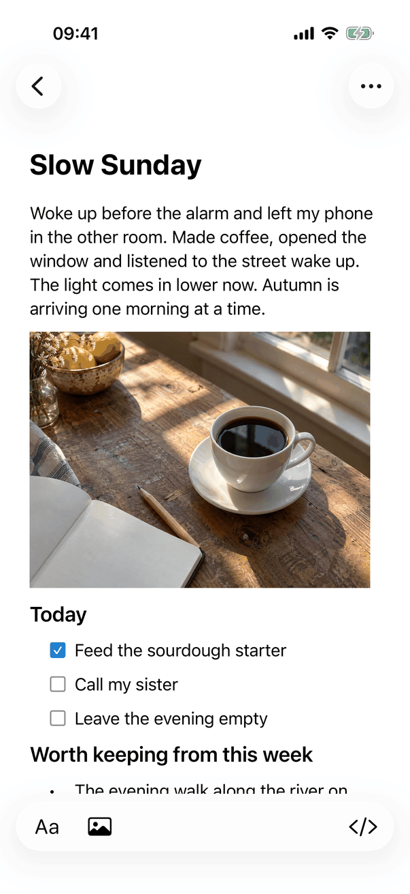 Back button and the Entry Actions "…" button as round glass controls, the title "Slow Sunday" in large bold, a body paragraph, a picture at the text width, the heading "Today", a checklist with one checked box in the accent colour, a second heading and the start of a bullet list cut off by the bottom capsule: Aa, Insert Image, and at the far end View Source (angle brackets). |
| Reading, dark |  The same in dark appearance. |
| Writing | 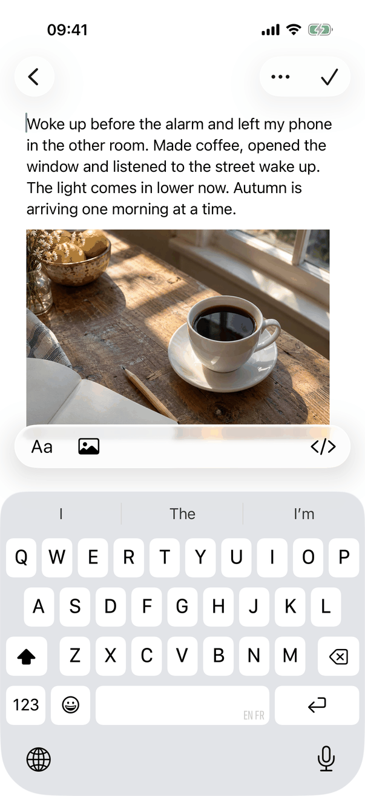 The caret at the start of the body, the title scrolled out of view, the navigation bar now holding "…" and the Done checkmark in one capsule, the same capsule floating above the keyboard. |
| Entry Actions menu | 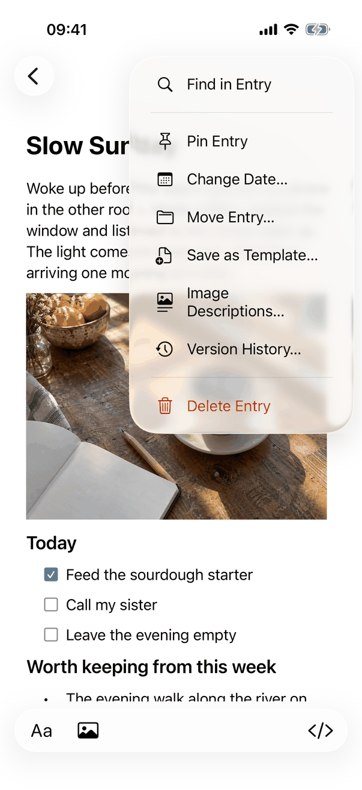 The menu: Find in Entry, a divider, Pin Entry, Change Date…, Move Entry…, Save as Template…, Image Descriptions…, Version History…, a divider and Delete Entry in red. |
| Checklist | 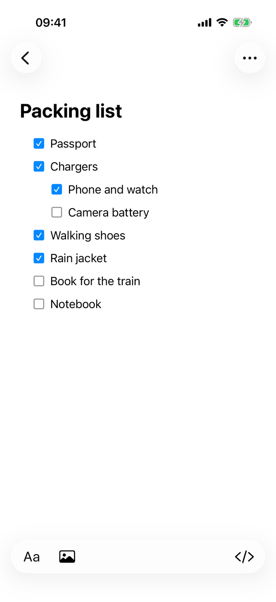 A checklist with a second level one list column in; boxes are filled in the accent colour when checked. |
| Table | 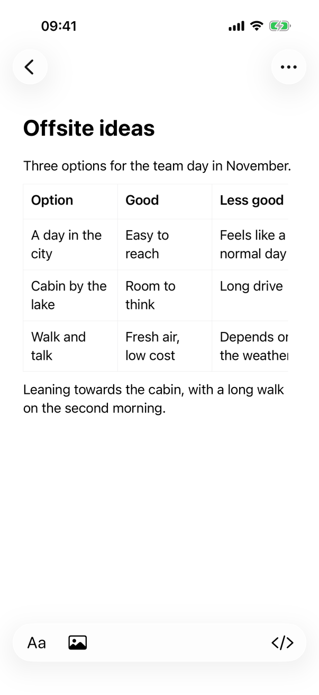 A three-column table with a semibold header row and a hairline grid; the third column runs off the right edge because the grid scrolls sideways. |

iPad (three columns, regular width; the editor is the right column):

| State | Capture |
| --- | --- |
| Reading, light |  The editor beside the list and the sidebar, with only the "…" button in the bar and a narrow capsule (Aa, Insert Image, View Source) centred at the bottom of the editor column. |
| Reading, dark |  The same in dark appearance. |
| Writing | 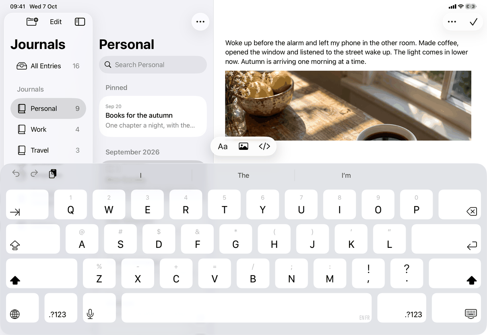 The on-screen keyboard with its shortcut bar (undo, redo, paste on the leading side, no B, I, U group), the capsule floating above it centred on the keyboard rather than on the editor, and the Done checkmark beside "…" in the bar. |
| Entry Actions menu | 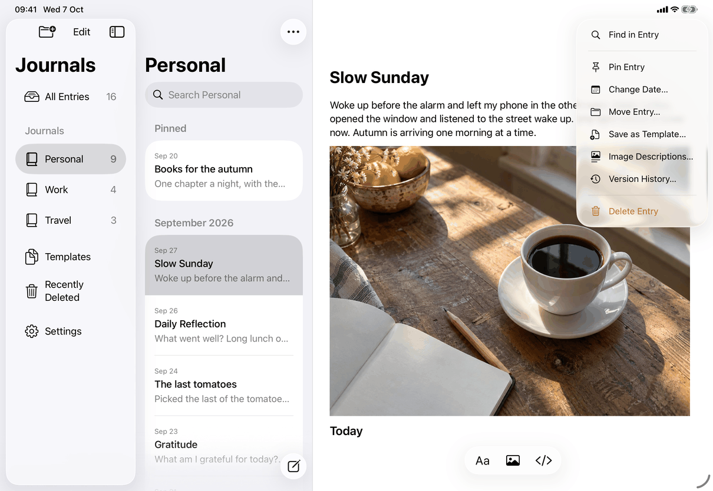 The same items as on iPhone in a menu hanging from the "…" button. |
| Checklist | 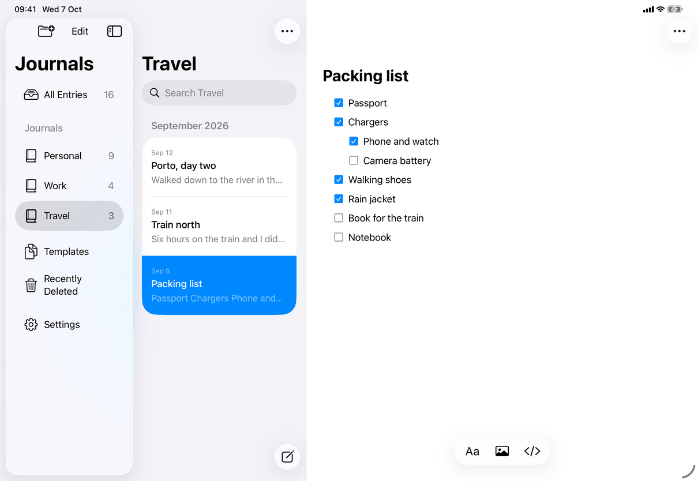 The same checklist at the editor column's width, in an entry of the Travel journal. |
| Table | 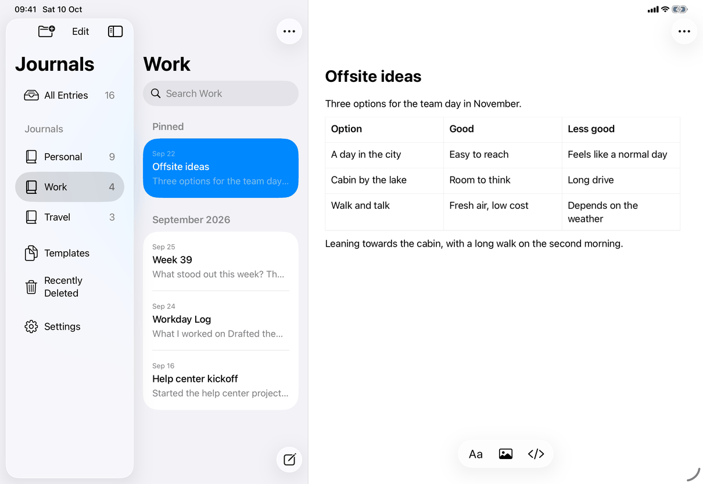 The table at full text width; all three columns fit, so nothing scrolls. |

Mac (window 1280 x 800 points; the window is not the key window in these captures, so the title bar and toolbar are dimmed):

| State | Capture |
| --- | --- |
| Default, light |  Sidebar, list and editor. The toolbar over the editor: New Entry, Formatting (Aa) and Insert Image, then Editor Only, View Source, Entry Actions and the search field. The title is a fixed field above the text; the body, picture and the start of the checklist (native checkboxes) scroll below it. |
| Default, dark | 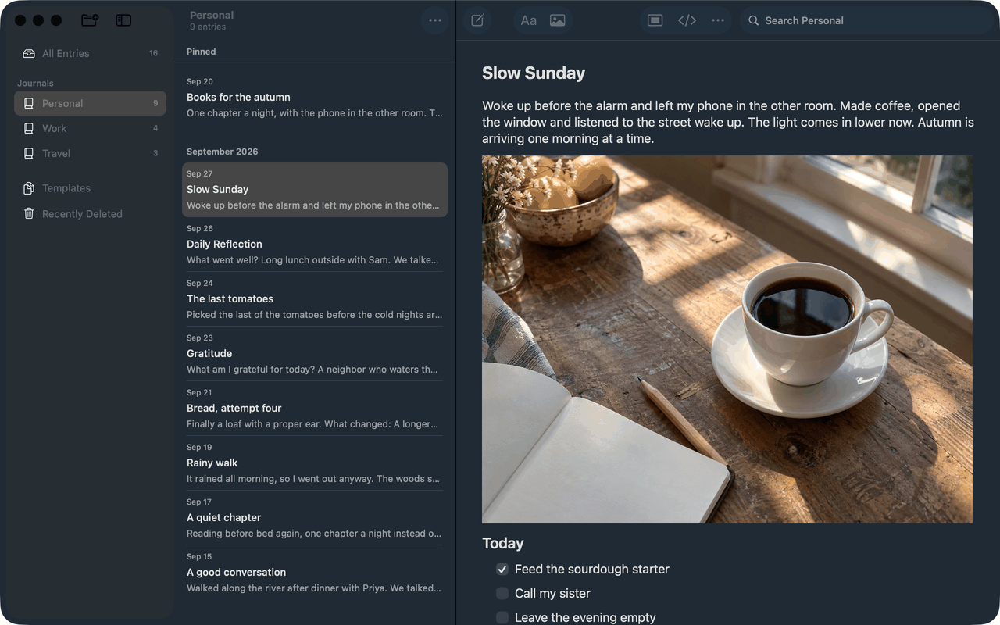 The same in dark appearance. |
| Checklist | 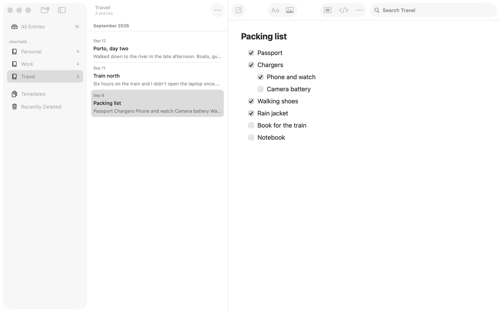 The checklist with native checkboxes, one level of nesting. |
| Table | 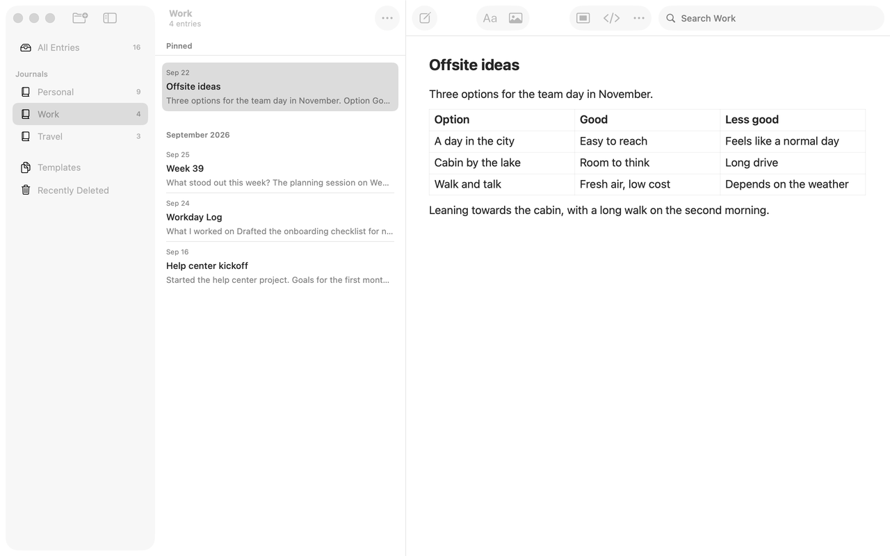 The table with a hairline grid, a semibold header row and compact rows. |

No capture exists of: the writing state on the Mac (nothing visible changes), the Formatting popover on the Mac, notices, the save-failure and recovery states, or an empty body with the template link.

## Source files

View (the screen and its notices):
- `apps/apple/JournalApp/Views/RootView.swift`: `detailContent`, `entryEditor`, `entryActionCatalog`, `entryMenu`, the Mac and iOS branches, `editorSize`.
- `apps/apple/JournalApp/Views/RootView+Toolbar.swift`: navigation-bar items (Done, Entry Actions), the reading-bar buttons.
- `apps/apple/JournalApp/Views/Mac/JournalToolbarController.swift`, `RootView+MacWindow.swift`: the Mac toolbar and its configuration.
- `apps/apple/JournalApp/Views/EntryHeaderView.swift`, `EntryEditingNote.swift`, `EntryRecoveryNotice.swift`, `SaveFailureNotice.swift`, `ImageImportNotice.swift`, `TemplateSuggestionView.swift`; `ConflictNotice` in `SettingsView.swift`.
- `apps/apple/JournalApp/Views/ReadingBar.swift`, `apps/apple/JournalApp/Editor/WritingAccessory.swift`: the writing controls.

Model:
- `apps/apple/JournalApp/Editor/RichText.swift`: `EditorActions` (the bridge from toolbar, menus and sheets to the text view), `FormattingSession`, rendering the document to text.
- `apps/apple/JournalApp/Editor/NativeEditor.swift`, `NativeTextView.swift`: the representable, the coordinator, `JournalTextView` on each platform.
- `apps/apple/JournalApp/Editor/JournalWritingView.swift`: iOS container (header, placeholder, accessibility order).
- `apps/apple/JournalApp/Editor/EntryTitleEditor.swift`, `EditorPlaceholder.swift`, `TypingRoom.swift`, `SelectionReveal.swift`: title, placeholder, scroll room.
- `apps/apple/JournalApp/Editor/ListLayout.swift`, `BlockDecorations.swift`, `InlineTasks.swift`, `InlineTables.swift` with `InlineTableGridIOS.swift` and `InlineTableGridMac.swift`, `TablePresentation.swift`, `ImagePresentation.swift`, `InlineImages.swift`, `ImageActionsIOS.swift`, `ImageActionsMac.swift`: how blocks are drawn and edited.
- `apps/apple/JournalApp/Editor/ListAccessibility.swift`, `KeyboardFormatting.swift`, `NativeTableIntegration.swift`: accessibility attributes, key commands, spelling and source mode.
- `apps/apple/JournalApp/Model/AppModel.swift`, `JournalNavigation.swift`, `apps/apple/JournalApp/AppCommands.swift`: selection, draft and autosave, and the menus.

Core: the document model, Markdown reading and writing, and the store live in `apps/apple/Packages/JournalCore` and carry no UI.

Design records (reasons and review outcomes): `docs/design/notes-alignment-revision.md`, `docs/design/owner-decisions-2026-09-25.md`, `docs/design/unified-entry-scrolling.md`, `docs/design/typing-scroll.md`, `docs/design/mac-typing-room-2026-10-04.md`, `docs/design/sync-now-and-done.md`, `docs/design/checklists-2026-10-03.md`, `docs/design/list-markers-2026-10-03.md`, `docs/design/list-indentation-2026-10-04.md`, `docs/design/client-only-mac-lists-markdown-2026-10-05.md`, `docs/design/quiet-sync-and-title-alignment.md`, `docs/design/save-failure-retry.md`, `docs/design/new-entry-template-suggestion.md`, `docs/design/image-block-spacing.md`, `docs/design/document-image-loading.md`, `docs/design/menus-and-popovers.md`.

## Open questions

See [open-questions.md](../../../open-questions.md), C18 (the 24 pt margins apply on every device, the spec says "on the computer"). D8 (Edit Link and Remove Link) is resolved in build 18 and the spec describes them ([link-editor](link-editor.md)).
