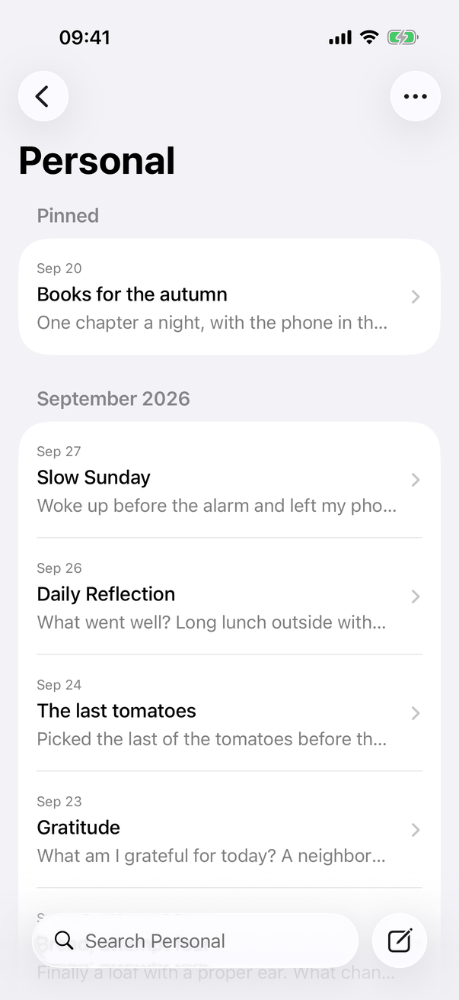
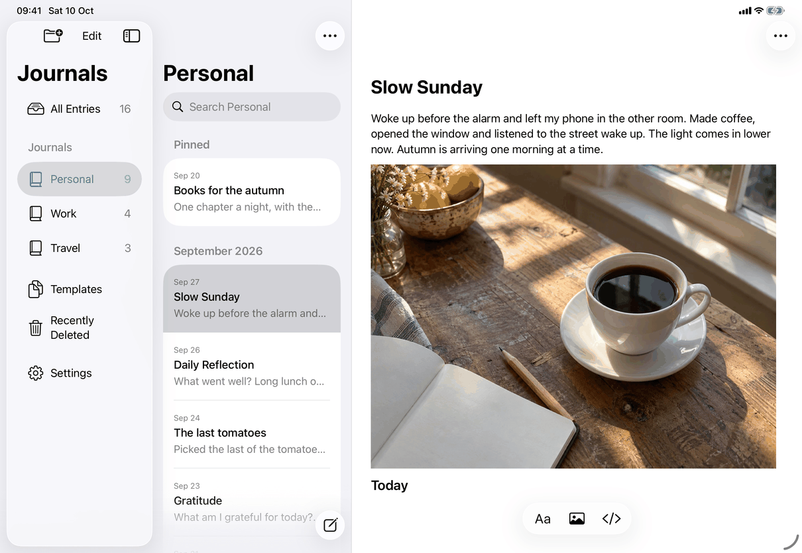
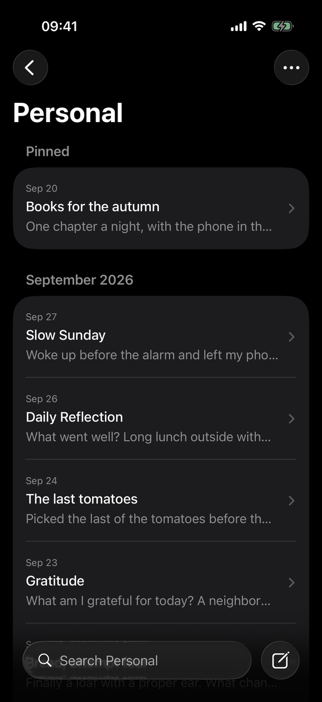
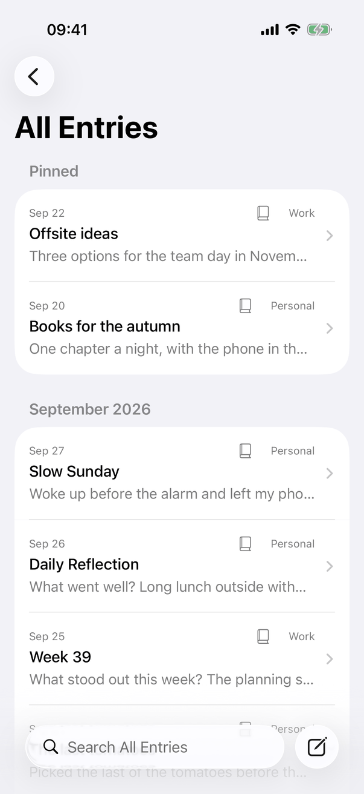
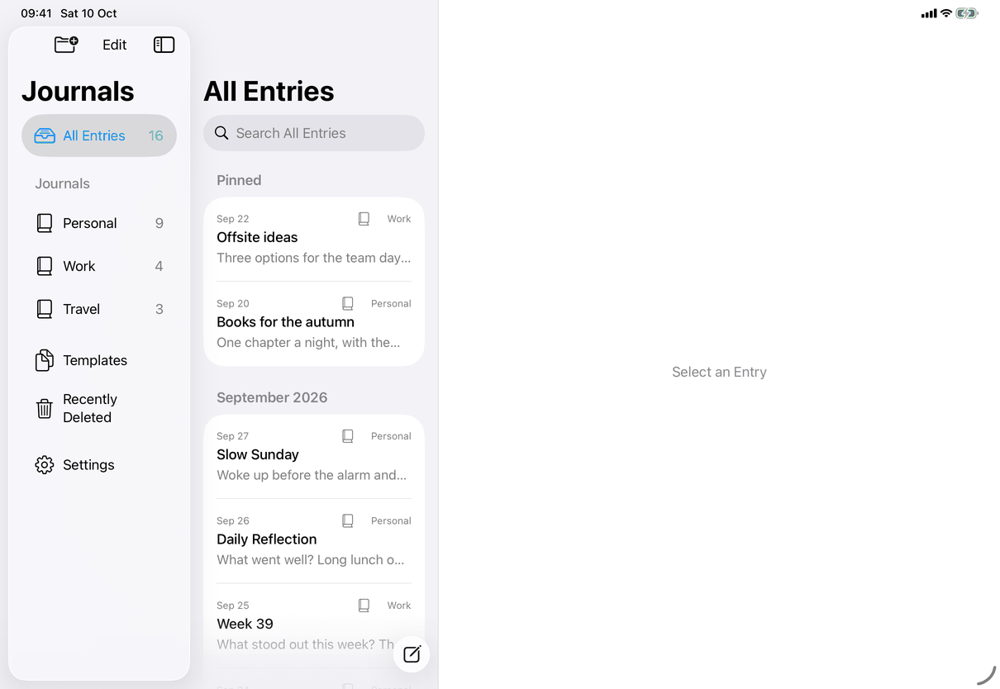
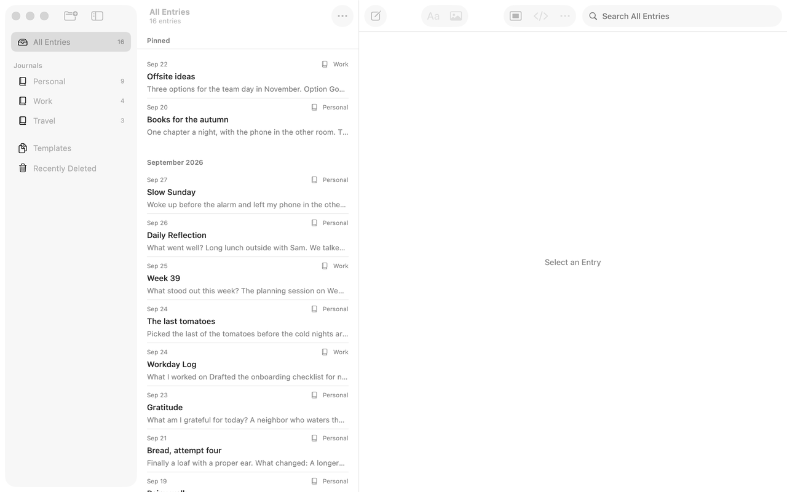

# Entry list (Apple)

Implements [screens/entry-list](../../../screens/entry-list.md). The same list view shows a journal, All Entries, Unavailable Journals, Templates ([templates](templates.md)) and Recently Deleted ([recently-deleted](recently-deleted.md)); this page covers what is shared and what is specific to entries. Where it sits in the window: [library-window](library-window.md).

## Controls

The list is `RootView.sidebar` (a historical name: it was once the sidebar), a `List(selection:)` of `Section`s inside a `ScrollViewReader`, shown through `listedSidebar`. `listedSidebar` wraps it in `Isolated(key: model.listKey(...))`, an `Equatable` view that rebuilds only when the key changes (library revision, content revision, search results, rows being deleted, selection, which collection, accessibility size, stacked, search presented). Each row is wrapped the same way with `rowKey`. This exists because every save, sync and keystroke makes the model publish, and rebuilding thousands of rows each time took tens of milliseconds; a port needs the same discipline (derive the lists once per change, rebuild only rows whose inputs changed). Model: `AppModel` (`entries`, `entryGroups`, `listPreview`, selection and deletion in `JournalNavigation.swift`, `EntryDeletionOperations.swift`, `LibraryOperations.swift`), with the lists cached in `DerivedLists`.

- **Title.** iOS: `.navigationTitle(collectionTitle(destination))` on the list (large title on iPhone and in the iPad column; fallback "Journal" with no destination). Mac: the window title and subtitle ([library-window](library-window.md)).
- **Sections.** `entryGroups` returns `[(String, [JournalItem])]`: first a group named "Pinned" (`AppModel.pinnedSection`, shown as `library.entryList.pinned`) holding the pinned entries, only where `showsPinnedSection` (a journal and All Entries), then one group per month, formatted `LLLL yyyy` with the current locale. Entries are sorted newest date first, ties by identifier (`listedEntries`); pinned ones are moved to the front in the same order. Headers are the `Section` header `Text`; on the Mac `entriesHeaderSeparatorHidden()` removes the line under them.
- **List style.** Mac `.listStyle(.inset)`; iOS `.listStyle(.insetGrouped)`. On the Mac `entriesRowSeparator(lastInSection:)` hides the bottom line of a section's last row, so lines appear only between rows (`MacListSeparators.swift`); iOS keeps the grouped cards.
- **Row** (`entryRow`, an `Isolated` row): a `VStack(spacing: 5)`:
  1. Date as `.dateTime.day().month(.abbreviated)`, caption, secondary. In All Entries a trailing `Label(journalName, systemImage: "book.closed")` (caption, secondary; `common.untitledJournal` when blank), and at the far end `Image(systemName: "exclamationmark.circle")` labelled `messages.conflict.needsReview` when the entry is in `model.conflicts`. At accessibility sizes these stack in a `VStack` instead of an `HStack`.
  2. Title: `entry.displayTitle` (`.body.weight(.medium)`, one line; unlimited lines at accessibility sizes). `displayTitle` in `JournalCore` is the title, else the first line of text, else the string for `library.entryList.untitledEntry`.
  3. Preview: `model.listPreview(of:)` (cached per stored version, whitespace collapsed, `callout`, secondary, one line) or `library.entryList.noAdditionalText`. Rows keep one height, so the preview line is always present.
  The row is `.accessibilityElement(children: .combine)` with `.accessibilityValue` set to `library.entryList.pinned` for a pinned entry in a list that shows the Pinned section (empty otherwise), `.padding(.vertical, 4)`, and `alignmentGuide(.listRowSeparatorLeading)` so separators start at the text.
- **Row link** (`entryLink`): iOS iPad `NavigationLink(value: id)`, stacked `NavigationLink(value: CompactJournalRoute.entry(id))`; Mac `content().tag(id)` because a link in an AppKit-hosted column is drawn dimmed (see [library-window](library-window.md)). Selecting calls `model.select(id)`, which saves the open entry first and refuses if that fails.
- **Swipe actions.** `.swipeActions(edge: .trailing)`: `Button("Delete", systemImage: "trash", role: .destructive)` for `common.delete`, only while `model.offersDelete(entry)` (editable, not deleted, in a journal in use; a template needs no journal). `.swipeActions(edge: .leading)`: Pin or Unpin with `pin` / `pin.slash` and `.tint(.accentColor)` (`library.entryList.swipe.pin`, `library.entryList.swipe.unpin`) while `model.canPin(entry)`; in Recently Deleted the leading swipe is Restore. Both edges allow the default full swipe. In Recently Deleted the trailing swipe starts permanent deletion instead ([recently-deleted](recently-deleted.md)).
- **Context menu and Entry Actions.** `.contextMenu { entryActions(entry) }` shows `MenuActionsView(actions: entryActionCatalog(entry))`. The same catalog is `entryMenu`, the editor's `Menu` (label `library.toolbar.entryActions`, `ellipsis`, `.menuIndicator(.hidden)`, disabled when nothing or a deleted journal is open) and the Mac toolbar's menu (`configuration.entryActions`, as `NSMenu`). Items in order: Pin Entry or Unpin Entry (`library.entryActions.pin` / `unpin`, symbols `pin` / `pin.slash`, entries only), Change Date… (`calendar`), Move Entry… (`folder`), Save as Template… (`doc.badge.plus`), Image Descriptions… (`text.below.photo`, present when the entry has pictures, enabled by `offersImageDescriptions`), Version History… (`clock.arrow.circlepath`), then in Recently Deleted Restore and Delete Permanently…, then a separator and Delete Entry (`trash`, destructive; `library.entryActions.deleteEntry`, or `deleteTemplate`) while `offersDelete`. `entryMenu` on iOS prepends Find in Entry (`magnifyingglass`, `library.entryActions.findInEntry`) and a divider and appends the Sync Status submenu (`syncMenu`, only when `model.showsSyncStatus`). Row actions that need the entry open (`performRowAction`) first call `model.selectEntryForAction(id)`, which saves the open entry and then selects the row's entry, so they never act on a stale selection; Pin and Delete do not change the selection.
- **Delete.** `RootView.delete(_:)`: `removeFromLists` takes the row out of `DerivedLists` in the same update (so a swipe animation has nothing to spring back to), `leaveDeletedEntry` pops the iPhone page, then a serialized `deletionTask` calls `deleteListed`, waits for the removal animation to settle (`.listRemoval`, none with Reduce Motion) and stores the deletion; `registerDeletionUndo` gives Edit a step named "Delete Entry" (or "Delete Template") that restores it (`library.entryActions.deleteEntry`). Where the Mac and iPad open the next entry after deleting the open one, `selectingNext` picks the one below, or the one above at the end (`entryAfter`). A failed save shows the row again and sets the general error.
- **Pin.** `setPinned` → `model.setPinned(_:entryID:undoManager:)`: stores the library record, animates with `AppModel.listAnimation`, schedules a sync, calls `announceForAccessibility` (`messages.announce.pinned` / `messages.announce.unpinned`), registers Undo named "Pin Entry" or "Unpin Entry" (`library.entryActions.pinUndo`, `library.entryActions.unpin`). `rowActionTask` then waits 0.4 s and sets `@AccessibilityFocusState returnedRow` to the entry so VoiceOver follows it into its new section; `.onValueChange(of: pinned membership of the open entry)` scrolls the list to the open entry with `ScrollViewProxy.scrollTo`. Failure: `messages.generic.pinFailed` or `messages.generic.unpinFailed` in the general error alert.
- **Save as Template.** The row action stores the entry's title in `templateName`, and `RootView` shows `.alert("Save as Template", isPresented: $saveTemplate)` (`library.saveTemplate.title`) with `TextField("Name")` (`common.name`), `common.cancel` and `common.save` (disabled while blank). `model.saveTemplate(name:)` flushes the draft, stores a new template with the trimmed name and the entry's document, and leaves the entry open.
- **Empty and search states** (`emptyListState`, an overlay of the list, also shown in the editor column on the Mac in Editor Only): a centered `VStack` of secondary text. No query: `library.entryList.empty.noEntries` with Button `common.newJournalEllipsis` when no journal exists, else `library.menu.file.newEntry` when `model.canCreateEntry`; Unavailable Journals shows `messages.unavailable.empty` with no button. With a query: `library.entryList.empty.noResults` with `library.entryList.empty.clearSearch`, which sets `model.query = ""`. Loading after unlock: the overlay is not shown while `model.openingJournals` (`listIsEmpty`), so the list is blank and offers nothing until the journals are read.
- **Mac keyboard.** `.onDeleteCommand(perform: deleteSelectedFromList)` and `CommandDeleteKey` (`onKeyPress(.delete)` with only ⌘ held, macOS 14 or later) delete the selected entry, or in Recently Deleted open the permanent-deletion prompt. Both act only while the list has focus, so ⌘⌫ in the editor keeps deleting to the start of the line.

## Layout

- **Mac.** The middle column of the split view, 360 to 460 points wide (see [library-window](library-window.md)); rows have no cards, 4 points of vertical padding, lines only between rows; the selection is the system highlight on one row, single selection only. The header over the list (title and count) is the window title and subtitle.
- **iPad, regular width.** The content column of `NavigationSplitView` (240 to 420, ideal 300), a large title, `.insetGrouped` cards, a selected row highlighted in the column, Journal Actions at the top right of the column and New Entry at the bottom trailing edge. Search appears under the title in the screenshots (see [search](search.md)).
- **iPhone, iPad in compact width, accessibility text sizes.** A page of the stack titled with the collection, back button at the top left, Journal Actions at the top right (journals only), the bottom bar with search and New Entry. The entry opens as the next page (`CompactJournalRoute.entry`).
- **Dynamic Type.** At accessibility sizes the row's date and journal stack on two lines (`isAccessibilitySize` branch in `entryRow`) and the title wraps; the preview stays one line. The key of every row includes `accessibilitySize`, so rows are rebuilt when the size crosses the threshold.

## Commands and shortcuts

| Command | Placement | Shortcut | Enabled when |
| --- | --- | --- | --- |
| `entry-actions` | as in [commands.md](../commands.md) | | An entry or template is open and it is not a deleted journal |
| `pin-entry`, `pin-entry-row` | as in commands.md (File menu acts on the open entry) | none | `canPin`: a listed entry in a journal in use, unlocked, library not being replaced |
| `delete-entry` | as in commands.md | Mac: Delete or ⌘⌫ in the focused list | `offersDelete`: editable, not deleted, in a journal in use |
| `change-date`, `move-entry`, `save-as-template`, `entry-version-history` | as in commands.md | | Change Date, Move Entry and Save as Template only for an editable entry; Version History always |
| `image-descriptions` | as in commands.md | | Entry has pictures; enabled while descriptions can be edited |
| `find-in-entry` | iOS: first item of Entry Actions | ⌘F on iPad | An entry is open |
| `sync-status` | iOS: last item of Entry Actions | | Only when sync needs the person |
| `empty-new-entry`, `clear-search` | in the empty list | | Empty-state conditions above |
| `undo`, `redo` | Edit menu | ⌘Z, ⇧⌘Z | Edit ▸ Undo Delete Entry or Undo Pin Entry right after the action |

Keyboard: Mac arrow keys move the selection and open the entry (system list behaviour with the selection binding); there is no multiple selection (`List(selection:)` takes one `UUID?`). On iPad with a hardware keyboard the list has no Delete shortcut: `onDeleteCommand` and `CommandDeleteKey` are Mac code. Escape and Return have no list-specific meaning.

## Copy differences

None. The list uses the spec's text on every device. Only the placement of the Recently Deleted explanation differs (footer text on iOS, header on the Mac) and that belongs to [recently-deleted](recently-deleted.md).

## Accessibility

- Each row is one element (`.accessibilityElement(children: .combine)`): date, journal in All Entries, title, preview, with the value `library.entryList.pinned` for a pinned row, so the state is heard when the Pinned header is skipped. The conflict symbol is labelled `messages.conflict.needsReview`.
- Section headers use the system's header trait of `Section`; no custom trait is added.
- Swipe actions are the system's, so VoiceOver offers them as the row's actions; the context-menu actions are reachable the same way.
- After Pin or Unpin, VoiceOver is told `messages.announce.pinned` or `messages.announce.unpinned` and its focus follows the row to its new section (`returnedRow`, 0.4 s after the update, because the row's view is rebuilt in the other section). A cancelled permanent deletion returns focus to the row the same way.
- Reduce Motion: row removal, pin moves and scrolling use `withAnimation(reduceMotion ? nil : .default)` or `AppModel.listAnimation`.
- Increase Contrast, Reduce Transparency, Voice Control, Full Keyboard Access: no list-specific handling; the Mac list is a standard focusable table.

## Differences between iPhone, iPad and Mac

- **Layout.** Mac: plain inset list with lines between rows, one selected row; iPhone and iPad: inset grouped cards. This follows Notes on each platform and the design record for the Mac separators.
- **Opening an entry.** iPhone pushes a page; iPad and Mac select a row and show the editor beside it, because only those layouts have room for it.
- **Delete key.** Mac only, because it needs a focused list and a hardware keyboard convention; iPhone and iPad delete by swipe, context menu or Entry Actions.
- **Entry Actions.** The iOS menu starts with Find in Entry and ends with Sync Status because the iOS editor bar holds only Entry Actions and Done, so Find in Entry (a system find navigator) and Sync Status live in that menu; the Mac has Find under Edit (⌘F) and a toolbar item for Sync Status.
- **Swipe.** iPhone and iPad swipe by touch; on the Mac the same `.swipeActions` modifiers are meant to work as a trackpad swipe (commands.md says so; not verified on the running Mac app, where the context menu and Entry Actions are the sure path).
- **Next entry after delete.** Mac and iPad open a neighbour (`selectingNext`); iPhone returns to the list because its page only exists for the open entry.

## Screenshots

| State | iPhone | iPad | Mac |
| --- | --- | --- | --- |
| A journal (Personal), Pinned and September 2026 |  |  |  |
| Dark |  |  | none |
| All Entries (journal label on each row, nothing open) |  |  |  |

## Source files

View:
- `apps/apple/JournalApp/Views/RootView.swift`: `sidebar` (the list), `entryRow`, `entryActionCatalog`, swipe actions, delete, pin, Save as Template, empty states.
- `apps/apple/JournalApp/Views/MacListSeparators.swift`, `CommandDeleteKey.swift`: Mac separators and ⌘⌫.
- `apps/apple/JournalApp/Views/Isolated.swift`: the equatable wrapper that keeps the list from being rebuilt.
- `apps/apple/JournalApp/Views/MenuActions.swift`: the shared menu description.
- `apps/apple/JournalApp/Views/CompactJournalNavigation.swift`: `entryLink`, the stack.

Model:
- `apps/apple/JournalApp/Model/JournalNavigation.swift`: the listed entries, groups, counts, selection.
- `apps/apple/JournalApp/Model/DerivedLists.swift`: caches, `listKey`, `rowKey`, rows hidden while being deleted.
- `apps/apple/JournalApp/Model/EntryDeletionOperations.swift`, `EntryActionOperations.swift`, `LibraryOperations.swift`: delete, undo, row actions, pins.

Core: `JournalItem.displayTitle`, `listPreview` and the lifecycle snapshot (`JournalLifecycleSnapshot`) in `apps/apple/Packages/JournalCore`.

Design records: `docs/design/pinned-entries.md`, `docs/design/mac-list-separators-2026-10-04.md`, `docs/design/owner-decisions-2026-09-25.md`, `docs/design/ios-delete-all-and-settings-2026-10-03.md`.

## Open questions

None.
