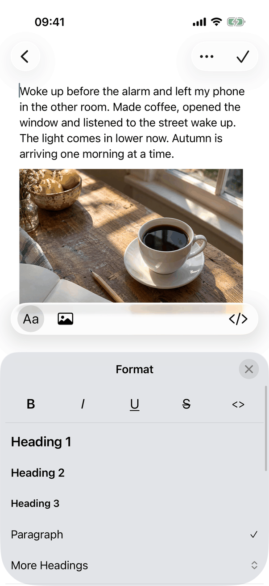
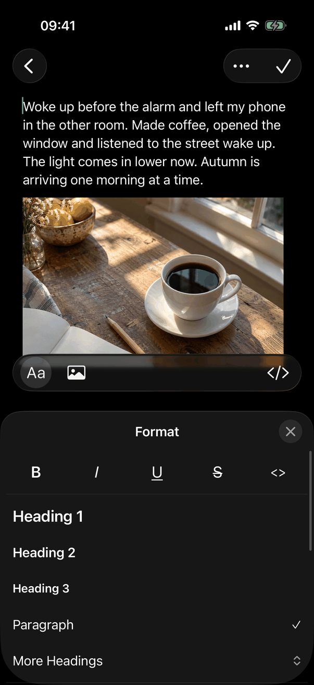
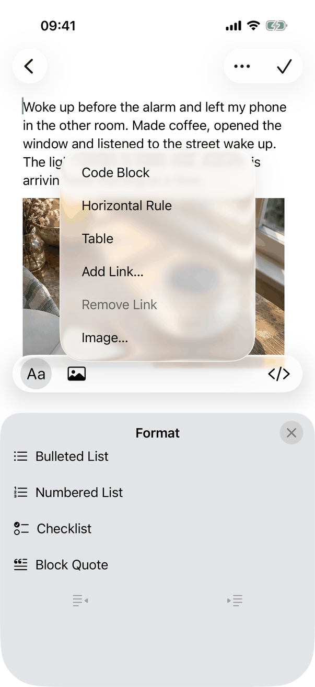
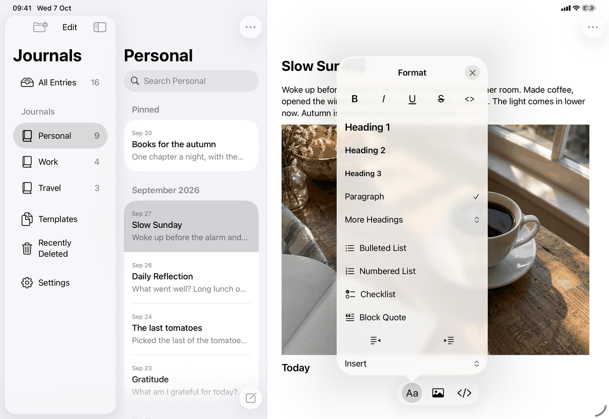
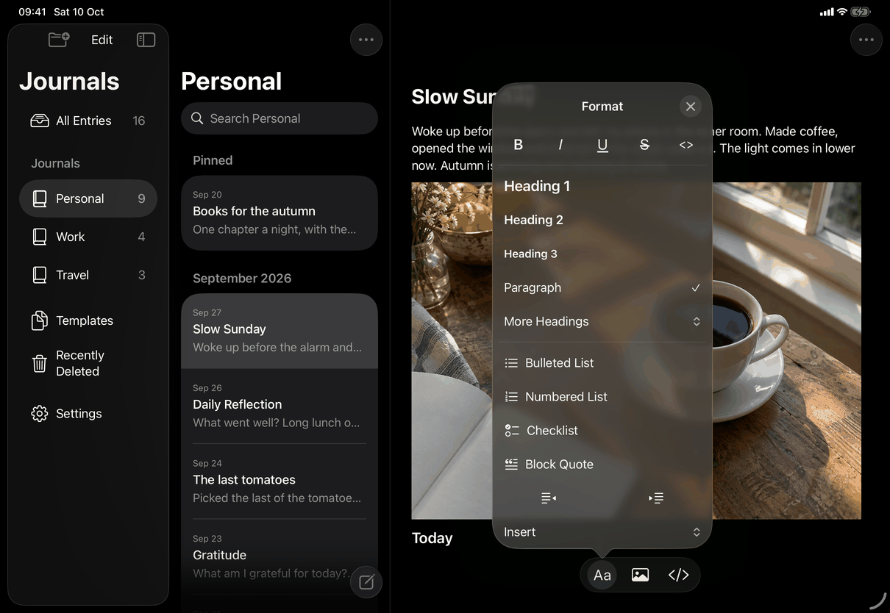
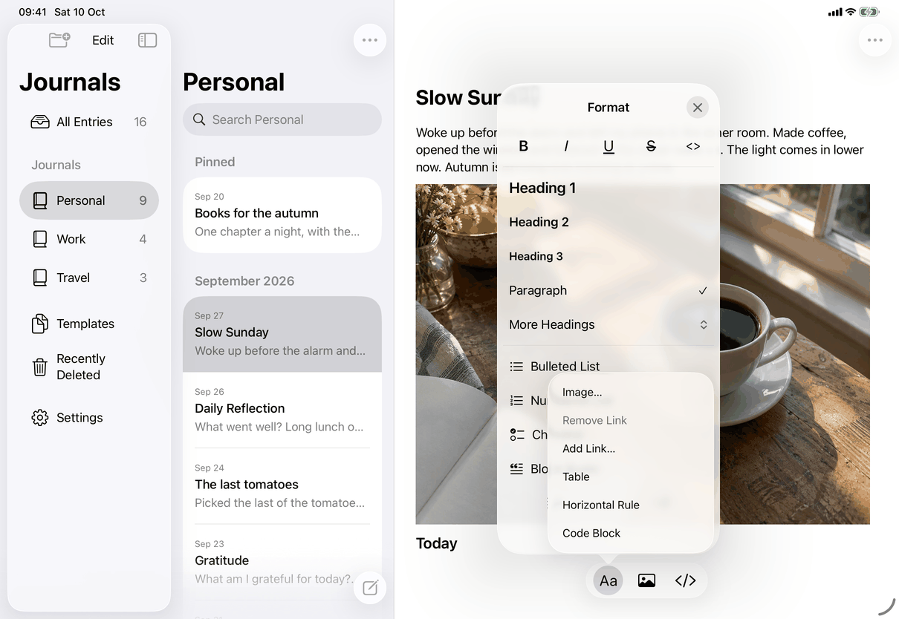

# Formatting (Apple)

How the Apple apps implement the spec's [format-sheet](../../../screens/format-sheet.md). One SwiftUI view, `FormattingPopover`, holds every row; three presenters show it: an AppKit popover on the Mac, a `UIPopoverPresentationController` popover on iPad in regular width, and an input view that replaces the keyboard on iPhone (and on iPad in compact width or at accessibility text sizes). The editor around it is on the [entry-editor](entry-editor.md) page; the sheets it opens are [link-editor](link-editor.md) and the image picker ([insert-image](../../../flows/insert-image.md)).

## Controls

`FormattingPopover` observes only a `FormattingSession` (the styles at the selection and `isPresented`), so styling does not redraw the window. Its rows are buttons with a custom `FormattingRowStyle` that draws the disabled state itself (30 % opacity, no hover highlight). Row height is `rowHeight`: 44 pt on iOS, 30 pt on the Mac.

| Spec element | Apple control | Notes |
| --- | --- | --- |
| Header `common.format`, close `editor.format.close` | `ZStack` with `Text("Format")` (`.headline`, header trait) and a trailing `Button` with an `xmark` glyph in a fixed 30 pt circle inside a 44 pt target | iOS only, so on iPhone and, differently from the spec, also on the iPad popover (see captures). Not on the Mac. |
| Inline row | `HStack` of five `Button`s, `.font(.title3)`: "B" bold, "I" italic, underlined "U", struck "S", "<>" in `.system(.body, design: .monospaced)` | Selected or mixed: `Color.accentColor.opacity(0.16)` in a 4 pt rounded rectangle; mixed adds a `minus` image. `accessibilityLabel` is the style name, `accessibilityValue` is "On", "Off" or "Mixed" (`editor.format.state.*`), `.help` the name. Disabled in a code block. |
| Divider | `Divider` with 4 pt padding | |
| Paragraph styles | `Button` rows: Heading 1 (`.title3.bold()`), Heading 2 (`.headline`), Heading 3 (`.subheadline.bold()`), Paragraph (`.body`) | A `checkmark` (caption size) trails the current style, which also has the selected accessibility trait. Disabled in a table cell or code block. |
| Mark as Checked / Unchecked | A `Button` row, present only when `state.taskCompletion` is non-nil | "Mark as Unchecked" when every selected item is checked, else "Mark as Checked". |
| More Headings | `Menu` whose label is a row with a `chevron.up.chevron.down`; items "Heading 4", "5", "6" | Disabled in a table cell or code block. |
| Lists and quote | `Button` rows with symbols `list.bullet`, `list.number`, `checklist`, `text.quote` | Checkmark on the current kind; Checklist counts checked and unchecked items. Disabled in a table cell or code block. |
| Indent row | `HStack` of two icon-only `Button`s (`decrease.indent`, `increase.indent`), each `.frame(maxWidth: .infinity)` | Always present, `.disabled` when `state.indent` says it does not apply. Labels and `.help` are kept when dimmed. Stays open after a press. |
| Exit Code Block | A `Button` row, only while `state.paragraph == "codeBlock"` | Sends `.insert("")`. |
| Insert | `Menu` row with the up-down chevron: Code Block, Horizontal Rule, Table, Add Link… or Edit Link…, Remove Link, Image… | Link… and Image… are `pendingPresentation` requests: the surface closes first and `EditorActions.finishPresentation` opens the link sheet or the picker for the selection there is then. The spec lists neither Edit Link… nor Remove Link; the code has both (Remove Link is dimmed unless the selection touches a link). |

Closing: rows that finish the formatting call `apply`, which performs the command and then `close()`; the inline toggles and the indent buttons call `EditorActions.performFormatting` and stay open. While the surface is open, `performFormatting` runs the command on the text's current selection (`handler`), not on the one captured at opening; when closed, it uses the captured session (`FormattingSessions.swift`). The model is `EditorActions` and `FormattingState` (built from the text storage, the selection and the typing attributes, or from the Markdown syntax in source view). Selection changes refresh the state at most once per run-loop turn (`formattingSelectionChanged`).

The states of the spec map as follows. Not editable: the Formatting button is disabled (`FormattingButton` on iOS; `formattingPopover.button.isEnabled` on the Mac) and `endFormatting` closes the surface without refocusing. In a table cell: `FormattingState` comes from the cell's own style (`selectedCellStyle`), whose rows are disabled as listed. In source view: `readSource` reads the syntax; the indent buttons are dimmed and Exit Code Block does not show. Rows that do not fit: the iOS `ViewThatFits` scrolls them (see Layout).

## Layout

The switch between presentations is in `MobileFormattingPresenter.toggle`:

- Mac: `ToolbarPopover` (AppKit `NSPopover`, `behavior = .transient`, `animates = false`) from the toolbar's Formatting item, `show(relativeTo:)` the item. The `FormattingPopover` content is hosted in an `NSHostingController` (`sizingOptions = .preferredContentSize`) created once per window and reused, 250 pt wide and as tall as its rows. The toolbar item also has an overflow-menu form ("Formatting") for narrow windows. There is no Mac capture.
- iPad, `horizontalSizeClass == .regular` and not an accessibility text size: a popover (`modalPresentationStyle = .popover`, `adaptivePresentationStyle` returns `.none` so it never becomes a sheet), `sourceView` the Aa button of the bar (`AnchorBox` or `formattingToolbarAnchor`), 300 pt wide and as tall as its rows (`preferredContentSize` from `sizeThatFits`), presented with `animated: false`, `safeAreaRegions = []`. `passthroughViews` holds the focused text view, so a tap in the text goes through and moves the caret, and that selection change closes the popover (`formattingSelectionMoved`).
- iPhone, and iPad in compact width (Slide Over, narrow Split View or Stage Manager window) or at an accessibility text size: `FormattingPanel`, a `UIInputView` with `inputViewStyle: .keyboard` that `JournalTextView.inputView` returns while `formattingInputView` is set. The text stays first responder; `reloadInputViews()` swaps it for the keyboard inside `UIView.performWithoutAnimation`. The keyboard accessory (the capsule with Aa, Insert Image and View Source) stays above it, with Aa drawn selected (`FormattingButton` fills a circle and adds the selected trait). Height: exactly the height of the keyboard it replaces, remembered per orientation from `keyboardWillChangeFrame` (without the accessory bar); with no on-screen keyboard (hardware keyboard, or none shown yet in that orientation) it is the height of the rows, at most 40 % of the window in portrait and 50 % in landscape. Rotation or a window resize recomputes it in `layoutSubviews`.
- Rows that do not fit (iPhone panel, large text, landscape): `FormattingPopover` uses `ViewThatFits(in: .vertical)`: the plain column when it fits, else a `ScrollView` with `scrollIndicatorsFlash(onAppear: true)` (iOS 17 and later), scrolled to the first row on every opening (`ScrollViewReader`). The same `ViewThatFits` serves the iPad popover.
- Dynamic Type: the text rows grow with it; the 30 pt close glyph is fixed. Row heights are minimums.
- Width change while open (rotation into Split View, Stage Manager): `PresentingController` reports a change of `horizontalSizeClass` (trait change registration on iOS 17, `willTransition` before) and the presenter closes the surface with refocus, so the keyboard returns.

## Commands and shortcuts

| Command | Placement | Shortcut | Enabled when |
| --- | --- | --- | --- |
| `show-formatting` | As in [commands.md](../commands.md): the Mac toolbar's Formatting item (and its overflow item), the Aa button of the reading bar and of the keyboard accessory | None | The entry can be edited (`model.canEdit`) |
| `close-formatting` | Close button (iPhone panel and iPad popover), Aa again, Formatting again (Mac), Escape | Escape | Surface open |
| `format-bold`, `format-italic`, `format-underline`, `format-strikethrough`, `format-inline-code` | Inline row | Same as the Format menu (⌘B, ⌘I, ⌘U, ⇧⌘X, ⌥⌘C; see [commands.md](../commands.md)) | Not in a code block |
| `format-paragraph`, `format-heading-1`, `format-heading-6` | Paragraph styles and More Headings | ⌥⌘0, ⌥⌘1 to ⌥⌘6 | Not in a table cell or code block |
| `format-bulleted-list`, `format-numbered-list`, `format-checklist`, `format-block-quote` | List and quote rows | As in the Format menu | Not in a table cell or code block |
| `format-mark-checked` | The Mark as Checked / Unchecked row | ⇧⌘U (menu) | Checklist items selected |
| `format-increase-indent`, `format-decrease-indent` | Indent row | ⌘] and ⌘[ (menu) | Per the editing rules; dimmed otherwise |
| `exit-code-block` | Row, only in a code block | Down Arrow at the end of a code block's last line (text) | Caret in a code block |
| `insert-code-block`, `insert-horizontal-rule`, `insert-table`, `insert-link`, `insert-image` | Insert menu | As in the Format menu | Always when the surface is available |

Keyboard behaviour of the surface:

- Escape closes it. Mac: `FormattingPopover` has `.onExitCommand(perform: close)` for when the popover holds focus, and `JournalTextView.cancelOperation` closes it while the text has focus, not while an input method is composing (`hasMarkedText`). iPhone and iPad: `EditorActions.formattingEscapeCommand` adds a `UIKeyCommand` for Escape with `wantsPriorityOverSystemBehavior` to the text view's `keyCommands` while the surface is open.
- Mac, opened with the mouse: the text keeps focus. Opened from the keyboard, the overflow menu or with VoiceOver, `ToolbarPopover.focusContent` makes the popover key and moves focus to the first control (Bold). Closing with Escape, the button or a closing row returns focus to the Formatting button if the popover took it, else the text keeps it; a click outside leaves focus where the click was.
- A second click on the Mac's Formatting button closes the popover and never reopens it: `PopoverClickGuard` compares the mouse-down that closed the popover with the button's own mouse-down.
- iPad popover: a tap on Aa within 0.35 s of a tap outside that closed the popover is ignored (`popoverDismissedAt`).

## Copy differences

None: no `mac` variant applies, and the rows use the same strings on every device. The strings are literals in `FormattingPopover` equal to the catalog (`library.menu.format.*`, `editor.format.*`), including `library.menu.format.insert.editLink` and `library.menu.format.insert.removeLink`.

## Accessibility

- Toggle buttons expose "On", "Off" or "Mixed" as their value (`editor.format.state.*`); the current paragraph style has the selected trait; indent buttons keep their labels when dimmed.
- iPhone panel: on opening, `showPanel` posts `UIAccessibility.post(.screenChanged)` with the panel, so VoiceOver moves to the "Format" heading. Aa carries the selected trait while open. Closing returns to the text.
- Mac: with VoiceOver or Full Keyboard Access the popover takes focus on Bold ("Bold, off, button"), `NSAccessibility.post(.focusedUIElementChanged)` announces it, and closing returns focus to the Formatting button after Escape or a closing row.
- The header's close button (label "Close", `editor.format.close`) is the visible way out on iPhone and iPad; the Mac popover has none and closes with Escape or a second activation of the toolbar item.
- Reduce Motion: nothing to reduce; the surface is presented and dismissed without animation on every device.
- Rows are 44 pt on iOS so every row is a full touch target; the close glyph is 30 pt inside a 44 pt target.

## Differences between iPhone, iPad and Mac

- Panel in place of the keyboard (iPhone, compact iPad), popover (regular iPad, Mac): the spec's rule, taken from Notes. The panel keeps the text focused and visible while the keyboard is not needed; the popover leaves the on-screen area free where there is room.
- Header with "Format" and a close button: iPhone panel and iPad popover; none on the Mac. The spec says the header is for the phone panel only; the code adds it to the iPad popover as well (C19).
- Row height 44 pt (iOS) against 30 pt (Mac), width 250 pt (Mac popover) against 300 pt (iPad popover) and the full keyboard width (iPhone panel): touch targets against pointer targets.
- Hover highlight (a 0.08 primary-colour fill) draws on rows where `onHover` fires: under the Mac pointer, and on iPad with a pointer.
- The surface can also be opened from the Format menu items, but only the Mac and iPad have those menus (see [commands.md](../commands.md)).
- Insert menu: it is a `Menu` and the system chooses its direction and order. In the captures it opens upward on both devices; on the iPad popover its items read bottom-up (Image… at the top), on the iPhone panel top-down (Code Block first). The Mac menu is not captured.

## Screenshots

| Device | State |
| --- | --- |
| iPhone |  The panel in place of the keyboard under the capsule (Aa selected), with "Format" and the close button, the inline row, Heading 1 to 3, Paragraph with its checkmark and More Headings; the remaining rows are below, scrolled out of view. |
| iPhone |  The same in dark appearance. |
| iPhone |  The panel scrolled to the lists, Block Quote and the two dimmed indent buttons, with the Insert menu open above: Code Block, Horizontal Rule, Table, Add Link…, Remove Link (dimmed) and Image…. |
| iPad |  A 300 pt popover pointing at Aa in the centred capsule: header, inline row, headings, Paragraph, More Headings, lists, the indent pair and the Insert row, all in view. |
| iPad |  The same in dark appearance. |
| iPad |  The Insert menu opened upward from the Insert row, listing Image…, Remove Link (dimmed), Add Link…, Table, Horizontal Rule and Code Block from the top. |

There is no Mac capture of the popover; the Mac description comes from the source.

## Source files

View:
- `apps/apple/JournalApp/Views/FormattingPopover.swift`: `FormattingPopover` (all rows, the iOS header), `FormattingButton`, the row style.
- `apps/apple/JournalApp/Views/MobileFormattingPresenter.swift`: iPhone panel (`FormattingPanel`), iPad popover and the size-class switch.
- `apps/apple/JournalApp/Views/MacFormattingButton.swift`: `ToolbarPopover` (the Mac popover, focus and closing).
- `apps/apple/JournalApp/Views/PopoverClickGuard.swift`: second click on the Mac button.
- `apps/apple/JournalApp/Views/Mac/JournalToolbarController.swift`: the Mac toolbar item and its overflow form.
- `apps/apple/JournalApp/Editor/WritingAccessory.swift`, `apps/apple/JournalApp/Views/ReadingBar.swift`: the Aa button on the iPhone and iPad bars.

Model:
- `apps/apple/JournalApp/Editor/RichText.swift`: `EditorActions`, `FormattingSession`, `performFormatting`, `finishPresentation`, the Escape key command.
- `apps/apple/JournalApp/Editor/FormattingState.swift`: the state each row shows.
- `apps/apple/JournalApp/Editor/FormattingSessions.swift`: the selection captured when the surface opens.
- `apps/apple/JournalApp/Editor/NativeTextView.swift`: `inputView` and `cancelOperation`.

Core: none (formatting acts on the editor's attributed text; Markdown conversion is in JournalCore).

Design records: `docs/design/menus-and-popovers.md`, `docs/design/list-indentation-2026-10-04.md`, `docs/design/checklists-2026-10-03.md`, `docs/design/pre-release-ui-2026-09-27.md` (section 5, superseded in part).

## Open questions

See [open-questions.md](../../../open-questions.md), C19 (the iPad popover shows the "Format" header and close button although the spec says the header is for the phone panel only). D8 (Edit Link… and Remove Link in the Insert menu) is resolved: they are in the spec.
