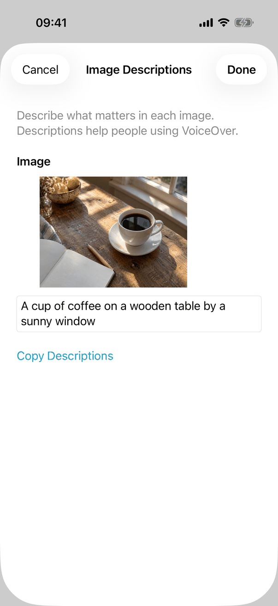
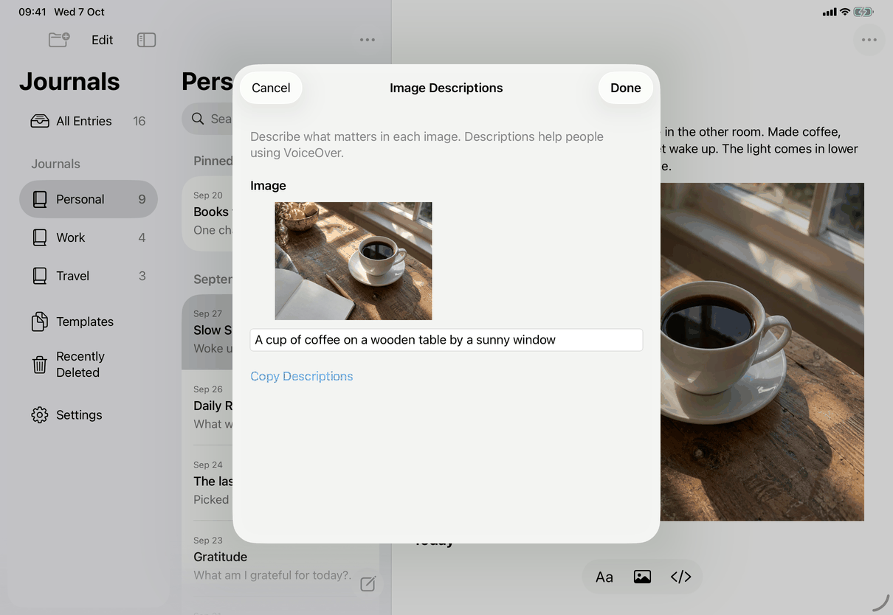
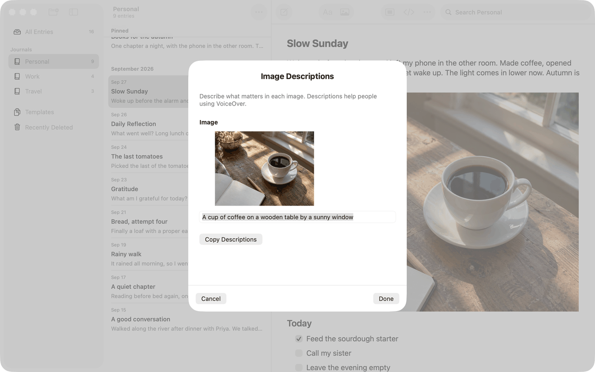

# Image Descriptions (Apple)

How the Apple apps implement the spec's [image-description](../../../screens/image-description.md): one sheet, `ImageDescriptionsView`, the same content on all three devices with different button placement. Sheet conventions are in [platform.md](../platform.md), section 9.

## Controls

`RootView` presents it with `.sheet(item: $imageDescriptionsEntry) { ImageDescriptionsView(entry: $0) }`. The item is `model.draft` (the open entry) captured when the action ran. Every entry point funnels into that one state:

- Entry Actions menu and the entry row's context menu: one `MenuAction` "Image Descriptions…" (`library.entryActions.imageDescriptions`, symbol `text.below.photo`) built by `RootView.entryActionCatalog`. It exists only when the entry has image blocks, and is enabled by `AppModel.offersImageDescriptions(for:)` (editable, not Markdown-only, not in conflict, not deleted, in a live journal or a template). From a row, `performRowAction` first selects the entry.
- A picture's menu: right-click on the Mac (`ImageActionsMac.swift`), long press on iPhone and iPad (`ImageActionsIOS.swift`, text-item menu from iOS 17), and the VoiceOver custom action "Image Descriptions" (`editor.image.describeSpoken`). These call `ImageActionSupport.describe`, which is nil, so the item is absent, unless `AppModel.canDescribeImages(in:)` is true.

Elements, in the spec's order:

| Spec element | Apple control | Notes |
| --- | --- | --- |
| Title `editor.imageDescriptions.title` | iPhone, iPad: `.navigationTitle` in a `NavigationStack`, `.navigationBarTitleDisplayMode(.inline)`. Mac: `Text` in `.title2.bold()` at the top of a `VStack` | |
| Cancel, Done | `ToolbarItem(.cancellationAction)` and `ToolbarItem(.confirmationAction)` on iOS; an `HStack` below a `Divider` on the Mac (Cancel, `Spacer`, Done) | Cancel `.keyboardShortcut(.cancelAction)`, disabled while busy or after saving. Done has no default-action shortcut. |
| Introduction `editor.imageDescriptions.intro` | `Text`, `.secondary` | First item of a `ScrollView` > `VStack(spacing: 24)` with 24 pt padding. |
| Per image: heading | `Text`, `.headline`: "Image" for one image, "Image N" for several | `editor.imageDescriptions.image` / `editor.imageDescriptions.imageNumber` |
| Preview | `Image` made by ImageIO as a thumbnail of at most 280 x displayScale pixels, `.scaledToFit()`, `.frame(maxWidth: 280, maxHeight: 160)` | The frame is 280 wide, so a narrower picture is centred in it, which is why the previews look indented in the captures. While loading, `ProgressView` with `editor.image.loading`; when missing, `Label` with the `photo` symbol and `editor.imageDescriptions.imageUnavailable`, `.secondary`. Decoded once per image and kept while the sheet is open (`ImagePreviews`). |
| Description field | `TextField` with `axis: .vertical`, `.lineLimit(1...3)`, `.textFieldStyle(.roundedBorder)`, `.submitLabel(.next)` (`.done` on the last) | Placeholder `editor.imageDescriptions.placeholder`. `describe(_:as:)` turns a typed Return into "advance to the next field" and pasted line breaks into spaces (`ImageDescription.singleLine` in JournalCore), so the field shows exactly what is saved. Disabled while busy or after saving. |
| Error or status text | `Text`, `.secondary`, `.textSelection(.enabled)` | Set from the model's `shown(.reading/.saving)` messages or the sheet's own text; announced (see Accessibility). |
| Progress | `ProgressView` titled "Loading Images…" while reloading, "Saving Descriptions…" while saving | `editor.imageDescriptions.loadingImages`, `editor.imageDescriptions.saving` |
| Copy Descriptions | Plain `Button`, hidden after saving, disabled while busy | Writes "Image N", a line break, the description, blank line between images, to the general pasteboard (`UIPasteboard` or `NSPasteboard`). |
| Reload Images, Try Again | Plain `Button`s shown after an error or when the sheet was invalidated (Reload Images), and Try Again only when saving can still succeed | Hidden while `needsEntrySave` (the entry's own writing is not saved), which is the state with the message from `messages.save.before.goBack` |
| Discard confirmation | `.confirmationDialog("Discard description changes?", titleVisibility: .visible)` with "Keep Editing" (cancel role) and "Reload Images" (destructive) | `editor.imageDescriptions.discardTitle`, `editor.imageDescriptions.keepEditing`, `editor.imageDescriptions.reload` |

States map to the spec's table: loading is the preview `ProgressView`; the empty state does not exist (the entry point is hidden without images); the error and "no longer available" states are the `error` text (`checkEligibility` sets `editor.imageDescriptions.noLongerAvailable` when the entry stops being describable, and fields stay editable but Done is disabled); busy is the progress rows; saved-but-not-shown sets `editor.imageDescriptions.savedNotShown` with Done closing.

Model: `AppModel` extension in `ImageDescriptionOperations.swift` (`canDescribeImages`, `saveImageDescriptions`, `reloadImageDescriptionEntry`), all of which first wait for the entry's own autosave (`awaitEntryAutosave`); the store call is `updateImageDescriptions` (core, `ImageDescriptions.swift`). Locking: the sheet registers `.savesBeforeLocking` (`LockSaving.swift`), which saves typed descriptions for at most two seconds before the journals lock; on lock the sheet keeps unsaved text in `model.keepUnsavedImageDescriptions` and dismisses, and `restoreKeptDescriptions` brings it back when the same entry with the same images opens the sheet again.

## Layout

- iPhone: full-height sheet, inline navigation title, Cancel leading, Done trailing; the content scrolls and focusing a field scrolls it to the top (`proxy.scrollTo(id, anchor: .top)`), so the keyboard never covers it.
- iPad: a centred form sheet (about half the window width in the landscape capture) with the same bar; no change by split-view width beyond the system's sizing.
- Mac: sheet with `frame(minWidth: 360, idealWidth: 460, minHeight: 400, idealHeight: 540)`; the title and the button row are fixed, only the middle scrolls.
- `.interactiveDismissDisabled(busy || dirty)`: swiping the sheet down is blocked with unsaved changes or work in progress, on iPhone and iPad.
- Dynamic Type: all text uses system styles; the preview frame stays 280 x 160, the text and buttons wrap.

## Commands and shortcuts

| Command | Placement | Shortcut | Enabled when |
| --- | --- | --- | --- |
| `image-descriptions` | As in [commands.md](../commands.md): Entry Actions, the row context menu and the picture menu (long press, right-click, VoiceOver action) | None | `AppModel.offersImageDescriptions(for:)` for the menus, `canDescribeImages(in:)` for the picture menu and the sheet |

In the sheet: Escape cancels on the Mac and with a hardware keyboard on iPad (`.cancelAction`), unless busy or already saved. Return in a description field moves to the next field, and after the last one ends editing (Done is not triggered by Return). Focus order is top to bottom: fields in document order, then Copy Descriptions and the recovery buttons.

## Copy differences

None. No `mac` variant applies and the sheet's wording is the spec's.

## Accessibility

- Each field: accessibility label "Image N description" (`editor.imageDescriptions.fieldLabel`), always numbered, also when there is one image. Each preview: label "Image N. description" (`editor.imageDescriptions.previewLabel`); a loading preview "Loading Image. ..." (`editor.imageDescriptions.previewLoading`); an unavailable one "... Image Unavailable" (`editor.imageDescriptions.previewUnavailable`).
- When `error` changes to a non-nil value the sheet calls `JournalAccessibility.announce` (not while locked): `UIAccessibility.post(.announcement)` on iOS, `NSAccessibility` `announcementRequested` at medium priority on the Mac.
- The sheet adds no focus management beyond scrolling the focused field to the top; Return advances focus field to field.
- Voice Control and Full Keyboard Access use the visible button titles; the fields are named by their numbered labels.

## Differences between iPhone, iPad and Mac

- Cancel and Done in the navigation bar (iPhone, iPad) against a bottom button row (Mac): the system places a `confirmationAction` in the bar on iOS; the Mac sheet has no navigation bar, so the row follows Mac dialog convention (Cancel left, Done right).
- Copy Descriptions is a plain text-style button on iPhone and iPad and a bordered button on the Mac, as the system draws them.
- Swipe-to-dismiss protection exists only on iOS, where the gesture exists.
- The picture-menu entry is a long press on iPhone and iPad and a right-click on the Mac; on all three the VoiceOver action is the same.

## Screenshots

| Device | State |
| --- | --- |
| iPhone |  Sheet with Cancel and Done, the introduction, the heading "Image", the preview of the sample photo, the description field filled in, and Copy Descriptions. |
| iPad |  The same content in a form sheet over the dimmed split view. |
| Mac |  Sheet with the title at the top, the same content, a divider, then Cancel at the left and Done at the right. The capture shows the description text highlighted; the code sets no initial focus, so the cause is the system's field behaviour in the capture (not verified). |

## Source files

View:
- `apps/apple/JournalApp/Views/ImageDescriptionsView.swift`: the sheet, previews, field handling, save, reload and lock handling.
- `apps/apple/JournalApp/Views/RootView.swift`: `imageDescriptionsEntry`, the sheet, and the entry action catalog.
- `apps/apple/JournalApp/Editor/ImageActionsIOS.swift`, `ImageActionsMac.swift`: the picture menu items and the VoiceOver action.

Model:
- `apps/apple/JournalApp/Model/ImageDescriptionOperations.swift`: eligibility, save and reload through the store.
- `apps/apple/JournalApp/Model/LockSaving.swift`: saving before the journals lock, and keeping unsaved descriptions.

Core:
- `apps/apple/Packages/JournalCore/Sources/JournalCore/ImageDescriptions.swift`: `ImageDescription.singleLine` and the update that rewrites only the alt text.

Design records: `docs/design/image-descriptions.md`, `docs/design/image-description-native-form.md`, `docs/design/pre-release-fixes-2026-09-27.md` (item i).

## Open questions

None.
