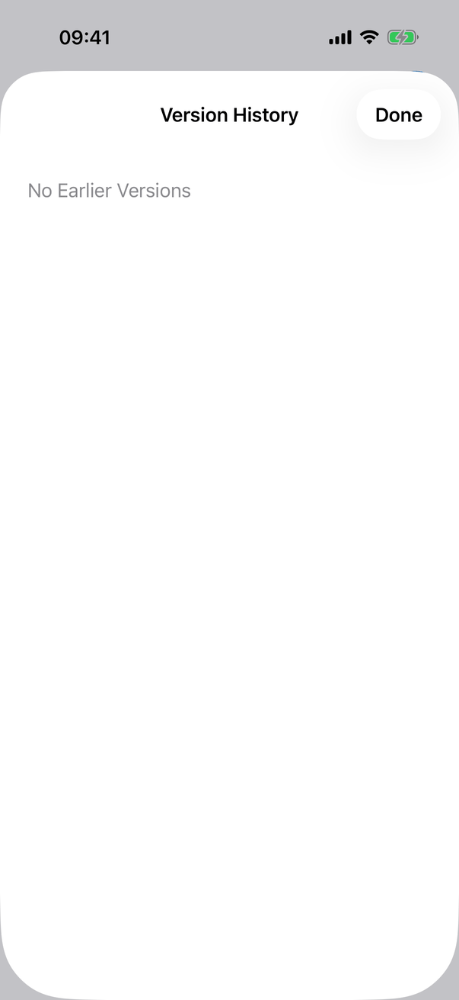
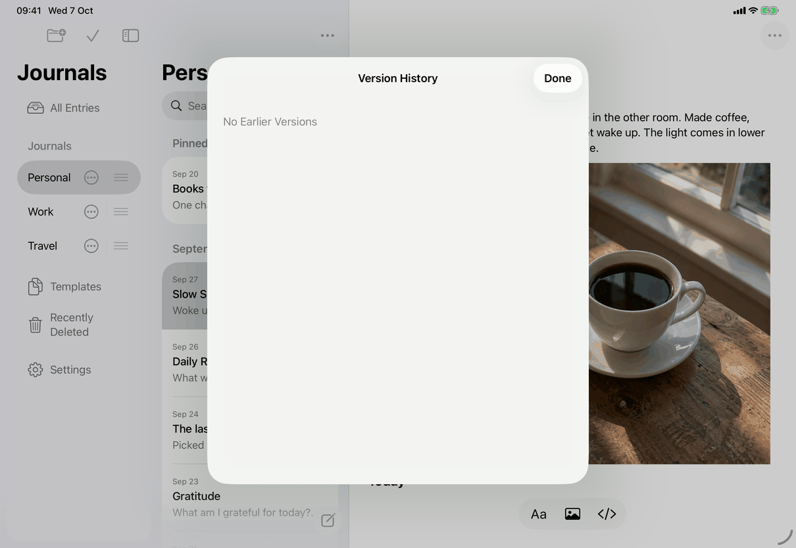

# Journal Version History (Apple)

Implements [screens/journal-history](../../../screens/journal-history.md): the earlier versions of a journal's name and default template, and Restore Settings. The entry and template form is [version-history](version-history.md). The Mac has no capture of this page (see Screenshots), so the Mac layout below comes from the source alone.

## Controls

`JournalHistoryView(journalID:)` is a sheet with its own `@State` (versions, selection, loading, preparing, busy, completed, error, result, comparison, conflict) and one cancellable `operation` task. It is presented with `.sheet(item:)` or `.sheet(isPresented:)` by every place that offers Version History: the sidebar rows and edit-mode menu (`JournalSidebarView`), the list bar's menu (`JournalMoreMenu`), the Mac toolbar menu (`JournalActionPresentation`), a deleted journal's detail (`DeletedJournalView`) and the per-journal settings form (`JournalSettingsView`). Model: `AppModel` and the store (`store.history(for:)`, `store.item`, `store.conflicts()`, `AppModel.restoreHistoricalJournalSettings`, in `Model/HistoryOperations.swift`, which commits through `commitJournalResolution`).

Container (`layout`): iOS `NavigationStack` with an inline `Version History` title (`editor.history.title`) and the Done button as `ToolbarItem(placement: .confirmationAction)`; Mac a `VStack` with the title in `.title2.bold()`, the scrolling content, a `Divider` and an `HStack` with Done at the leading end. Done is `Button("Done")` (`common.done`) with `.keyboardShortcut(.cancelAction)` (Escape) on every device and is disabled while `preparing || busy`. `.interactiveDismissDisabled(preparing || busy)` stops a swipe-down while it works.

Content (`content`, a `ScrollView` over a `VStack(alignment: .leading, spacing: 20)`, 24 points of padding), top to bottom:

1. While `loading`: `ProgressView("Loading History…")` (`editor.history.loading`). Loading runs from `.task` and calls `store.history(for:)`; the result keeps only `kind == "journal"` and is ordered by `HistoryVersions.newestFirst` (by `modifiedAt`, ties in the store's recorded order, most recent first).
2. No versions and no error: `editor.history.empty` in secondary text.
3. **Version picker** (`HistoryVersionPicker`): a `Menu` whose content is an inline `Picker("Version")` of the version titles, and whose label is `WrappingMenuLabel`: a caption (`common.version`) over the value with a `chevron.up.chevron.down`, allowed to wrap (`fixedSize(horizontal: false, vertical: true)`). The label is one accessibility element with the caption as label and the value as value. Titles are `modifiedAt.formatted(date: .abbreviated, time: .standard)` and, only for identical ones, ` · n` in recorded order (`editor.history.versionDuplicate`); with no valid selection the value is `editor.history.chooseVersion`. The first version is selected after a load. Disabled while working, completed or a comparison is open.
4. **Summary** (`JournalMetadataSummary`, defined in `JournalConflictView.swift`): three captioned fields, `common.name` (or `common.untitledJournal`), `common.defaultTemplate` (the template's title from `model.templates`, `common.blankEntry`, or `messages.conflict.journal.value.unavailableTemplate`), `messages.conflict.journal.field.location` (`common.journals` or `common.recentlyDeleted`). Each field is one combined accessibility element and its value is selectable text.
5. A version this app can read (`document.isEditable`): `Button("Restore Settings…")` (`library.journalHistory.restoreSettings`), disabled while working, when a reload is needed or while `model.replacingVault`. A version from a newer app: `editor.history.updateToRestore` and `ArchiveExportControls` (the Export Archive… button of Settings ▸ Backup, with its one-time password check; defined in `ArchiveView.swift`).
6. While `preparing`: `ProgressView("Loading Settings…")` (`library.journalHistory.loadingSettings`). `prepare()` reads the current journal, any conflict for it and the live templates, then opens the comparison, or shows `messages.lifecycle.needsReview` (and the Review Changes button), or `library.journalHistory.cantChange` (and Export Archive…).
7. Error and result text: the error is secondary and selectable, and is announced with `JournalAccessibility.announce` whenever it changes (not while locked); the result text is the plain text `library.journalHistory.restored` or `messages.history.settingsInUse`.
8. Recovery buttons (`recoveryActions`, not once completed): Reload History (`editor.history.reload`, after a failed load or `messages.history.versionUnavailable`), Review Changes (`common.reviewChanges`, opens `JournalConflictView` in a nested sheet) and Export Archive… (when the journal is missing or unsupported).

**Comparison sheet** (`JournalSettingsConfirmation`, a nested `.sheet(item: $comparison)` over the history sheet): iOS `NavigationStack` with an inline `Restore Settings` title (`library.journalHistory.confirm.title`), `Cancel` in `.cancellationAction` and `Restore` in `.confirmationAction`; at accessibility sizes the title is repeated as a header in the content. Mac `VStack` with the title, content, `Divider` and a row with Cancel (`.keyboardShortcut(.cancelAction)`) at the leading end and `Restore Settings` at the trailing end; no `.defaultAction` shortcut is set, so Return does not press it. Content: `library.journalHistory.confirm.explanation`; a summary headed `library.journalHistory.confirm.current` and one headed `common.restore`, each with `common.name` and `common.defaultTemplate` (`.headline` headings with the header trait); the sentence `library.journalHistory.confirm.nameTaken` when `model.restoringNameTaken` finds another listed journal with the earlier name (the confirming button is then disabled); `ProgressView("Restoring Settings…")` (`library.journalHistory.confirm.restoring`) while busy. Template names in the comparison (`JournalSettingsComparison`) are the title or `library.entryList.untitledTemplate`; duplicates become `title · date · n` (`library.journalHistory.templateDuplicate`); a missing template is `messages.conflict.journal.value.unavailableTemplate`, numbered (`library.journalHistory.unavailableTemplateNumbered`) when both sides name different missing templates. The sheet cannot be dismissed while busy. The confirming action runs `restore(_:)` → `model.restoreHistoricalJournalSettings(historical, expectedJournal: current)`: success sets completed and the `library.journalHistory.restored` text, and dismisses both sheets when the library refreshed; `HistoryRecoveryError.settingsAlreadyApplied` shows `messages.history.settingsInUse` (completed); a conflict reloads it for Review Changes; a missing or unsupported journal shows `library.journalHistory.cantChange` and Export Archive…; `unavailableVersion` sets the reload flag and shows `messages.history.versionUnavailable`; the changed-journal case shows `messages.history.journalChanged`.

**Locked.** `.onValueChange(of: model.locked)` cancels the task, forgets versions, comparison, conflict, error and result, and dismisses; the nested sheets go with it.

## Layout

- **Mac.** `.frame(minWidth: 360, idealWidth: 460, minHeight: 360, idealHeight: 520)`; the comparison sheet `minWidth: 360, idealWidth: 460, minHeight: 420, idealHeight: 560`. Content scrolls inside the sheet; the button row stays at the bottom.
- **iPad.** A form sheet centered over the window with a navigation bar, the window dimmed behind (screenshot). The nested comparison is another sheet over it.
- **iPhone.** A page sheet with a navigation bar; Done at the top right.
- **Dynamic Type.** Content is a `ScrollView`; the version label wraps; at accessibility sizes the comparison sheet repeats its title in the content because the navigation bar title may be truncated.

## Commands and shortcuts

| Command | Placement | Shortcut | Enabled when |
| --- | --- | --- | --- |
| `journal-version-history` | as in [commands.md](../commands.md) (journal context menu, Journal Actions, deleted journal's detail) | none | Always |
| `review-changes` | The Review Changes button here | none | The journal has changes to review |
| `export-archive` | The Export Archive… control here | none | Version from a newer app, or journal missing or unsupported |

Keyboard: Escape presses Done (`.cancelAction`) in the history sheet and Cancel in the comparison sheet, on the Mac and on iPad with a hardware keyboard. No Return default button is set on either sheet. Tab order is the system's: Version menu, Restore Settings…, Done.

## Copy differences

- `library.journalHistory.confirm.restore`: `Restore` on iPhone and iPad (a button in the navigation bar next to the sheet title), `Restore Settings` on the Mac (the button names its action because it sits in a row at the bottom of a sheet). In code the two are separate `#if os(iOS)` branches of `restoreButton`.

## Accessibility

- The Version menu is read as its caption and its full value (`WrappingMenuLabel` hides its children and sets label and value).
- Each summary field is one element; each summary heading has `.accessibilityAddTraits(.isHeader)`; the group is `.accessibilityElement(children: .contain)`.
- Errors are announced through `JournalAccessibility.announce` (`NSAccessibility.post(.announcementRequested)` on the Mac, `UIAccessibility.post(.announcement)` on iOS); the result text is plain text and is not announced separately.
- The comparison's content carries an accessibility identifier for UI tests.
- Reduce Motion, Increase Contrast and Reduce Transparency: nothing page-specific.

## Differences between iPhone, iPad and Mac

- **Chrome.** iPhone and iPad use a navigation bar with Done (confirming position) and, in the comparison, Cancel and Restore; the Mac draws the title, a divider and a button row itself, because a Mac sheet has no navigation bar.
- **Sheet size.** The Mac sets explicit minimum and ideal sizes; iOS lets the system size the sheet.
- **Confirming label.** Restore on iOS, Restore Settings on the Mac (see Copy differences).

## Screenshots

Both captures show the empty state of a journal with no earlier versions (`editor.history.empty`). The loaded states (Version menu, summary, Restore Settings…, the comparison sheet) and every Mac state have no capture.

| iPhone | iPad |
| --- | --- |
|  |  |

## Source files

View:
- `apps/apple/JournalApp/Views/JournalHistoryView.swift`: the sheet, loading, preparing and restoring.
- `apps/apple/JournalApp/Views/JournalSettingsConfirmation.swift`: the comparison sheet and `JournalSettingsComparison`.
- `apps/apple/JournalApp/Views/HistoryMenu.swift`: `HistoryVersionPicker`, `WrappingMenuLabel`, `HistoryVersions` (order and titles).
- `apps/apple/JournalApp/Views/JournalConflictView.swift`: `JournalMetadataSummary` and the journal's Review Changes sheet.
- `apps/apple/JournalApp/Views/ArchiveView.swift`: `ArchiveExportControls`.

Model:
- `apps/apple/JournalApp/Model/HistoryOperations.swift`: `restoreHistoricalJournalSettings`.

Core: `HistoryRecoveryError` in `apps/apple/Packages/JournalCore/Sources/JournalCore/HistoryRecovery.swift`; `store.history(for:)` and `restoreJournalSettings` in the same package.

Design record: `docs/design/history-recovery.md`.

## Open questions

See [open-questions.md](../../../open-questions.md), B22: the version summary (`JournalMetadataSummary`) shows a template's raw title, so a template with a blank title gives an empty Default Template value, while the comparison sheet shows `library.entryList.untitledTemplate` for the same template.
