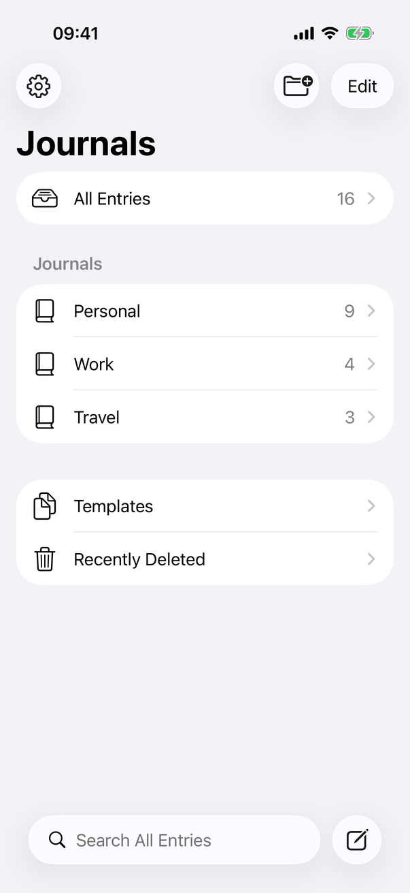
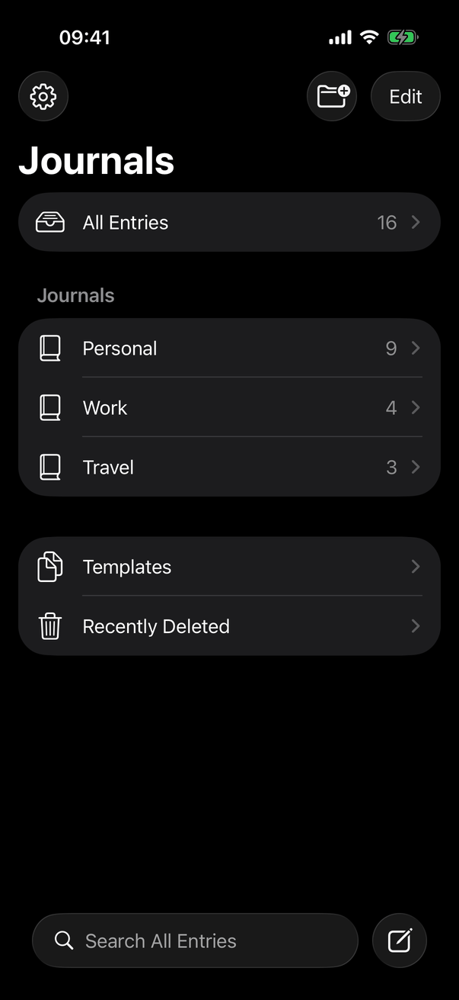
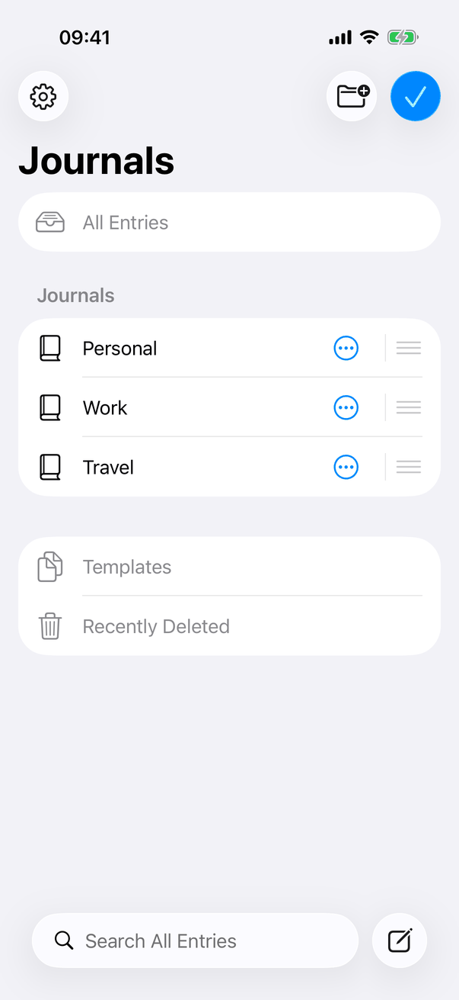
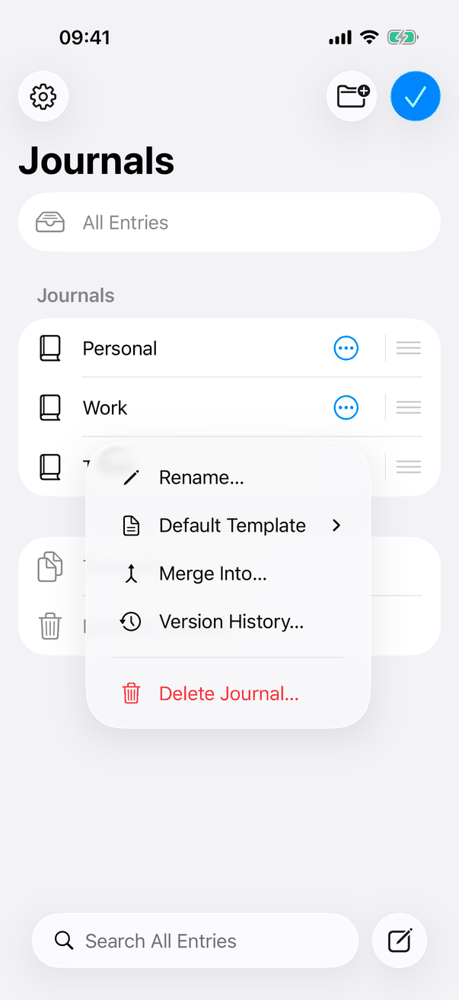
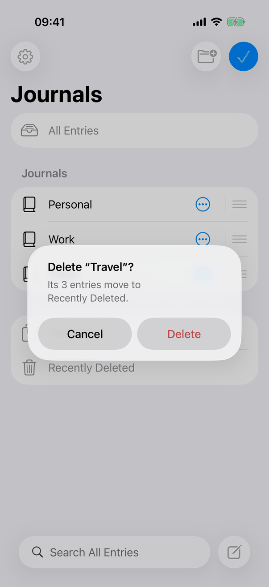
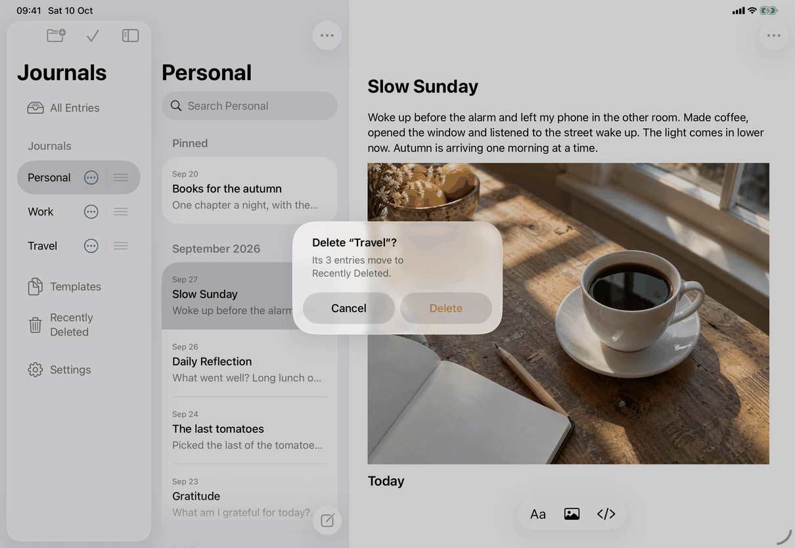
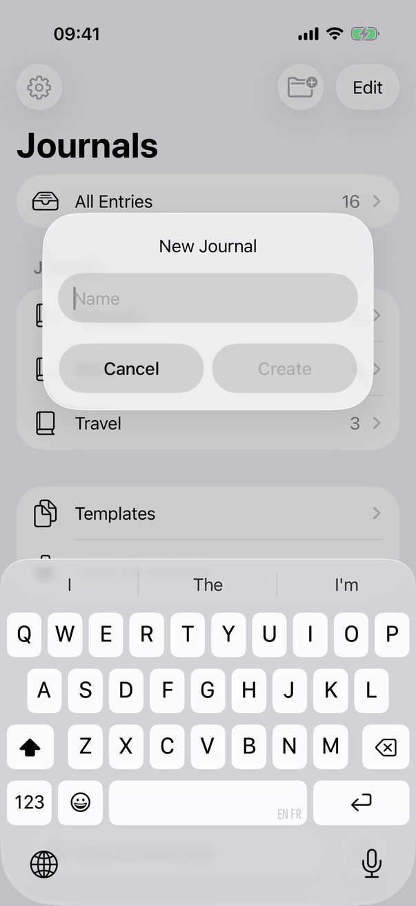
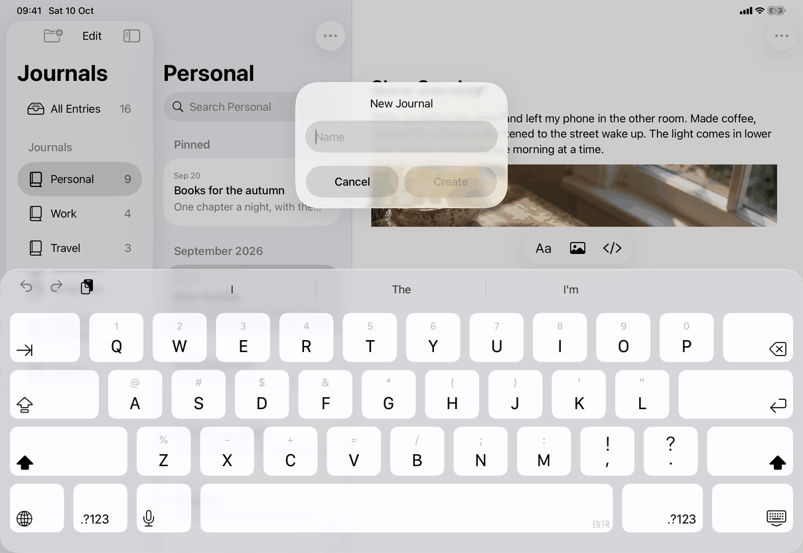
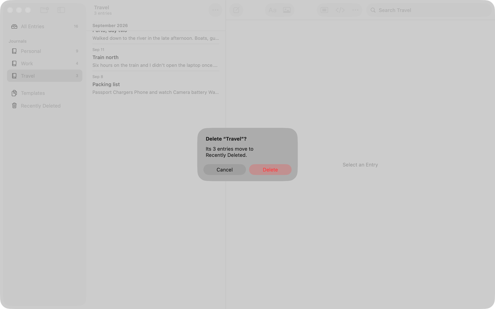
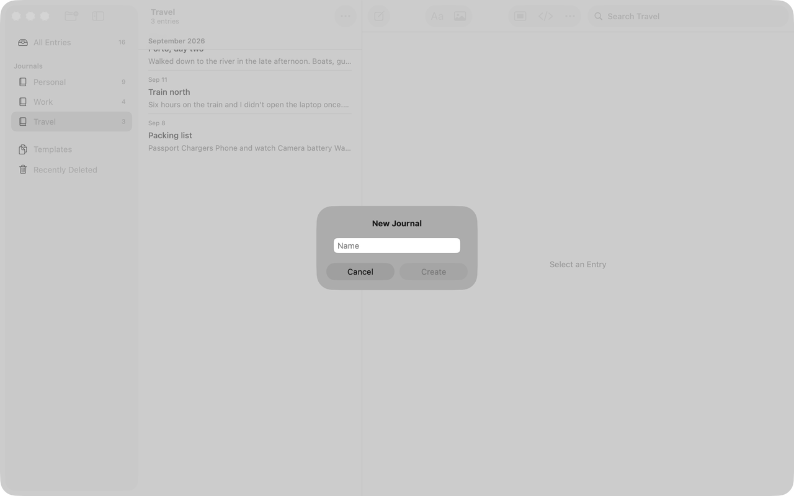

# Journals (Apple)

Implements [screens/journals](../../../screens/journals.md): the list that chooses what the entry list shows, and where journals are created, renamed, deleted and reordered. It is the Mac and iPad sidebar and the iPhone root page. The window around it is [library-window](library-window.md).

## Controls

One view, `JournalSidebarView`, serves all three devices. It is a `List` whose rows are built by `destinationRow`; what a row is depends on the device:

| Device | Row control | Selection |
| --- | --- | --- |
| Mac | `Label(...).badge(count).tag(destination)` | `List(selection:)` bound to `model.destination`; choosing calls `model.show(_:)` |
| iPad (regular width) | `Button` with `.buttonStyle(.plain)` and `.tag(destination)`, label from `rowLabel` (symbol, name, count at the trailing end) | the same binding; the button calls `onNavigate` (`openRegularCollection`), which also hides the sidebar in a window under 1,000 points |
| iPhone and stacked iPad | `NavigationLink(value: CompactJournalRoute.collection(destination))` with `rowLabel`, drawn with a chevron | none (`List(selection: nil)`); the stack's path is the state |
| Edit mode (iOS) | the row's label alone, dimmed and `.disabled(true)` for fixed rows; see Edit mode below | the highlight stays on the collection that was shown |

`JournalDestination` (`.journal(UUID)`, `.all`, `.templates`, `.deleted`, `.unavailable`) names a row. Rows, in the order of the spec's Content section:

1. **All Entries**: `destinationRow` with symbol `tray.full`, name `library.journals.allEntries`, count `model.entryCount(in: .all)`.
2. **Journals section**: `Section("Journals")` (`common.journals`) over `ForEach(listedJournals)`: closed-book symbol (`book.closed`), `JournalNames.displayName(title)` (which gives `common.untitledJournal` for a blank name), count. `listedJournals` is `model.journals` without journals being deleted (`lists.deleting`), so a deleted row leaves at once. `.onMove` is attached only while `model.canMoveJournals` (library available, unlocked, not being replaced, order not from a newer version).
3. **Second group**: Templates (`doc.on.doc`, `library.journals.templates`), Recently Deleted (`trash`, `common.recentlyDeleted`), and Unavailable Journals (`exclamationmark.folder`, `common.unavailableJournals`) only while `model.hasUnavailableEntries` or that collection is shown. None of these shows a count: `entryCount(in:)` returns nil for them.
4. **iPad Settings row** (iOS, `showsToolbar` only, so not on the iPhone root, which has the gear in its bar): a `Section` with a `Button` that sets `model.settingsPresented`, `Label` with `gearshape`, copy `library.toolbar.settings`; a dimmed `Label` while editing.

The list has `.listStyle(.sidebar)` on every device and `.accessibilityLabel("Journals")`. On the Mac `SidebarTopEdgeEffectHidden` turns off the scroll edge effect on macOS 26, which otherwise kept a stale light sample behind the toolbar icons after a switch to dark (design record `docs/design/mac-window-appkit.md`).

**Counts.** The Mac badge is `badge(count ?? 0)`, and SwiftUI draws nothing for 0; iPhone and iPad draw the number (`Text(count.formatted())`), so a journal with no entries shows `0`. At accessibility text sizes `rowLabel` becomes a `VStack` with the count under the name as a sentence (`common.entryCount`, written in code as "1 entry" or "N entries").

**Empty and error states.** No journal in use: the section is empty and Edit is hidden (`JournalEditToolbarItems` checks `model.journals.isEmpty`). The empty entry list offers New Journal… (see [entry-list](entry-list.md)). Locked or being replaced: edit mode ends (`AppModel` sets `editingJournals = false` from the `locked` and `vaultReplacement` observers), `canMoveJournals` is false, and the VoiceOver move actions are not attached.

### Actions and their controls

- **New Journal.** `RootView` owns the alert: `.alert("New Journal", isPresented: $newJournal)` with a `TextField("Name")` (`common.name`), `Cancel` and `Create` (disabled while the name is blank after trimming). The title is `library.newJournal.title`. The Mac and the File menu set `model.newJournalRequested`, which `presentRequestedNewJournal()` answers (also from `.onAppear`, because the menu may ask while no window is open); iPhone and iPad set `newJournal` directly. A taken name (`model.journalNameTaken`) shows the Name Taken alert (`library.nameTaken.title`, `library.nameTaken.message`, `common.ok`) from `journalNameTakenAlert`; its OK reopens the name alert. Both alerts are chained through `afterAlertCloses(model)`, which waits 350 ms because SwiftUI drops an alert presented while another one is still closing, and does nothing if the app locked meanwhile. When New Entry opened it with no journal, `createAfterJournal` starts the entry once the journal exists. `model.createJournal` shows the new journal unless `editingJournals`.
- **Journal actions.** One catalog, `AppModel.journalActions(_:rename:delete:)` in `JournalSidebarView.swift`, returns `MenuAction` values (command, submenu, separator; `MenuAction` is in `MenuActions.swift`). It is shown as SwiftUI `MenuActionsView` in context menus, in the edit-mode ⋯ `Menu`, and as an AppKit `NSMenu` in the Mac toolbar menu (`MenuActionTarget`), so the three always agree. Items: `library.journalActions.rename` (`pencil`), a separator, `library.journalActions.deleteJournal` (`trash`, destructive); the Mac menus start with `common.newJournalEllipsis`, a separator, then these. Nothing is disabled for a conflict: a journal is never in conflict, and one whose change from another device is held is not listed at all. The list bar's ⋯ on iPhone and iPad is a separate view, `JournalMoreMenu`, with the same items, built directly in SwiftUI. The alerts and sheets of the actions exist three times, each with its own state: `JournalSidebarView` (rows and edit mode), `JournalMoreMenu` (list bar), and `JournalActionPresentation` in `RootView+MacWindow.swift` (Mac toolbar). A port should have one.
- **Rename.** Alert `library.renameJournal.title`, `TextField("Name")` starting with the current title, `common.cancel`, `library.renameJournal.rename` (disabled while blank). `model.changeJournal(_:name:)` trims the name and saves through a serialized task chain (`editJournal`); a taken name goes to Name Taken and back to Rename. The edit rewrites only the name: the record's stored `defaultTemplateID` of earlier versions is kept unchanged (earlier devices still use it; this version ignores it).
- **Delete Journal.** `journalDeletionPrompt` (`JournalDeletionPrompt.swift`): `prepare` calls `model.prepareJournalDeletion` (saves the open entry and checks the journal) and only then shows an alert titled `library.deleteJournal.title`, message `library.deleteJournal.noEntries` or `library.deleteJournal.message`, buttons `common.delete` (`role: .destructive`) and `common.cancel`. Delete hides the row in the same update (`model.hideInLists`, animated unless Reduce Motion) and `commit` deletes; the row comes back (`showInLists`) when it is done or fails. Failures: an unsupported journal and any other error go to the general error alert; `messages.refresh.journalDeletedView` when only the display refresh failed; deleted already or missing is ignored.
- **Reorder.** Mac: SwiftUI `.onMove` on the Journals `ForEach`, so the system draws the drag and the insertion line. iPhone and iPad: edit mode makes the same `.onMove` show reorder handles (`.environment(\.editMode, .constant(.active))` while `model.editingJournals`; outside edit mode the environment is left alone so touch-and-hold dragging still works). `move(_:to:in:)` turns the drop position into "before this journal" among all journals, because the list shown leaves out journals being deleted; `model.moveJournal` shows the new order at once (`lists.journalOrder`), stores it, schedules a sync, calls `announceForAccessibility` with `messages.announce.journalMovedAbove` or `messages.announce.journalMovedBelow` (`moveAnnouncement`), and registers an Undo step named `library.journals.undoMove` (`LibraryUndo`). A failed store restores the previous order and sets the general error `messages.generic.moveJournalFailed`. On iOS `.accessibilityActions` adds `library.journals.moveUp` and `library.journals.moveDown` to each journal row, left out at the ends.

### Edit mode (iPhone and iPad)

`JournalEditToolbarItems` and `JournalEditButton` (iOS only): `Button("Edit")` (`library.toolbar.edit`; disabled while not ready, locked or replacing) and, while `model.editingJournals`, `Button(role: .confirm)` on iOS 26, which the system draws as the confirming checkmark and VoiceOver reads as Done; before iOS 26 a `Label("Done", systemImage: "checkmark")`. The toggle uses `withAnimation(AppModel.listAnimation)`, which is nil with Reduce Motion. In edit mode `journalRow` swaps the row for an `HStack`: the name (with the book symbol only when stacked, to leave the name room in the iPad's narrow sidebar), then `journalActionsControls`: a borderless `Menu` with `ellipsis.circle` (`library.toolbar.journalActions`; 44 points tall with a negative vertical padding so the row keeps its height), a 1-point `Divider`, and the system reorder handle. Fixed rows are dimmed and not selectable. New Entry and the stacked Journals page's search end edit mode (`EntryCreationActions`, `.onValueChange(of: journalsSearchPresented)`); New Journal does not, and `createJournal` then adds the journal without showing it.

## Layout

- **Mac.** The sidebar is the first column of the window's `NSSplitViewController` (210 to 320 points, 230 preferred; see [library-window](library-window.md)). The toolbar's first section holds New Journal and the sidebar button. No Settings row and no Edit: Settings is in the app menu. The sidebar's empty area has a context menu (`.contextMenu(forSelectionType:)`, empty selection only) with New Journal…; a row's context menu starts with New Journal… and a divider.
- **iPad, regular width.** The sidebar column of `NavigationSplitView` (180 to 320, ideal 220) with a large navigation title `common.journals` (`.navigationBarTitleDisplayMode(.large)`), a bar with New Journal (`folder.badge.plus`) and Edit, and Settings as the last group. The narrow column wraps long names (the screenshots show Recently Deleted on two lines).
- **iPhone, and iPad in compact width or at an accessibility text size.** The root page of the `NavigationStack`: `JournalSidebarView(showsToolbar: false, stacked: true)`. Its own toolbar is off; `compactToolbar` supplies Settings (top left), New Journal and Edit (top right), and the bottom bar with the Journals search field and New Entry ([library-window](library-window.md)). While the search field has text, `JournalSearchResults` replaces the list ([search](search.md)).
- **Dynamic Type.** At accessibility sizes `rowLabel` stacks name and count, names wrap (`fixedSize(horizontal: false, vertical: true)`), and edit mode keeps the count because it is part of the name block.

## Commands and shortcuts

| Command | Placement | Shortcut | Enabled when |
| --- | --- | --- | --- |
| `choose-collection` | as in [commands.md](../commands.md) | Mac: Up and Down in the focused sidebar | Always while unlocked; not in edit mode |
| `new-journal` | as in commands.md | as in commands.md (⌥⌘N on Mac and iPad) | Library open and unlocked; Mac also leaves Editor Only first |
| `new-journal-context` | Mac sidebar context menu; empty entry list | | Library open and unlocked |
| `journal-actions` | as in commands.md | | Rows as per the catalog; the list bar's ⋯ only while a journal is shown |
| `rename-journal` | as in commands.md | | Journal in use |
| `delete-journal` | as in commands.md | | Always (the deletion is checked first) |
| `reorder-journal` | as in commands.md | Escape cancels a Mac drag (system) | `canMoveJournals` |
| `journals-edit` | iPhone top right; iPad sidebar bar | | Not locked, not replacing; hidden without journals |
| `open-settings` | iPad last sidebar row; iPhone gear (library window) | | Dimmed in edit mode |
| `undo`, `redo` | Edit menu | ⌘Z, ⇧⌘Z | Edit ▸ Undo Move Journal while a move can be undone |

The alerts are system alerts (`.alert` with a `TextField` for New Journal and Rename), so their keys are the platform's (Return for the default button, Escape for Cancel on the Mac); the page adds no key handling. Arrow keys in the focused Mac sidebar choose the previous or next collection through the list's selection.

## Copy differences

None. The sidebar uses the spec's text on every device. The only platform-specific wording is the first item of the Mac menus, New Journal… (`common.newJournalEllipsis`), which iOS menus do not carry because the bar has a New Journal button.

## Accessibility

- The list is labelled `common.journals`. Each row is a button or link, so the name and count are read with it; at accessibility sizes the count is a second line of the same row.
- iOS journal rows carry the custom actions `library.journals.moveUp` and `library.journals.moveDown` (`.accessibilityActions`). The spec wants focus to stay on the moved row; the code sets no accessibility focus for it, so that relies on the list keeping the row's identity when the order changes (not verified with VoiceOver). The move is announced with `announceForAccessibility`.
- Edit mode: dimmed rows are `.disabled(true)`, so VoiceOver reads them as dimmed; the ⋯ menu has the label `library.toolbar.journalActions` and an identifier made from the journal's id (`Journal Actions <id>`) for UI tests; the confirming button reads as Done.
- Reduce Motion: edit toggling, row deletion and reordering use `AppModel.listAnimation` or `withAnimation(reduceMotion ? nil : .default)`.
- No custom handling for Voice Control or Full Keyboard Access.

## Differences between iPhone, iPad and Mac

- **Edit mode and the Edit button: iPhone and iPad only.** The Mac reorders by dragging a row directly with the pointer (owner decision, `docs/design/journal-order.md`), where touch has Edit with handles, as in Notes' Folders list.
- **Settings row: iPad only.** iPhone has the gear in the Journals page bar; the Mac has Settings in the app menu (⌘,) and its own window. On iPad the sidebar is always visible, so a last row is the natural place (owner decision).
- **Counts of zero** show `0` on iPhone and iPad and nothing on the Mac: `Label.badge` hides 0, while the iOS rows draw their own count.
- **New Journal… in context menus: Mac only**, because the Mac sidebar has no always-visible add button inside the list; iOS has the bar button.
- **Selection.** The Mac and iPad keep a selected row because the list column is visible beside it; iPhone pushes a page per row and has no selection.
- **Menu symbols.** The Mac menus show the symbols as `NSMenuItem` images.

## Screenshots

The iPhone captures are the stacked Journals page; the iPad captures show the sidebar in the three-column window; the Mac captures show the alerts over the window (the Mac sidebar itself is visible in [library-window](library-window.md)).

| State | iPhone | iPad |
| --- | --- | --- |
| Default |  |  |
| Default, dark |  |  |
| Edit mode |  |  |
| Journal actions menu |  |  |
| Delete confirmation |  |  |
| New Journal alert |  |  |

| State | Mac |
| --- | --- |
| Delete confirmation |  |
| New Journal alert |  |

## Source files

View:
- `apps/apple/JournalApp/Views/JournalSidebarView.swift`: the list, all row variants, edit mode, reordering, the journal action catalog, `JournalDestination`.
- `apps/apple/JournalApp/Views/JournalEditButton.swift`: Edit and Done (iOS).
- `apps/apple/JournalApp/Views/JournalMoreMenu.swift`: the list bar's Journal Actions menu (iOS).
- `apps/apple/JournalApp/Views/JournalDeletionPrompt.swift`: the Delete Journal prompt.
- `apps/apple/JournalApp/Views/JournalNameTakenAlert.swift`: Name Taken and `afterAlertCloses`.
- `apps/apple/JournalApp/Views/MenuActions.swift`: `MenuAction`, shown as SwiftUI or AppKit menus.
- `apps/apple/JournalApp/Views/RootView.swift` (New Journal alert), `Views/Mac/RootView+MacWindow.swift` (Mac toolbar menu and its alerts), `Views/CompactJournalNavigation.swift` (the stacked root).

Model:
- `apps/apple/JournalApp/Model/JournalNavigation.swift`: `journals`, counts, `show`, destination.
- `apps/apple/JournalApp/Model/LibraryOperations.swift`: `moveJournal`, `canMoveJournals`, the announcement and Undo.
- `apps/apple/JournalApp/Model/JournalOperations.swift`: `createJournal`, `deleteJournal`, `prepareJournalDeletion`.
- `apps/apple/JournalApp/Model/JournalEditing.swift`: `journalNameTaken`, `changeJournal`, serialized edits.

Core: `JournalNames` (name comparison and numbering) and `JournalRanks` (the order) in `apps/apple/Packages/JournalCore`.

Design records: `docs/design/journal-order.md`, `docs/design/journal-name-uniqueness.md`, `docs/design/owner-decisions-2026-09-25.md`, `docs/design/ios-delete-all-and-settings-2026-10-03.md`.

## Open questions

See [open-questions.md](../../../open-questions.md): (1) A44, the spec says searching ends edit mode on iPhone and iPad; in code only the stacked Journals page's search does, and the iPad list column's search does not. (2) The menu screenshots below were captured before 1.1 and still show the removed items; they are recaptured when the owner says the listing screenshots are due.
