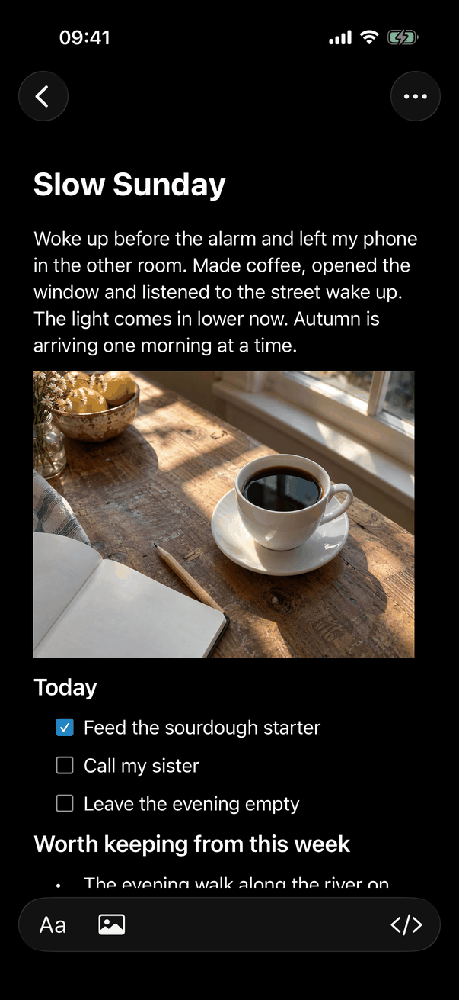
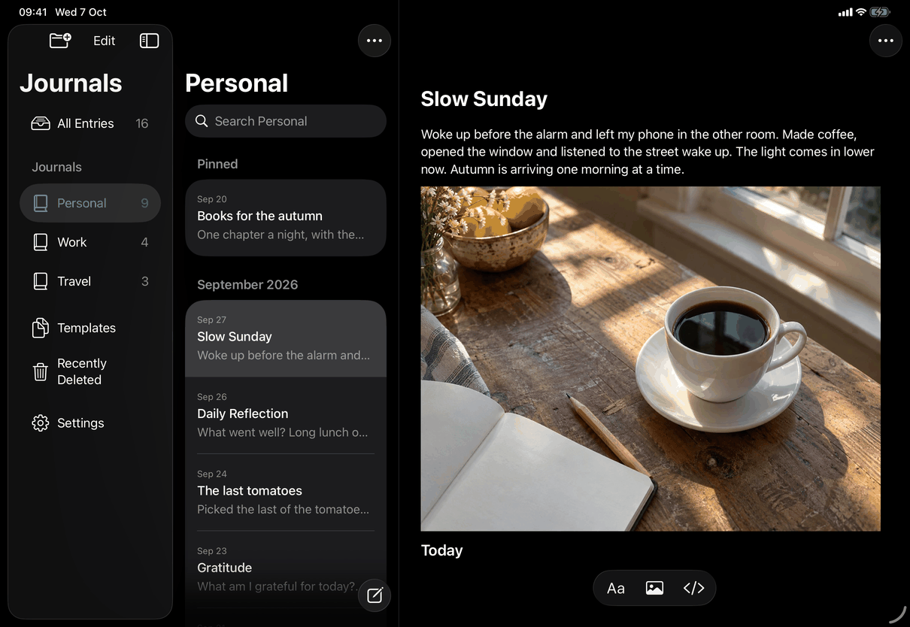
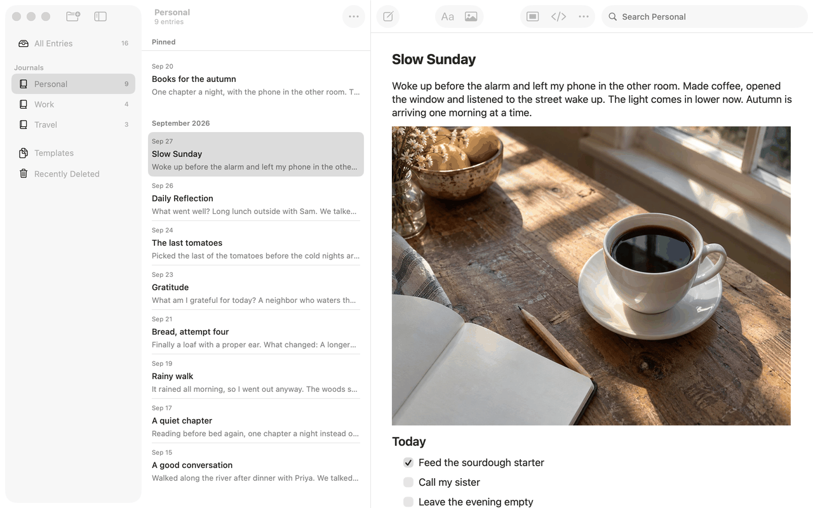

# Library window (Apple)

Implements [screens/library-window](../../../screens/library-window.md): the window that holds the journals, the entry list and the editor. Conventions shared by every page (shell, windows, menus, sheets, keyboard) are in [platform.md](../platform.md); this page records what is specific to the window itself. The sidebar, the list and the editor have their own pages: [journals](journals.md), [entry-list](entry-list.md), [search](search.md).

## Controls

One SwiftUI scene, `WindowGroup(id: "journal")` in `JournalApp.swift`, whose root is `RootView` with two shared objects, `AppModel` (all library state and operations, in `Model/` extensions) and `EditorActions` (what the editor and the menus ask of each other). `RootView.window` picks what the window shows from the model's state, in this order:

| State | What shows | Copy |
| --- | --- | --- |
| Configuration not read yet (loading) | `ProgressView` with a title, no other control | `library.app.loading` |
| Locked | `UnlockView` ([lock-screen](lock-screen.md)) | |
| Library problem, no library, recovery key | `LibraryProblemView`, the welcome screen, `RecoveryView` (other pages) | |
| Otherwise | `mainNavigation`, below | |

`mainNavigation` is a different container on each platform, chosen at compile time and then by `usesStackedNavigation`:

- **Mac:** `MacJournalWindow`, an `NSViewControllerRepresentable` around `JournalSplitViewController` (an `NSSplitViewController`). It has three `NSSplitViewItem`s, each hosting SwiftUI in an `NSHostingController`: `NSSplitViewItem(sidebarWithViewController:)` with `JournalSidebarView`, `NSSplitViewItem(contentListWithViewController:)` with the entry list (`listedSidebar`, a `List` in `.listStyle(.inset)`), and a plain item with `detail`. SwiftUI's `NavigationSplitView` is not used on the Mac: the toolbar sections have to line up with the dividers, which only `NSToolbar` with `NSTrackingSeparatorToolbarItem` does, and the window must hide the sidebar by itself when it is too narrow. The window is made `.ignoresSafeArea()` so the sidebar runs under the title bar. Model: `windowColumns` (`WindowColumns`, in `Model/WindowColumns.swift`) is `@SceneStorage("windowColumns")`, one value per window.
- **iPad, regular width:** `NavigationSplitView(columnVisibility:)` with three columns, `JournalSidebarView` (sidebar), `listedSidebar` (content) and `detail` (detail), `.navigationSplitViewStyle(.balanced)`.
- **iPhone, iPad in compact width, iPad at an accessibility text size:** `NavigationStack(path:)` over `[CompactJournalRoute]` (`.collection(JournalDestination)` and `.entry(UUID)`), in `CompactJournalNavigation.swift`. The root is `JournalSidebarView(stacked: true)`, or `JournalSearchResults` while the Journals search field has text ([search](search.md)). Pages are built through `navigationDestination(for:)` inside `ModelObservingPage`, which rebuilds the page on every model change; without it a list kept showing an entry that had just been deleted. Rows use `NavigationLink(value:)`. The list has no selection binding here (`listSelection` is nil).

The Mac list rows are not `NavigationLink`s: the list column lives in AppKit's split view outside any navigation container, where a link is drawn dimmed. `entryLink` in `CompactJournalNavigation.swift` returns the row with `.tag(id)` there and the selection opens the entry.

**Detail column when nothing is open** (`detailContent`): a view that fills the column and is blank, overlaid with `library.window.selectEntry` when the list has entries, and with the list's empty state (`emptyListState`) only on the Mac in Editor Only with an empty list (`showsEmptyListInEditor`). The column keeps a measured size when blank; do not return an empty view there.

**Mac window title and subtitle.** `.navigationTitle` is the collection's name, or `library.app.name` with no collection; `.navigationSubtitle` is `collectionSubtitle` in `RootView+MacWindow.swift` (the count strings, `common.entryCount`, `common.templateCount`, `common.itemCount`, with `library.window.subtitle.noItems`; empty while the library is not ready). `JournalToolbarController.applyTitle` sets `window.titleVisibility = .hidden` while the list is hidden, so Editor Only shows no title; the Window menu keeps it. `uninstall` resets title and subtitle to the app's display name when the toolbar is removed (locking), so nothing of a journal stays in the title bar.

**Mac toolbar.** `JournalToolbarController` owns one `NSToolbar` (display mode icon only, customization off, `window.titlebarSeparatorStyle = .none`). Its sections follow the dividers through `.sidebarTrackingSeparator` and a tracking separator at divider index 1. A column that hides takes its items with it, before it collapses, and gets them back after it has expanded (`showColumns`), so no item rides over another column or falls into the overflow menu. `RootView.toolbarConfiguration` (in `RootView+MacWindow.swift`) rebuilds the configuration on every update.

| Over | Item | AppKit control and symbol | Notes |
| --- | --- | --- | --- |
| Sidebar | New Journal | `NSToolbarItem`, `folder.badge.plus` | Enabled when `isReady && !locked` |
| Sidebar | Sidebar button | the system `.toggleSidebar` item | |
| List | Journal Actions | `NSMenuToolbarItem`, `ellipsis`, indicator hidden | Menu filled on demand from `MenuAction` values (`journalActionCatalog`); New Journal… first, then the shown journal's actions |
| Editor | New Entry | `NSToolbarItem`, `square.and.pencil` | Enabled when `isReady && !locked && !replacingVault`; with no journal in use it opens New Journal first (`newEntryFromToolbar`) |
| Editor | Formatting | `ToolbarPopover` button, `textformat` | Popover opens without animation; enabled while the open item can be edited |
| Editor | Insert Image | `NSToolbarItem`, `photo` | Open panel; enabled while the open item can be edited |
| Editor | Sync Status | a fixed-size slot view holding a menu button, `exclamationmark.icloud` | The slot exists only when `model.connection != nil` and is kept while the button is hidden, so nothing moves; the button fades in (not with Reduce Motion); `visibilityPriority = .low` makes it the first item to overflow |
| Editor | Editor Only | `NSButton`, `.pushOnPushOff`, `.toolbar` bezel, `rectangle.center.inset.filled` | Pressed while Editor Only is on; tooltip `library.toolbar.editorOnly.help` or `library.toolbar.editorOnly.helpActive` |
| Editor | View Source / View Preview | `NSToolbarItem`, `chevron.left.forwardslash.chevron.right` / `doc.richtext` | Tooltip `common.previewUnavailable` while the entry must stay Markdown |
| Editor | Entry Actions | `NSMenuToolbarItem`, `ellipsis` | Enabled while an entry or template is open |
| Editor | Search | `NSSearchToolbarItem`, 200 points preferred (`FocusReportingSearchField`) | Placeholder, tooltip and accessibility label are all the search prompt ([search](search.md)) |

**iPhone and iPad bars** are SwiftUI toolbars:

- Journals page (iPhone, `compactToolbar`): `ToolbarItem(placement: .topBarLeading)` Settings (`gearshape`, `library.toolbar.settings`); `.primaryAction` New Journal (`folder.badge.plus`) and `JournalEditToolbarItems` (Edit, or the system confirm checkmark while editing; on iOS 26 a fixed `ToolbarSpacer` separates the two); bottom bar: the search item and `EntryCreationActions` icon only.
- iPad sidebar: the same New Journal and Edit as items of the sidebar's own bar, large navigation title `common.journals` (`.navigationBarTitleDisplayMode(.large)`), no Settings button because Settings is the sidebar's last row ([journals](journals.md)).
- List (`listToolbar`): `.primaryAction` `JournalMoreMenu` (Journal Actions, `ellipsis`) while a journal is shown; `.primaryAction` Delete All while `offersDeleteAll` (Recently Deleted with items and no search; disabled unless `canDeleteAll`); bottom bar: search and New Entry. The search item is added with `DefaultToolbarItem(kind: .search, placement: .bottomBar)` on iOS 26; the list also carries `.searchable` ([search](search.md)).
- Editor (`mainToolbar`, only while a draft is open on iPad): `.primaryAction` Entry Actions (`entryMenu`, `ellipsis`, indicator hidden) and, while the editor is in editing state (`EditorActions.editing`), Done (`checkmark`, `common.done`), which ends typing and waits for the save (`model.finishPendingSave()`). Below the writing, `ReadingBar` is a `safeAreaInset(edge: .bottom)` capsule (glass on iOS 26, `.bar` material before) holding Formatting, Insert Image and View Source; it is replaced by the keyboard accessory while typing, and is up to 600 points wide in the stacked layout and as wide as its contents in the split layout (`fitsContents`).

**Zoom** (`zoom-in`, `zoom-out`, `actual-size`) sets `AppModel.textSize`, 12 to 30 in steps of 1, default 16 (`AppModel.defaultTextSize`), kept in memory only. `RootView.editorSize` gives the Mac editor that value in points; on iPhone and iPad it is `preferredTextSize * textSize / 16`, with `preferredTextSize` a `@ScaledMetric` of 17, so Dynamic Type still applies.

**Alerts the window owns** (`RootView.window`): the general error alert (title text in code is the app name, message `model.error`, `common.ok`, and `common.tryAgain` first when `model.saveFailure`), New Journal and Save as Template text-field alerts, and the Name Taken alert. They are suppressed while locked. `closePresentations()` dismisses every sheet, popover and panel when the app locks, a library problem appears or the library is erased.

**Mac close and quit.** `WindowCloseGuard` installs `WindowDelegateProxy`, which answers `windowShouldClose` (flush the draft; if it cannot be saved, `presentSaveRecovery()` shows an `NSAlert` with `messages.save.mac.title`, `messages.save.mac.message` and the single button `messages.save.mac.keepOpen`, and the window stays) and forwards every other delegate message to SwiftUI's own delegate. `ApplicationDelegate.applicationShouldTerminate` does the same on quit and then `sendWritingBeforeQuitting(within: 3)`.

**Leaving the app on iPhone and iPad.** `JournalApp` observes `scenePhase`: on `.background` it calls `model.applicationEnteredBackground()` and `BackgroundActivity.run("Save and lock")`, which locks first and then saves, so no journal content shows after the switch; a task keyed on `scenePhase == .background` syncs again on return. While `scenePhase != .active` and App Lock is on, a `LockedCover` overlay hides the window (the app-switcher privacy cover, see [platform.md](../platform.md)).

## Layout

- **Mac.** Window default 1100 x 720 (`.defaultSize`), minimum 801 x 420 (`.frame(minWidth:minHeight:)` on `RootView`). Column widths come from `JournalSplitViewController`: sidebar 210 to 320 (preferred 230), list 360 to 460 (preferred 360), editor minimum 439. The list's minimum is deliberately the width AppKit needs for the toolbar section when the sidebar is hidden, so the list does not change width when the sidebar hides. Holding priorities (sidebar 270, list 260, editor 250) make a window resize go to the editor first. Dividers stop at the minimums; the list collapses only for Editor Only. A window narrower than all three minimums hides the sidebar (`windowSizeProposed`), never the list or editor; showing a column in a window too narrow for it widens the window (`widenWindow`, not in full screen). Widths the person dragged are saved 0.3 s after the drag ends (`WindowColumns.sidebarWidth` and `listWidth`) and re-applied when the window opens. The editor text is at most 760 points wide and centered (`.frame(maxWidth: 760)`), with a 24-point margin (`RootView.editorMargin`). There is no Dynamic Type; the zoom commands are the only text size control.
- **iPad.** Sidebar 180 to 320 (ideal 220), list 240 to 420 (ideal 300), `.balanced`. A `GeometryReader` background records the navigation's width (`navigationWidth`); choosing a collection from the sidebar (`openRegularCollection`) sets `columnVisibility = .doubleColumn` when it is under 1,000 points, which hides the sidebar. Stage Manager, Split View and Slide Over widths follow `horizontalSizeClass`: compact width switches to the stacked layout, and `rebuildNavigationPath()` rebuilds the stack without animation from the model's collection and open entry when the layout flips, so the stack never shows stale routes. The editor column keeps the 760-point cap and 24-point margin.
- **iPhone.** Always stacked: Journals page, then the collection's list, then the entry. Each page has a back button; the bottom bar of the Journals page and of every list holds search and New Entry.
- **Accessibility text sizes.** `usesStackedNavigation` is also true when `dynamicTypeSize.isAccessibilitySize`, so iPad leaves the three-column layout at those sizes. List rows then stack the date and journal on separate lines and let the title wrap (see [entry-list](entry-list.md)).

## Commands and shortcuts

| Command | Placement | Shortcut | Enabled when |
| --- | --- | --- | --- |
| `new-entry` | as in [commands.md](../commands.md) | as in commands.md | Mac toolbar and bars: ready, unlocked, library not being replaced (the iOS button also while not already creating); File menu: also needs a journal (`canCreateEntry`). Reopens the Mac window when it was closed (`inJournalWindow`) |
| `new-journal` | as in commands.md | as in commands.md | Mac: `isReady && !locked`; leaves Editor Only first |
| `toggle-sidebar` | Mac: `NSToolbarItem` `.toggleSidebar` and `SidebarCommands()`; iPad: the system sidebar button | as in commands.md | Always (Mac: also while the toolbar's search field has focus, through the delegate proxy) |
| `show-editor-only` | Mac only: View menu and the Editor Only toolbar toggle | ⇧⌘D | `editorOnly` focused value present, which is a journal window with a library open |
| `previous-entry`, `next-entry` | Mac only: View menu | ⌥⌘↑, ⌥⌘↓ | Focused value present and `listedID(.previous/.next)` is not nil |
| `zoom-in`, `zoom-out`, `actual-size` | View menu (Mac, iPad) | as in commands.md | Always; Actual Size not at 16 |
| `search-entries` | Edit menu | ⌥⌘F (the menu item is declared with ⇧⌘F on iPad and swapped at launch, see [search](search.md)) | `isReady && !locked`; iPad needs iOS 17 |
| `journal-actions` | Mac toolbar; iPhone and iPad list bar | as in commands.md | Mac: always; iOS: while a journal is shown |
| `entry-actions` | Mac toolbar; iPhone and iPad editor bar | as in commands.md | An entry or template is open, not a deleted journal |
| `finish-editing` | iPhone and iPad editor bar | | `EditorActions.editing` |
| `sync-status` | Mac toolbar; iOS inside Entry Actions | | `model.showsSyncStatus` |
| `open-settings` | iPhone gear (top left); iPad last sidebar row | | Always; dimmed in journals edit mode |
| `journals-edit` | iPhone and iPad | | Hidden without journals; disabled while locked or the library is replaced |
| `close-window`, `quit` | Mac | | Both wait for the draft to be saved (see Controls) |

Keyboard behaviour: Show Editor Only moves focus to the editor unless a text view already has it; hiding a column that holds keyboard focus moves focus to the list, or to the editor in Editor Only (`moveFocus`). In the Mac list, arrow keys move the selection and open the entry; Delete and ⌘⌫ are on the [entry-list](entry-list.md) page. On the Mac, ⌘= also triggers Zoom In (`ZoomInShortcut`). On iPad with a hardware keyboard the menu-bar commands come from the same `JournalCommands` definitions as the Mac's, minus the Mac-only items.

## Copy differences

None. The window uses the spec's text on every device. The Mac-only strings in this window (the window subtitle, Editor Only, the Mac close alert) have no iOS counterpart.

## Accessibility

- Every Mac toolbar item has a label, a tooltip and (for image items) an accessibility description; the search field's accessibility label is the search prompt; Sync Status is exposed as a menu button.
- Reduce Motion: the Mac split view collapses and expands columns without animation (`NSWorkspace.accessibilityDisplayShouldReduceMotion`), Sync Status appears without fading, and list removals use `withAnimation(reduceMotion ? nil : .default)`. iPhone and iPad navigation transitions are the system's, which follow the setting.
- Keyboard focus never stays in a column that hides (see Commands and shortcuts).
- Reading controls on iPhone and iPad scroll horizontally in a `ScrollView` when they do not fit (`ViewThatFits`), for example at large text sizes.
- Entering Editor Only on the Mac moves keyboard focus to the editor, so writing continues without a click.
- Increase Contrast and Reduce Transparency are handled by the system materials (`glassEffect`, `.bar`, the sidebar style); the window sets no colors of its own.

## Differences between iPhone, iPad and Mac

- **Container.** Mac uses an AppKit split view and `NSToolbar` so the toolbar sections track the dividers and the sidebar can hide itself in a narrow window; iPad uses `NavigationSplitView` because AppKit does not exist there; iPhone uses `NavigationStack` because a phone shows one level at a time.
- **Editor Only, Previous Entry and Next Entry** exist on the Mac only: a window with room for a hidden sidebar and list is a Mac habit, and the menu items need a menu bar that iPhone lacks (iPad has one, but its columns are managed by the system).
- **Toolbar.** The Mac has one top toolbar with search at the trailing end, as in Notes; iPhone and iPad put search and New Entry in the bottom bar and the editor's actions in the editor's navigation bar.
- **Text size.** The Mac has zoom in points only; iPhone and iPad scale the person's Dynamic Type size.
- **Window lifetime.** The Mac app keeps running with no window and its menu commands reopen it; iPhone and iPad have no such state, and instead lock and save as the app leaves the foreground.
- **State restoration.** iPhone reopens the last entry directly (`revealRestoredEntry`, without animation); the Mac restores each window's columns and widths with `@SceneStorage`; the remembered journal and entry are device settings on every platform (`AppModel.rememberSelection`, in `Model/JournalNavigation.swift`).

## Screenshots

The iPhone captures show the editor page of an entry, the last page of the stack; the list and Journals pages are on [journals](journals.md) and [entry-list](entry-list.md).

| Device | Light | Dark |
| --- | --- | --- |
| iPhone |  |  |
| iPad |  |  |
| Mac |  |  |

On the Mac captures the sidebar and the toolbar items look dimmed, as in a window that is not in front.

## Source files

View:
- `apps/apple/JournalApp/JournalApp.swift`: the scene, the window's minimum and default size, lifecycle (`scenePhase`), the privacy cover, the Settings scene on the Mac.
- `apps/apple/JournalApp/Views/RootView.swift`: the state switch, the three-column and detail views, every window-level alert and sheet.
- `apps/apple/JournalApp/Views/CompactJournalNavigation.swift`: the stack, `CompactJournalRoute`, restoration on iPhone, `openRegularCollection`, `presentSearch`.
- `apps/apple/JournalApp/Views/RootViewAdaptations.swift`: rebuilding the stack when the layout changes; `EntrySearch`.
- `apps/apple/JournalApp/Views/RootView+Toolbar.swift`: the iPhone and iPad toolbars and the search prompt.
- `apps/apple/JournalApp/Views/EntryCreationActions.swift`, `EditorOnlyLayout.swift`, `ReadingBar.swift`: the New Entry button, Editor Only behaviour, the reading bar.
- `apps/apple/JournalApp/Views/Mac/JournalSplitViewController.swift`, `JournalToolbarController.swift`, `MacJournalWindow.swift`, `RootView+MacWindow.swift`: the Mac window, toolbar and title.

Model:
- `apps/apple/JournalApp/Model/WindowColumns.swift`: the column layouts, Editor Only's remembered layout, saved widths, the `@SceneStorage` encoding.
- `apps/apple/JournalApp/Model/WindowSafety.swift`: the application delegate, window-close guard, the save-recovery alert.
- `apps/apple/JournalApp/Model/JournalNavigation.swift`: collections, selection, restoration, Previous and Next Entry.
- `apps/apple/JournalApp/AppCommands.swift`: the menu bar commands, including zoom.

Core: none; the window has no logic in `JournalCore`.

Design records: `docs/design/mac-window-appkit.md`, `docs/design/editor-only.md`, `docs/design/notes-alignment-revision.md`, `docs/design/owner-decisions-2026-09-25.md`, `docs/design/quiet-sync-and-title-alignment.md`.

## Open questions

See [open-questions.md](../../../open-questions.md): the general error alert's title text in code differs from the spec's `common.alertTitle`.
