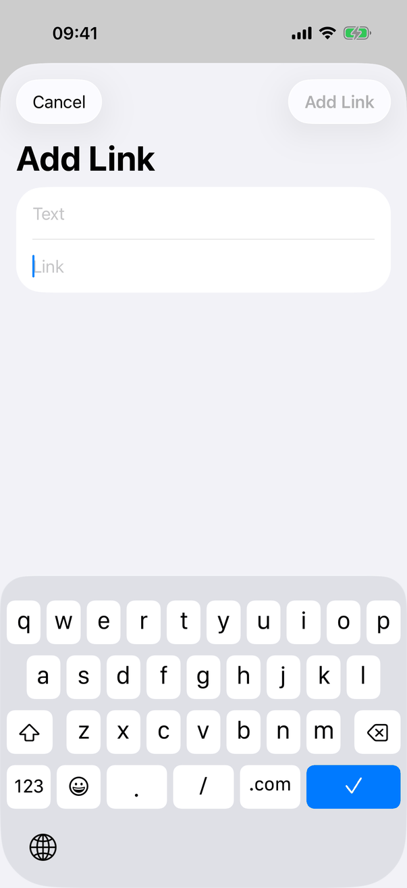
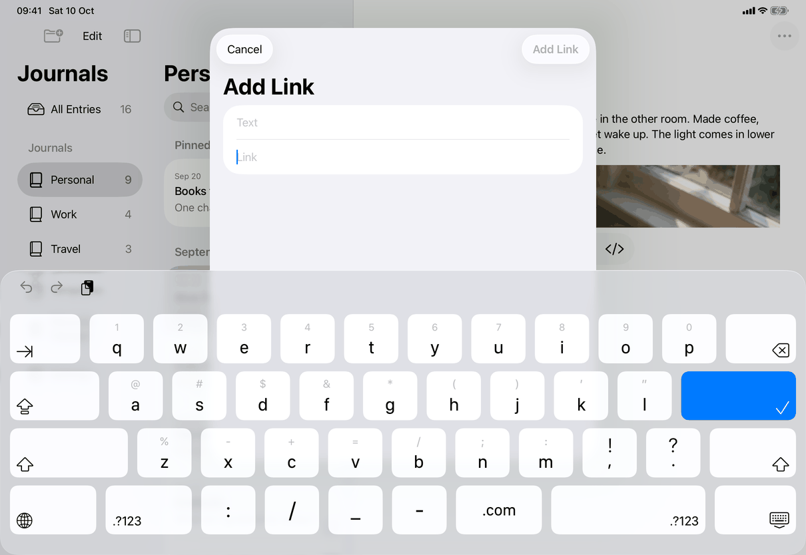

# Add Link and Edit Link (Apple)

How the Apple apps implement the spec's [link-editor](../../../screens/link-editor.md). Read [platform.md](../platform.md) for sheets (section 9) and the editor's text input conventions. The sheet is shared by the three devices; the Mac fixes its size and the iPhone and iPad add URL keyboard behaviour.

Since build 18 the sheet is also Edit Link: with the caret or selection inside a link it opens filled with that link's address and offers Remove Link. The spec now describes both ([screens/link-editor](../../../screens/link-editor.md); rules L-7 to L-10 in [flows/editing-rules](../../../flows/editing-rules.md)). **Draft:** the screenshots of the Edit Link states are pending (see Screenshots).

## Controls

`LinkEditorView` (SwiftUI) in a `NavigationStack` holding a `Form` with `.formStyle(.grouped)`. It is presented by `RootView` with `.sheet(isPresented:)` bound to the editor actions' `requestLink` flag, so it is one plain sheet on every device (iPhone: full-width sheet; iPad: centred form sheet; Mac: sheet attached to the window). The state it edits lives in `EditorActions` (`linkText`, `editingLink`), not in the view.

| Spec element | Apple control | Notes |
| --- | --- | --- |
| Title `editor.link.title`, or `editor.link.editTitle` when editing | `.navigationTitle`, which reads "Add Link" for a new link and "Edit Link" when `editingLink` is set | Both strings are literals in `LinkEditorView`. On iPhone and iPad the title is the large title below the bar buttons (see screenshots). |
| Text field `editor.link.text` | `TextField("Text", text:)` bound to the editor actions' `linkText` | Filled from `EditorActions.prepareLink`: the link's own text when editing, else the selected text, else empty. Hidden when editing a link whose characters are not one plain line (`EditableLink.editsText` false: it holds an inline image or a line break), so an edit never flattens them. |
| Address field `editor.link.address` | `TextField("Link", text: $address)` with `.autocorrectionDisabled()`, `@FocusState` | Empty for a new link; for Edit Link it holds the link's address, without `mailto:`. iOS only: `.keyboardType(.URL)`, `.textInputAutocapitalization(.never)`, `.submitLabel(.done)`. Focus is set in `.onPresented`, which on iOS waits for `viewDidAppear` (`PresentedFocus.swift`) because focus set earlier is lost when the sheet opens right after the Formatting popover closes. |
| Invalid message `editor.link.invalid` | `Text` with `.font(.callout)`, `.foregroundStyle(.secondary)`, below the fields | Shown when the address is not empty and `LinkAddress.url` returns nil. |
| Add Link | Toolbar button, `ToolbarItem(placement: .confirmationAction)`, `.disabled(!valid)` | Titled "Add Link" (`editor.link.add`) when adding, "Done" (`common.done`) when editing. |
| Cancel | Toolbar button, `ToolbarItem(placement: .cancellationAction)` | `common.cancel`. |
| Remove Link `editor.link.remove` | A `Section` with `Button("Remove Link", role: .destructive)`, only when editing; on the Mac also `.foregroundStyle(.red)` | Removes the link from the text it covers, keeps the text (`remove-link`). |

Model: the sheet calls `EditorActions.performFormatting` with `.link`, `.editLink` or `.removeLink`; the text view's coordinator (`NativeEditor.Coordinator.perform`) applies them as one undo step (action names `editor.undo.editLink` and `editor.undo.removeLink`, literals in code) through `LinkInsertion` and `LinkEditing`. `LinkAddress.url` (in `FormattingState.swift`) is the single validator for the sheet and the editors; the rules are the spec's (`LinkInsertionTests`). A table cell's links are not editable here: `.editLink` and `.removeLink` return without effect while a cell is active, and `linkAtSelection` returns nil in a cell and in Markdown source.

States: there is no loading or error state. The empty state is the empty address (button dimmed, no message) and the error state is the invalid message. Locked, another entry opened, or journals erased: `RootView.closePresentations` and the `selectedID` change reset `requestLink` to false, which dismisses the sheet.

## Layout

- iPhone: sheet over the entry; Cancel leading, Add Link trailing in the navigation bar, the large title, the grouped form, the URL keyboard. No detents.
- iPad: the same sheet as a centred form sheet over the split view, wider than the iPhone's but with the same layout. It does not change with Split View or Stage Manager widths except as the system sizes form sheets.
- Mac: `.frame(width: 420, height: 220)` for a new link, `height: 270` when the Remove Link section is present. There is no capture of the Mac sheet.
- Dynamic Type: system text styles in a `Form`, so rows grow; no fixed heights on iOS.

## Commands and shortcuts

| Command | Placement | Shortcut | Enabled when |
| --- | --- | --- | --- |
| `insert-link` | As in [commands.md](../commands.md). In the code the menu item is Format ▸ Insert ▸ Add Link…, which reads Edit Link… when the caret is in a link (`AppCommands.swift`); next to it is Remove Link, enabled when the selection touches a link | ⌘K, on the Mac and in the iPad menu bar; with a hardware keyboard on iPhone and iPad the text view's own key command (`KeyboardFormatting.swift`, not while an input method is composing) | The body or a table cell has keyboard focus (`EditorActions.openLinkFromKeyboard` checks `isEditing`) and the entry can be edited |

Other routes the code adds: Formatting ▸ Insert ▸ Add Link… or Edit Link… ([format-sheet](format-sheet.md); the Formatting surface closes first and the sheet opens from `EditorActions.finishPresentation`), and on the Mac a right-click on a link offers Edit Link… and Remove Link (`LinkMenuMac.swift`, which replaces the system's two items of the same name).

Keyboard in the sheet:

- iPhone and iPad: Return in the address field adds the link when valid (`.onSubmit`, as in Notes); when not valid the field keeps focus and, if it is not empty, `announceForAccessibility` speaks `editor.link.invalid`.
- Mac: `.onSubmit` is compiled for iOS only, so Return in the address field does nothing itself. Whether the confirmation button takes Return as the default button is system sheet behaviour that I did not verify. Escape cancels (system sheet).
- Apply and Cancel close without the sheet's animation (`Transaction.disablesAnimations`, then `dismiss`); the sheet also opens without animation (`presentLink`). On the Mac the system sheet may still slide.

## Copy differences

None: no `mac` variant applies. The code uses `editor.link.editTitle`, `editor.link.remove`, `editor.link.removed` (announcement), `library.menu.format.insert.editLink` and `library.menu.format.insert.removeLink`, and writes them as literals.

## Accessibility

- Fields are labelled by their placeholders, "Text" and "Link" (`editor.link.text`, `editor.link.address`); the invalid message follows the address field in reading order.
- iPhone and iPad: Return on an invalid, non-empty address announces `editor.link.invalid` (`announceForAccessibility`). The message is a plain `Text` with no accessibility modifiers; on the Mac nothing announces it when it appears (not verified with VoiceOver).
- `.onDisappear` calls `performFormatting(.focus)`, so keyboard focus (and VoiceOver focus) returns to the text after the sheet closes, however it closed.
- Remove Link has the destructive role; the Mac also colours it red. Any Remove Link, from the sheet or a menu, announces `editor.link.removed` ("Link removed.") with `JournalAccessibility.announce`.
- Mac standard sheet keys: Escape cancels. Full Keyboard Access reaches both fields and buttons in the system order.

## Differences between iPhone, iPad and Mac

- URL keyboard, no autocapitalization, Return key "Done" and Return-to-add: iPhone and iPad only, because the on-screen keyboard has a URL layout and Notes adds on Return; the Mac keeps its single-line text field and the system's sheet buttons.
- Fixed 420 x 220 (270 when editing) size: Mac only; iOS sheets are sized by the system.
- The sheet title is a large title on iPhone and iPad (navigation bar inside the sheet) and a window-style sheet on the Mac, as the system draws a `NavigationStack` toolbar in each.
- Edit Link from a right-click: Mac only (pointer); on iPhone and iPad there is no long-press route, so editing is through ⌘K or Formatting ▸ Insert.

## Screenshots

| Device | State |
| --- | --- |
| iPhone |  New link, nothing selected: Cancel and a dimmed Add Link, the large title "Add Link", Text and Link fields (the Link field has the caret), the URL keyboard with ".com" and a checkmark Return key. |
| iPad |  The same sheet as a centred form sheet over the dimmed split view, with the on-screen keyboard. |

None for the Mac (the screenshot set has no Mac capture); the Mac claims above come from the source.

**Screenshots pending** (capture script run needed; none made by hand): the Edit Link sheet on iPhone, iPad and Mac (link-editor-edit: filled address, Remove Link group, "Done"); the Edit Link sheet for a link without a Text field (link-editor-edit-address-only); the Add Link sheet on the Mac (link-editor-default); the Mac right-click menu on a link (link-editor-link-menu). This page stays `draft` until they exist.

## Source files

View:
- `apps/apple/JournalApp/Views/LinkEditorView.swift`: the sheet.
- `apps/apple/JournalApp/Views/PresentedFocus.swift`: `onPresented`, focus after the sheet has appeared.
- `apps/apple/JournalApp/AppCommands.swift`: the menu items and ⌘K.
- `apps/apple/JournalApp/Editor/LinkMenuMac.swift`, `NativeTextView.swift`: the Mac link context menu.

Model:
- `apps/apple/JournalApp/Editor/RichText.swift`: `EditorActions` (`requestLink`, `linkText`, `editingLink`, `openLinkFromKeyboard`, `prepareLink`, `performFormatting`).
- `apps/apple/JournalApp/Editor/FormattingState.swift`: `LinkAddress` (validation) and `LinkInsertion`.
- `apps/apple/JournalApp/Editor/LinkEditing.swift`: finding, editing and removing the link at the selection.
- `apps/apple/JournalApp/Editor/NativeEditor.swift`: applying `.link`, `.editLink`, `.removeLink` on each platform's text view.
- `apps/apple/JournalApp/Editor/KeyboardFormatting.swift`: ⌘K on iPhone and iPad.

Core: none (the link attributes live in the editor's attributed text).

Design records: `docs/design/menus-and-popovers.md` (D8) and `docs/design/build-18-fixes-2026-10-06.md` (section 2.4, Edit Link).

## Open questions

None for this page. D8 (the spec said there was no Edit Link or Remove Link) is resolved: the spec now describes both, see [open-questions.md](../../../open-questions.md). Return in the address field on the Mac is unverified and noted above.
