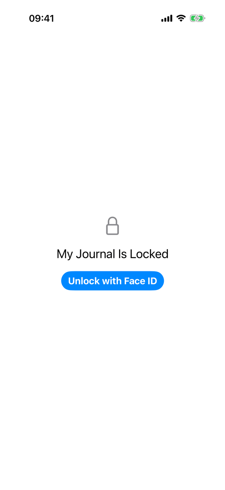
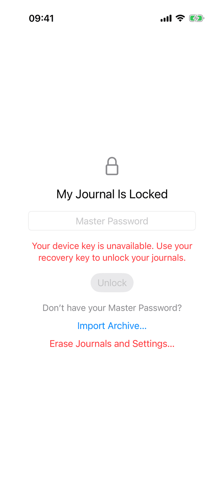
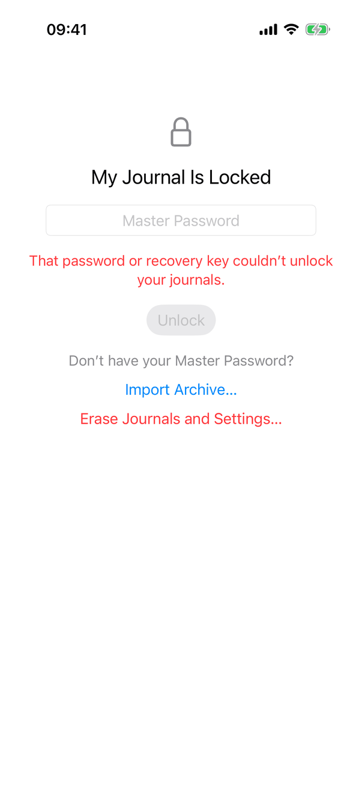
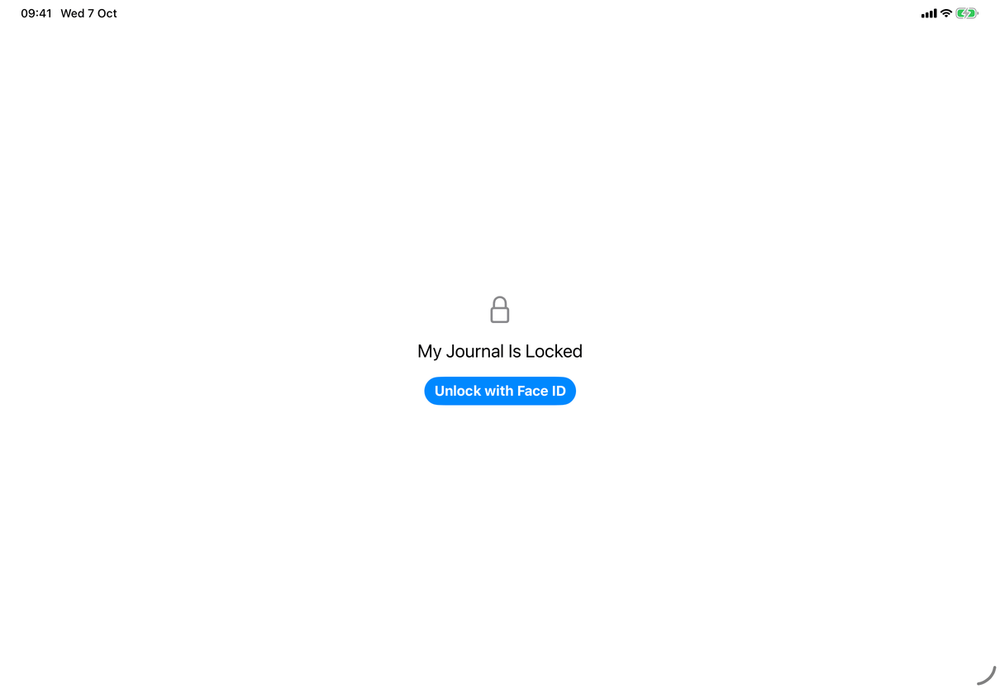
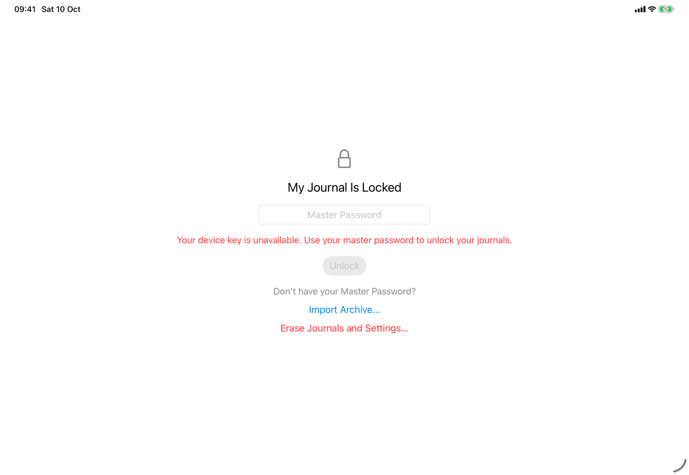
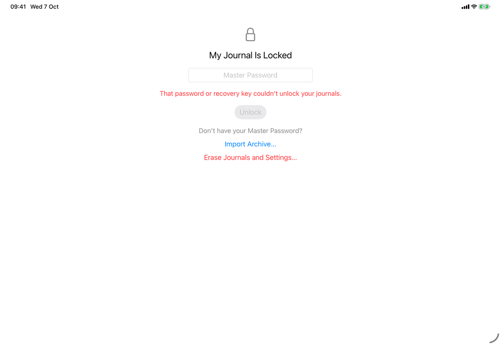
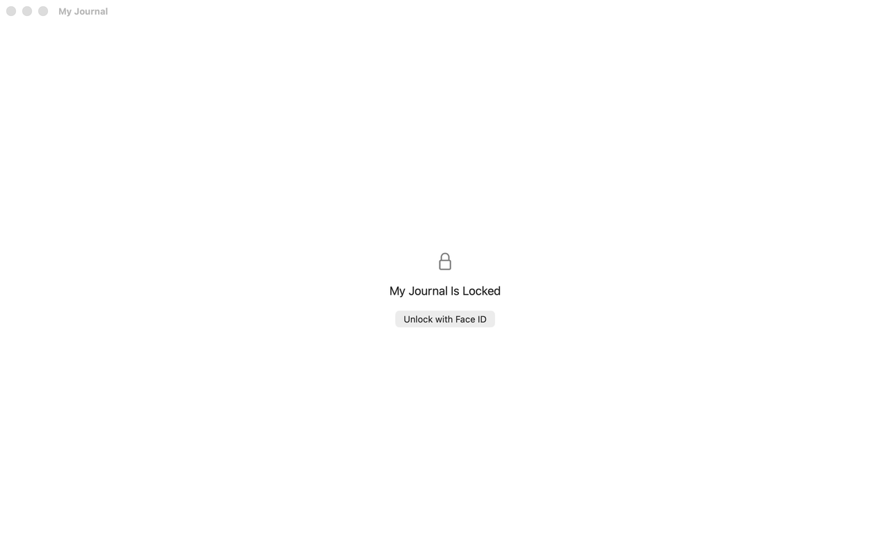

# Lock screen and privacy cover (Apple)

Implements [screens/lock-screen](../../../screens/lock-screen.md). When and why the app locks is on [flows/app-lock](../flows/app-lock.md). The views hold the English text as literals; the copy keys named here are the spec's keys for the same text. Conventions: [platform.md](../platform.md#13-device-authentication-and-app-lock) and [platform.md](../platform.md#20-screen-capture-and-app-switcher-privacy).

## Controls

- **Where it shows.** `RootView.window` shows `UnlockView` whenever `model.locked`, after the "Opening Journal…" progress view and before the library problem screen, the welcome screen, the recovery key screen and the library. It is the window's whole content; on the Mac every journal window shows it, and the Settings window shows `settings.locked` instead (`Views/SettingsView.swift`). Locking closes the sheets and prompts the window had open (`closePresentations` in `RootView`).
- **Container.** `GeometryReader` around a `ScrollView` whose content has `.padding(32)`, `.frame(maxWidth: .infinity)` and `.frame(minHeight: geometry.size.height)`, so the column is centred vertically and scrolls when text is large. `VStack(spacing: 18)` with `.multilineTextAlignment(.center)`.
- **Symbol and heading.** `Image(systemName: "lock")` in `.largeTitle`, secondary colour, `accessibilityHidden(true)`; heading `Text` in `.title2` with the `.isHeader` trait (`common.myJournalIsLocked`).
- **Device unlock** (`deviceUnlock`, shown unless the credential form is). In order:
  - the problem, if any, as red `.callout` `Text` with no icon: `model.error` first, else `settings.lock.failed` when `unlockState.problem`;
  - a `Button` with `.buttonStyle(.borderedProminent)`, `.keyboardShortcut(.defaultAction)`, `.disabled(model.unlockState.authenticating)` and `@AccessibilityFocusState`, titled `settings.lock.unlockWith` with `{method}` from `DeviceUnlockMethod.name` (`library.lock.method.*`); it runs `model.unlockWithDevice()`;
  - while `configuration.pinRetiredNotice` is true, `.callout` secondary `Text` `settings.lock.pinRetired` with `{phrase}` from `DeviceUnlockMethod.phrase` (`library.lock.phrase.*`);
  - after a failure, when `configuration.requiresPassword`, a link-style `Button` (`.buttonStyle(.plain)`, `.foregroundStyle(.tint)`) `settings.lock.useCredential`; it sets `usingCredential` and clears `model.error`.
- **Credential form** (`credentialForm`, shown when `model.masterKey == nil` or `usingCredential`). `SecureField` titled with `configuration.credentialName` (`common.masterPassword`, `library.lock.credential.recoveryKey`, `library.lock.credential.accessPassword`, `common.recoveryCode`, or `common.passwordOrRecoveryKey` when there is no configuration), `.textFieldStyle(.roundedBorder)`, `.frame(maxWidth: 300)`, `.passwordAutofill()`, `onSubmit` unlocks. The field has no `@FocusState`, so it does not take focus by itself. Then the red error text (`model.error`), a `.borderedProminent` `Button` `settings.lock.unlock` disabled while the field is empty (no keyboard shortcut; Return works through the field), and, when the device key is present, a link-style `settings.lock.useMethod` that clears the field and the error. The field is cleared after every attempt, successful or not. The attempt is `model.unlockWithRecovery(_:)` (`Model/AppModel.swift`), which tries this device's envelope and then the server's (`recoverKey` in `Model/PasswordOperations.swift`), saves the key to the Keychain again, marks a master password as checked and keeps App Lock on.
- **Without the credential** (`withoutCredential`, shown inside the credential form when `model.libraryProblem == .needsKey`, that is the device key is gone and the library cannot open). A caption `library.problem.missingKey.caption` ("Don’t have your {credential}?"), a link-style Import Archive… (`common.importArchive`, sets `model.archiveImportRequested`) and `UnopenedEraseButton` (`settings.erase.button`, `role: .destructive`, red). They form one accessibility container labelled with the caption. Both are in the screenshots named master-password and wrong-password. The spec's [lock-screen](../../../screens/lock-screen.md) page describes this block.
- **Prompting without a tap.** `UnlockView.task` refreshes `DeviceOwnerAvailability` and calls `model.promptToUnlockIfPending()`; `AppModel.applicationBecameActive()` calls it too. It prompts once per lock when `unlockState.promptPending`, the app is active, the library is locked with App Lock on and a key. Only the launch and the iOS background lock set `promptPending`; Lock My Journal and the Mac's own locks do not.
- **Device authentication.** `SystemDeviceOwner` (`Model/DeviceAuthentication.swift`) calls `LAContext.evaluatePolicy(.deviceOwnerAuthentication, ...)` with the reason `settings.privacy.appLock.reason.unlock`; on the Mac `AppModel.authenticationReason` lowercases the first letter so the system sentence "My Journal is trying to ..." reads correctly. `unlockState.availability` is `.available(method)`, `.noPasscode` or `.unavailable`; `.unavailable` sets `problem`, and `.noPasscode` turns App Lock off and opens the journals.
- **Privacy cover.** `LockedCover` (`Model/PrivacyCover.swift`): a `Rectangle` filled with `.background`, `ignoresSafeArea()`, with a `Label` `common.myJournalIsLocked` and the `lock` symbol only when `model.locked`. `JournalApp.swift` overlays it on the journal window when `scenePhase != .active && model.appLockOn && !model.unlockState.requestInFront`. On iOS, `PrivacyCover.shared` (`#if os(iOS)`) additionally puts a `UIWindow` at `windowLevel = .alert + 1` hosting `LockedCover` over every `UIWindowScene` on `UIScene.willDeactivate` (not while App Lock's own request is in front) and `UIScene.didEnterBackground`, and removes it on `UIScene.didActivate`, so sheets, popovers and alerts, which sit above the root view, are covered too.
- **App Lock Is Off alert.** `AppLockTurnedOffAlert` (`Views/UnlockView.swift`), applied to the root in `JournalApp.swift`: `.alert("App Lock Is Off", ...)` (`settings.lock.turnedOff.title`) with an OK button (`common.ok`), shown when `unlockState.turnedOff != nil && !model.locked`. The message has a Mac text (login password, "Your Mac user") and an iOS text (passcode, "This iPhone" or "This iPad" from `DeviceUnlockMethod.deviceName`), for `passcodeRemoved` and `pinRetired`.

## Layout

- **iPhone.** Full-screen column, vertically centred (see the screenshots); the credential form stacks the field, the error, Unlock and the without-credential block and grows downward from the centre as content is added.
- **iPad.** The same column in the full window; there is no split view while locked. At regular widths the field is 300 points wide, so it does not stretch.
- **Mac.** The same column in each journal window below the title bar (title "My Journal"); no sidebar, list or toolbar. Buttons use the Mac's `.borderedProminent` appearance.
- **Dynamic Type.** The `ScrollView` lets the column scroll at accessibility sizes; every `Text` uses `fixedSize(horizontal: false, vertical: true)` so lines wrap rather than truncate.

## Commands and shortcuts

| Command | Placement | Shortcut | Enabled when |
| --- | --- | --- | --- |
| `unlock-with-device` | as in [commands.md](../commands.md) | Return (`.defaultAction`); on the Mac per commands.md; iPad with a hardware keyboard not verified | locked, not authenticating |
| `use-credential` | as in commands.md | none | after a failed device unlock, journals with a password |
| `unlock-with-credential` | as in commands.md | Return in the field | field not empty |
| `use-device-unlock` | as in commands.md | none | credential form with the device key present |
| `import-archive` | as in commands.md | none | missing-device-key lock screen only (a button, not the menu item) |
| `erase-device` | as in commands.md | none | missing-device-key lock screen only (`UnopenedEraseButton`) |

## Copy differences

- `settings.privacy.appLock.reason.unlock` has a Mac variant (lower case, "unlock your journals"); the code produces it by lowercasing the first letter.
- `settings.lock.turnedOff.passcodeRemoved` and `settings.lock.turnedOff.pinRetired` have Mac variants (login password, "Your Mac user"); the code branches on `#if os(macOS)`.
- `library.lock.phrase.touchID` has a Mac variant ("Touch ID or your login password"); the method names follow the device (`library.lock.method.*`). The captures show "Face ID" on all three devices, including the Mac, which the real app would never show for Face ID; the capture appears to use the app's scripted device authentication (`ScriptedDeviceOwner`, debug builds), not verified.

## Accessibility

- The heading has `.isHeader`; the symbol is hidden. The problem text is announced with `JournalAccessibility.announce` whenever `problem` changes (medium priority on the Mac).
- Cancelling the system request moves VoiceOver focus back to the Unlock with {method} button (`@AccessibilityFocusState` set when `authenticating` becomes false while locked).
- After a success behind Face ID's closing panel on iOS, `JournalAccessibility.screenChanged()` runs when the app becomes active; other unlocks rely on the view change. The spec says focus moves to the journals; this is the only explicit call.
- The without-credential block is one container labelled with its caption, so VoiceOver reads the buttons in that context.
- The cover for an app that is merely inactive is a blank rectangle; with `common.myJournalIsLocked` only when locked.
- Reduce Transparency, Increase Contrast: the cover and the screen use the system background; nothing extra.

## Differences between iPhone, iPad and Mac

- The method name and the passcode wording follow the device: Face ID, Optic ID, Touch ID or Passcode on iPhone and iPad, Touch ID or Login Password on the Mac (`DeviceUnlockMethod`), because that is what each system can ask for.
- The extra `UIWindow` cover is iOS only: the app switcher snapshots iOS windows, including sheets and alerts, which the SwiftUI overlay inside the root view does not cover. On the Mac only the overlay in `JournalApp.swift` exists, attached to the journal window's root view; the code does not apply it to the separate Settings window or to sheets, and (A41) whether `scenePhase` leaves `.active` on the Mac whenever another app is in front was not verified.
- Locking when the app leaves the screen is iOS only; the Mac locks on its own events ([flows/app-lock](../flows/app-lock.md)).
- Prompting without a tap after returning from the background is iOS only, because only iOS locks on leaving the foreground.

## Screenshots

| Device | Default | Master password (device key unavailable) | Wrong password |
| --- | --- | --- | --- |
| iPhone |  Lock symbol, heading and Unlock with Face ID. |  Credential form: Master Password field, red device-key message, Unlock dimmed, then Import Archive… and Erase Journals and Settings…. |  The same form with the red message `messages.error.invalidRecoveryKey`. |
| iPad |  The same column in the full window. |  As on iPhone; the message fits on one line. |  As on iPhone. |
| Mac |  The journal window with its title bar; the window is inactive in the capture, so the button is grey instead of accent colour. | Not captured. | Not captured. |

## Source files

- View: `Views/UnlockView.swift` (screen, credential form, App Lock Is Off alert), `Views/UnopenedEraseButton.swift`, `Views/RootView.swift` (precedence, closing presentations), `JournalApp.swift` (cover overlay, alert, scene phase), `Views/SettingsView.swift` (`settings.locked`).
- Model: `Model/AppLockOperations.swift` (`DeviceUnlockState`, unlock, prompt, application activity), `Model/DeviceAuthentication.swift` (methods, availability, `LAContext`), `Model/PrivacyCover.swift` (`LockedCover`, iOS windows), `Model/PasswordOperations.swift` (`recoverKey`), `Model/AppModel.swift` (`lockImmediately`, `unlockWithRecovery`), `Model/LibraryProblem.swift` (`needsKey`).
- Core: none specific.
- Design: [app-lock-system-auth.md](../../../../docs/design/app-lock-system-auth.md), [app-lock-accessibility.md](../../../../docs/design/app-lock-accessibility.md), [missing-device-key-unlock.md](../../../../docs/design/missing-device-key-unlock.md), [pre-release-fixes-2026-09-27.md](../../../../docs/design/pre-release-fixes-2026-09-27.md).

## Open questions

See [open-questions.md](../../../open-questions.md).
