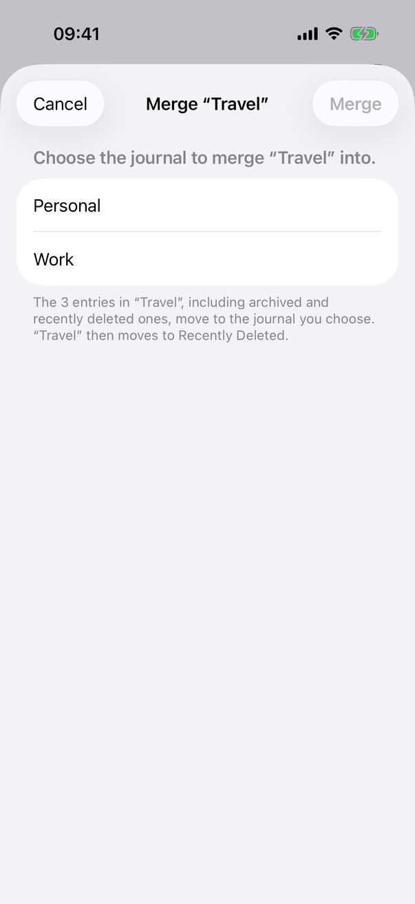
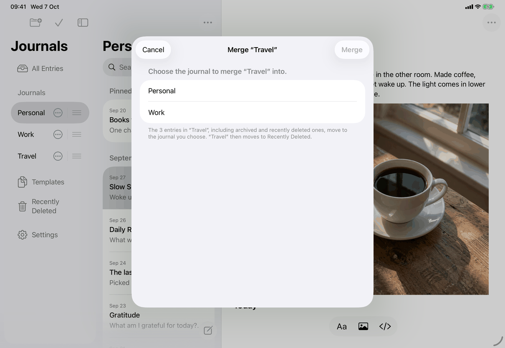
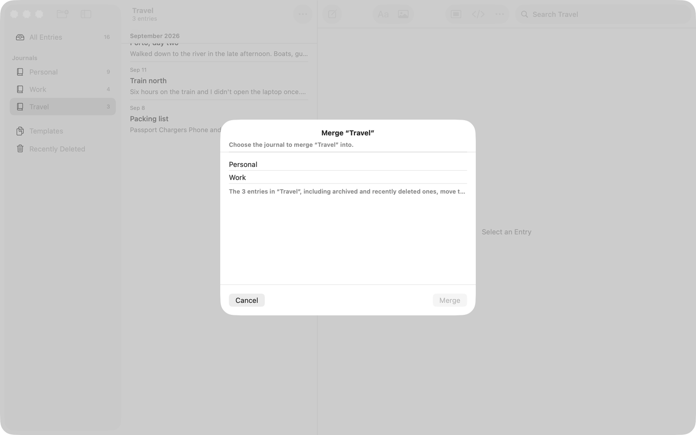

# Merge Into… (Apple)

Implements [screens/merge-journal](../../../screens/merge-journal.md): choose a journal, move every entry of the source journal into it, and move the source to Recently Deleted. It opens from Merge Into… in the journal actions ([journals](journals.md)).

## Controls

`MergeJournalView(sourceID:)`, a sheet. It is presented by `.sheet(item: $merging)` in `JournalSidebarView` (row context menu and edit-mode menu), `.sheet(isPresented: $merging)` in `JournalMoreMenu` (list bar on iPhone and iPad) and in `JournalActionPresentation` (Mac toolbar menu). Model: `AppModel.mergeJournal(_:into:)` in `Model/JournalOperations.swift`, which calls the store's `mergeJournal` (`JournalMerging.swift`, one transaction) through `commitMutation`.

- **Container.** `layout`: Mac a `VStack` with the title (`library.merge.title`, `.headline`, header trait), the list, a `Divider` and a button row (below), `.frame(minWidth: 320, idealWidth: 420, minHeight: 280, idealHeight: 360)`; iOS a `NavigationStack` with an inline navigation title of the same text and the buttons in the bar. `.interactiveDismissDisabled(busy)` and `.keepsUnlockedWhile(busy)` (the Mac inactivity lock does not fire while merging; it does nothing on iPhone and iPad).
- **List.** One `Section` in a `List` (`.listStyle(.inset)` on the Mac). Header: `Text("Choose the journal to merge ...")` with `.textCase(nil)` (`library.merge.header`). Rows: one `Button` (`.buttonStyle(.plain)`) per journal in use other than the source (`model.journals`, the sidebar order), the name from `JournalNames.displayName`, and under it `library.merge.created` with the creation date (`.abbreviated`, no time) only when another destination has the same name (`sharesName`, comparing `JournalNames.key`). The chosen row ends in a `checkmark` (tint, hidden from accessibility) and has the `.isSelected` trait. Rows are disabled while busy or once the source is gone.
- **Footer** (a `VStack` in the section footer): `footer` text, `library.merge.footer.none`, `library.merge.footer.one` or `library.merge.footer.other` (count of every entry whose `journalID` is the source, which includes archived and recently deleted ones), with the target `library.merge.footer.target` (the chosen name in typographic quotes) or `library.merge.footer.targetNone`; then the agent sentence; the error in red (`Merge error` accessibility identifier); a `Review Changes` button (`common.reviewChanges`) after a conflict; `ProgressView("Merging…")` (`common.merging`) while busy.
- **Agent sentence.** `loadAgents()` runs from `.task` when `model.connection != nil` and `model.agentCopies` exists: it lists the server's agents, drops expired ones, and sets `AgentReaders` to `.none` (no agents, or `AgentCopyError.serverOutdated`), `.unknown` (the call failed, or an agent's settings could not be read) or `.known`. `agentSentence` is nil when no destination is chosen or the source has no entries; for `.unknown` it is `library.merge.agents.unknown`; for `.known` it considers only agents with selected journals (agents with All Journals read both): those that read the destination but not the source ("gaining", `library.merge.agents.gainingOne` or `gainingMany`) and those that read the source but not the destination ("losing", `library.merge.agents.losingOne` or `losingMany`), joined in one paragraph.
- **Buttons.** Mac: `Button(sourceGone ? "Done" : "Cancel", role: .cancel)` with `.keyboardShortcut(.cancelAction)`, disabled while busy, at the leading end; `Button("Merge")` (`common.merge`) with `.keyboardShortcut(.defaultAction)` at the trailing end, disabled until a journal is chosen and while busy, hidden once the source is gone, with `.accessibilityHint` `library.merge.hint`. iOS: `ToolbarItem(placement: .cancellationAction)` Cancel (Done once the source is gone) and `ToolbarItem(placement: .confirmationAction)` Merge; no keyboard shortcut and no hint on iOS.
- **Merge** (`merge()`): sets `busy`, clears the error, runs `model.mergeJournal(sourceID, into:)`. The model saves the open entry first (`messages.save.before.goBack` when it cannot), commits, closes the open entry when it was in the source, and shows the destination journal with the search cleared and the selection remembered. On success the view announces `library.merge.merged` with the destination's name (`JournalAccessibility.announce`) and dismisses. If the commit worked but the view could not be refreshed: `library.merge.displayFailed`, and only Done remains. Errors by case: `JournalMergeError.conflict` sets `conflictToReview` and shows `messages.lifecycle.needsReview`; `.sourceUnavailable` sets `sourceGone` and shows `messages.generic.journalNamedUnavailable`; `.destinationUnavailable` clears the choice and shows `library.merge.destinationGone`; any other error (`.newerVersion` is `messages.merge.newerVersion`) goes through `shown(.saving)`. Each error is announced.
- **Observers.** The source leaving the list (`JournalNames.isListed`) while not busy sets `sourceGone` with the same message; a chosen destination leaving clears the choice and shows `common.journalGone` (while busy the merge call reports `library.merge.destinationGone` instead); locking closes the review sheet and dismisses the view.
- **Review Changes** opens a nested sheet: `JournalConflictView` for a journal's conflict, `ConflictReview(id:)` for an entry's, and `messages.conflict.resolved` when the conflict no longer exists.

## Layout

- **Mac.** Sheet, 320 minimum and 420 ideal wide, 280 and 360 tall; title centered over the list, button row at the bottom. In the capture the list is inset and the footer is cut to one line with an ellipsis (see Open questions).
- **iPad.** Form sheet centered over the window, with a navigation bar; the list is the grouped style and the footer wraps.
- **iPhone.** Page sheet with the same navigation bar; Cancel at the top left and Merge at the top right, dimmed until a journal is chosen.
- **Dynamic Type.** Names use `fixedSize(horizontal: false, vertical: true)` so they wrap; the footer is `fixedSize` vertically so it grows. The List scrolls.

## Commands and shortcuts

| Command | Placement | Shortcut | Enabled when |
| --- | --- | --- | --- |
| `merge-journal` | as in [commands.md](../commands.md) (journal context menu and Journal Actions) | none | The journal has no changes to review and another journal is in use |
| `review-changes` | The Review Changes button in the footer | none | After a merge refused because of changes to review |

Keyboard (Mac): Return presses Merge once a journal is chosen, Escape presses Cancel (or Done). On iPad with a hardware keyboard neither shortcut is attached: the buttons are the navigation bar's, without `.keyboardShortcut`.

## Copy differences

None. Only the accessibility hint on Merge (`library.merge.hint`) exists on the Mac alone, because the Mac button has no bar title to explain it.

## Accessibility

- The chosen row has the selected trait and its checkmark is hidden from VoiceOver.
- The Mac title has the header trait. Errors and the result are announced with `JournalAccessibility.announce`.
- The Mac Merge button has the hint `library.merge.hint`.
- Dismissing is blocked while busy (`interactiveDismissDisabled`), so a swipe-down or Escape cannot drop a running merge.
- Reduce Motion and the other display settings: nothing page-specific.

## Differences between iPhone, iPad and Mac

- **Buttons and keys.** iOS puts Cancel and Merge in the navigation bar with no shortcuts; the Mac has a bottom button row with Escape and Return, because Mac sheets are keyboard-driven and have no navigation bar.
- **Accessibility hint** on Merge: Mac only (above).
- **Inactivity lock.** The Mac holds off its inactivity lock while merging (`keepsUnlockedWhile`); iPhone and iPad have no inactivity lock.
- **List style.** `.listStyle(.inset)` on the Mac; the system's grouped style on iOS.

## Screenshots

| iPhone | iPad | Mac |
| --- | --- | --- |
|  |  |  |

## Source files

View:
- `apps/apple/JournalApp/Views/MergeJournalView.swift`: the sheet, list, footer, agent sentence and error handling.
- `apps/apple/JournalApp/Views/JournalSidebarView.swift`: where Merge Into… is offered (`journalActions`).

Model:
- `apps/apple/JournalApp/Model/JournalOperations.swift`: `mergeJournal(_:into:)`.

Core: `JournalMergeError` and `JournalStore.mergeJournal` in `apps/apple/Packages/JournalCore/Sources/JournalCore/JournalMerging.swift`; `JournalNames`.

Design record: `docs/design/journal-name-uniqueness.md`.

## Open questions

See [open-questions.md](../../../open-questions.md), A47: in the Mac capture the footer paragraph is cut to one line with an ellipsis ("... move t…") in the inset list, so the sentence naming the source and target is not readable there; iOS wraps it.
