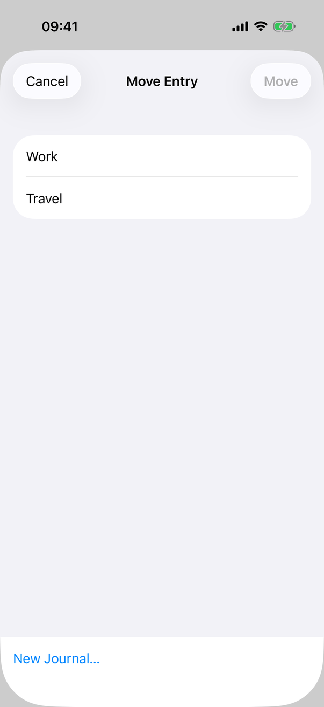
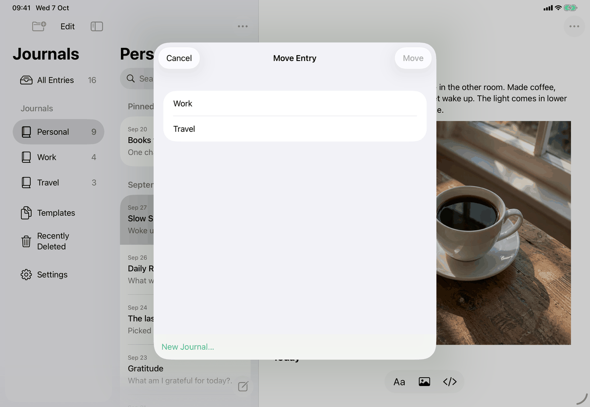
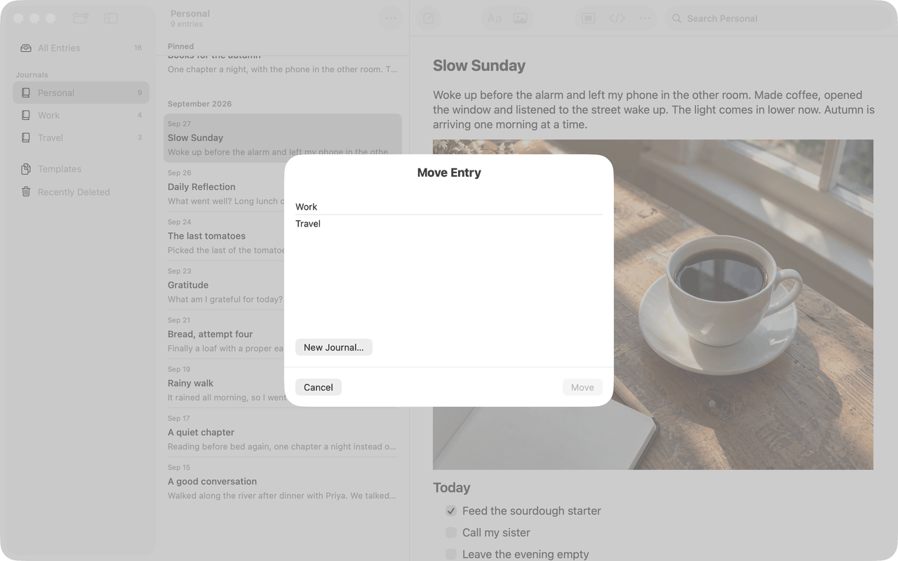

# Move Entry (Apple)

Maps [screens/move-entry.md](../../../screens/move-entry.md). One view, `MoveEntryView(entryID:)` in `Views/MoveEntryView.swift`. It has no restoring form any more: Restore is a separate verb that picks the journal itself ([recently-deleted](recently-deleted.md)).

## Controls

**Where it opens.**
- Move Entry (command `move-entry`): `RootView` holds `entryToMove` and presents `.sheet(item: $entryToMove) { MoveEntryView(entryID:) }`. The menu action first selects the row's entry (`performRowAction`, which saves the open writing), then sets `entryToMove` to the open draft, so the sheet always acts on the entry the person chose.
- Model: `AppModel.moveEntry(_:to:)` (`Model/JournalOperations.swift`) saves the open entry first (`finishPendingSave`), then calls `JournalStore.moveEntry` through `commitEntryMove`, which on success selects the destination journal and the entry and clears the search. JournalCore holds the rules (`Store.swift`).

**Chrome.**
- Title: `library.moveEntry.title`.
- Action Button: `library.moveEntry.move`. Disabled unless `canMove`: not busy and the selected journal is in `selectableIDs`.
- iPhone and iPad: `NavigationStack`, inline `.navigationTitle`, `ToolbarItem(placement: .cancellationAction)` Cancel and `ToolbarItem(placement: .confirmationAction)` for the action. No keyboard shortcuts are attached.
- Mac: `VStack` with the title (`.title2.bold()`), the content, a `Divider` and an `HStack`: Cancel (`.keyboardShortcut(.cancelAction)`) at the leading edge and the action (`.keyboardShortcut(.defaultAction)`) at the trailing edge; `.frame(minWidth: 320, idealWidth: 420, minHeight: 280, idealHeight: 360)`.
- `.interactiveDismissDisabled(busy)`; Cancel is disabled while busy.

**Content** (a `VStack(alignment: .leading, spacing: 0)` called `content`).
1. No other journals (`destinations` empty): a centered `VStack(spacing: 12)` filling the sheet: `library.moveEntry.noOtherJournals` (`.headline`), `library.moveEntry.noOtherJournals.message` (secondary) and a Button `common.newJournalEllipsis`.
2. Otherwise a `List(destinations)`, default list style. `destinations` is `AppModel.journals` (sidebar order) without the entry's current journal. Each row is a plain Button (`.buttonStyle(.plain)`, `contentShape(Rectangle())`) with the journal's name (`JournalNames.displayName`, so a blank name reads `common.untitledJournal`) and a trailing `checkmark` symbol (hidden from accessibility) on the selected row. Choosing a row sets `selection` and clears the error. A name that matches another listed journal's after case folding (`duplicateNames`) makes the row non-selectable: secondary text, disabled, with `library.moveEntry.sameName` under the name.
3. When any row is dimmed, `library.moveEntry.renameExplanation` under the list (secondary, padded). The text is chosen at compile time: the `mac` variant ("in the sidebar") under `#if os(macOS)`, the default ("in the Journals list") on iOS.
4. Below the list, when journals exist: a Button `common.newJournalEllipsis` (padded, default style). It opens `RecoveryJournalView(entryID:)` as a nested `.sheet` ([screens/destination-journal](../../../screens/destination-journal.md)).
5. Error: `Text(error).foregroundStyle(.red)`, accessibility identifier "Move error". There is no Review Changes button and no nested sheet any more.
6. While moving: `ProgressView("Moving Entry…")` (`library.moveEntry.moving`).

There is no empty-state beyond item 1, no loading state (journals are local) and no offline state.

**Errors** (set by `showError`, which also posts an accessibility announcement): a conflict on the entry, its journal or the destination (`JournalLifecycleError.conflict`) refreshes the model and shows `messages.lifecycle.combining` when the record is not in `heldConflictIDs`, and `messages.lifecycle.unsupportedJournal` when it is; a journal that a newer version saved shows `messages.lifecycle.unsupportedJournal`; the selected journal disappearing or becoming ambiguous clears the selection and shows `common.journalGone` (`onValueChange(of: selectableIDs)`); an unsaved open entry shows `messages.save.before.goBack`; anything else shows `error.shown(.saving)`. A move that was stored but cannot be shown is the generic alert with `common.entryMovedNotDisplayed` (set by `commitEntryMove` after the sheet's `dismiss()`).

**Closing without a move.** The sheet closes by itself, cancelling the task, when the app locks or when another entry becomes the open draft (`onValueChange(of: model.draft?.id)`).

## Layout

- **iPhone:** the default sheet: a large card with a gap above it, a navigation bar, the list as an inset grouped card, the extra controls ("New Journal…" and the explanation lines) in a plain white block at the bottom of the sheet (visible in both screenshots; it is the content `VStack`'s area under the `List`).
- **iPad (regular width):** the same view as a centered card, about 580 by 650 points, over the dimmed window; the list occupies the top and "New Journal…" sits at the bottom of the card.
- **Mac:** a window-attached sheet, 320 to 420 points wide and 280 to 360 high, with an unframed `List` (plain rows, no card), the "New Journal…" Button as a bordered button below it, and Cancel and Move in the bottom bar.
- **Dynamic Type:** no switch of layout; row names wrap (`fixedSize(horizontal: false, vertical: true)`); the title in the navigation bar can truncate at large sizes on iPhone, which is why the action label is short.

## Commands and shortcuts

| Command | Placement | Shortcut | Enabled when |
| --- | --- | --- | --- |
| `move-entry` | Opens this sheet from Entry Actions and the row's context menu | none | An editable entry in a journal in use |

Where `move-entry` appears on each device is in [commands.md](../commands.md). The "New Journal…" Button in the sheet has no command id of its own; it opens the sheet of [screens/destination-journal](../../../screens/destination-journal.md). Keyboard: on the Mac Return chooses Move (when enabled) and Escape cancels (when not busy). On iPhone and iPad the buttons carry no keyboard shortcut. Edit ▸ Undo does not undo a move.

## Copy differences

- `library.moveEntry.renameExplanation`: the `mac` variant says "in the sidebar", the default says "in the Journals list", because that is where a journal is renamed on each device (`#if os(macOS)` in `MoveEntryView.swift`).

## Accessibility

- The selected row has `.accessibilityAddTraits(.isSelected)`; its checkmark is `accessibilityHidden(true)`, so VoiceOver reads the state once. A dimmed row is disabled (VoiceOver says dimmed) and its secondary line is read with it; the explanation follows the list.
- Errors are announced with `UIAccessibility` (iOS) or `NSAccessibility` (Mac) announcements in `showError`. The error text carries the identifier "Move error" for UI tests.
- Nothing moves focus after a move; the sheet closes and the entry stays open in its new journal.
- While moving, the rows, New Journal… and Cancel are all disabled, and the sheet cannot be swiped away.

## Differences between iPhone, iPad and Mac

- Cancel at the top left and the action at the top right on iPhone and iPad (navigation bar slots); both at the bottom on the Mac with Return and Escape wired, because a Mac sheet has no navigation bar and expects default and cancel keys.
- The rename explanation names the sidebar on the Mac and the Journals list on iPhone and iPad, since the journals are renamed in those places.
- The list is an inset grouped card on iOS and a plain list on the Mac, the platform defaults of `List`.
- iPad shows a centered card and iPhone a large sheet, the system's presentation of a plain `.sheet` at each width.

## Screenshots

| Device | Screenshot | State |
| --- | --- | --- |
| iPhone |  | Move Entry from a Personal entry: Work and Travel listed, nothing selected, Move dimmed, "New Journal…" at the bottom |
| iPad |  | The same list as a centered card over the dimmed window |
| Mac |  | A sheet with the title, a plain two-row list, the bordered "New Journal…" Button, and Cancel and Move at the bottom (Move dimmed) |

## Source files

View: `Views/MoveEntryView.swift` (the sheet, selection, errors), `Views/RootView.swift` (opens it from the entry actions), `Views/RecoveryJournalView.swift` (New Journal…).

Model: `Model/JournalOperations.swift` (`moveEntry`, `commitEntryMove`, `createRecoveryJournal`), 

Core: `Store.swift` (`moveEntry`), `JournalNames.swift` (display names and name keys).

Tests that pin behaviour: `JournalTests/MoveLifecycleTests.swift`.

Design records: `docs/design/move-entry.md`, `docs/design/pre-release-fixes-2026-09-27.md`.

## Open questions

See [open-questions.md](../../../open-questions.md), A21 (withdrawn: the store refuses a taken journal name on every creation path, so the New Journal sheet shows the error; the wording is B12).
