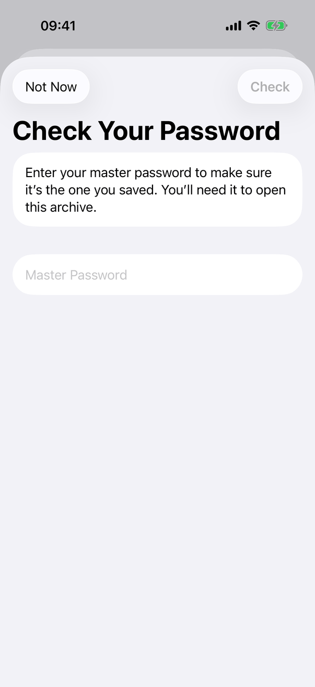
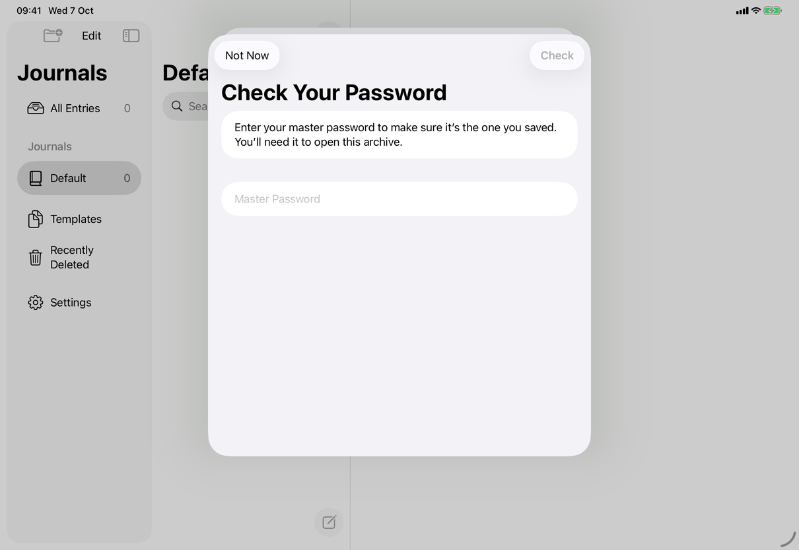

# Check Your Password, and Set New Password (Apple)

Implements [screens/password-check](../../../screens/password-check.md). The Forgot Password? path step by step is [flows/forgot-password](../flows/forgot-password.md). The views hold the English text as literals; the copy keys named here are the spec's keys for the same text.

## Controls

- **Presenter.** `ArchiveExportControls` in `Views/ArchiveView.swift` owns `.sheet(isPresented: $checkingPassword, onDismiss:)` with `PasswordCheckView { exportAfterCheck = true }`. The Export Archive… button opens the sheet when `model.passwordCheckPending`, otherwise it starts the export. The export starts in `onDismiss`, because the save dialog (`.fileExporter`) cannot appear while the sheet is still on screen. The same controls appear in Settings ▸ Backup, in the File ▸ Export Archive… sheet (`ArchiveExportSheet`, Mac and iPad) and in the history, conflict and journal-lifecycle sheets that embed them.
- **Container.** `NavigationStack` around a `Group` that shows either the check page (`check`) or `NewPasswordForm` depending on `setting`; `.formStyle(.grouped)`. The two pages share one stack and one sheet; Set New Password replaces the check page, it is not pushed, so there is no back button (Cancel does that job). `.interactiveDismissDisabled(checking)`; `onValueChange(of: model.locked)` dismisses the sheet when the app locks.
- **Check Your Password page.** `Form` with: a `Section` with the intro `Text` in primary colour (`settings.passwordCheck.intro`); a `Section` with a `SecureField` (`common.masterPassword`), `.passwordAutofill()`, `.submitLabel(.done)`, `onSubmit` runs the check when `canCheck`. Section footer, a `VStack`: when `wrong`, the red `Label` with `exclamationmark.circle` (`settings.passwordCheck.wrong`); while `checking`, a bare `ProgressView().controlSize(.small)`; and, when `wrong` and `model.canSetPasswordWithoutCurrent` and `AppModel.canAuthenticateDeviceOwner`, a `Button` with `.buttonStyle(.borderless)` (`settings.passwordCheck.forgot`, disabled while checking). The form is `.disabled(checking)`. `wrong` is never reset while the page is open, so Forgot Password? stays after a later attempt.
- **Toolbar, check page.** `.cancellationAction`: `settings.passwordCheck.notNow` with `.keyboardShortcut(.cancelAction)`, disabled while checking; it calls `finish()`, which runs `proceed` (the export continues) and dismisses. `.confirmationAction`: `settings.passwordCheck.check` with `.keyboardShortcut(.defaultAction)`, disabled unless `canCheck` (not checking, field not empty, unlocked).
- **Check result.** `model.checkPassword(_:)` (in `Model/PasswordCheckOperations.swift`) opens this device's envelope with the typed password (`VaultCrypto.recover` in `Task.detached`; nothing leaves the device), compares the result with the master key and the envelope's wrapped key, and on success sets `configuration.passwordChecked`. If saving that flag fails it only logs; the export continues and the next launch asks again. Wrong: `wrong = true`, field cleared, focus back, `announceForAccessibility(settings.passwordCheck.wrong)`. A throw (locked meanwhile) just dismisses.
- **Set New Password page.** `NewPasswordForm` (same file): intro `Text` in primary colour (`settings.passwordCheck.setNew.intro`), two `SecureField`s (`settings.changePassword.new`, `settings.changePassword.confirm`) with `.passwordAutofill(creating: true)`; Return in New moves to Confirm, Return in Confirm sets when `canSet`. Footer `VStack`: mismatch label (`messages.connection.passwordsDontMatch`, same `showsMismatch` rule as [screens/change-password](change-password.md)), error label, bare `ProgressView` while `busy`. Toolbar: `.cancellationAction` `common.cancel` with `.keyboardShortcut(.cancelAction)` (calls `returnToCheck()`, which clears `passwordResetAuthorizedAt`), disabled while busy; `.confirmationAction` `settings.passwordCheck.setNew.set` with `.keyboardShortcut(.defaultAction)`, disabled unless `canSet` (not busy, unlocked, New at least one character and equal to Confirm). `.interactiveDismissDisabled(busy)`. Title `settings.passwordCheck.setNew.title`; it takes focus in New on appear.
- **Setting.** `model.setPasswordWithoutCurrent(_:)` requires `passwordResetAuthorizedAt` less than 300 seconds old, `canSetPasswordWithoutCurrent` (master-password library, no server connection, not being replaced, unlocked), and re-checks both after the key derivation. It writes the new envelope for the same key, sets `passwordChecked`, clears the authorization, and the view calls `done()` (the export continues). Any failure, including a lock, shows `settings.passwordCheck.setNew.error` and announces it.
- **Authentication.** `model.authorizePasswordReset()` calls `LAContext().evaluatePolicy(.deviceOwnerAuthentication, localizedReason: ...)` directly with the text of `settings.passwordCheck.authReason`. It does not go through `AppModel.checkDeviceOwner` or the model's `deviceOwner`, which is where the other prompts (App Lock, Add Device) are cancelled by a lock and scripted by the UI tests.

## Layout

- **iPhone.** A sheet with a large title: `.navigationBarTitleDisplayMode(.large)` under `#if os(iOS)`. The source comment gives the reason: both titles are too long for an inline title between two buttons. Not Now is at the left of the top bar and Check at the right.
- **iPad.** The same sheet as the centred card the system uses at regular width (screenshot); the large title and bar buttons are the same as on iPhone.
- **Mac.** `.frame(width: 440)` and `.frame(minHeight: setting ? 380 : 280)` under `#if os(macOS)`; there is no capture. Navigation titles are not large on the Mac (the modifier is iOS only); the bar buttons sit at the bottom of the sheet as in other Mac sheets.
- **Dynamic Type.** `Form` scrolls; nothing switches layout.

## Commands and shortcuts

| Command | Placement | Shortcut | Enabled when |
| --- | --- | --- | --- |
| `password-check` | as in [commands.md](../commands.md) | Return (`.defaultAction`) and Return in the field | field not empty, not checking, unlocked |
| `password-check-not-now` | as in commands.md | Escape (`.cancelAction`) | not checking |
| `forgot-password` | as in commands.md | none | after a wrong password, journals only on this device, device can authenticate its owner, not checking |
| `set-new-password` | as in commands.md | Return (`.defaultAction`) and Return in Confirm | not busy, unlocked, both fields filled and equal |
| `set-new-password-cancel` | as in commands.md | Escape (`.cancelAction`) | not busy |

Focus order: the password field on the check page; New then Confirm on the other page. Swiping the sheet down on iPhone or iPad is not the same as Not Now: it dismisses without calling `proceed`, so the export does not start, and the check is asked again next time.

## Copy differences

- `settings.passwordCheck.authReason` is lower case ("set a new password for your journals"). On the Mac the system prefixes it with "My Journal is trying to"; on iPhone and iPad it is shown as it is, with the lower-case start, because this call does not use `AppModel.authenticationReason`, which capitalises the other prompts on iOS.

## Accessibility

- A wrong password and a failed set are announced with `announceForAccessibility`; focus returns to the password field after a wrong password.
- The mismatch label on Set New Password is not announced (computed footer; A38).
- Fields are labelled by their placeholder text. The bare `ProgressView` has no label.

## Differences between iPhone, iPad and Mac

- Large navigation title on iPhone and iPad only, because the titles do not fit inline there; on the Mac the sheet has its own width.
- Mac sheet is 440 points wide with a page-dependent minimum height; iPhone and iPad take the system sheet size.
- The authentication prompt shows the reason in different forms (see Copy differences), because the Mac system wraps it in a sentence.

## Screenshots

| Device | State |
| --- | --- |
| iPhone |  Large title, intro, empty Master Password field, Not Now and Check (dimmed). |
| iPad |  Same page in the centred sheet over the Journals window; the library behind is the empty one the capture uses. |

No Mac capture; the wrong-password state and Set New Password are not captured.

## Source files

- View: `Views/PasswordCheckView.swift` (`PasswordCheckView`, `NewPasswordForm`), `Views/ArchiveView.swift` (`ArchiveExportControls` presents the sheet and continues the export).
- Model: `Model/PasswordCheckOperations.swift` (`passwordCheckPending`, `canSetPasswordWithoutCurrent`, `canAuthenticateDeviceOwner`, `checkPassword`, `authorizePasswordReset`, `setPasswordWithoutCurrent`).
- Core: `Sources/JournalCore/Crypto.swift` (`VaultCrypto.recover`, `makeRecovery`).
- Design: [pre-release-ui-2026-09-27.md](../../../../docs/design/pre-release-ui-2026-09-27.md).

## Open questions

See [open-questions.md](../../../open-questions.md).
