# Recently Deleted (Apple)

Maps [screens/recently-deleted.md](../../../screens/recently-deleted.md). Recently Deleted is not a screen of its own: it is one collection of the entries list (`JournalDestination.deleted`) in the same list column that shows a journal, so most of it is `RootView.sidebar` in `Views/RootView.swift` (confusingly named: it is the entries list, not the journals sidebar). The item opened from it appears in the detail column through `RootView.detail`. Delete and restore as a whole is in [flows/delete-and-restore](../flows/delete-and-restore.md).

## Controls

Model: `AppModel` with `showingTrash` (set when the Recently Deleted row is chosen), `filteredDeletedJournals`, `filteredDeletedTemplates`, `entryGroups` (entries whose `JournalLifecycleSnapshot.location(of:)` is `.recentlyDeleted`), `query`, `deleteAllPhase`. Which items count is decided in JournalCore, `JournalLifecycle.swift`.

**Title and count.**
- iPhone and iPad: `.navigationTitle` with `common.recentlyDeleted` (large title that collapses to inline when the list scrolls).
- Mac: the window's two-line title and subtitle (`.navigationTitle` / `.navigationSubtitle` in `RootView+MacWindow.swift`): `common.recentlyDeleted` and `common.itemCount`, or `library.window.subtitle.noItems`. The count is `AppModel.recentlyDeletedContents.count`, which leaves out rows that are leaving.

**The list.** One `List(selection:)` for all three sections. `.listStyle(.insetGrouped)` on iPhone and iPad, `.listStyle(.inset)` on the Mac. Rows are `entryLink` rows: a `NavigationLink(value:)` on iOS, a plain tagged row on the Mac (the Mac list sits in AppKit's split view, where a navigation link would draw dimmed). On iPhone (stacked navigation) selection is nil and a row pushes a `CompactJournalRoute.entry` page.

Sections, each present only when it has rows:
1. **Journals** (`common.journals`, header text only): rows of `filteredDeletedJournals`, sorted by name (`localizedStandardCompare`). Row: the name (`common.untitledJournal` when blank) and under it, in `.callout` secondary text, `library.recentlyDeleted.journalCount`. The row is one accessibility element with the value `library.entryList.journalValue`. Journal rows have no swipe actions and no context menu; everything is in the journal's detail (below).
2. **Templates** (`library.journals.templates`): `entryRow` rows with the value `library.entryList.templateValue`, newest first, filtered by name or text.
3. **Entries**: `monthRows` per month, newest month first, rows as in [screens/entry-list](../../../screens/entry-list.md) (date, title, one-line preview, `Image(systemName: "exclamationmark.circle")` for changes to review). The first month's header is a two-line stack: `library.recentlyDeleted.section.entries` over the month.

**Explanation `library.recentlyDeleted.footer`.**
- iPhone and iPad: `trashFooter`, the footer of the last section that exists (`#if os(iOS)`).
- Mac: not a footer; the sentence is the leading text of the bar below.

**Delete All.** `library.recentlyDeleted.deleteAll`, command `delete-all-recently-deleted`; model `AppModel.offersDeleteAll` (shown) and `canDeleteAll` (enabled).
- iPhone and iPad: a `ToolbarItem(placement: .primaryAction)` Button in `listToolbar` (`RootView+Toolbar.swift`), in the list's navigation bar at the top right, text only. Present only while `offersDeleteAll` (Recently Deleted shown, no search, something listed), disabled while `canDeleteAll` is false.
- Mac: `RecentlyDeletedHeader.swift`, applied with `.recentlyDeletedHeader(shown:)` on the list. A `.small` bordered Button after the footer sentence in an `HStack`, with `.help` `library.recentlyDeleted.deleteAll.help` or `library.recentlyDeleted.deleteAll.helpSearching`. On macOS 26 it is `safeAreaBar(edge: .top)` (rows scroll under it); before that `safeAreaInset(edge: .top)` with `.bar` material and a `Divider`. The bar is always shown on this collection, and the button is disabled (not hidden) while searching, while empty or while Delete All runs.
- Mac only: File ▸ Delete All in Recently Deleted… (⇧⌘⌫), `AppCommands.swift`, through `focusedSceneValue(\.deleteAll, ...)` so it acts on the front window.

**Search.** iPhone and iPad: `.searchable` through `EntrySearch` (bottom of the screen on iPhone, below the large title on iPad), prompt `library.search.deleted`. Mac: the toolbar's search field (`MacJournalSearchField`), same prompt as placeholder and tooltip. Filtering is `AppModel.query`.

**Empty and no-results states.** `emptyListState`, an `.overlay` on the list while `listIsEmpty`: centered secondary text `library.entryList.empty.noDeletedItems`, or with a query `library.entryList.empty.noResults` plus a plain Button `library.entryList.empty.clearSearch` (command `clear-search`). A deleted journal or template counts as content, so the empty text never covers them. There is no loading state beyond the window's opening (`ProgressView("Opening Journal…")` in `RootView.window`); offline and error states do not apply, since everything is local.

**Row actions.**
- Leading swipe: Button with `systemImage: "arrow.uturn.backward"`, `.tint(.accentColor)`, shown when `canRestoreDirectly` (entry editable, not deleted with its journal by an earlier version, and its journal in use; templates always). Label `common.restore`. Calls `AppModel.restore`, which restores without a question: for an entry it is `moveEntry(restoring: true)` back into its own journal.
- Trailing swipe: `Button(role: .destructive)` `common.delete` with the trash symbol, always present here. `swipePermanentDeletion` takes the row out of the lists first (`hideInLists`, animated unless Reduce Motion is on), then asks.
- Context menu on an entry or template row (all devices; long press on iPhone and iPad), built by `entryActionCatalog` and shared with the Entry Actions menu: `library.entryActions.imageDescriptions` (only with pictures), `common.versionHistoryEllipsis`, `common.restore` (when direct restore is possible), a separator, `library.entryActions.deletePermanently` (destructive, trash). Pin, Change Date, Move Entry, Save as Template and Delete Entry are not offered because `offersDelete` is false for a deleted item.
- Mac list with focus: Delete and ⌘⌫ (`.onDeleteCommand` and `CommandDeleteKey`, which uses `onKeyPress` on macOS 14 or later) call `deleteSelectedFromList`; for an entry or template here that is Delete Permanently; for a deleted journal it does nothing.

**Opening an item** (`RootView.detailContent`).
- A deleted entry or template opens read-only (`AppModel.canEdit` is false, so `NativeEditor(editable: false)`). The recovery notice is `EntryRecoveryNotice`, drawn above the title with `.padding().background(.quaternary)`. On iPhone and iPad it is part of the editor's scrolling header (`EntryHeaderView`, after a save-failure notice if there is one) and scrolls away with the text. On the Mac it is a fixed band above the title (`RootView.recoveryNotice`); at accessibility text sizes it is wrapped in `ViewThatFits` and a `ScrollView` limited to half the detail height.
  - Its content follows `model.lifecycle.location(of:)`: Recently Deleted shows `library.recoveryNotice.entry` (or `library.recoveryNotice.legacy` for an entry an earlier version deleted with its journal) with plain Buttons `common.restore` (command `restore`; not offered when the journal is deleted or the entry is legacy), `library.recoveryNotice.restoreWithJournal` (`restore-with-journal`, opens [restore-journal](restore-journal.md)) and `library.recoveryNotice.restoreAndMove` (`restore-and-move`, opens [move-entry](move-entry.md)). A template shows `library.recoveryNotice.template` and `common.restore`. The unavailable reasons (`common.updateToRestoreEntry`, `common.journalNotArrived`, `common.journalUnavailableEntrySaved`, `common.journalNeedsReview`) and their buttons are in [unavailable-content](unavailable-content.md).
  - All buttons are `recoveryButton`: left-aligned text, full-width hit area (`contentShape(Rectangle())`), plain default Button style, so they read as links in the tint colour.
- A deleted journal opens `DeletedJournalView` (a scrolling `VStack`, 28 points of padding, `.title2` name, secondary count): Buttons `library.recentlyDeleted.restoreJournal` (opens the sheet of [restore-journal](restore-journal.md)), or for a journal from a newer version `messages.unavailable.restoreJournalNeedsUpdate` with `ArchiveExportControls`; `common.reviewChanges` when the journal has a conflict; `common.versionHistoryEllipsis` when `journalHistoryIDs` has it; `library.entryActions.deletePermanently` with `role: .destructive` (red). All are disabled while `replacingVault`. The Entry Actions menu stays visible but dimmed for a journal.

**Delete Permanently** (`PermanentDeletionView.swift`, the `.permanentDeletionPrompt` modifier, attached at the root of `RootView` and again inside `DeletedJournalView`). `AppModel.preparePermanentDeletion` saves the open entry and asks JournalCore (`JournalStore.preparePermanentDeletion`) to check the item before anything appears. The prompt is a standard `.alert`: title `library.deletePermanently.title` or `library.deletePermanently.titleWithEntries`, message `library.deletePermanently.journalEntries` then `library.deletePermanently.retention`, buttons `common.delete` (`role: .destructive`) and `common.cancel` (`role: .cancel`). Delete removes the row at once (`removePermanentlyDeletedFromLists`), calls `leave` (iPhone pops the page) and runs `permanentlyDeleteListed`, which brings the row back if nothing was stored. Cancel calls `returnRow`, which restores a swiped row and moves VoiceOver focus to it (`accessibilityFocused`). Failures: unreadable-by-this-version and changed items go to the generic alert (`messages.generic.deleteNeedsUpdate`, `messages.generic.deleteChanged`; title `common.alertTitle` in the spec, "My Journal" in the code); an item with changes to review gets a second alert, `DeletionConflictAlert`, with Review Changes and Cancel (see the report in Open questions); a missing or already deleted item is ignored; a stored deletion that cannot be shown is `messages.refresh.itemDeleted`.

**Delete All** (`DeleteAllPrompt.swift`). Setting `deleteAllRequested` on `RootView` starts `AppModel.beginDeleteAll` (`deleteAllPhase`: idle, checking, confirming, deleting). `reviewDeleteAll` saves the open entry and checks every journal, template and entry listed (journals first; entries of a journal that is deleted are not checked again). Alert text comes from `DeleteAllCopy` (`library.deleteAll.title.*`, `library.deleteAll.includes`, `library.deleteAll.held.*`, then `library.deletePermanently.retention`); a single item reuses the Delete Permanently wording. With nothing deletable a second `.alert` shows `library.deleteAll.nothing.*` and `common.ok`. Delete takes every affected row out at once (`removeFromLists(review)`), then `permanentlyDeleteAll` deletes one item per transaction and reads the library once at the end (`settle` 450 ms so the row animation finishes; zero with Reduce Motion). Rows that failed come back with `library.deleteAll.changed.*`. Locking cancels the task, closes the alerts and returns the rows.

## Layout

- **iPhone (compact width):** stacked `NavigationStack` (`compactNavigation`): Journals screen, then the Recently Deleted list as a page, then an item as a page. The list page has the bar button at the top right and, at the bottom, the search field and the compose button (`creationActions`, command `new-entry`; creates in the Default Journal and shows that journal). The back button returns to the Journals screen.
- **iPad (regular width):** `NavigationSplitView` with `.navigationSplitViewStyle(.balanced)`: sidebar (180 / 220 / 320 points min / ideal / max), list column (240 / 300 / 420), detail. The list column holds Recently Deleted; the detail shows the secondary text "Select an Entry" (a literal in `RootView.detailContent`, with no copy key) until something is chosen. The footer sentence is narrow here and wraps onto two lines.
- **Stacked on iPad:** `usesStackedNavigation` is `horizontalSizeClass == .compact || dynamicTypeSize.isAccessibilitySize`. A narrow Slide Over or Split View window, or an accessibility text size, switches the iPad to the iPhone layout.
- **Mac:** three columns in AppKit (`NSSplitViewController` via `MacJournalWindow`): journals sidebar, list column with the bar at its top, editor. The list column's toolbar section holds the window title and subtitle, the Journal Actions "…" menu and the compose button; the search field is in the editor-side toolbar section. The window's minimum width is 801 points; narrower hides the sidebar.
- **Dynamic Type:** rows wrap and lose their one-line limits at accessibility sizes (`entryRow`); the Mac bar and the iOS footer wrap their sentence. The Mac bar's button is `fixedSize` and keeps its place beside the text.

## Commands and shortcuts

| Command | Placement | Shortcut | Enabled when |
| --- | --- | --- | --- |
| `delete-all-recently-deleted` | iPhone and iPad: list's top-right bar button "Delete All"; Mac: bar button "Delete All…" and File menu | Mac only: ⇧⌘⌫ (File ▸ Delete All in Recently Deleted…); none on iPad | `AppModel.canDeleteAll`; the bar button on the Mac is disabled, not hidden, while searching or empty |
| `restore` | Leading swipe, context menu, Entry Actions, recovery notice | none | An entry whose journal is in use, not an earlier version's legacy entry; or a template; editable |
| `restore-with-journal` | Recovery notice only | none | Entry's journal deleted, editable, no review pending |
| `restore-and-move` | Recovery notice only | none | Entry editable (Recently Deleted, or deleted with its journal by an earlier version) |
| `restore-journal` | Deleted journal's detail | none | Journal editable, not `replacingVault` |
| `try-syncing-again` | Recovery notice | none | Journal missing and the library syncs |
| `delete-permanently` | Trailing swipe, context menu, Entry Actions, deleted journal's detail | Mac: Delete or ⌘⌫ with the list focused (entries and templates) | Always for an item listed here, not `replacingVault` |
| `review-changes` | Recovery notice, deleted journal's detail | none | The record has a conflict |
| `image-descriptions`, `entry-version-history`, `journal-version-history` | Context menu and Entry Actions; deleted journal's detail for the journal | none | As in [commands.md](../commands.md) |
| `entry-actions` | Editor toolbar "…" (iPhone, iPad, Mac) | none | An entry or template is open; dimmed for a deleted journal |
| `clear-search`, `search-entries` | Under No Results; the list's search | Mac ⌥⌘F, iPad ⌥⌘F (iPadOS 17 or later) | As in [commands.md](../commands.md) |
| `new-entry` | iPhone: bottom compose button; iPad: compose button in the list column; Mac: toolbar | Mac and iPad ⌘N | As in [commands.md](../commands.md) |

Placements and shortcuts not listed are as in [commands.md](../commands.md). Keyboard behaviour: the Mac list moves the selection with ↑ and ↓, which also opens each item; Delete and ⌘⌫ act only while the list has focus and never while typing in the editor (⌘⌫ in the text keeps deleting to the line start). The alerts are standard SwiftUI alerts: Return and Escape follow the system (Escape chooses Cancel on the Mac, a hardware keyboard on iPad does the same through the alert's cancel role). Delete All has no keyboard shortcut on iPad.

## Copy differences

- `library.recentlyDeleted.deleteAll`: "Delete All" on iPhone and iPad (a bar button that confirms in an alert), "Delete All…" on the Mac (a button, with an ellipsis because it asks first). `RootView+Toolbar.swift` and `RecentlyDeletedHeader.swift`.
- `library.recentlyDeleted.footer` is the same sentence but a footer on iPhone and iPad and the bar's text on the Mac.
- The two tooltips `library.recentlyDeleted.deleteAll.help` and `library.recentlyDeleted.deleteAll.helpSearching` exist only on the Mac (`.help`); iOS has no tooltips.
- `library.menu.file.deleteAll` (Mac File menu) names what it deletes, since a menu has no list beside it.

## Accessibility

- A deleted journal's row is one element reading the name and count, with the value `library.entryList.journalValue`; a template row has `library.entryList.templateValue`. Entry rows combine their children; a conflict mark has the label `messages.conflict.needsReview`.
- After Cancel on a swipe-deleted row, the row returns and VoiceOver focus goes to it (`returnedRow` / `accessibilityFocused` in `entryRow`). After Delete All empties the list nothing is announced; VoiceOver finds `library.entryList.empty.noDeletedItems`.
- The Delete All bar button is a plain text button in the default tint, not red. The destructive items are marked `role: .destructive`, which VoiceOver reads as destructive.
- On iPhone and iPad the notice sits inside the entry's header (`.accessibilityElement(children: .contain)`, identifier "Entry header") so it is read before the title. A deleted journal's title is plain text, not a heading.
- At accessibility text sizes the iPad uses the stacked layout and the Mac notice scrolls inside half the detail height.
- Reduce Motion: removing and returning rows use `nil` animation, and the library is read again without the 450 ms settle delay.

## Differences between iPhone, iPad and Mac

- Delete All is a top-right bar button on iPhone and iPad and a bar above the list on the Mac, because the Mac's list column has no navigation bar to hold it and Finder's Trash sets the pattern; the Mac menu item exists because the menu has no list beside it.
- The explanation is a footer on iOS and the bar's text on the Mac, for the same reason.
- iPhone goes back to the list when an item is deleted permanently (`leave` pops the page); iPad and Mac keep the column layout and the detail column empties.
- The recovery notice scrolls with the text on iOS (it lives in the editor header) and stays fixed above the title on the Mac (the Mac editor is a separate AppKit view).
- Delete and ⌘⌫ in the list exist only on the Mac, which has a focusable list and a hardware keyboard by default; iOS uses swipes and menus.
- A destructive swipe (iPhone, iPad) removes the row before the alert asks, because SwiftUI cannot keep a swipe open behind an alert; Cancel brings it back with the list's animation.

## Screenshots

iPhone (603 x 1311):

| Screenshot | State |
| --- | --- |
| 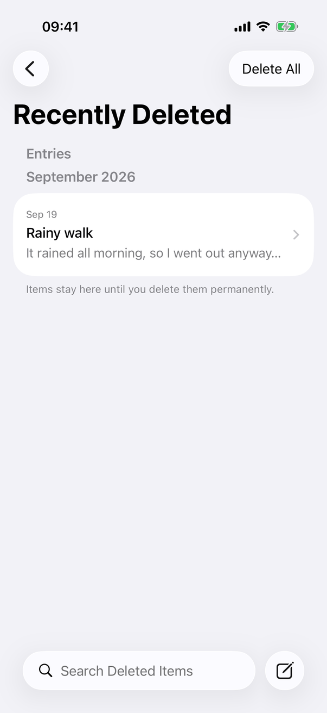 | One deleted entry under Entries and a month; footer under it; "Delete All" top right; search and compose at the bottom |
| 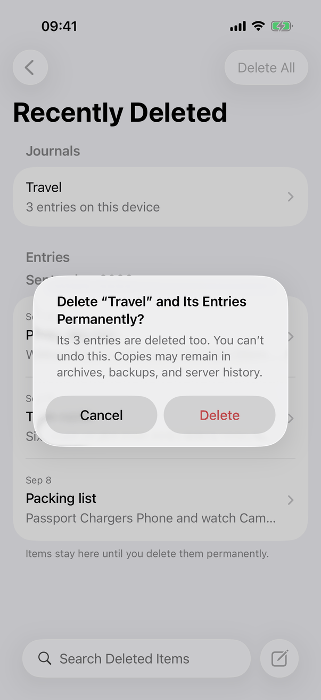 | The alert for a deleted journal with three entries, opened from the top-right button; the list is dimmed behind it |
| 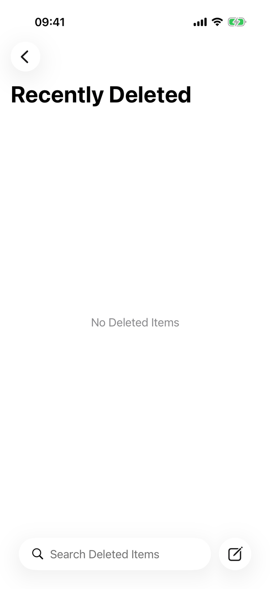 | The empty state, no Delete All button |
| 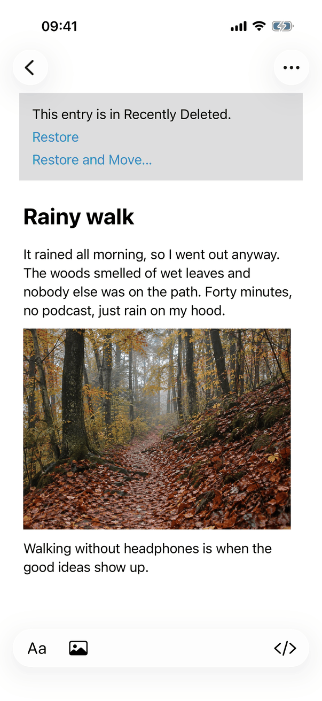 | Read-only entry with the recovery notice (Restore, Restore and Move…) above the title |
| 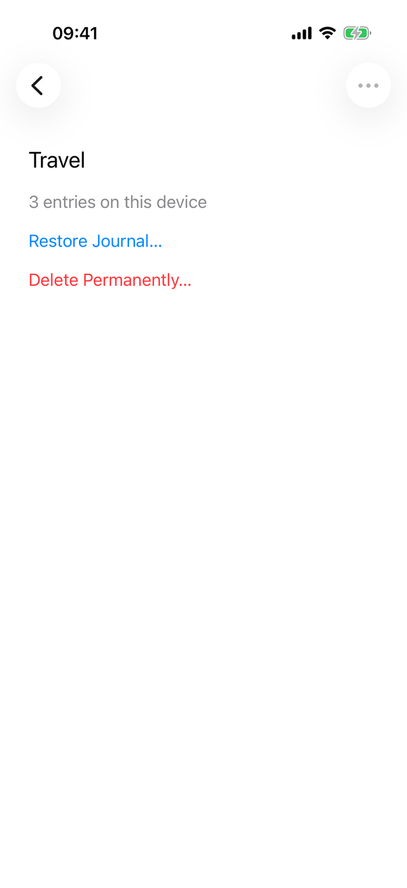 | The journal's page: name, count, Restore Journal…, Delete Permanently…; Entry Actions dimmed |
| 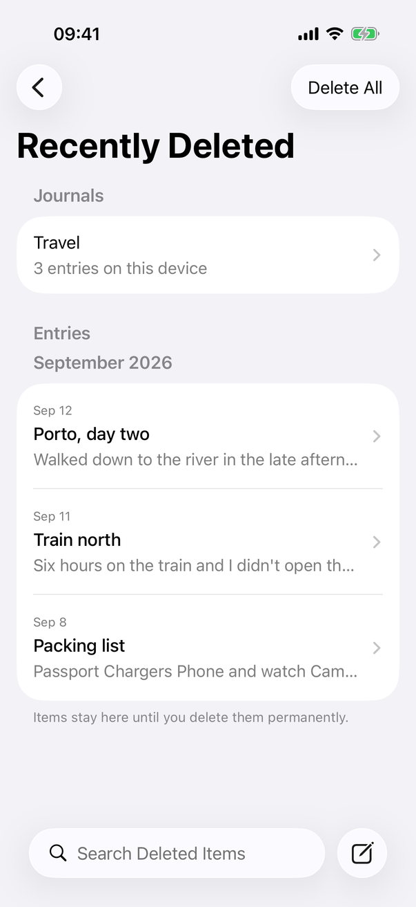 | Journals section with Travel, then Entries with a month and three rows, footer |

iPad Pro 11-inch landscape (1210 x 834):

| Screenshot | State |
| --- | --- |
| 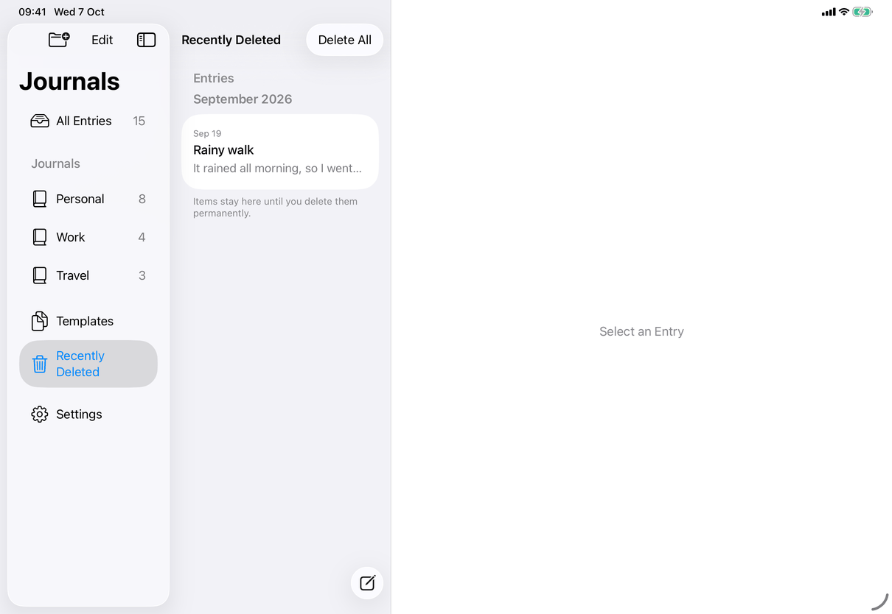 | Three columns, Recently Deleted chosen in the sidebar, one entry listed, "Select an Entry" in the detail; the list title is inline because of the scroll position |
| 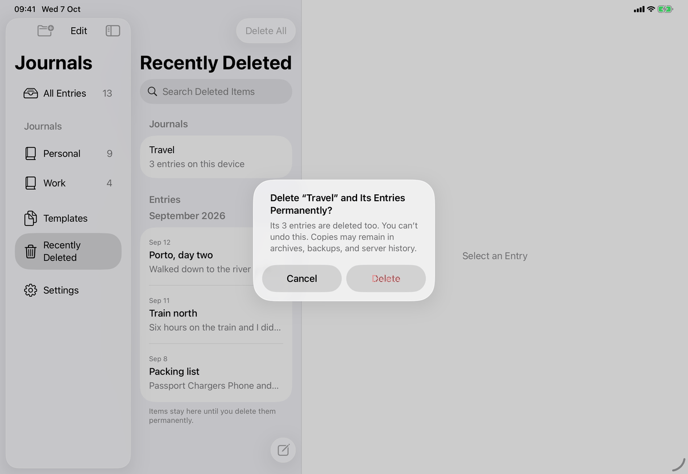 | The same alert, centered |
| 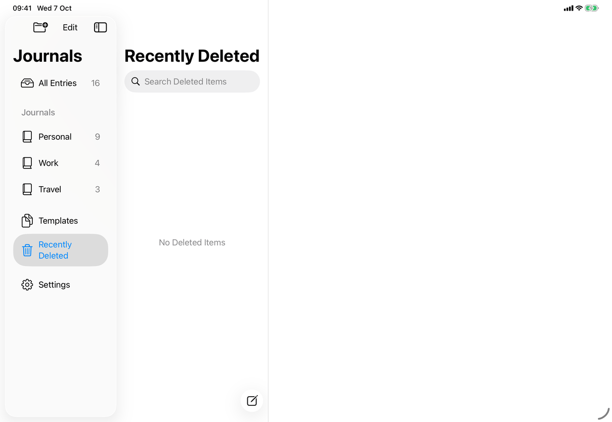 | No Deleted Items, search field under the large title |
| 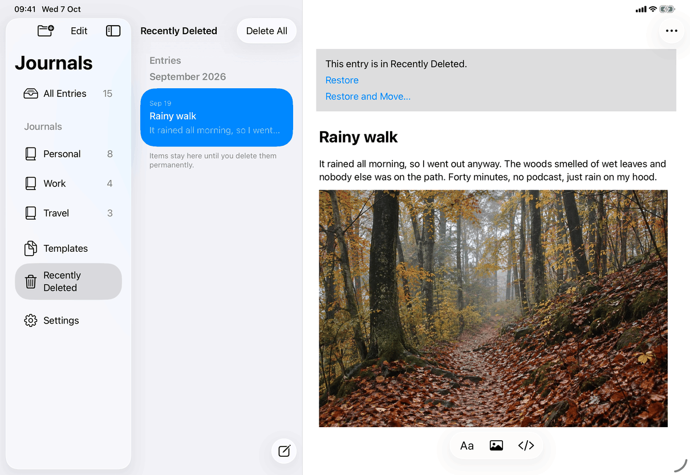 | The selected row highlighted, the entry and its notice in the detail column |
| 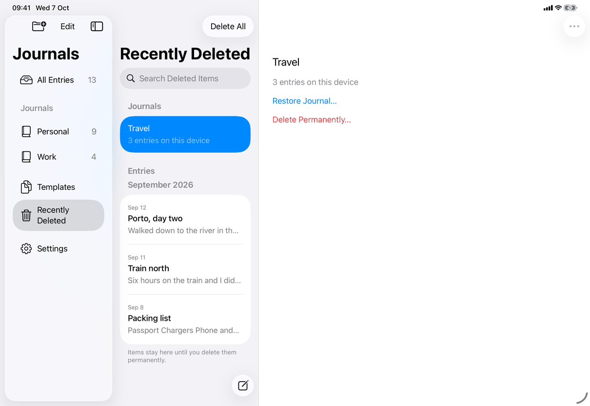 | The journal's detail |
| 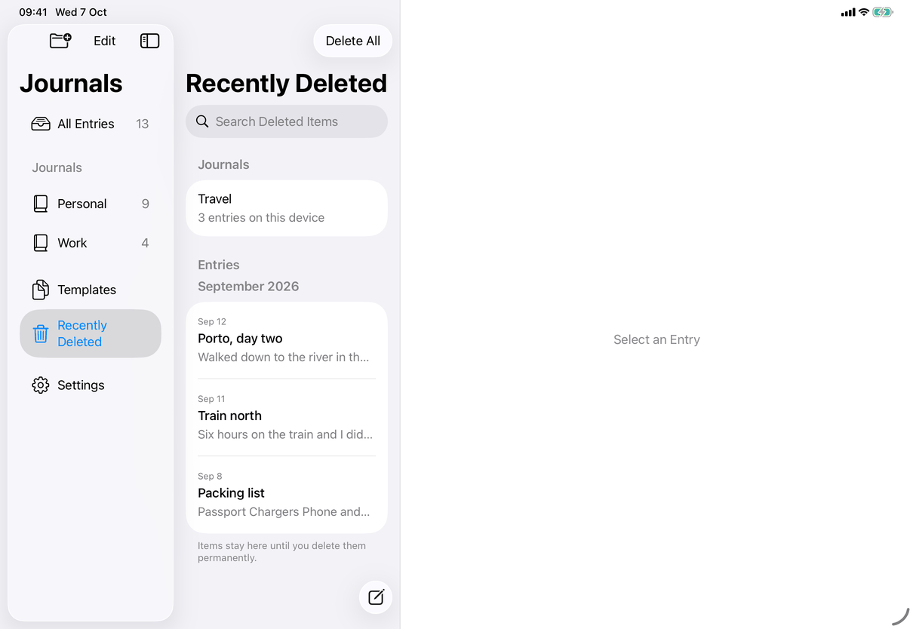 | Journals and Entries sections |

Mac window (1280 x 800 points):

| Screenshot | State |
| --- | --- |
| 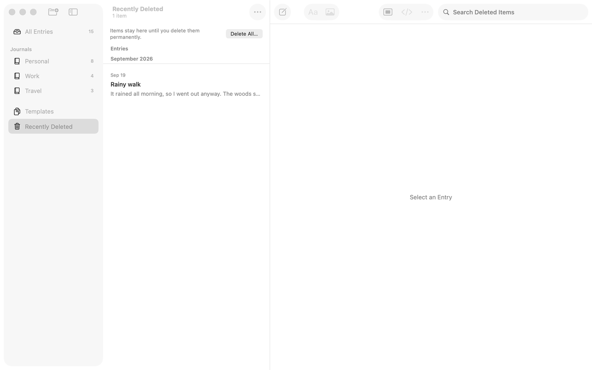 | Window not in front (dimmed). Subtitle "1 item", the bar with the sentence and "Delete All…", one entry, "Select an Entry" in the editor |

## Source files

View:
- `Views/RootView.swift`: the entries list (`sidebar`), rows, swipes, context menu, `detailContent`, Delete Permanently triggers, empty state.
- `Views/RootView+Toolbar.swift`: the iOS Delete All bar button and the search prompt.
- `Views/CompactJournalNavigation.swift`: iPhone stack and `entryLink`.
- `Views/DeletedJournalView.swift`: the deleted journal's detail.
- `Views/EntryRecoveryNotice.swift`, `Views/EntryHeaderView.swift`: the notice and where it is placed on iOS.
- `Views/PermanentDeletionView.swift`, `Views/DeleteAllPrompt.swift`, `Views/DeletionConflictAlert.swift`: the alerts and their wording.
- `Views/Mac/RecentlyDeletedHeader.swift`, `Views/Mac/RootView+MacWindow.swift`, `Views/CommandDeleteKey.swift`: the Mac bar, window subtitle and ⌘⌫.

Model: `Model/PermanentDeletionOperations.swift` (preparation, Delete All phases, batches), `Model/EntryRestorationOperations.swift` and `Model/EntryDeletionOperations.swift` (restore, restore of templates, list hiding), `Model/JournalNavigation.swift` (the filtered lists).

Core: `JournalLifecycle.swift` (where an entry is: journal, Recently Deleted, unavailable), `StoreDeletion.swift` (checks and permanent deletion).

Design records: `docs/design/recently-deleted-2026-09-30.md`, `docs/design/ios-delete-all-and-settings-2026-10-03.md`, `docs/design/permanent-deletion.md`, `docs/design/owner-decisions-2026-09-25.md`.

## Open questions

See [open-questions.md](../../../open-questions.md) (D15). New differences found while writing this page are reported to the owner: the conflict alert for permanent deletion has no copy key and is not in the spec, and the generic alert title in code is "My Journal" where the spec says "Journal".
