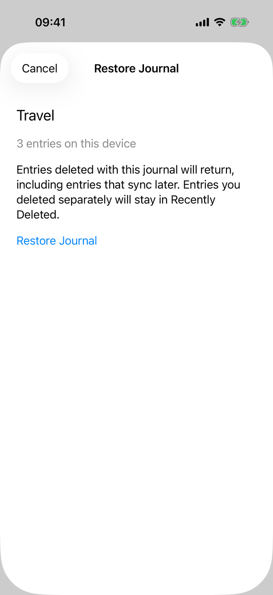
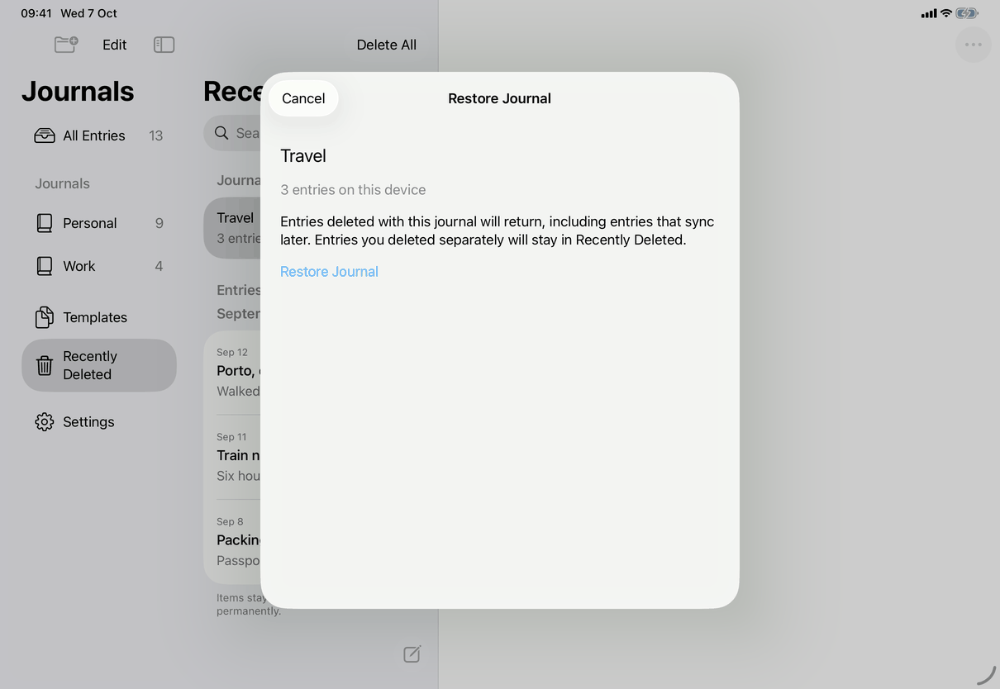

# Restore Journal and Restore Entry (Apple)

Maps [screens/restore-journal.md](../../../screens/restore-journal.md). One SwiftUI view, `JournalLifecycleView` (`Views/JournalLifecycleView.swift`), serves both sheets. The Mac has no screenshot in the capture set; its layout below is from the source.

## Controls

`JournalLifecycleView(journalID:restoringEntryID:)`. With `restoringEntryID` set it is Restore Entry, otherwise Restore Journal. It is presented with a plain `.sheet` from two places: `DeletedJournalView` (`.sheet(isPresented:)`, from `library.recentlyDeleted.restoreJournal`, command `restore-journal`) and `EntryRecoveryNotice` (`.sheet(item:)`, from `library.recoveryNotice.restoreWithJournal`, command `restore-with-journal`; the sheet receives the entry's journal id and the entry id). The view has no detents.

State is kept in the view (`@State`): `entryPlan` (what the check returned for Restore Entry: `EntryRestorationPlan`, the entry, its journal and the counts), `journal`, `prepared`, `loaded`, `busy`, `completed`, `error`, `conflictID`, `entryIssue`. The model calls are `AppModel.refresh`, `prepareEntryRestoration`, `restoreJournal`, `restoreEntryAndJournal`, `reviewRestoredEntry` and `sync`; JournalCore does the work in `JournalLifecycle.swift` and `EntryRestoration.swift`.

Chrome:
- Title: `library.restoreJournal.title` or `library.restoreEntry.title`.
- iPhone and iPad: `NavigationStack` with an inline `.navigationTitle` and the close button as `ToolbarItem(placement: .cancellationAction)` at the top left.
- Mac: a `VStack` with the title (`.title2.bold()`, 24 points above), the content, a `Divider`, and a bar with the close button at the left; `frame(minWidth: 360, idealWidth: 460, minHeight: 360, idealHeight: 500)`.
- Close button: `Button(completed ? "Done" : "Cancel", role: .cancel)`, `.keyboardShortcut(.cancelAction)`, disabled while `busy` (`common.cancel`, `common.done`). `.interactiveDismissDisabled(busy)` stops a swipe-down while working.

Content, in a `ScrollView` and a left-aligned `VStack(spacing: 18)` with 24 points of padding, in this order (the numbering follows the spec):
1. Restore Entry only, once `entryPlan` exists: the entry's `displayTitle` in `.title2`, its date as `.dateTime.year().month().day()` in secondary, then `library.restoreEntry.needsJournal`.
2. The journal's name (`.title2`, `common.untitledJournal` when blank) and `library.recentlyDeleted.journalCount` in secondary. The count is `entryPlan.entryCount`, or `AppModel.restorableEntryCount` before the check.
3. The explanation, `library.restoreJournal.explanation` or `library.restoreEntry.explanation` (`restorationExplanation`).
4. `library.restoreJournal.legacy` in secondary, when `legacyEntryCount` is not zero.
5. `common.restoredAsRenamed` when `AppModel.restoredName(of:)` finds another journal in use with the same name.
6. The error, plain secondary `Text` (not red) with `.textSelection(.enabled)`.
7. `ProgressView("Please Wait…")` (`common.pleaseWait`) while `busy`.
8. The confirming Button, shown only once `prepared` is true and the sheet is not `completed`: label `library.restoreJournal.title` or `common.restore`; default plain style with `.foregroundStyle(Color.accentColor)`; multi-line left-aligned label; `accessibilityIdentifier("confirm-journal-lifecycle")`; no key shortcut. It commits what the check captured (`entryPlan` is not recomputed), so a changed journal ends in an error and a new explicit press.
9. Recovery actions (plain Buttons):
   - `common.tryAgain`, when the check failed, no issue is classified and the journal is editable or unknown (`prepare()` again);
   - Restore Entry failures (`entryIssue`): `library.restoreJournal.reviewEntry` when the journal was already restored (`reviewRestoredEntry`, then the sheet closes), `common.trySyncingAgain` when the journal is missing and `model.connection` exists (`sync()` then `prepare()` again), and the export control;
   - `common.reviewChanges` when `conflictID` is set; it opens a nested sheet with `JournalConflictView` for a journal or `ConflictReview` for an entry, or, if the conflict is gone, the text `messages.conflict.resolved` with `common.done`. When the nested sheet closes, `prepare()` runs again;
   - `ArchiveExportControls` (a plain "Export Archive…" Button with an inline error and progress, `Views/ArchiveView.swift`; command `export-archive`) for content from a newer version and for a missing journal;
   - a missing journal in Restore Journal: `library.restoreJournal.unavailableLocal` (no server) or `common.journalNotArrived` with `common.trySyncingAgain` (with a server).

Busy and error states: while `busy` every control is disabled, the close button too. Messages are `failure.shown(.saving)` (`FailureMessage`), except `messages.lifecycle.changedContinue` and the two "already restored" texts, which `handle(_:)` sets itself. Messages for the open entry that cannot be saved first come from `AppModel` (`messages.save.before.goBack`). After a stored restore that cannot be shown the sheet sets the error to `messages.refresh.journalRestored` or `library.restoreEntry.displayFailed`, marks itself `completed` (button becomes Done) and offers no second restore.

Success: `AppModel.restoreJournal` selects the journal with no entry open (`showingTrash` off, `persistSelection`) and calls `store.placeJournalAtEnd`, which gives the journal a place at the end only if journals were arranged and it has no rank yet; `restoreEntryAndJournal` selects the journal and opens the entry. Then `dismiss()`.

Locking: `onValueChange(of: model.locked)` cancels the task, clears the state and dismisses.

## Layout

- **iPhone:** the default sheet, a large card with a gap above it and a rounded top edge; title centered inline; Cancel (or Done) at the top left in a capsule. Dynamic Type only grows the text; the column scrolls.
- **iPad:** the default sheet in regular width is a centered card (about 580 by 650 points in the screenshot) over the dimmed three-column window; same navigation bar. In a compact-width window (Slide Over, narrow Split View) the system presents it like the iPhone's.
- **Mac:** a window-attached sheet, 360 to 460 points wide and 360 to 500 high, with the title above the content and the close button at the bottom left. The confirming Button sits in the content, not the bar, on every device.
- **Dynamic Type:** no layout switch; text wraps (`fixedSize(horizontal: false, vertical: true)`) and the sheet scrolls.

## Commands and shortcuts

| Command | Placement | Shortcut | Enabled when |
| --- | --- | --- | --- |
| `restore-journal` | The confirming Button in the sheet; the sheet itself is opened from a deleted journal's detail | none (no Return shortcut) | The check succeeded (`prepared`), not busy |
| `restore-with-journal` | Opens this sheet from the recovery notice | none | As in [commands.md](../commands.md) |
| `try-syncing-again` | In the sheet when the journal is missing and the library syncs | none | Not busy, `model.connection` set |
| `review-changes` | In the sheet when the check found a conflict | none | Not busy |
| `export-archive` | The "Export Archive…" control for newer-version content and a missing journal | none | As in [commands.md](../commands.md) |

Keyboard: Escape closes (`.cancelAction`, not platform-conditional, so a hardware keyboard on iPad does the same); Return does nothing, so the person must press or tab to Restore after reading. Escape is ignored while busy.

## Copy differences

None. The text is the same on all devices; the spec's `restoredAsRenamed` and journal names come from `JournalNames.displayName`.

## Accessibility

- The error text is announced when it changes (`JournalAccessibility.announce`, skipped while locked), both on the Mac (`NSAccessibility` announcement) and on iOS (`UIAccessibility` announcement).
- Counts use singular and plural forms in code (`"1 entry on this device"` against `"{count} entries ..."`). Names wrap instead of truncating.
- The confirming Button is a plain Button (no extra traits). The destructive role is not used for restore, so VoiceOver does not call it destructive.
- The sheet's title is the navigation title on iOS; on the Mac it is a plain `Text` styled as a title, with no header trait added in the source.
- All controls are standard Buttons in a scroll view, so Full Keyboard Access and Voice Control reach them by name; Escape closes.

## Differences between iPhone, iPad and Mac

- Cancel and Done are at the top left on iPhone and iPad (the navigation bar's cancellation slot) and at the bottom left on the Mac, where a sheet has no navigation bar and puts its buttons in a bar below the content (sheet conventions: [platform.md](../platform.md#9-sheets-popovers-and-notices)).
- iPad shows a centered card and iPhone a large sheet, because that is how a plain `.sheet` is presented at each width; the app sets no detents.

## Screenshots

| Device | Screenshot | State |
| --- | --- | --- |
| iPhone |  | Restore Journal for the deleted journal Travel: name, "3 entries on this device", the explanation, Restore Journal in the accent colour; Cancel top left; nothing below the button |
| iPad |  | The same sheet as a centered card over the dimmed Recently Deleted list |

None for the Mac: the capture set has no Mac image of this sheet.

## Source files

View: `Views/JournalLifecycleView.swift` (the whole sheet), `Views/DeletedJournalView.swift` and `Views/EntryRecoveryNotice.swift` (where it opens), `Views/ArchiveView.swift` (`ArchiveExportControls`).

Model: `Model/JournalOperations.swift` (`restoreJournal`), `Model/EntryRestorationOperations.swift` (`prepareEntryRestoration`, `restoreEntryAndJournal`, `reviewRestoredEntry`), `Model/JournalEditing.swift` (`restoredName(of:)`), `Model/FailureMessage.swift` (error text).

Core: `JournalLifecycle.swift` (lifecycle errors, locations), `EntryRestoration.swift` (the plan and its errors), `Store.swift` (`restoreJournal`, `restoreAndMoveEntry`).

Design records: `docs/design/journal-lifecycle-ui.md`, `docs/design/journal-name-uniqueness.md`.

## Open questions

None.
