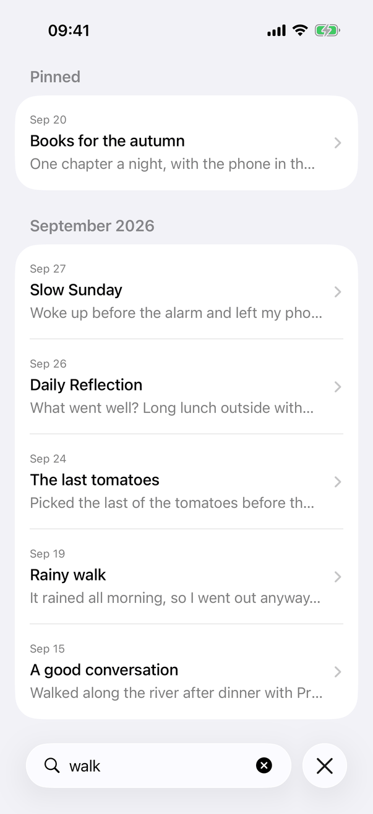
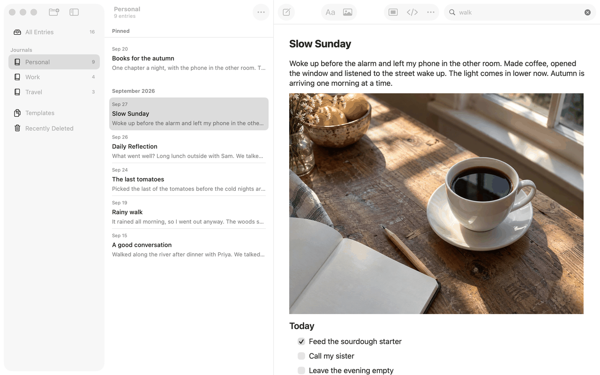
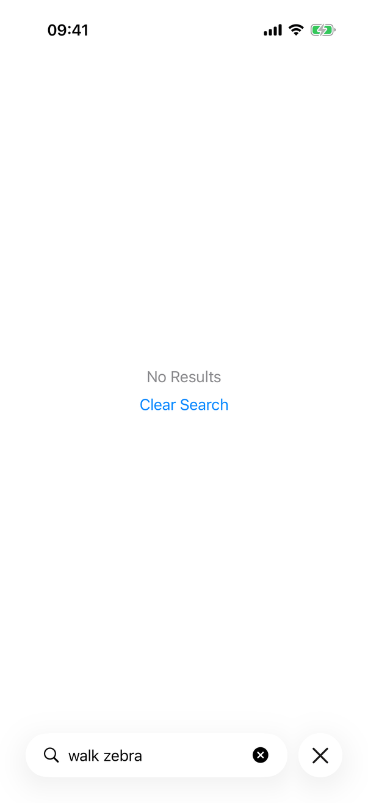

# Search (Apple)

Implements [screens/search](../../../screens/search.md). Search has no screen of its own: it is a field that filters the entry list on screen ([entry-list](entry-list.md)), and on the stacked Journals page a second field with its own results page. Shared model: `AppModel.query`, `DerivedLists` and the `EntrySearchIndex` actor in `JournalCore`.

## Controls

- **Prompt.** `RootView.searchPrompt(for: model)` (`RootView+Toolbar.swift`) is the one source of the field's placeholder: `library.search.allEntries`, `common.searchUnavailableEntries`, `library.search.deleted`, `library.search.templates`, or `library.search.journal` filled with the journal's name (`common.untitledJournal` when blank), with `library.search.journalFallback` when no journal is chosen. On the Mac it is also the field's tooltip and accessibility label.
- **List search on iPhone and iPad.** The list carries `EntrySearch(text: $model.query, isPresented: $searchPresented, prompt:)` (`RootViewAdaptations.swift`), a `ViewModifier` that applies `.searchable(text:isPresented:prompt:)` on iOS 17 and later and `.searchable(text:prompt:)` before. On iOS 26 the list's toolbar also adds `DefaultToolbarItem(kind: .search, placement: .bottomBar)` so the system draws the search control in the bottom bar next to New Entry (`listToolbar`). `isPresented` is what lets a command open the field.
- **Mac toolbar field.** `JournalToolbarController` owns an `NSSearchToolbarItem` whose `searchField` is a `FocusReportingSearchField` (an `NSSearchField` subclass in `MacJournalSearchField.swift`), `preferredWidthForSearchField = 200`, `sendsSearchStringImmediately = true`. Typing calls `configuration.setQuery`, which sets `model.query`. The item can collapse when the window is narrow (the editor's minimum width is chosen to leave room for it). The field reports focus the person gave it, by click or by Tab (`becomeFirstResponder` checks the current event is a mouse-down or key-down, so a window that places focus on opening does not count), and that leaves Editor Only (`searchFocused`, `leaveEditorOnly`).
- **Journals page search (stacked layout).** `compactNavigation` applies `EntrySearch` with `journalsQuery` (local `@State`, not the model's query) and the prompt `library.search.allEntries`. While `journalsQuery` is not empty the root of the stack is `JournalSearchResults` instead of `JournalSidebarView`: a plain `List` titled `common.journals` of `Button`s (`.buttonStyle(.plain)`), each a `VStack` of the date (`.dateTime.day().month(.abbreviated)`, caption), the title (`displayTitle`, headline, one line), the first 1,000 characters of text on one line (secondary) and a `Label` with `book.closed` and the journal's name (`library.entryList.journalValue` when it cannot be found). `.overlay` shows `library.entryList.empty.noResults` once a search has completed with no result. Results come from `model.matchingEntries(query)` in a `.task(id:)` keyed by the query and the list revision, then are filtered to entries in a journal in use (`lifecycle.location(of:) == .journal`) and sorted newest first. Choosing a result (`openSearchResult`) shows All Entries, copies the text into `model.query`, selects the entry and sets the stack to `[.collection(.all), .entry(id)]`, so Back goes to the filtered All Entries.
- **Matching.** `AppModel.query` has a setter that calls `searchQuery()`: an empty query clears the matches; otherwise `DerivedLists.search` waits for the index, asks `EntrySearchIndex.matches`, and delivers the set of ids if the query is still current. The index stores each entry's and template's folded title and text (`folding(options: [.caseInsensitive, .diacriticInsensitive])`, composed form, UTF-8) in memory only, and finds the folded query with `memmem`, in parallel (`Parallel.map`). Nothing of it is written to disk. The list filter is applied in `AppModel.listedEntries`; while a new query is being searched the previous results stay (`lists.matches` is replaced only when the new ones arrive), and a result equal to the shown one does not change the list. Recently Deleted filters its journals by name (`localizedStandardContains`) and its templates by name or text directly in the model, and `query` there refreshes views at once.
- **Empty state.** `emptyListState` in the entry list: `library.entryList.empty.noResults` and a `Button` for `library.entryList.empty.clearSearch` that sets `model.query = ""` (see [entry-list](entry-list.md)). The Journals results page has the text only.
- **Locked.** Locking sets `query = ""`, and `DerivedLists.clear()` cancels searches and clears the index and the matches.

## Layout

- **Mac.** The field is the last item of the toolbar over the editor, 200 points (the screenshot shows its placeholder `Search Personal` and a clear button once text is typed). The list keeps its section headers (the Pinned header stays over matching pinned entries). Search Entries leaves Editor Only first so the list shows the results.
- **iPad, regular width.** The list column has the system search field under its large title (see the iPad screenshots); the bottom of the column holds New Entry. Search Entries shows the list column when it was hidden (`presentSearch`: `columnVisibility == .detailOnly` becomes `.doubleColumn`) and opens the field.
- **iPhone and stacked iPad.** The field sits in the bottom bar with New Entry (iOS 26). While it is active the keyboard shows and a close button appears beside the field (screenshot). In a list, Search Entries (with a hardware keyboard) first pops an open entry back to its list (`navigate(to: prefix(1))`) and then opens the list's search; on the Journals page it opens `journalsSearchPresented`.
- **Dynamic Type.** The system field scales with the text size; the results rows have no fixed height.

## Commands and shortcuts

| Command | Placement | Shortcut | Enabled when |
| --- | --- | --- | --- |
| `search-entries` | Edit menu (Mac, iPad), below Find | ⌥⌘F | `isReady && !locked`; on iPad only from iOS 17 (`canPresentSearch`) |
| `clear-search` | Under No Results in the list | | A query is set |

`JournalCommands` declares the Edit-menu item with `[.command, .option]` on the Mac and `[.command, .shift]` on iOS. On the Mac `FindMenuShortcuts` (installed in `applicationWillFinishLaunching`, before the menu bar is built) observes `NSMenu.didAddItemNotification` and `didChangeItemNotification` and rewrites the system Find and Replace… item to ⇧⌘F whenever the menu changes; without it SwiftUI would drop Search Entries because the system item already owns ⌥⌘F. On iPad `JournalAppDelegate.buildMenu(with:)` calls `FindKeyCommands.reassign(in:)`, which swaps the two shortcuts in the Edit menu after the app's commands are in place: Search Entries is added with ⇧⌘F (the system holds ⌥⌘F for Find and Replace…, and UIKit leaves out a command whose shortcut is taken) and then given ⌥⌘F while Find and Replace… gets ⇧⌘F. The command sets the `searchRequested` flag of `EditorActions`; `RootView` answers it on iOS with `presentSearch()` and on the Mac `JournalToolbarController.update` calls `beginSearchInteraction()` on the search item, then clears the request.

Keyboard: the page adds no Return or Escape handling to the field (the system search field's own behaviour applies); Tab and a click move focus to the Mac field and leave Editor Only. No result navigation keys exist.

## Copy differences

None. The same prompt strings are used on every device; the Mac also uses the prompt as tooltip and accessibility label.

## Accessibility

- The field is the system search field (`NSSearchField` on the Mac, `.searchable` on iOS) with the prompt as its label (explicitly set on the Mac: `setAccessibilityLabel(prompt)`).
- Each Journals result row is a `Button` whose children read as one element; list rows are described in [entry-list](entry-list.md).
- Reduce Motion: no animation of its own; the list updates when results arrive.
- A hidden list column cannot keep focus: on the Mac, focus moves to the list or editor when the column collapses ([library-window](library-window.md)).

## Differences between iPhone, iPad and Mac

- **Where the field is.** Mac: in the toolbar, as in Notes. iPhone: in the bottom bar, as in Notes (iOS 26). iPad: under the list's title in the column, which is where the system puts a `.searchable` field in a regular-width column; the spec says bottom bar for both iOS devices, and the iPad screenshots show the field at the top.
- **Search across journals** exists as its own page only on the stacked Journals page. On the iPad's three-column layout and on the Mac the person chooses All Entries and searches there: the sidebar has no field because it never shows entries.
- **Search Entries on iPad needs iOS 17**, because presenting `.searchable` from code (`isPresented`) was added then; before it the command is not offered.
- **Shortcut plumbing** differs by platform (a menu observer on the Mac, a menu builder hook on iPad) to reach the same ⌥⌘F / ⇧⌘F pair as Notes (owner decision).

## Screenshots

| State | iPhone | iPad | Mac |
| --- | --- | --- | --- |
| Search "walk" in Personal |  |  |  |
| No results ("walk zebra") |  |  | none |

The iPhone captures are the entry list of one journal (the list's search), not the Journals page results.

## Source files

View:
- `apps/apple/JournalApp/Views/RootView+Toolbar.swift`: the prompt and the iOS list toolbar (search item and New Entry).
- `apps/apple/JournalApp/Views/RootViewAdaptations.swift`: `EntrySearch` (the iOS 17 switch).
- `apps/apple/JournalApp/Views/CompactJournalNavigation.swift`: the Journals page search, `openSearchResult`, `presentSearch`.
- `apps/apple/JournalApp/Views/JournalSearchResults.swift`: the Journals page results.
- `apps/apple/JournalApp/Views/MacJournalSearchField.swift`, `Views/Mac/JournalToolbarController.swift`: the Mac field.
- `apps/apple/JournalApp/AppCommands.swift`: the Search Entries menu item.

Model:
- `apps/apple/JournalApp/Model/AppModel.swift` (`query`), `DerivedLists.swift` (`search`, `setMatches`, `searchQuery`, `matchingEntries`): the query path.
- `apps/apple/JournalApp/Model/FindMenuShortcuts.swift` (Mac), `FindKeyCommands.swift` (iPad): the ⌥⌘F pair.

Core: `EntrySearchIndex` in `apps/apple/Packages/JournalCore/Sources/JournalCore/EntrySearch.swift`.

Design records: `docs/design/pre-release-ui-2026-09-27.md`, `docs/design/pinned-entries.md`.

## Open questions

See [open-questions.md](../../../open-questions.md): the spec lists the iPad's search as a bottom-bar field, but the iPad screenshots show it under the list title; the spec also says search ends edit mode on iPad, which the code does only on the stacked Journals page ([journals](journals.md)).
