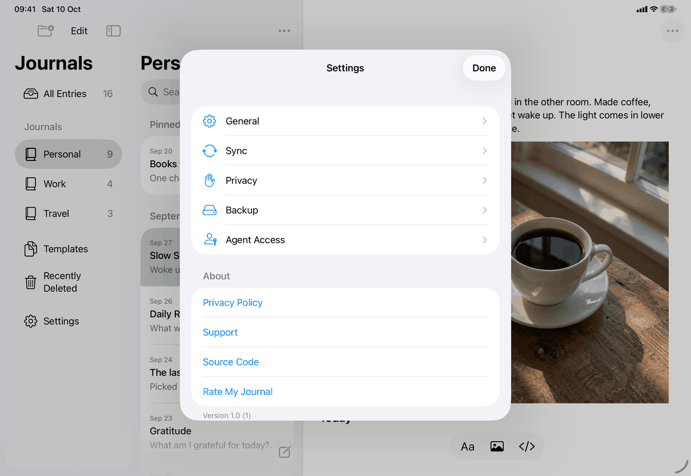

# Settings ▸ About, and the Help menu (Apple)

Neutral spec: [screens/settings-about.md](../../../screens/settings-about.md). Container: `settings`. Conventions: [platform.md](../platform.md#4-menus-and-toolbars).

The same five destinations are reached two ways. iPhone and iPad list four of them in a Settings section (About). The Mac has no About section: the Help menu holds them (and so does an iPad with a hardware keyboard or menu bar). Both are built from one enum, `AboutLink`, so the addresses are defined once.

## Controls

**Settings ▸ About (iPhone and iPad only).** `AboutSection`, declared inside `#if os(iOS)` in `Views/AboutLinks.swift` and placed by `SettingsView` between the five pane rows and the Erase section.
- A `Section` with header `settings.about.header`.
- Four `Link` rows in the order of `AboutLink.settingsRows`: `common.privacyPolicy`, `settings.about.support`, `settings.about.sourceCode`, `common.rateMyJournal`. A row is built only when its `URL` is non-nil. Each `Link(title, destination:)` opens the address with the system (the browser, or the App Store for the review page); the rows are tint-coloured text with no chevron (screenshot).
- Section footer: the version, a `Text` with `.textSelection(.enabled)` and `.accessibilityLabel(...)`. `AboutLink.version` reads `CFBundleShortVersionString` and `CFBundleVersion` from the main bundle and gives `settings.about.version` ("Version 1.0 (1)"), or `settings.about.versionWithoutBuild` when there is no build number; the spoken form is `settings.about.version.spoken`.
- There is no user-guide row here; the guide is only in the Help menu.

**Help menu (Mac, and iPad with a menu bar or hardware keyboard).** `CommandGroup(replacing: .help) { HelpMenuItems() }` in `AppCommands.swift` replaces the system's help items with `HelpMenuItems`, a list of `Button`s that call `openURL`:
1. `library.menu.help.guide` ("My Journal Help") with `.keyboardShortcut("?", modifiers: .command)`.
2. `Divider()`.
3. `library.menu.help.support`, `common.privacyPolicy`, `library.menu.help.source`.
4. `Divider()`.
5. `common.rateMyJournal`.

**Addresses (all in `AboutLink`).** The repository address is the constant `AboutLink.repository`; the guide is `docs/guide/README.md`, Support is `SUPPORT.md`, the privacy policy is `PRIVACY.md`, the source link is the repository's home page. Rate My Journal uses `https://apps.apple.com/app/id6816758959?action=write-review` on iOS (including iPad's Help menu) and the `macappstore://` scheme with the same path on the Mac, so the Mac App Store app opens directly. It is never the in-app rating prompt (`StoreKit` review requests are in `ReviewRequestPresenter.swift`).

**States.** No empty, loading or error state: the links are static, and Settings shows its locked text instead of this section while locked. If the device cannot open the address the system handles it; the app shows nothing.

## Layout

- **iPhone.** The About section is the second section of the Settings list, below the five pane rows and above the red Erase section, with the version under it (screenshot).
- **iPad.** The same section in the Settings sheet; the sheet is shorter than the list, so the section is partly cut off at the bottom in the capture and scrolls.
- **Mac.** No section. The Help menu is the last menu in the menu bar; the Mac's About My Journal window (the standard About panel from the application menu) shows the version.
- Dynamic Type: standard row and footer wrapping; the version footer wraps.

## Commands and shortcuts

| Command | Placement | Shortcut | Enabled when |
| --- | --- | --- | --- |
| `about-privacy-policy` | Settings ▸ About, as in [commands.md](../commands.md) | none | always |
| `about-support` | Settings ▸ About | none | always |
| `about-source-code` | Settings ▸ About | none | always |
| `about-rate` | Settings ▸ About | none | always |
| `help-guide` | Help menu, first item | ⌘? | always |
| `help-support` | Help menu | none | always |
| `help-privacy` | Help menu | none | always |
| `help-source` | Help menu | none | always |
| `help-rate` | Help menu, after a separator | none | always |

Keyboard: Help menu items are also reachable through the iPad ⌘-hold shortcut list (only ⌘? has a key). Settings rows are standard links for Full Keyboard Access.

## Copy differences

- The Help menu items name the app ("My Journal Help", "My Journal Support", "Source Code on GitHub") because a menu item is read without a section header, while the Settings rows are "Support" and "Source Code" under the About header (`library.menu.help.*` against `settings.about.*`). There are no `mac` variants. See [open-questions.md](../../../open-questions.md), B13.
- The guide row's title in the enum (`settingsTitle` "Help") is never shown, because `settingsRows` omits the guide.

## Accessibility

- The version `Text` has the label `settings.about.version.spoken`, so VoiceOver reads "Version 1.0, build 1", not "1.0 (1)" with punctuation.
- `Link` rows are exposed as links by the system. The section header is read as a header.
- The version is selectable (`.textSelection(.enabled)`).

## Differences between iPhone, iPad and Mac

- About section on iPhone and iPad only: iOS has no Help menu on a phone, so Settings carries the links; the Mac and iPad with a keyboard have the menu, and the Mac's About window shows the version.
- Rate My Journal opens the web review URL on iOS and the `macappstore://` URL on the Mac, so the Mac opens the App Store app instead of a web page that hands over to it.
- ⌘? exists wherever the Help menu does (Mac and iPad with a hardware keyboard).

## Screenshots

| State | iPhone | iPad |
| --- | --- | --- |
| The Settings list with the About section (Privacy Policy, Support, Source Code, Rate My Journal) and the version "Version 1.0 (1)" |  |  |

The captures are of the whole Settings list: it is the screen this section lives on. The iPad capture cuts the section off after Source Code. The Mac and the Help menu are not captured: the Mac capture records the window only, and a menu is not part of it.

## Source files

View:
- `apps/apple/JournalApp/Views/AboutLinks.swift`: `AboutLink` (titles, addresses, version), `AboutSection` (iOS), `HelpMenuItems`.
- `apps/apple/JournalApp/AppCommands.swift`: replaces the Help menu.
- `apps/apple/JournalApp/Views/SettingsView.swift`: places `AboutSection`.

Design record: `docs/design/about-and-ratings-2026-10-05.md`.

## Open questions

See [open-questions.md](../../../open-questions.md), B13 (the Help menu and Settings labels differ).
