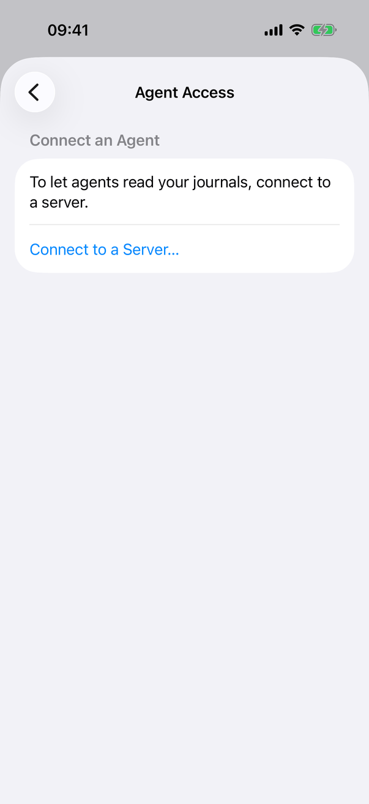
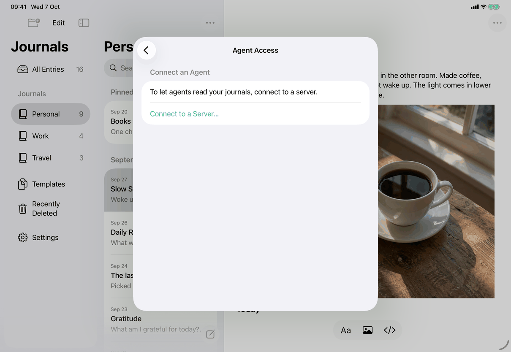
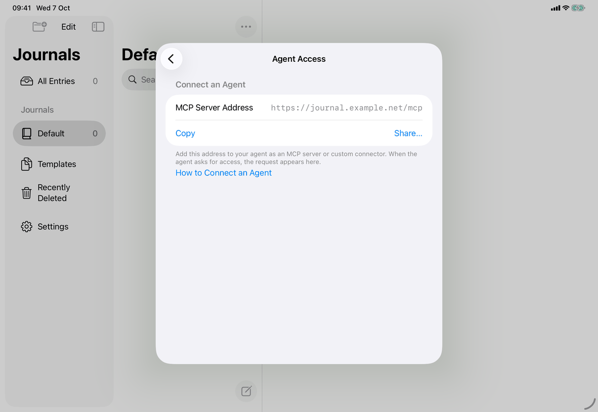
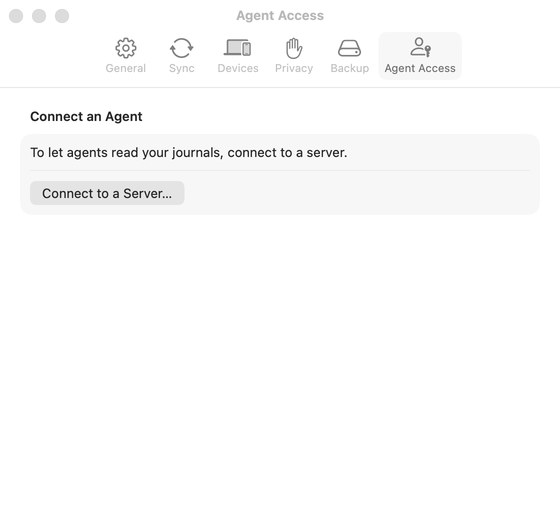
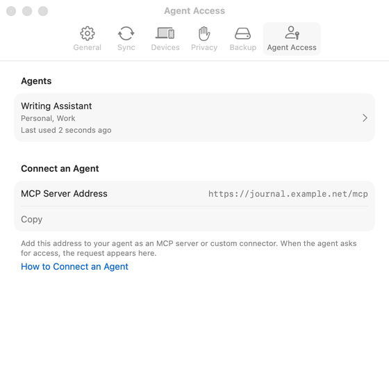
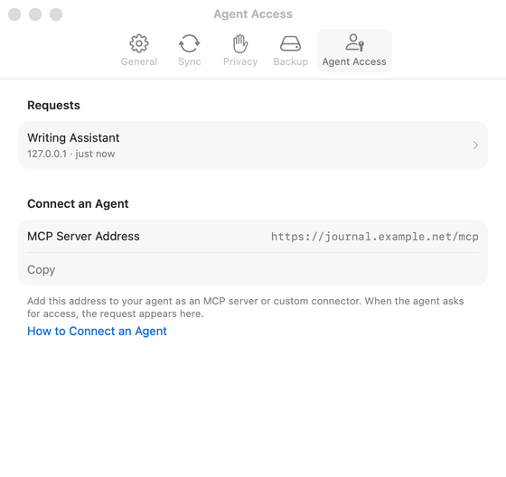
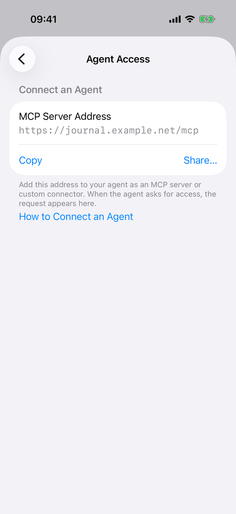

# Settings ▸ Agent Access (Apple)

Implements [screens/settings-agent-access.md](../../../screens/settings-agent-access.md): the Agent Access pane of Settings. Its sheets are [allow-agent.md](allow-agent.md) (Allow Access) and [agent-detail.md](agent-detail.md); the whole flow is [flows/allow-agent.md](../flows/allow-agent.md). Settings conventions: [platform.md](../platform.md#10-settings). Reading agents needs an MCP agent client and a server, so the agent list, requests, Allow Access and the detail were captured on the Mac only (see Screenshots).

The pane is `ServerAgentsSections` inside the `Form` of `SettingsView.agentSettings`, with `ServerAgentsPresentation` as a view modifier on the same `Form`. State and calls belong to `ServerAgentsController` (a `@MainActor ObservableObject`, one per `SettingsView`), which talks to the server through `AppModel.connectedClient()` and to the agent copies through `AppModel.agentCopies` (an `AgentCopyPublisher`, JournalCore). Agents themselves live on the server; this device only lists and changes them.

## Controls

Order of the spec's Content section. The container is a `Form` with `.formStyle(.grouped)`; sections are `Section` with a header (Mac and iOS render the header in the grouped style of each).

1. **Requests** (`Section("Requests")`, key `settings.agents.requests.header`): shown when `model.connection != nil`, the controller has loaded a list or is `.ready`, and `controller.requests` is not empty. One row per `AgentRequest` that is not being declined (`ServerAgentsController.requests` is the server's list minus `AgentRequestDeclines.inFlight`): a `Button` with `.buttonStyle(.plain)`, an `HStack` of a `VStack` (client name from `ServerAgentText.displayName`, then `redirectHost · {asked}` in `.subheadline` secondary, each `lineLimit(1)` unless `dynamicTypeSize.isAccessibilitySize`), a `Spacer` and a hidden `chevron.right`. `ServerAgentText.asked` gives `settings.agents.justNow` under 60 seconds, else `date.formatted(.relative(presentation: .named, unitsStyle: .abbreviated))`. The button keeps its accessibility label `settings.agents.requestLabel` and hint `settings.agents.requestHint`. Tapping sets `controller.reviewing`, which presents Allow Access. The section's footer shows `controller.declineFailure` (`settings.agents.requests.declineFailed`) after a Don't Allow could not be sent, as secondary text (the default footer style; the words and an announcement through `JournalAccessibility.announce` carry it, not colour); `ServerAgentsController` clears it when a later decline succeeds, when `request(_:id:)` opens that request, when `receive(waiting:)` no longer lists it, and in `clear()` (lock).
2. **Agents** (`Section("Agents")`, `settings.agents.agents.header`): when connected, a list has loaded and `controller.agents` is not empty; sorted by `localizedStandardCompare` on the name. Each row is `ServerAgentRow` (a `VStack`: name, then journals via `ServerAgentText.journalNames` limited to 2 lines, then, only if `agent.settings != nil`, the status from `ServerAgentText.status`). The status is a `Label` with `exclamationmark.circle` for `settings.agents.status.needsReconnect` while access has not ended, plain text otherwise; the order is ended, connecting (`common.connecting`), needs reconnect, ends within 7 days, never used, last used (`.relative(presentation: .named)`). On iPhone and iPad the row is a `NavigationLink` to `ServerAgentDetailView` (pushed in the Settings `NavigationStack`); on the Mac it is a plain `Button` with a trailing chevron that sets `controller.selected`, shown as a sheet. Both carry hint `settings.agents.agentHint`. The whole row is one accessibility element (`.accessibilityElement(children: .combine)`).
3. **Connect an Agent** (`connectSection`, header `settings.agents.connect.header`). `connect` switches on the connection and `controller.phase`:
   - not connected: `settings.agents.connect.notConnected` and a `Button` `common.connectToServer`, which sets `controller.connecting` to present `ConnectionView` as a sheet;
   - `.loading` and nothing loaded yet: `connectionStatus` (a small `ProgressView` and `settings.agents.loading`);
   - `.needsUpdate`: `settings.agents.connect.needsUpdate`;
   - `.noAccess`: `settings.agents.connect.noAccess` and a button `messages.sync.action.connectAgain` (the button's title in the source is "Connect Again…") that also presents `ConnectionView`;
   - `.addressUnavailable(reason)`: `settings.agents.connect.publicUrlRequired` when the server reports that a public address is required, else `settings.agents.connect.httpsRequired`, plus a `Link` `settings.agents.connect.guide`;
   - `.unreachable`: `settings.agents.connect.unreachable` and `common.tryAgain` (`controller.load`);
   - `.ready` (default): `MCPAddressRow`, then `ServerAgentText.reachability` (callout, secondary: `settings.agents.reach.local` for `127.0.0.1`, `localhost` or `::1`; `settings.agents.reach.tailnet` for a host ending in the Tailscale domain `.ts.net`).
   - `MCPAddressRow`: `LabeledContent` `settings.agents.mcpAddress` whose value is the address in `.system(.callout, design: .monospaced)`, `.textSelection(.enabled)`, trailing aligned (leading aligned, below the label, at accessibility sizes); then an `HStack` with `Button` `common.copy` (`.buttonStyle(.borderless)`; its title becomes `settings.agents.copied` for two seconds; accessibility label `settings.agents.copyLabel`; `PlainPasteboard.copy` writes `NSPasteboard.general` on the Mac and `UIPasteboard.general` elsewhere) and, `#if os(iOS)` only, `ShareLink(item: address)` titled `common.share` with label `settings.agents.shareLabel`.
   - Footer (only when connected and `.ready`): `settings.agents.connect.footer`; `settings.agents.connect.exposure` when `model.configuration?.encrypted != false` and the server host is not loopback; a `Link` `settings.agents.connect.guide` to the repository's agent-access guide (`ServerAgentText.guide`).
   - `{host}` is `ServerAgentText.host`: the host name, `settings.agents.thisMac` for a loopback address, `settings.agents.yourServer` when unknown; `leadingHost` capitalises it.

Loading, offline and error states are in Connect an Agent as listed. Once `controller.loaded` is true a later failure leaves Requests and Agents on screen and only the Connect section changes.

Loading and polling are in `ServerAgentsPresentation`: `.task(id: model.connection?.address)` loads the status and the agent list (`ServerAgentsController.read`: `client.status()`, the agent-access feature check, the MCP address, then `publisher.list()`), then calls `refreshRequests` at once and every 3 seconds (`Task.sleep`) while the task runs and the app is active (`NSApp.isActive` on the Mac, `scenePhase == .active` on iPhone and iPad). It also refreshes when `scenePhase` becomes `.active`, on the Mac when `NSApplication.didBecomeActiveNotification` fires, and when the Allow Access sheet is dismissed. A change in the set of request ids, or any agent still `.pending`, reloads the list. `.onValueChange(of: model.locked)` calls `controller.clear()`, which also closes the sheets and cancels first-copy uploads. The task is cancelled when the pane disappears, so nothing polls while another pane is shown.

Why the sheets are attached to the Form: a sheet attached to a section of an iPhone form is hosted by a row and dismisses Settings instead of appearing (comment in `ServerAgentsController`), so `ServerAgentsPresentation` attaches `.sheet(item: $controller.reviewing)`, `.sheet(isPresented: $controller.connecting)` and, on the Mac, `.sheet(item: $controller.selected)` to the form itself.

On the Mac, at launch `LocalAgentCleanup.run` removes what the earlier local agent connections left (grants, activity, connection files, two keychain items). It has no UI; a porter does not need it unless a client also kept the older local connection files.

## Layout

- **iPhone (compact)**: Settings is a sheet with a `NavigationStack`; Agent Access is a row (`person.badge.key`) that pushes the pane with an inline title. Rows and sheets use the full width; at accessibility sizes request and agent names wrap and the MCP address moves under its label.
- **iPad (regular)**: the same stack inside the Settings card sheet (about 580 pt wide); no sidebar inside Settings.
- **Mac**: a tab (`person.badge.key`, title "Agent Access") of the Settings window's `TabView`; each tab is 560 pt wide (`.frame(width: 560)`, `fixedSize()`), at least 440 pt high and as tall as its content up to the screen height less 120 pt, then it scrolls; the pane does not rubber-band when it fits (`scrollBounceBehavior(.basedOnSize)`). Buttons in the form render as bordered Mac buttons ("Connect to a Server…") where iPhone and iPad show tinted text.
- The switch is `#if os(macOS)` in `SettingsView` and in `agentRows`/`MCPAddressRow`.

## Commands and shortcuts

| Command | Placement | Shortcut | Enabled when |
| --- | --- | --- | --- |
| `review-agent-request` | The request row | None | A request waits |
| `open-agent` | The agent row | None | An agent is listed |
| `copy-mcp-address` | Copy button | None | Address shown |
| `share-mcp-address` | Share… button, iPhone and iPad only | None | Address shown |
| `open-agent-guide` | Link in the footer and in the address-unavailable state | None | Always |
| `agents-try-again` | Try Again | None | Server unreachable |
| `connect-to-server` | Connect to a Server… | None | Not connected |
| `sync-reconnect` | Connect Again… | None | This device lost access |

Placement and shortcuts are as in [commands.md](../commands.md). The pane has no keyboard shortcuts of its own: rows are buttons reached by Tab (Full Keyboard Access) and Space or Return on the Mac, and by a hardware keyboard on iPad.

## Copy differences

None. No key of this pane has a `mac` variant. The server host reads "this Mac" for a loopback address on every device (the key `settings.agents.thisMac` is not a variant), including when an iPhone or iPad is connected to a loopback address, which only happens in development.

## Accessibility

- A request row stays a `Button` with its own label and hint, not a combined element, so VoiceOver and the Mac's accessibility actions can press it (design record, section 15).
- An agent row is one element reading name, journals and status; the status never relies on colour (an icon and text).
- Copy changes its accessibility label to `settings.agents.copied` while the title says it and posts `settings.agents.copiedAnnouncement` through `announceForAccessibility` (`UIAccessibility.post(.announcement)` on iOS, `NSAccessibility` `announcementRequested` at high priority on the Mac).
- The loading row is one combined element. Request and agent names, and the footer, wrap at accessibility sizes.
- Client and agent names are shown with `Text(verbatim:)` so they never format as Markdown, and request names pass through `AgentDisplayName.clean`.

## Differences between iPhone, iPad and Mac

- Agent rows push on iPhone and iPad (a `NavigationLink`, a navigation stack is available) and present a sheet on the Mac (a tab of the Settings window has no navigation stack of its own).
- Share… exists only on iPhone and iPad because the address is usually needed on a computer, where Copy is enough; `ShareLink` is compiled `#if os(iOS)`.
- The pane is a pushed screen on iPhone and iPad and a tab on the Mac (Settings window), the standard idiom of each.
- Mac only: `LocalAgentCleanup` at launch, and the foreground refresh through `NSApplication.didBecomeActiveNotification` (iOS uses `scenePhase`).

## Screenshots

Captured from the sample library on the platforms shown. The agent list, requests, Allow Access and the agent detail need an MCP agent client, so they were captured on the Mac only; iPhone and iPad show only the not-connected state and, on iPad, the address row (against a server on the capture machine, so the address is a loopback one and the local-reach sentence shows).

| Device | Image | State |
| --- | --- | --- |
| iPhone |  | Pushed pane: Connect an Agent with `settings.agents.connect.notConnected` and the Connect to a Server… button |
| iPad |  | The same state in the Settings card sheet over the library |
| iPad |  | Connected: MCP Server Address in monospaced type, Copy and Share…, the loopback reach sentence, footer and How to Connect an Agent |
| Mac |  | Agent Access tab of the Settings window, not connected; bordered button |
| Mac |  | Agents section with one agent (name, journals, Last used), then the address with Copy, the footer and the guide link; no Share…, no exposure sentence |
| Mac |  | Requests section with one request (client, `127.0.0.1 · just now`, chevron), above Connect an Agent |

-  iPhone: connected to a server: the MCP server address, Copy and Share, with no agent yet (an agent needs an MCP client, so the agent list is captured on the Mac only).

## Source files

View:

- `Views/ServerAgentsView.swift`: `ServerAgentsSections` (this pane), `ServerAgentsPresentation` (sheets and polling), `MCPAddressRow`, `ServerAgentRow`, and the sheets in the other two pages.
- `Views/SettingsView.swift`: where the pane sits (`agentSettings`, the tab and the row), `ConnectionView` presentation.

Model:

- `Model/ServerAgentsController.swift`: phases, the lists, `load`, `refreshRequests`, approve, revoke; `ServerAgentText` (host, reachability, status and name strings); `PlainPasteboard`.
- `Model/LocalAgentCleanup.swift`: Mac launch cleanup of older local connections.

Core:

- `JournalCore/AgentCopyPublisher.swift` (`LibraryAgent`, `list`, the 20-agent limit), `JournalCore/AgentCopy.swift`, `JournalCore/AgentCopyClient.swift`.

Design records: [agent-access-simplified.md](../../../../docs/design/agent-access-simplified.md), [agent-access-server.md](../../../../docs/design/agent-access-server.md), [client-only-mac-lists-markdown-2026-10-05.md](../../../../docs/design/client-only-mac-lists-markdown-2026-10-05.md); protocol: [agent-access-server.md](../../../../protocol/agent-access-server.md).

## Open questions

See [open-questions.md](../../../open-questions.md), C21 (the design record says the no-server state offers "Set Up Sync…"; the code and `copy/en.json` use "Connect to a Server…").
