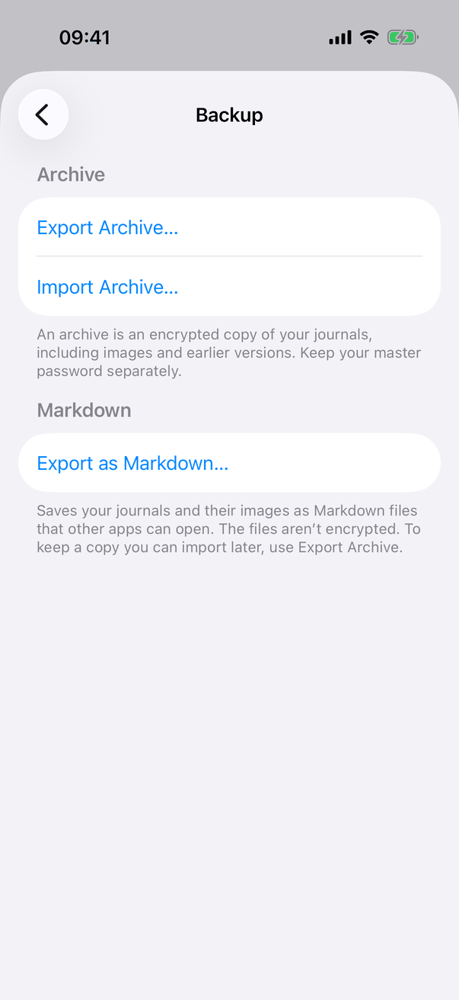
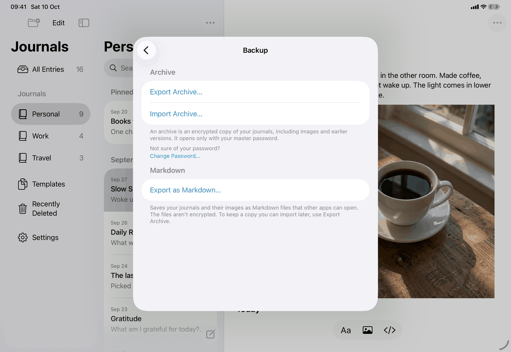
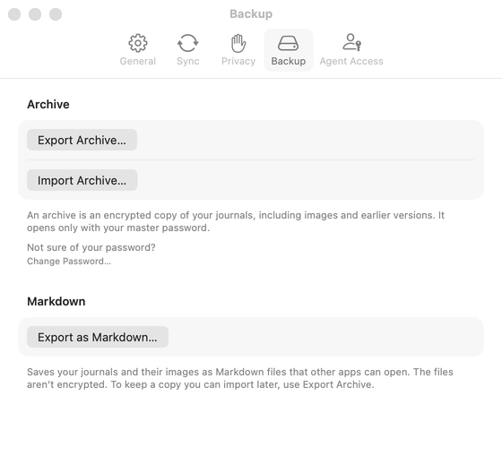

# Settings ▸ Backup, and the Export sheets (Apple)

Neutral spec: [screens/settings-backup.md](../../../screens/settings-backup.md). Container: `settings`. Related pages: `export-archive`, `export-markdown`, `import-archive`, `archive-import`. Conventions: [platform.md](../platform.md#16-files-pickers-and-document-types).

## Controls

The pane body (`SettingsView.pane(.backup)`) is a `Form` with `.formStyle(.grouped)` holding `ArchiveControls` and `MarkdownExportSection`. Models: `AppModel`, and two `@MainActor` `ObservableObject`s created by the controls with `@StateObject`: `ArchiveExport` and `MarkdownExportController` (one operation each, in `Model/DocumentTransferOperations.swift` and `Model/MarkdownExportOperations.swift`).

**1. Archive section** (`ArchiveControls`, `Views/ArchiveView.swift`). Header `settings.backup.archive.header`.
- `ArchiveExportControls`: an `HStack` with a `Button` `common.exportArchive` (disabled while `export.showsProgress`), a `Spacer(minLength: 0)` and, after a 0.3 second delay (`ArchiveExport.progressDelay`), a `ProgressView().controlSize(.small)` with accessibility label `settings.backup.preparingArchive`, so the row keeps its size. Below it, when `export.error` is set, a red selectable `Text` (message keys `messages.export.archiveFailed`, `messages.export.archiveNoSpace`, `messages.export.archiveSaveFailed`, `messages.save.before.goBack`). It is cleared when the next export starts.
- `ArchiveImportButton`: a `Button` `common.importArchive` that sets `choosing`, which presents `.fileImporter(allowedContentTypes: [.journalArchive])`. A chosen file is presented in `ArchiveImportView` as a `.sheet` (page `archive-import`). A picker failure shows `.alert` titled `settings.backup.openFailed`, `common.ok`.
- After a save (1.1): `messages.export.archiveSaved` in the same place as the error line, as secondary selectable `Text` with `{credential}` lower-cased, until the next export starts (`ArchiveExport` holds a `savedMessage`, cleared by `start`), announced with `JournalAccessibility.announce` when it appears. Nothing for an unencrypted library.
- Footer `settings.backup.archive.footerEncrypted` (credential name lower-cased) or `settings.backup.archive.footerUnencrypted`, chosen from `model.configuration?.encrypted`.
- Under the footer, for master-password libraries only: a borderless `Button` `settings.backup.archive.changePassword` that presents `ChangePasswordView` as a `.sheet` (the same sheet as Settings ▸ Privacy ▸ Change Password…, command `change-password`). It appears in this pane and in `ArchiveExportSheet`.

**2. Markdown section** (`MarkdownExportSection`, `Views/MarkdownExportView.swift`). Header `settings.backup.markdown.header`.
- `MarkdownExportControls`: the same row with `Button` `settings.backup.exportMarkdown`, disabled while preparing or when `model.store == nil`; indicator label `settings.backup.preparingFiles`; a red selectable error `Text` (`messages.export.markdownFailed`, `messages.export.markdownNoSpace`, `messages.export.markdownSaveFailed`, `messages.save.before.goBack`); a secondary selectable note `Text` after a successful save that left something out (`settings.backup.markdownNote.*`). Error and note changes are announced with `JournalAccessibility.announce`.
- Footer `settings.backup.markdown.footer` (encrypted journals) or `settings.backup.markdown.footerUnencrypted`.

**Save dialogs.** Both exports end in SwiftUI `.fileExporter`: for the archive `contentType: .journalArchive` (a package type, `org.privatejournal.archive`, extension `journalarchive`) with a document `JournalFile(package:filename:)` and default name `settings.backup.archiveFilename`; for Markdown `contentType: .folder` with the folder name `settings.backup.markdownFolderName`. The dialogs are the system's: the Files browser sheet on iPhone and iPad, a save panel sheet on the Mac. The prepared package or folder is a temporary copy removed when the dialog closes (`discard()`), and at the next launch by `ArchiveExportLeftovers.removeAtLaunch` if the app quit meanwhile.

**No password check (1.1).** Export Archive goes straight to preparing; the sheet `PasswordCheckView`, `passwordCheckPending` and its two commands are gone. Typing the current password in Change Password is the check, and Forgot Password? there resets a forgotten password for a local-only library.

**Authentication before an archive.** `ArchiveExport.confirmOwner`: when App Lock is on and the library is not encrypted, the device owner is asked first (reason `settings.backup.archiveReason`, "Export an archive of your journals", lower-cased on the Mac); cancelled does nothing, failed shows `settings.backup.verifyFailed` ("Couldn’t verify it’s you. Try again.") as the red line. The spec now says so too. Markdown export asks whenever App Lock is on (`settings.backup.markdownReason` or `settings.backup.markdownReasonUnencrypted`); failure shows the same verification text.

**3. Export sheets** (File menu). `ArchiveExportSheet` and `MarkdownExportSheet` (same files) are each a `NavigationStack` containing a `Form` (`.formStyle(.grouped)`) with one section holding the same controls and the same footer; `.navigationTitle` `settings.backup.exportArchiveSheet.title` or `settings.backup.exportMarkdownSheet.title`; one `ToolbarItem(placement: .cancellationAction)` `Button` `common.done` that dismisses; closed by `onValueChange(of: model.locked)`. On the Mac `.frame(minWidth: 460, minHeight: 220)` (archive) or `minHeight: 240` (Markdown). They are presented by `RootView` from `model.archiveExportPresented` and `model.markdownExportPresented`, set by File ▸ Export Archive… and File ▸ Export Journals as Markdown… in `AppCommands.swift` (enabled when `model.isReady && !model.locked`). `ArchiveExportSheet` is also what the Erase warning opens (`erase`).

**File menu import.** File ▸ Import Archive… sets `model.archiveImportRequested`, which a `.fileImporter` on `RootView` handles; the chosen file goes to `archiveToImport`, shown as `ArchiveImportView`. The item is enabled by `model.canImportArchive` (not while locked).

**Lifetime and states.** One export of each kind at a time (`busy` is `operation != nil || presenting`). Leaving the pane while preparing cancels it; while the save dialog is open it continues (`onDisappear` cancels only when not presenting). Locking cancels and closes the dialog. On the Mac `keepsUnlockedWhile(export.busy && !export.presenting)` suppresses the inactivity lock while preparing. Preparing state is the indicator; the error state is the red line.

## Layout

- **iPhone.** A pushed "Backup" screen: the Archive section (two rows, then footer), the Markdown section (one row, then footer) (screenshot). The save dialog is a bottom sheet over the Settings sheet.
- **iPad.** The same inside the Settings sheet. The save dialog is a larger centred sheet with the Files sidebar.
- **Mac.** The Backup tab: bordered buttons in grouped rows, 560 points wide, minimum height 440 so the import and Change Password sheets fit. The File-menu export sheets are small window sheets.
- Dynamic Type: standard form rows; no layout changes.

## Commands and shortcuts

| Command | Placement | Shortcut | Enabled when |
| --- | --- | --- | --- |
| `export-archive` | the Archive section's first row; File menu on the Mac and iPad keyboard, per [commands.md](../commands.md) | none | library open, not locked, not preparing or saving |
| `import-archive` | the Archive section's second row; File menu | none | not locked (File item: `canImportArchive`) |
| `export-markdown` | the Markdown section row; File ▸ Export Journals as Markdown… | none | library open, not locked, not preparing |
| `export-sheet-done` | the sheets' Done button | Escape (cancellation action) | always |
| `change-password` | the borderless pointer under the archive footer (also in the Export Archive sheet) | none | master-password library, unlocked |

Keyboard: Return and Escape follow the standard default and cancel actions in the sheets. The save dialogs use the system's keys.

## Copy differences

- The Mac authentication reasons for Markdown export are lower case (`settings.backup.markdownReason` and `settings.backup.markdownReasonUnencrypted` have `mac` variants), as the system sentence reads "My Journal is trying to {reason}".
- The File menu names the Markdown item "Export Journals as Markdown…" while Settings says `settings.backup.exportMarkdown` ("Export as Markdown…") (`export-markdown`; [open-questions.md](../../../open-questions.md), B13).
- Everything else is the catalog default text.

## Accessibility

- The indicators carry labels (`settings.backup.preparingArchive`, `settings.backup.preparingFiles`); the button stays labelled by its title.
- Markdown error and note text is announced when it appears (`JournalAccessibility.announce`); archive errors are shown but not announced; the archive saved message is announced.
- The red lines are selectable text. No other `.accessibility*` modifiers in this pane.

## Differences between iPhone, iPad and Mac

- Entry points: Settings only on iPhone; Settings and the File menu on iPad with a keyboard and the Mac, because only those have a menu bar. The File-menu sheets exist for the same reason: a menu item needs a surface to hold the button, the indicator and the error.
- Save dialog: Files sheet on iOS, save panel sheet on the Mac, both from `.fileExporter`; iPhone and iPad suggest the package's own name and leave a copy under that name in the temporary folder when cancelled, which `ArchiveExport` removes before the next export.
- On the Mac the inactivity lock is held off while a package is prepared (`keepsUnlockedWhile`); iOS has no inactivity lock.
- Mac tab height has a 440-point minimum for sheets; iOS lets the system size sheets.

## Screenshots

| Device | State |
| --- | --- |
| iPhone |  Both sections, encrypted-library footers. Captured before 1.1: the footer still reads "Keep your master password separately." and there is no Change Password pointer. |
| iPad |  The same in the Settings sheet. |
| Mac |  The Backup tab (inactive window). |

The save dialogs and File-menu sheets are on `export-archive` and `export-markdown`. Screenshots are refreshed by the capture script when the owner says ready.

## Source files

View:
- `apps/apple/JournalApp/Views/ArchiveView.swift`: `ArchiveControls`, `ArchiveExportControls`, `ArchiveExportSheet`, `ArchiveImportButton`, `ArchiveImportView`.
- `apps/apple/JournalApp/Views/MarkdownExportView.swift`: `MarkdownExportSection`, `MarkdownExportControls`, `MarkdownExportSheet`.
- `apps/apple/JournalApp/Views/ExportView.swift`: `JournalFile` (the `FileDocument`), the `journalArchive` type, the file name.
- `apps/apple/JournalApp/Views/ChangePasswordView.swift`: the sheet the pointer opens.
- `apps/apple/JournalApp/Views/RootView.swift` and `AppCommands.swift`: sheets and File menu.

Model:
- `apps/apple/JournalApp/Model/DocumentTransferOperations.swift`: `ArchiveExport`, `prepareArchive()`, `ArchiveExportLeftovers`.
- `apps/apple/JournalApp/Model/MarkdownExportOperations.swift`: `MarkdownExportController`, notes and errors.

Design records: `docs/design/archives.md`, `archive-actions-accessibility.md`, `export-operation-lifetime.md`, `owner-decisions-2026-09-25.md`, `client-only-mac-lists-markdown-2026-10-05.md`.

## Open questions

See [open-questions.md](../../../open-questions.md), A29, B13, B43 and B44. D2 is resolved: Export Archive asks for the device's authentication when App Lock is on and the library is not encrypted (build 18), and the spec says so. The picker-failure alert shows the fixed text of `settings.archiveImport.error.couldntOpen`, not the system's message the spec describes (B44).
