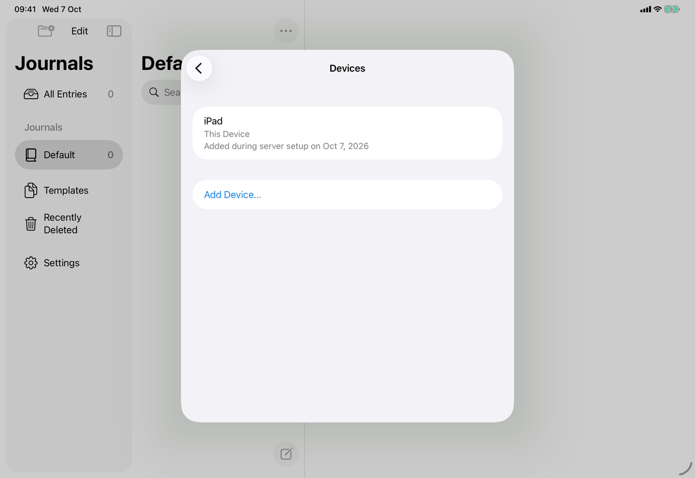
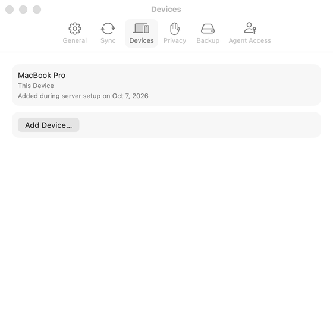
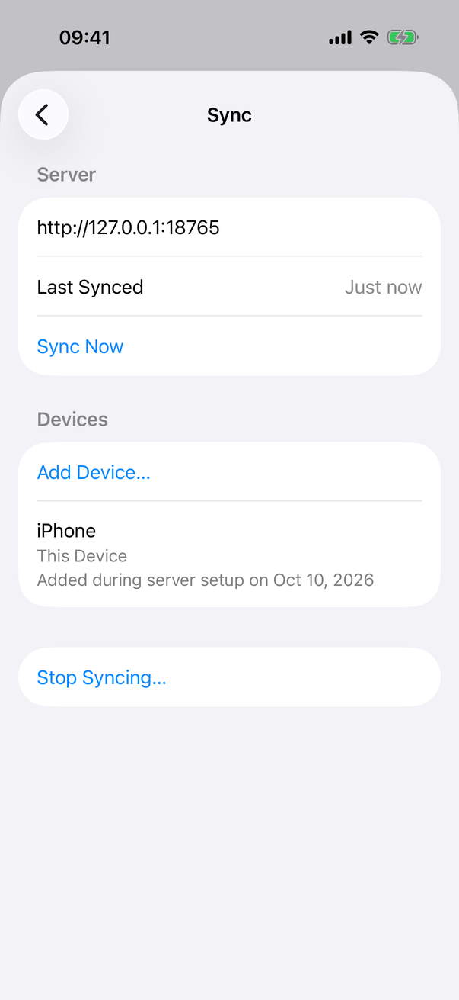

# Settings ▸ Sync ▸ Devices (Apple)

`DevicesSection` in `DevicesSection.swift`, a section of the Sync pane's `Form` (`SettingsView.syncSettings`), built only while `model.connection != nil && !model.serverRefusesThisDevice`. It is no longer a pane of its own. Spec: [settings-devices](../../../screens/settings-devices.md). Settings conventions: [platform.md](../platform.md#10-settings).

## Controls

Local `@State` holds everything: `devices: [ServerDevice]`, `loading`, `busy`, `error`, `refused`, `add`, `revoking`, `failedRevoke`. The view also takes `reload: Int`, which `SettingsView` raises in the `onDismiss` of its Connect or Reconnect sheet. The server is reached through `AppModel.connectedClient()` (`Model/DeviceOperations.swift`), whose `devices()` and `revoke(_:)` calls are the only network use. The list is read by `.task(id: reload)` (when the section is built, which is when the Sync pane appears or the sync state stops refusing the device, and again whenever `reload` changes) and by the Add Device sheet's `onDismiss`. While the app is locked `SettingsView` shows only `settings.locked`, so this view never builds a body for that state.

One `Section` with the header `settings.sync.devices.header` ("Devices"), in order:
1. `Button` `settings.devices.add`, `.disabled(busy || loading)`, first row: sets `add = true` and presents `AddDeviceView` ([add-device](add-device.md)) with `.sheet(isPresented:onDismiss:)`; dismissing it reads the list again.
2. While `loading` and no error is shown: `ProgressView("Loading Devices…")` (`settings.devices.loading`), a labelled spinner. A reload keeps the previous list visible.
3. `ForEach(devices.filter { !$0.revoked })`: one `DeviceRow` per device, in the order the server returned. The row is an `HStack` with a trailing button (a `VStack` at accessibility Dynamic Type sizes, `dynamicTypeSize.isAccessibilitySize`):
   - a `VStack(alignment: .leading, spacing: 3)` with the name, then (subheadline, secondary) `common.thisDevice` for the device whose id equals `model.connection?.deviceID`, then the added line from `DeviceDescriptions.added(_:)`. The stack uses `fixedSize(horizontal: false, vertical: true)` and `.accessibilityElement(children: .combine)`, so it is one element that wraps;
   - for every other device a `Button(role: .destructive)` `settings.devices.revoke`, `.disabled(busy)`, with accessibility label `DeviceDescriptions.revokeLabel` (`settings.devices.revokeLabel`, with ", " and the added line when another listed device has the same name). On iOS it is `.buttonStyle(.borderless)`, so only the button is tappable and not the whole row.
4. When `error != nil`: a `Text` in secondary style (not red) and `Button` `common.tryAgain` (`.disabled(busy || loading)`; revokes `failedRevoke` again if one failed, else `load()`). The error is `settings.devices.error.load` (load failed) or `common.couldntRevokeAccess` (revoke failed). A new error is announced with `JournalAccessibility.announce` (`onValueChange(of: error)`), as the Backup pane does. The error stays on screen while Try Again runs, so the button keeps its focus.
5. **Access refused:** when the load throws `JournalError.unauthorized`, `refused = true` removes the section's content and `model.learnWhyAccessWasRefused()` runs a sync, whose state `recordSyncHealth` stores; if that sync does not say, the state becomes `.accessRemoved` (`syncMessage(of:)`, `Model/SyncHealthOperations.swift`). `SettingsView` then also stops building the section, and the Server section shows the message and Reconnect…. The section appears again, and reads its list, when the sync state stops refusing the device.
6. **Revoke confirmation:** `.confirmationDialog` on the section with `titleVisibility: .visible`; title `common.revokeAccessFor` (name interpolated; `settings.devices.revoke.titleFallback` while `revoking` is already nil during the close animation); message `settings.devices.revoke.message`, preceded by the added line and ". " only when `DeviceDescriptions.hasNamesake(_:)`; buttons `common.revokeAccess` (`role: .destructive`, starts `revoke(_:)`) and `common.cancel` (`role: .cancel`). A successful revoke marks the device `revoked` in `devices` (it leaves the list but still names the devices it approved), clears `failedRevoke`, and does not read the list again.
7. **Locking:** `onValueChange(of: model.locked)` clears `devices` and sets `add` and `revoking` to false, which closes the sheet and the dialog.

**How a device was added** (`DeviceDescriptions`, same file). `sentence(_:detail:)` builds the line from `device.origin`: `.pairing` gives `settings.devices.added.byDevice` when the approving device (`approvedByDeviceId`) is in the list (revoked devices still count as approvers), else `settings.devices.added.pairingCode`; `.setup` gives `settings.devices.added.setup`; `.recovery` depends on `configuration.recovery.formatVersion` (1 `settings.devices.added.recoveryKey`, 3 `settings.devices.added.accessPassword`, 4 `settings.devices.added.recoveryCode`, anything else `settings.devices.added.masterPassword`); `.unknown` gives `settings.devices.added.unknown`. The date is `createdAt.formatted(date: .abbreviated, time: .omitted)` in the device's locale (the captures read "Oct 7, 2026"; a British-English device reads "7 Oct 2026"). `init` makes two passes: devices that would read the same (same name and sentence) get the time (`.shortened`, joined with " at "), and those still the same get " · " plus the first eight lowercase characters of their id.

Device names are `AppModel.deviceName`: `Host.current().localizedName` on the Mac, `UIDevice.current.name` on iPhone and iPad (which iOS reports generically as "iPhone" or "iPad", the reason for the added line and the namesake rules).

## Layout

- **iPhone:** a section of the Sync pane pushed in the Settings sheet's `NavigationStack`, below the Server section (and Changes to Review) and above Stop Syncing…; grouped rounded rows, the revoke button a trailing red text button. A phone scrolls to it.
- **iPad:** the same pane in the centred Settings form sheet.
- **Mac:** a section of the Sync tab of the Settings window, 560 points wide at a fixed height of `min(640, screen height minus 120)` that scrolls inside ([settings-sync](settings-sync.md)). The revoke button is a bordered button. Sheets and the dialog attach to the Settings window.
- Add Device on the Mac is a sheet with `frame(minWidth: 400, idealWidth: 460, minHeight: 440, idealHeight: 540)` ([add-device](add-device.md)); Connect to a Server is 440 to 480 wide.
- Dynamic Type: no size handling of its own; the added lines wrap because of `fixedSize(horizontal: false, vertical: true)`.

## Commands and shortcuts

| Command | Placement | Shortcut | Enabled when |
| --- | --- | --- | --- |
| `add-device` | First row of the section | none | connected, not loading, not busy; the section is absent while access is refused |
| `revoke-device` | Trailing destructive button of each other device's row | none | not this device; not while `busy` |
| `devices-try-again` | Row after the error text | none | after an error; not while `busy` or loading |

No shortcuts on this pane. The revoke dialog uses the system's keys.

## Copy differences

None. One string per element on all devices; only the date format differs with the device's locale.

## Accessibility

- The header is the section's one heading; then Add Device…, then one element per device. Each device's name, This Device and added line are one VoiceOver element (`.accessibilityElement(children: .combine)`) and its Revoke Access… button is another.
- Revoke Access… has the label `settings.devices.revokeLabel` naming the device (and how it was added when names repeat), so a list of identical "Revoke Access…" rows is distinguishable by VoiceOver and Voice Control.
- The revoke dialog's title is visible and read first.
- Loading is a labelled `ProgressView`, which VoiceOver reads as "Loading Devices…". There is no announcement when loading ends or a revoke succeeds; the row simply disappears.
- An error is a plain text row, announced once when it first appears; Try Again keeps focus while it runs.
- At accessibility text sizes the Revoke Access… button sits under the device's text.

## Differences between iPhone, iPad and Mac

- Container: a section of the pushed Sync pane (iPhone, iPad) versus of the Sync tab (Mac), as Settings elsewhere ([platform.md](../platform.md#10-settings)). The Mac's tab has a fixed height and scrolls; a phone scrolls the pane.
- Revoke Access… is a borderless text button on iOS and a bordered button on the Mac.
- Revoke confirmation: a window-modal dialog on the Mac; on iPhone and iPad `confirmationDialog` is an action sheet or an anchored popover depending on the system (the iOS 26 form was captured for Stop Syncing, [stop-syncing](../flows/stop-syncing.md); this dialog was not captured).
- Add Device is a sheet over the Settings window on the Mac, a sheet over the Settings sheet on iPhone and iPad; the Mac's is excluded from screen capture ([add-device](add-device.md)).
- Device names: the Mac reports its computer name, iPhone and iPad a generic name, so the added lines matter most there.

## Screenshots

Sample library; the connected captures show only this device (no other device to revoke), so Revoke Access…, the loading row and every error row are not captured. **The captures below predate the 1.1 layout:** they show Devices as a pane of its own (this device's card, then Add Device…). The next capture run (`design/spec-screenshots/capture.sh iphone ipad mac`) takes them from the Sync pane, scrolled to the Devices section (the state “settings-devices-connected”), with Add Device… first. Devices has no not-connected state any more, so those captures are gone.

| Device | State | Capture |
| --- | --- | --- |
| iPad | Connected: this device ("iPad", This Device, added during server setup) and Add Device… |  |
| Mac | Connected |  |

-  iPhone: connected: this device with when it was added, and Add Device….

## Source files

View:
- `apps/apple/JournalApp/Views/DevicesSection.swift`: the section, its rows, the revoke dialog, and `DeviceDescriptions` (added lines, namesake detail, revoke label).
- `apps/apple/JournalApp/Views/SettingsView.swift`: places the section in `syncSettings` and raises `devicesReload`.

Model:
- `apps/apple/JournalApp/Model/DeviceOperations.swift`: `connectedClient()`, `deviceName`, `approveDevice`.
- `apps/apple/JournalApp/Model/SyncHealthOperations.swift`: `serverRefusesThisDevice`, `learnWhyAccessWasRefused()` (runs a sync to learn why access was refused).

Design records: [devices.md](../../../../docs/design/devices.md), [pre-release-ui-2026-09-27.md](../../../../docs/design/pre-release-ui-2026-09-27.md), [sync-health-and-recovery.md](../../../../docs/design/sync-health-and-recovery.md).

## Open questions

None. [open-questions.md](../../../open-questions.md), A14 and A39 are resolved by this section.
