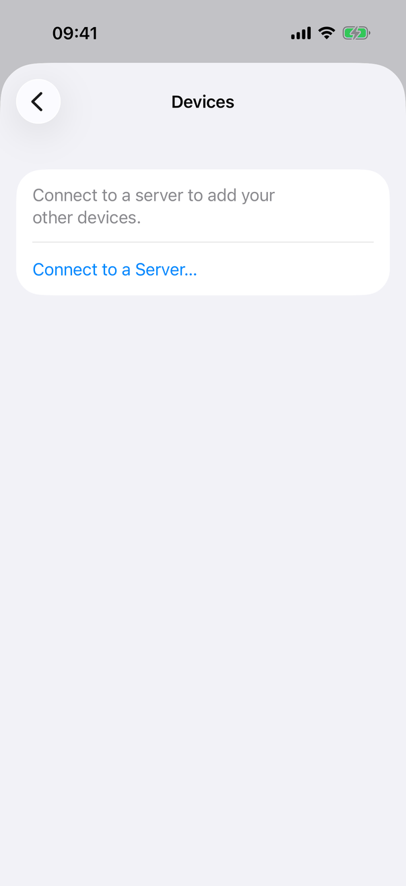
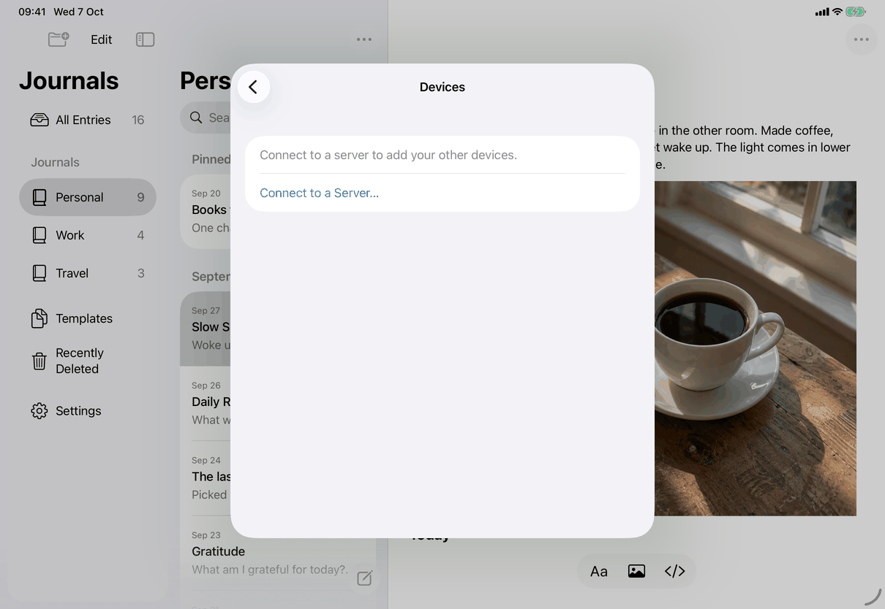
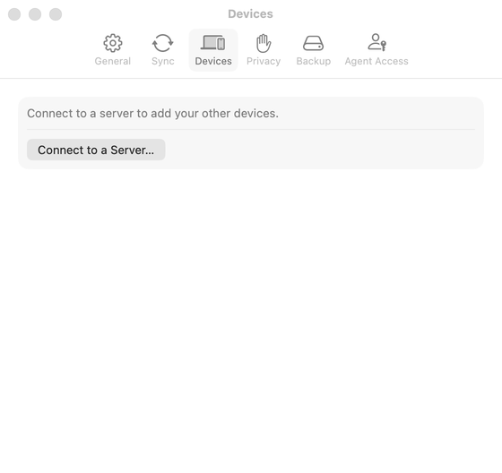

# Settings ▸ Devices (Apple)

`DevicesView` in `DevicesView.swift`, hosted by `SettingsView.pane(.devices)`. One `Form` with `.formStyle(.grouped)` on all devices. Spec: [settings-devices](../../../screens/settings-devices.md). Settings conventions: [platform.md](../platform.md#10-settings).

## Controls

Local `@State` holds everything: `devices: [ServerDevice]`, `loading`, `busy`, `error`, `unauthorized`, `add`, `connect`, `revoking`, `failedRevoke`. The server is reached through `AppModel.connectedClient()` (`Model/DeviceOperations.swift`), whose `devices()` and `revoke(_:)` calls are the only network use. The list is reloaded by `.task { await load() }` (when the pane appears) and by the Add Device sheet's `onDismiss`.

The `Form` shows exactly one of three bodies:

1. **Locked** (`model.locked`): a plain `Text` `settings.devices.locked`.
2. **Not connected** (`model.connection == nil`): `Text` `settings.devices.notConnected` in secondary style, then `Button` `common.connectToServer`, which sets `connect = true` and opens `ConnectionView` with `.sheet(isPresented:)` ([connect-to-server](connect-to-server.md)).
3. **Connected**, in order:
   1. While `loading`: `ProgressView("Loading Devices…")` (`settings.devices.loading`), a labelled spinner as the first row. It also shows during a reload while the previous list stays visible.
   2. `ForEach(devices.filter { !$0.revoked })`: one `Section` per device, in the order the server returned.
      - A `VStack(alignment: .leading, spacing: 3)` with the name, then (subheadline, secondary) `common.thisDevice` for the device whose id equals `model.connection?.deviceID`, then the added line from `DeviceDescriptions.added(_:)`. The stack uses `fixedSize(horizontal: false, vertical: true)` and `.accessibilityElement(children: .combine)`, so it is one element that wraps.
      - For every other device a `Button(role: .destructive)` `settings.devices.revoke`, `.disabled(busy)`, with accessibility label `DeviceDescriptions.revokeLabel` (`settings.devices.revokeLabel`, with ", " and the added line when another listed device has the same name). It is a second row of the same `Section`; this device's section has one row.
   3. When `error != nil`: a `Text` in secondary style (not red; not in a `Section`). The error is `settings.devices.error.load` (load failed), `common.couldntRevokeAccess` (revoke failed), or, when the server answered unauthorized (`unauthorized = true`), the sync state's message from `model.lostAccessHealth().message()` (`messages.sync.signInNeeded`, `messages.sync.serverNotSetUp`, `messages.sync.serverReplaced`, `messages.sync.accessRemoved`; `.accessRemoved` when the state can't be told).
   4. When `unauthorized`: one `Button` titled by `model.syncStatusAction` when it connects (`messages.sync.action.setUpServerAgain`, `messages.sync.action.connectAgain`, `common.signIn`), else `messages.sync.action.connectAgain`. It opens `ConnectionView`. Add Device… is not offered.
   5. Otherwise: after an error, `Button` `common.tryAgain` (`.disabled(busy)`; revokes `failedRevoke` again if one failed, else `load()`), then `Button` `settings.devices.add` (`.disabled(busy || loading)`), which sets `add = true` and presents `AddDeviceView` ([add-device](add-device.md)) with `.sheet(isPresented:onDismiss:)`; dismissing it reloads the list.
4. **Revoke confirmation:** `.confirmationDialog` on the form with `titleVisibility: .visible`; title `common.revokeAccessFor` (name interpolated; `settings.devices.revoke.titleFallback` while `revoking` is already nil during the close animation); message `settings.devices.revoke.message`, preceded by the added line and ". " only when `DeviceDescriptions.hasNamesake(_:)`; buttons `common.revokeAccess` (`role: .destructive`, starts `revoke(_:)`) and `common.cancel` (`role: .cancel`). A successful revoke removes the device from `devices` locally and clears `failedRevoke`; no reload.
5. **Locking:** `onValueChange(of: model.locked)` clears `devices` and sets `add`, `connect` and `revoking` to false, which closes the sheets and the dialog.

**How a device was added** (`DeviceDescriptions`, same file). `sentence(_:detail:)` builds the line from `device.origin`: `.pairing` gives `settings.devices.added.byDevice` when the approving device (`approvedByDeviceId`) is in the list (revoked devices still count as approvers), else `settings.devices.added.pairingCode`; `.setup` gives `settings.devices.added.setup`; `.recovery` depends on `configuration.recovery.formatVersion` (1 `settings.devices.added.recoveryKey`, 3 `settings.devices.added.accessPassword`, 4 `settings.devices.added.recoveryCode`, anything else `settings.devices.added.masterPassword`); `.unknown` gives `settings.devices.added.unknown`. The date is `createdAt.formatted(date: .abbreviated, time: .omitted)` in the device's locale (the captures read "Oct 7, 2026"; a British-English device reads "7 Oct 2026"). `init` makes two passes: devices that would read the same (same name and sentence) get the time (`.shortened`, joined with " at "), and those still the same get " · " plus the first eight lowercase characters of their id.

Device names are `AppModel.deviceName`: `Host.current().localizedName` on the Mac, `UIDevice.current.name` on iPhone and iPad (which iOS reports generically as "iPhone" or "iPad", the reason for the added line and the namesake rules).

## Layout

- **iPhone:** a pane pushed in the Settings sheet's `NavigationStack` (inline title "Devices", `settings.pane.devices`); sections are grouped rounded rows, the revoke button a red text row.
- **iPad:** the same pane in the centred Settings form sheet.
- **Mac:** the Devices tab of the Settings window (`laptopcomputer.and.iphone`), 560 points wide, at least 440 high, as the Sync tab ([settings-sync](settings-sync.md)). Sheets and the dialog attach to the Settings window.
- Add Device on the Mac is a sheet with `frame(minWidth: 400, idealWidth: 460, minHeight: 440, idealHeight: 540)` ([add-device](add-device.md)); Connect to a Server is 440 to 480 wide.
- Dynamic Type: no size handling of its own; the added lines wrap because of `fixedSize(horizontal: false, vertical: true)`.

## Commands and shortcuts

| Command | Placement | Shortcut | Enabled when |
| --- | --- | --- | --- |
| `connect-to-server` | Button when not connected, as in [commands.md](../commands.md) | none | always while unlocked |
| `sync-reconnect` | The reconnect button when access was refused | none | `unauthorized` |
| `revoke-device` | Destructive row in each other device's section | none | not this device; not while `busy` |
| `add-device` | Row at the end of the list | none | connected, not loading, not busy, access not refused |
| `devices-try-again` | Row before Add Device… after an error | none | after an error; not while `busy` |
| `settings-open-pane` | The Devices row (iPhone, iPad) or tab (Mac) | none | always |

No shortcuts on this pane. The revoke dialog uses the system's keys.

## Copy differences

None. One string per element on all devices; only the date format differs with the device's locale.

## Accessibility

- Each device's name, This Device and added line are one VoiceOver element (`.accessibilityElement(children: .combine)`).
- Revoke Access… has the label `settings.devices.revokeLabel` naming the device (and how it was added when names repeat), so a list of identical "Revoke Access…" rows is distinguishable by VoiceOver and Voice Control.
- The revoke dialog's title is visible and read first.
- Loading is a labelled `ProgressView`, which VoiceOver reads as "Loading Devices…". There is no announcement when loading ends or a revoke succeeds; the row simply disappears.
- Errors are plain text rows, not announced.

## Differences between iPhone, iPad and Mac

- Container: pushed pane (iPhone, iPad) versus tab (Mac), as Settings elsewhere ([platform.md](../platform.md#10-settings)).
- Revoke confirmation: a window-modal dialog on the Mac; on iPhone and iPad `confirmationDialog` is an action sheet or an anchored popover depending on the system (the iOS 26 form was captured for Stop Syncing, [stop-syncing](../flows/stop-syncing.md); this dialog was not captured).
- Add Device is a sheet over the Settings window on the Mac, a sheet over the Settings sheet on iPhone and iPad; the Mac's is excluded from screen capture ([add-device](add-device.md)).
- Device names: the Mac reports its computer name, iPhone and iPad a generic name, so the added lines matter most there.

## Screenshots

Sample library; the connected captures show only this device (no other device to revoke), so Revoke Access…, the loading row and every error row are not captured.

| Device | State | Capture |
| --- | --- | --- |
| iPhone | Not connected: explanation and Connect to a Server… |  |
| iPad | Connected: this device ("iPad", This Device, added during server setup) and Add Device… |  |
| iPad | Not connected (the button looks dimmed in this capture) |  |
| Mac | Connected, Devices tab |  |
| Mac | Not connected |  |

The iPhone connected capture, listed below, matches the iPad's.

-  iPhone: connected: this device with when it was added, and Add Device….

## Source files

View:
- `apps/apple/JournalApp/Views/DevicesView.swift`: the pane, the revoke dialog, and `DeviceDescriptions` (added lines, namesake detail, revoke label).
- `apps/apple/JournalApp/Views/SettingsView.swift`: places the pane (`pane(.devices)`) and the tab or row.

Model:
- `apps/apple/JournalApp/Model/DeviceOperations.swift`: `connectedClient()`, `deviceName`, `approveDevice`.
- `apps/apple/JournalApp/Model/SyncHealthOperations.swift`: `syncStatusAction`, `lostAccessHealth()` (runs a sync to learn why access was refused).

Design records: [devices.md](../../../../docs/design/devices.md), [pre-release-ui-2026-09-27.md](../../../../docs/design/pre-release-ui-2026-09-27.md), [sync-health-and-recovery.md](../../../../docs/design/sync-health-and-recovery.md).

## Open questions

See [open-questions.md](../../../open-questions.md), A39: possible stale state, read from the source and not run. After Connect to a Server or the reconnect button closes its sheet, `DevicesView` does not reload (`connect` has no `onDismiss`, `.task` ran only when the pane appeared), so a pane opened while not connected may show no device rows until it appears again, and an `unauthorized` error may stay on screen after a successful reconnect.
