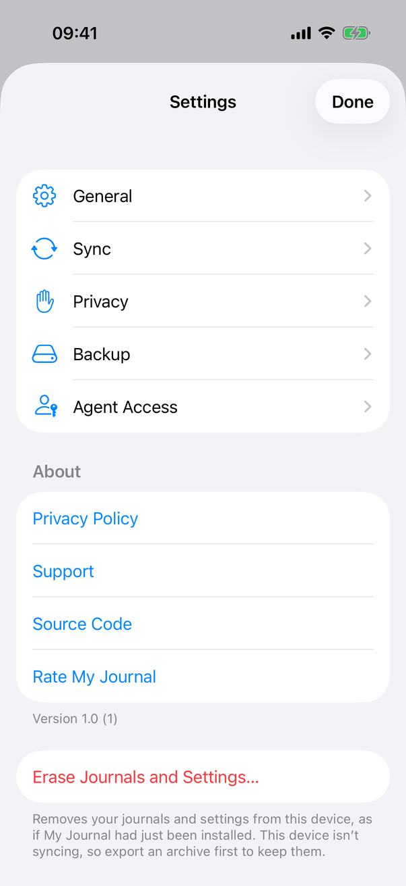

# Erase Journals and Settings (section and alerts) (Apple)

Neutral spec: [screens/settings-erase.md](../../../screens/settings-erase.md); behaviour in the flow [flows/erase.md](../../../flows/erase.md) (Apple note: `erase`). Container: `settings`. Conventions: [platform.md](../platform.md#8-alerts-and-confirmations) and [platform.md](../platform.md#17-app-data-backups-and-erasing).

Where it is: iPhone and iPad, a last section of its own in the Settings list; Mac, the last group of the General tab (see `settings-general`). The same `EraseSection` view serves both; `SettingsView` places it and passes a closure that runs after a successful erase.

## Controls

`EraseSection` (`Views/EraseSection.swift`), fed by `AppModel` (`store`, `eraseBlock`, `connection`, `eraseWarning()`, `eraseLibrary(shown:)`, `locked`, `formerMacServerFilesExist` on the Mac). It is a `Section` with the button, a footer, two alerts and one sheet.

- **Button** `settings.erase.button`, `Button(role: .destructive)`. Disabled unless `model.store != nil && model.eraseBlock == nil && !checking && !erasing`. `eraseBlock` is `.busy` while the library is being replaced, a server connection is being made, Delete All in Recently Deleted is running, a save has failed, encryption is running or an erase is already running. On the Mac only, the button also gets `.foregroundStyle(enabled ? Color.red : Color.secondary)`, because a Mac form does not colour a destructive role itself; on iOS the role draws it red (screenshot).
- **Footer** (`Text`): `settings.erase.footerConnected` when `model.connection != nil`, otherwise `settings.erase.footerLocal`; on the Mac, when `formerMacServerFilesExist` is true, a space and `settings.erase.footerFormerServer` are appended.
- **Warning alert**: `.alert("Erase Journals and Settings?" ..., presenting: warning)` (`settings.erase.alert.title`). `warning` is an `EraseWarning`; `Self.message(_:)` picks the message:

  | Case | Key |
  | --- | --- |
  | `onServer(host)` | `settings.erase.alert.onServer` |
  | `unsent(count, host)` | `settings.erase.alert.unsent` (plural) |
  | `unconfirmed(host)` | `settings.erase.alert.unconfirmed` |
  | `notSyncing` | `settings.erase.alert.notSyncing` |
  | `nothingWritten` | `settings.erase.alert.nothingWritten` |
  | `unopened(credential, host)` | `settings.erase.alert.unopened` and its parts (see below) |

  Buttons in declaration order: `common.exportArchive` ("Export Archive…", only when `losesJournals`: unsent, unconfirmed, not syncing), `settings.erase.alert.erase` with `role: .destructive`, `common.cancel` with `role: .cancel`. The system places the cancel-role button; no button is marked as the default. Export Archive… closes the alert and, after `afterAlertCloses` (a 350 ms wait so the sheet can appear), sets `exporting`, which presents `ArchiveExportSheet` (see `export-archive`); afterwards the person erases again from the button.
- **Failure alert**: `settings.erase.failed.title`, message `settings.erase.failed.message`, one `common.ok` button (role cancel).
- **The sixth warning, `unopened`.** Used only by `UnopenedEraseButton` (`Views/UnopenedEraseButton.swift`), the Erase button of the library problem screen and the lock screen of a missing device key, not by this section. It has the same title, Erase and Cancel buttons (no Export Archive…, because nothing can be read), a plain red `.buttonStyle(.plain)` button and the failure alert. It authenticates the device owner before showing the warning (when App Lock is on or cannot be known, `removalNeedsAuthentication`), and not again at Erase. Its message is built in code (`unopenedMessage`) from `settings.erase.alert.unopened.reasonCantOpen` or `.reasonNeedsKey` (with the credential name) and `.serverKnown` (with the host) or `.serverUnknown`; the spec describes it in [flows/erase](../../../flows/erase.md). The alert is not captured (see Screenshots).

States and transitions:
- Checking (`checking`): the button is disabled until the alert appears; the open entry is saved first (`eraseWarning()` calls `flush()`).
- Erasing (`erasing`): disabled. `eraseLibrary(shown:)` returns `.erased` (close Settings through the closure), `.changed(current)` (the warning appears again after `afterAlertCloses`), `.failed` (the failure alert after `afterAlertCloses`) or `.cancelled` (authentication cancelled or app locked; nothing shown).
- Locked: `.onValueChange(of: model.locked)` clears the warning, closes the export sheet and cancels checking (not a running erase). `.onDisappear` cancels checking.
- Without an open store (`model.store` is nil) the button is disabled.

## Layout

- **iPhone.** The last section of the Settings list, after About: one full-width red row and a multi-line footer; scroll to reach it (screenshot: the row and the start of the footer are at the bottom edge).
- **iPad.** The same section inside the Settings sheet, below the visible area in the capture; scroll the sheet.
- **Mac.** The last group of the General tab: a bordered button with red text in a grouped row, the footer below (`settings-general` screenshot). The pane grows with the footer, including the former-server sentence.
- The alert is the system's: centred on iPhone and iPad, a window-attached alert on the Mac.
- Dynamic Type: standard.

## Commands and shortcuts

| Command | Placement | Shortcut | Enabled when |
| --- | --- | --- | --- |
| `erase-device` | iPhone and iPad: last Settings section; Mac: end of General, as in [commands.md](../commands.md) | none | a library exists and nothing else is changing it, not while checking |
| `erase-confirm` | the Erase button of the warning alert | none | always |
| `export-archive` | the Export Archive… button of the warning alert | none | the case loses journals |

Keyboard: the alert follows the system's rules (Return for the default, Escape for Cancel on the Mac; this alert has no declared default button). No shortcut opens Erase.

## Copy differences

- `settings.erase.authReason`: lower case first letter on the Mac ("erase journals on this device"), because the system dialog reads "My Journal is trying to {reason}"; `AppModel.authenticationReason` applies it.
- `settings.erase.footerFormerServer` appears on the Mac only.
- The Mac draws the button red by code; iOS by role. No other wording differs.
- The `unopened` message and the problem-screen button text are literal strings in code; their keys are `settings.erase.alert.unopened*` and `settings.erase.button`.

## Accessibility

- The button is a destructive-role `Button`; VoiceOver announces it as a button, and the alert's destructive button is announced as destructive by the system.
- The alert message starts with the action to take ("Export an archive first...") for the three journal-losing cases.
- After erasing on iPhone and iPad, VoiceOver is sent a screen-changed notification 600 ms after the sheet closes; see `settings`.
- Authentication is the system's panel (Face ID, Touch ID or passcode; Mac login password).

## Differences between iPhone, iPad and Mac

- Placement: own section on iOS, last group of General on the Mac, each following that platform's Settings (Transfer or Reset).
- Colour: role-driven red on iOS, explicit red or secondary colour on the Mac (a Mac form does not tint destructive buttons).
- The former-server footer sentence exists only on the Mac, because only earlier Mac builds ran a server whose files can remain.
- Keychain clean-up in the flow differs: iOS removes every item of the app's keychain service (orphans from earlier installs); the Mac removes only items of this data folder and the old `agent-` ones, because development copies share the team's keychain group (`sweptKeychainAccounts`).
- After erasing the Mac opens a journal window if none is open; iPhone and iPad rely on the existing window.

## Screenshots

| Device | State |
| --- | --- |
| iPhone |  The Settings list scrolled to the top; the Erase row and the start of its footer at the bottom. |
| iPad |  The Settings sheet at its top; the Erase section is below the visible part. |

The alert is on the `erase` page. The Mac section is in the `settings-general` screenshot.

**Not captured:** the alert for journals that can't be opened (`unopened`) on iPhone, iPad and Mac. It is a system alert opened from the library problem screen, and the capture script has no state for it (design/spec-screenshots/README.md, Not captured, covers system sheets and panels). The page stays `draft`.

## Source files

View:
- `apps/apple/JournalApp/Views/EraseSection.swift`: the section, warnings' wording, the two alerts, the export sheet.
- `apps/apple/JournalApp/Views/UnopenedEraseButton.swift`: the variant for journals that cannot be opened.
- `apps/apple/JournalApp/Views/SettingsView.swift`: placement and `closeAfterErasing()`.

Model:
- `apps/apple/JournalApp/Model/EraseOperations.swift`: `EraseWarning`, `EraseBlock`, `eraseWarning()`, `eraseLibrary(shown:)`, `erasureList`, `finishEarlierErasures()`.
- `apps/apple/JournalApp/Model/LocalErasure.swift`: the commit by moving the configuration, deleting and leftovers.
- `apps/apple/JournalApp/Model/FormerMacServer.swift`: `formerMacServerFilesExist`.

Design records: `docs/design/erase-device-2026-10-04.md`, `client-only-mac-lists-markdown-2026-10-05.md`, `build-18-fixes-2026-10-06.md` (§2.1, journals that cannot be opened).

## Open questions

See [open-questions.md](../../../open-questions.md), C12 (the erase record still describes blocking on a Mac that runs a server). The sixth warning (`unopened`) is now in the spec and the catalog.
