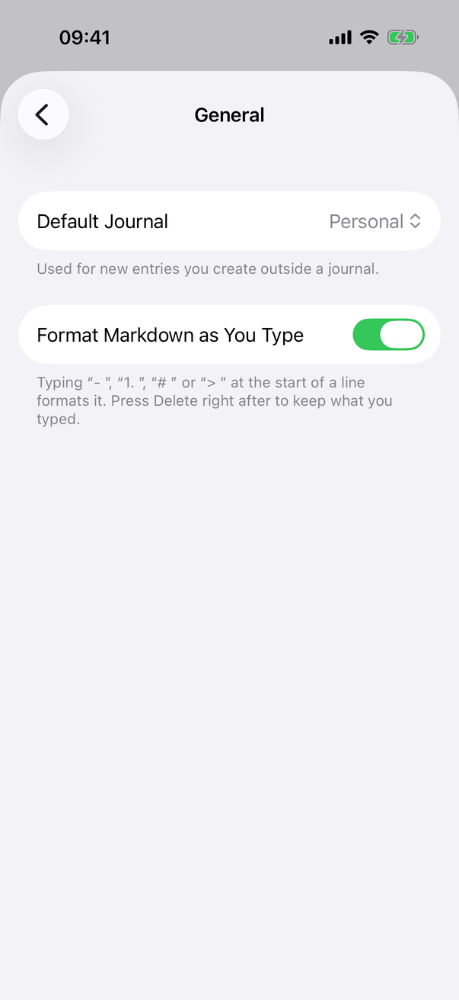
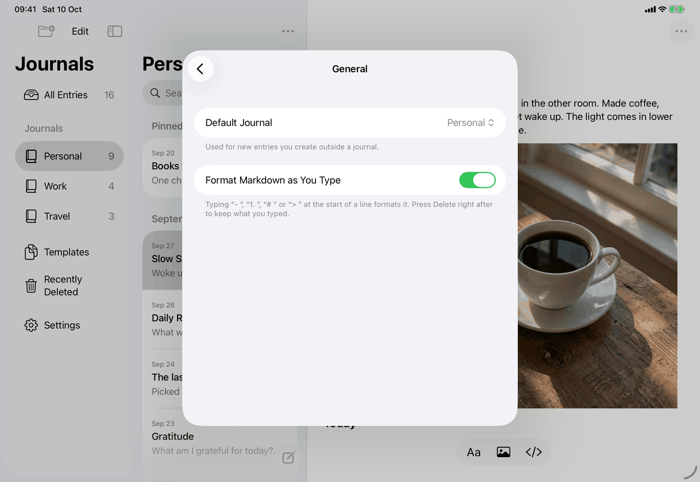
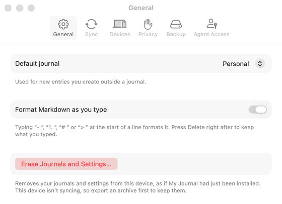

# Settings ▸ General (Apple)

Neutral spec: [screens/settings-general.md](../../../screens/settings-general.md). Container: `settings`. Conventions: [platform.md](../platform.md#10-settings).

This pane is called General on every device (a pushed list row on iPhone and iPad, a tab on the Mac; until 1.1 it was Writing on iPhone and iPad). The Mac tab also holds Erase Journals and Settings…; on iPhone and iPad Erase is a separate last section of the Settings list (`settings-erase`), by the owner's decision.

## Controls

Built by `SettingsView.generalSettings`: a `Form` with `.formStyle(.grouped)`. Models: `AppModel` (`journals`, `defaultJournal`, `chooseDefaultJournal(_:)`, in `Model/JournalNavigation.swift`); the Markdown switch is an `@AppStorage` bound to `MarkdownShortcuts.settingKey`.

1. **Default journal section**, built only when `model.journals` is not empty.
   - A `Picker` labelled `settings.general.defaultJournal` over `ForEach(model.journals)`, each option a `Text` of the journal's title or `common.untitledJournal`, tagged by journal id (`UUID?`). The order is the Journals list order (`model.journals`: journals in use, by rank). The selection reads `model.defaultJournal?.id` and writes through `chooseDefaultJournal`. The picker has no style modifier: it is the system's default for a grouped `Form`, a pop-up menu button on the Mac and a menu (value with up-down chevron) on iPhone and iPad.
   - Footer: `settings.general.defaultJournal.footer`.
   - `defaultJournal` returns the saved choice if that journal is still in use, otherwise the oldest journal in use (creation date, then identifier). The choice is stored in the local configuration file (`configuration.defaultJournalID`), per device, not synced.
   - Error state: if the configuration cannot be saved, `chooseDefaultJournal` restores the previous value and sets `model.error` to `messages.generic.defaultJournalFailed`; the app's general error alert shows it, and the picker still shows the old journal because it reads the model.
2. **Formatting section.** A `Toggle` labelled `settings.general.formatAsYouType` bound to the user default `formatMarkdownAsYouType` (on when the key is unset). Footer `settings.general.formatAsYouType.footer`. The editor reads the same default (`MarkdownShortcuts.enabled`), so the change applies at once. Erase removes the key, which restores on.
3. **Mac only: `EraseSection`** as the last group of the form (inside `#if os(macOS)`), after the Markdown section: see `settings-erase`.

There is no empty, loading or offline state; with no journals the first section is simply absent.

## Layout

- **iPhone.** A pushed screen titled "General" with a back button; two grouped sections, then empty space (screenshot).
- **iPad.** The same screen inside the Settings sheet (a centred form sheet), with the back button at the top left.
- **Mac.** The first tab of the Settings window. The pane has no minimum height (`tab == .general ? nil : 440` in `SettingsView.tab`), so the window is only as tall as its three groups; it is 560 points wide.
- Dynamic Type: standard form rows wrap, nothing custom.

## Commands and shortcuts

| Command | Placement | Shortcut | Enabled when |
| --- | --- | --- | --- |
| `choose-default-journal` | as in [commands.md](../commands.md): the pop-up in the first section | none | at least one journal exists |
| `toggle-format-as-you-type` | as in [commands.md](../commands.md): the switch | none | always |
| `erase-device` | Mac: last group of this pane; iPhone and iPad: its own section of the Settings list | none | see `settings-erase` |

Keyboard: the page adds no keys; the picker and switch are standard controls.

## Copy differences

- `settings.general.defaultJournal` and `settings.general.formatAsYouType`: sentence case on the Mac ("Default journal", "Format Markdown as you type"), title case on iPhone and iPad (`mac` variants), as System Settings does. The code selects them with `#if os(macOS)`.
- `settings.pane.general` is the pane name: "General" on every device (see `settings`).

## Accessibility

- The picker and the switch are named by their label text; the code adds no `.accessibility*` modifiers.
- Journal names in the picker are read as written; an untitled journal reads `common.untitledJournal`.

## Differences between iPhone, iPad and Mac

- Erase is in this pane only on the Mac, following System Settings ▸ General's Transfer or Reset; iOS has a last section instead.
- Label casing differs by platform convention (see Copy differences).
- The picker is a pop-up on the Mac and a menu on iOS, from the system's `Form` style, not a custom choice.

## Screenshots

| Device | State |
| --- | --- |
| iPhone |  (the capture predates the rename and its title still reads Writing) Default journal "Personal", Markdown switch on, both footers. |
| iPad |  The same inside the Settings sheet. |
| Mac |  The General tab, with the Erase group at the bottom; the window is inactive in the capture, so the controls are drawn in their inactive colours. |

## Source files

View:
- `apps/apple/JournalApp/Views/SettingsView.swift`: `generalSettings`, `defaultJournalSection`.
- `apps/apple/JournalApp/Views/EraseSection.swift`: the Mac's Erase group.

Model:
- `apps/apple/JournalApp/Model/JournalNavigation.swift`: `journals`, `defaultJournal`, `chooseDefaultJournal`.
- `apps/apple/JournalApp/Editor/MarkdownShortcuts.swift`: the setting key and its default.

Design records: `docs/design/default-journal.md`, `owner-decisions-2026-09-25.md`, `erase-device-2026-10-04.md`.

## Open questions

None.
