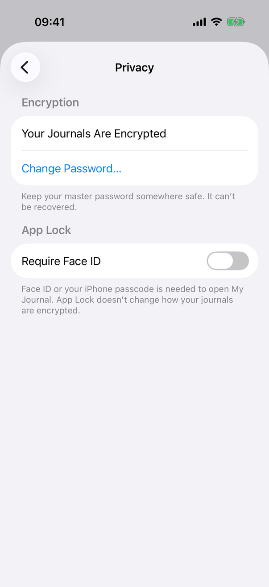
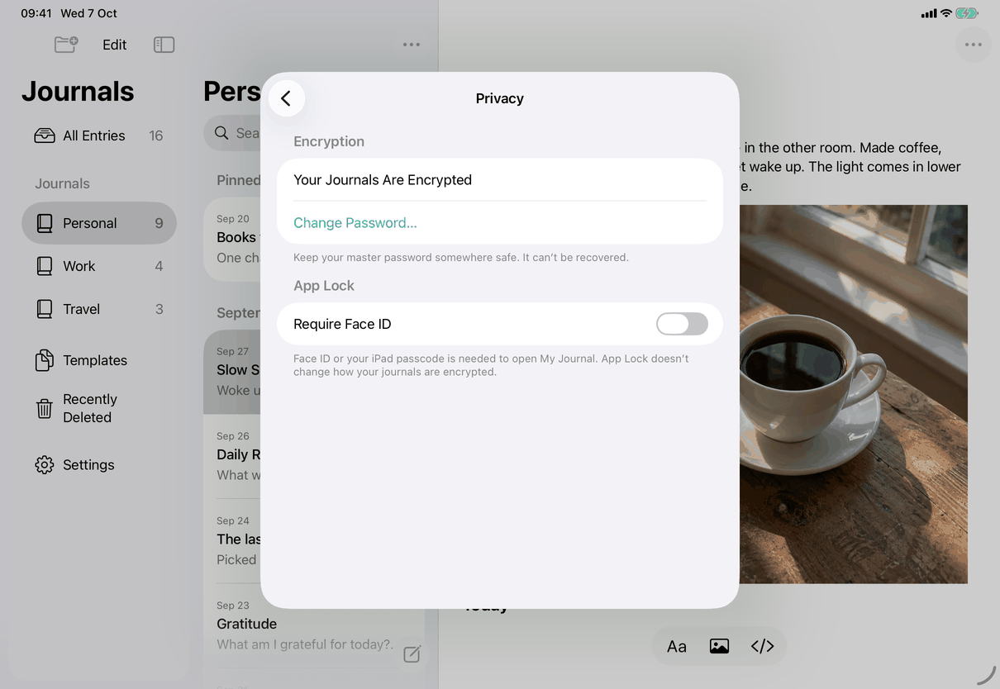
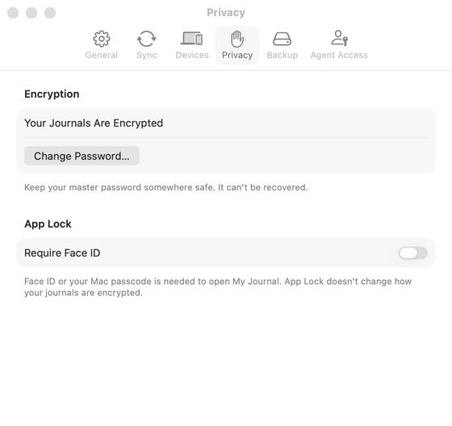
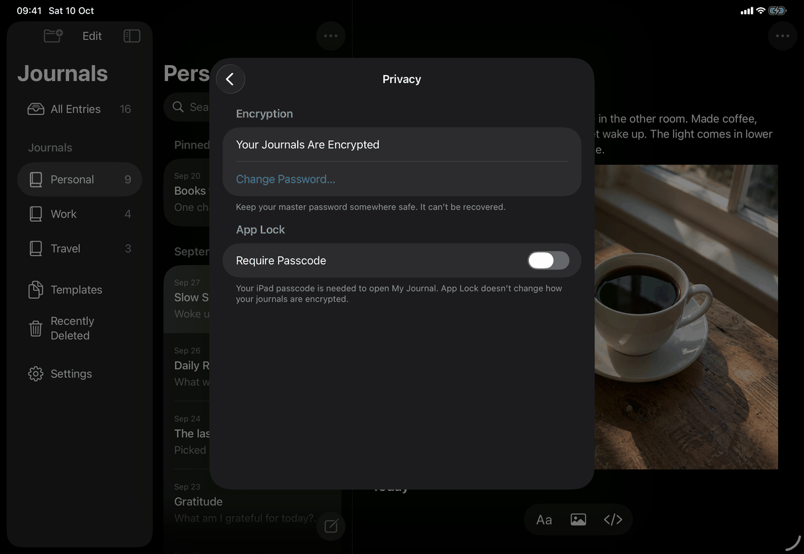
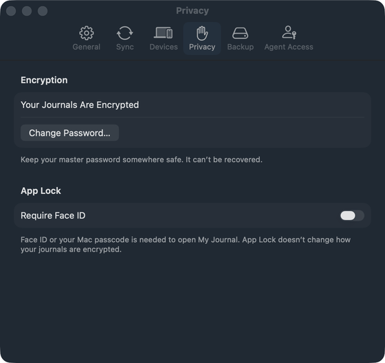
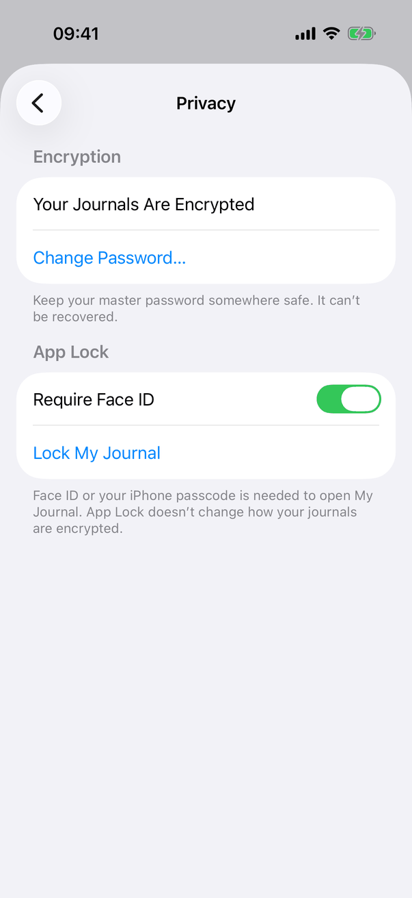
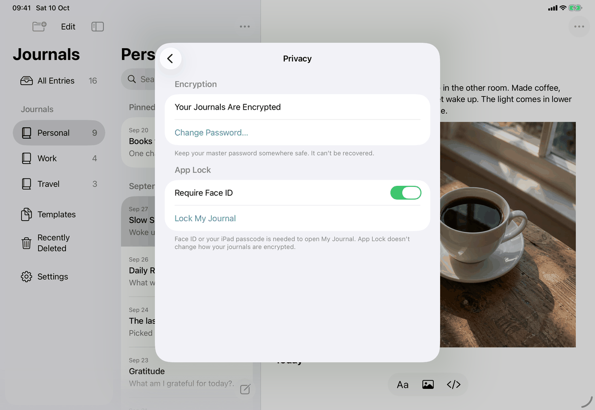
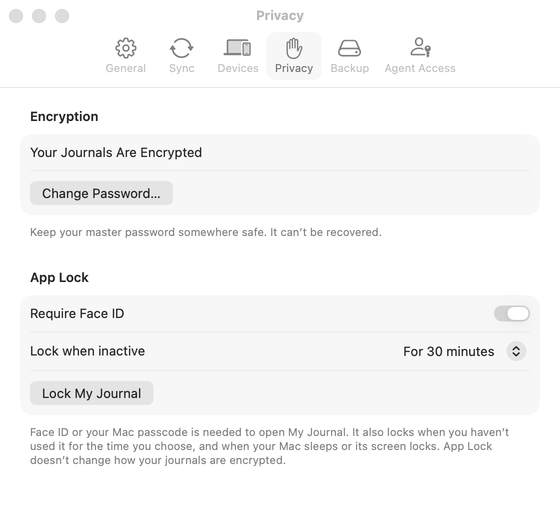
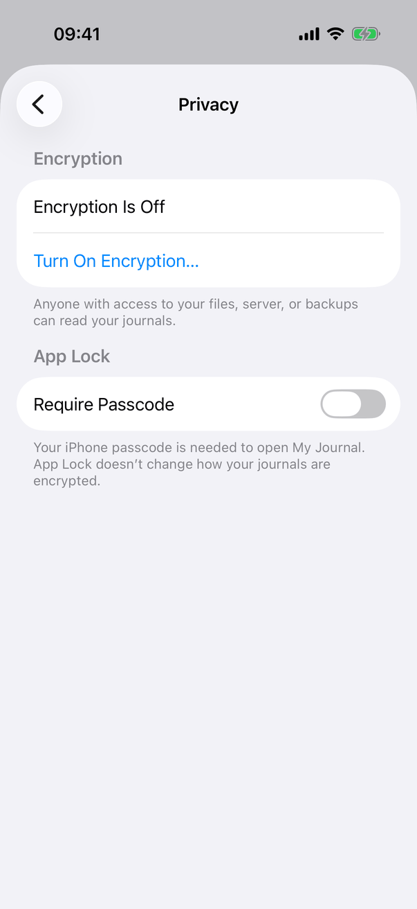
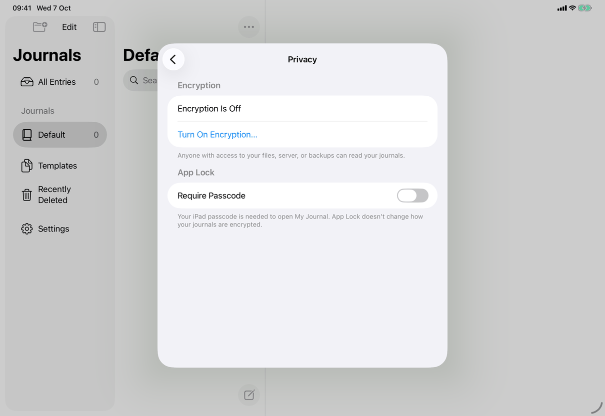

# Settings ▸ Privacy (Apple)

Neutral spec: [screens/settings-privacy.md](../../../screens/settings-privacy.md). Container: `settings`. Conventions: [platform.md](../platform.md#13-device-authentication-and-app-lock). The sheets this pane opens have their own pages (`encrypt-journals`, `change-password`, `connect-to-server`); App Lock behaviour is in the neutral flow [flows/app-lock.md](../../../flows/app-lock.md).

## Controls

Built by `SettingsView.privacySettings`: a `Form` with `.formStyle(.grouped)` that contains the two sections below only when `model.configuration != nil`. With no library (just after Erase, while Settings closes) it is empty.

**1. Encryption section: `EncryptionSettingsSection` (in the 1.1 encryption views, `Views/EncryptJournalsView.swift`).** Fed by `AppModel` and `model.encryption` (`EncryptionUpgrade`).
- Header: `settings.privacy.encryption.header`.
- Status `Text`: `settings.privacy.encryption.on` when `model.configuration?.encrypted != false`, otherwise `settings.privacy.encryption.off`. The Encrypt Your Journals form is attached to this `Text` as a `.sheet` (the sheet variant with Cancel; `screens/encrypt-journals`). Only an unencrypted library left by an earlier version, after Not Now, shows the off state.
- One action `Button`, the first that applies:
  - encrypted: `ChangePasswordButton` (`Views/ChangePasswordView.swift`): `settings.privacy.changePassword`, shown only when `configuration.recovery.formatVersion == 2` (master-password libraries; a recovery-key library shows nothing), `.disabled(model.locked)`, opens `ChangePasswordView` as a sheet.
  - not encrypted and `upgrade.offersSignIn`: `common.reconnect`, `.disabled(model.locked)`. It calls the closure passed in by `SettingsView`, which sets `connect = ConnectionRequest()`; the Settings view presents the sheet, titled Reconnect, over the pane. When the form sheet is dismissed after a reconnect request, `onDismiss` runs the same closure.
  - otherwise: `settings.privacy.encryption.turnOn`, `.disabled(model.locked || (model.replacingVault && !upgrade.pausesWriting))`, presents the form as a sheet with Cancel. While encryption is running the journals show the working notice instead (`Views/EncryptionNotice.swift`).
- Footer, same order: `settings.privacy.encryption.footerOn` with the credential's name lower-cased (`credentialName`, "password" if unknown); `messages.encryption.turnedOnElsewhere`; `common.unencryptedWarning`.
- The form as a sheet is dismissed with Cancel (Escape on the Mac); its sizes are on `encrypt-journals`.

**2. App Lock section: `AppLockSettingsSection` (`Views/AppLockSettings.swift`).**
- Header: `settings.privacy.appLock.header`.
- `Toggle` titled `settings.privacy.appLock.require` with the method name from `model.unlockState.availability` (`DeviceOwnerAvailability.method.name`: Face ID, Touch ID, Optic ID, Passcode on iPhone and iPad, Login Password on the Mac, whichever `DeviceAuthentication.swift` reports; the keys are `library.lock.method.*`). Its binding shows `requested ?? model.appLockOn`; `requested` holds the asked-for value while the system's authentication runs and the toggle is disabled meanwhile. It is also disabled when authentication is not usable and App Lock is off (`!usable && !model.appLockOn`); when App Lock is on it stays enabled so it can be turned off.
- Mac only, when App Lock is on: `InactivityLockPicker` (`Views/InactivityLockSettings.swift`), a `Picker` titled `settings.privacy.appLock.inactive` (a pop-up) with the choices 5 and 15 minutes, 30 minutes, 1 hour, then Never last (`InactivityLock.choices = [5, 15, 30, 60, 0]`, with a stored value that is not one of them inserted in order). Titles: `settings.privacy.appLock.inactive.minutes`, `settings.privacy.appLock.inactive.hours`, `common.never`. It is disabled while a change is being authenticated. Stored per library in `configuration.inactivityLockMinutes` (nil means the 30-minute default).
- When App Lock is on: `Button` `common.lockMyJournal`; it awaits `model.lock()` and then calls the closure that `dismiss()`es Settings.
- Footer from `availability`: available gives `settings.privacy.appLock.footer`, built from the method phrase (`library.lock.phrase.*`, with the device name from `UIDevice.userInterfaceIdiom` on iOS and "Mac" on the Mac) with its first letter upper-cased, plus on the Mac `AppModel.automaticLockSentence` (`settings.privacy.appLock.footerInactive` when a time is chosen, `settings.privacy.appLock.footerSleepOnly` for Never; empty on iPhone and iPad); `noPasscode` gives `settings.privacy.appLock.noPasscode`; otherwise `settings.privacy.appLock.unavailable`.
- Availability is re-read in `onAppear` of the section and whenever the app becomes active (`AppLockOperations.swift`).
- Error states: `.alert(item:)` with title `settings.privacy.appLock.error.turnOn` or `settings.privacy.appLock.error.turnOff`, message `settings.privacy.appLock.error.message`, the system's default OK button (`common.ok`), shown when the configuration could not be saved (`AppLockChange.notSaved`); the toggle then shows the old value. The Mac pop-up has its own alert: `settings.privacy.appLock.inactive.error`, message `settings.privacy.appLock.error.message`, button `common.ok`. A cancelled or failed authentication shows nothing.
- Authentication reasons (`settings.privacy.appLock.reason.turnOn`, `.turnOff`, `.change`) go through `AppModel.authenticationReason`, which lower-cases the first letter on the Mac because the system dialog reads "My Journal is trying to {reason}". Turning on needs availability `.available`; turning off with no passcode needs no authentication; a longer inactivity time or Never authenticates first, a shorter time does not.

## Layout

- **iPhone.** A pushed screen titled "Privacy" inside the Settings sheet; two grouped sections, links in tint colour (screenshots).
- **iPad.** The same pane in the centred Settings sheet; the form is the sheet's width and rows are wider, so footers wrap less.
- **Mac.** The Privacy tab, 560 points wide, minimum height 440 (`SettingsView.tab`). Buttons are bordered buttons inside grouped rows rather than tinted text, as the system draws a `Button` in a Mac grouped form. The Lock when inactive pop-up sits between the switch and Lock My Journal. The tab is tall enough for the Turn On Encryption, Change Password and Connect to a Server sheets.
- Dynamic Type: standard form rows and footers wrap; nothing custom.

## Commands and shortcuts

| Command | Placement | Shortcut | Enabled when |
| --- | --- | --- | --- |
| `turn-on-encryption` | the action row of the Encryption section; opens the form as a sheet | none | not locked, and not while the journals are being replaced unless the work is already running |
| `change-password` | same row | none | master-password library, not locked |
| `sync-reconnect` | same row, labelled `common.reconnect` | none | not locked |
| `toggle-app-lock` | the switch | none | not while the system asks; turning on needs authentication available |
| `set-inactivity-lock` | Mac only: the pop-up | none | App Lock on, not while asking |
| `lock-my-journal` | button below the switch (and pop-up on the Mac); the Mac also has ⌃⌘L in the application menu per [commands.md](../commands.md) | none in the pane | App Lock on |

Keyboard: no page-specific keys. The system's authentication panel takes Return for its default button on the Mac.

## Copy differences

- `settings.privacy.appLock.reason.turnOn`, `.turnOff`, `.change`: first letter lower case on the Mac (`mac` variants), because the Mac dialog reads "My Journal is trying to {reason}".
- `settings.privacy.appLock.noPasscode`: Mac says "set a login password for your Mac user in System Settings"; iPhone and iPad say "set a passcode for this {device} in Settings".
- `library.lock.phrase.touchID`: Mac says "Touch ID or your login password"; iPhone and iPad say "Touch ID or your {device} passcode".
- Method and device words vary by hardware: Face ID, Touch ID, Optic ID, Passcode (iOS), Login Password (Mac); iPhone, iPad, Mac. In the captures the device reports Face ID, or Passcode where Face ID is not enrolled, so the same screen shows "Require Face ID" in some captures and "Require Passcode" in others; the Mac capture's footer reads "Face ID or your Mac passcode", which comes from the capture device, not from the Mac wording above.
- The Mac pop-up titles use sentence case ("For 30 minutes", "Lock when inactive").

## Accessibility

- The switch is labelled with the method it requires ("Require Face ID"); the code adds no `.accessibility*` modifiers to this pane.
- The status line is a plain `Text`; the action rows are buttons, with an ellipsis where they open a sheet.
- While the system asks, the switch is `.disabled` and shows the requested value until the answer arrives.
- Failures are alerts, which the system announces.
- Lock My Journal locks and then closes Settings (iPhone and iPad), leaving the lock screen.

## Differences between iPhone, iPad and Mac

- Lock when inactive and the automatic-lock sentence exist only on the Mac. iPhone and iPad lock whenever the app leaves the screen, so no timer is needed.
- The method name differs (Face ID, Touch ID, Optic ID, Passcode on iOS; Touch ID or Login Password on the Mac) because each device offers different authentication; the footer names the device.
- Action rows are tint-coloured text on iOS and bordered buttons on the Mac: the system's `Form` styles.
- Lock My Journal closes the Settings sheet on iOS; on the Mac it calls `dismiss()` too, and the window shows the locked text if it remains open.

## Screenshots

| State | iPhone | iPad | Mac |
| --- | --- | --- | --- |
| Encrypted, App Lock off, light |  |  |  |
| Encrypted, App Lock off, dark |  |  |  |
| App Lock on (Lock My Journal; on the Mac also Lock when inactive "For 30 minutes" and the longer footer) |  |  |  |
| Encryption off ("Encryption Is Off", Turn On Encryption…, the unencrypted footer) |  |  | not captured |

The encryption-off iPad capture shows a library with one empty journal, so its sidebar differs from the other iPad captures. The Mac windows are inactive in the captures (grey controls).

## Source files

View:
- `apps/apple/JournalApp/Views/SettingsView.swift`: `privacySettings`, the Connect to a Server sheet.
- `apps/apple/JournalApp/Views/EncryptJournalsView.swift`: `EncryptionSettingsSection` and the form.
- `apps/apple/JournalApp/Views/ChangePasswordView.swift`: `ChangePasswordButton` and its sheet.
- `apps/apple/JournalApp/Views/AppLockSettings.swift`: the App Lock section and its alerts.
- `apps/apple/JournalApp/Views/InactivityLockSettings.swift`: Lock when inactive (Mac), `automaticLockSentence`, `keepsUnlockedWhile`.

Model:
- `apps/apple/JournalApp/Model/AppLockOperations.swift`: `setAppLock`, `checkDeviceOwner`, `authenticationReason`.
- `apps/apple/JournalApp/Model/DeviceAuthentication.swift`: method names and phrases, availability, `LAContext` use.
- `apps/apple/JournalApp/Model/InactivityLock.swift`: choices, `setInactivityLock`.
- `apps/apple/JournalApp/Model/LocalConfiguration.swift`: `appLock`, `inactivityLockMinutes`.
- `apps/apple/JournalApp/Model/EncryptionUpgrade.swift`: form state and `offersSignIn`.

Design records: `docs/design/enable-encryption.md`, `sync-security-2026-09-24.md`, `app-lock-system-auth.md`, `mac-inactivity-lock-2026-10-03.md`.

## Open questions

See [open-questions.md](../../../open-questions.md), C9 (the switch stays enabled while App Lock is on). Not verified: that `dismiss()` after Lock My Journal closes the Mac Settings window (the code calls it; the window shows the locked text either way).
