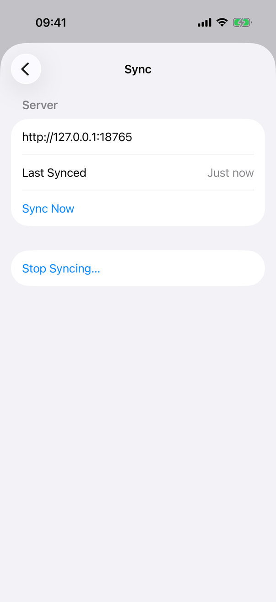
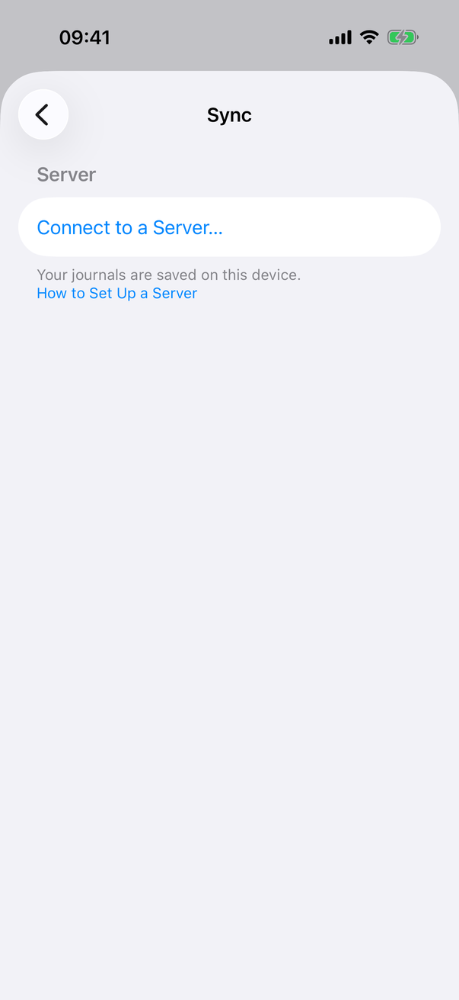
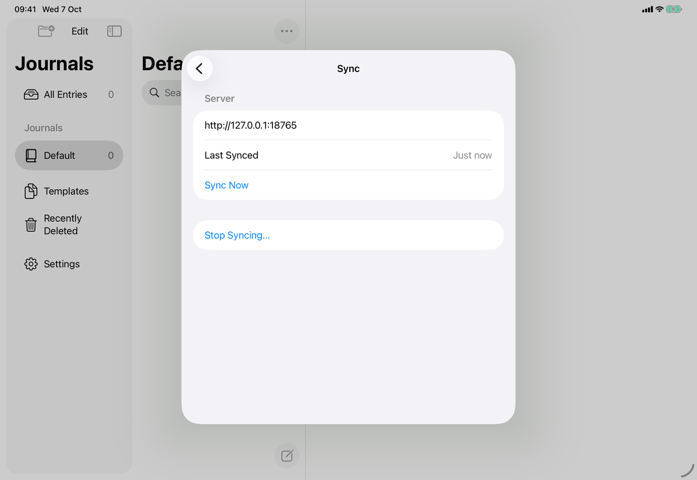
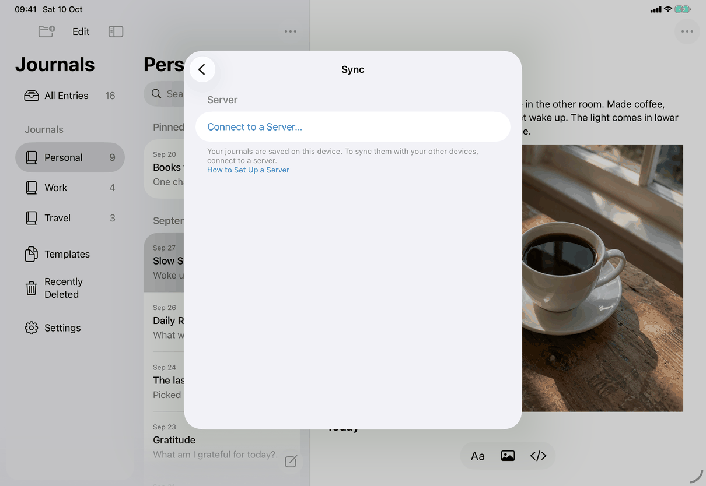
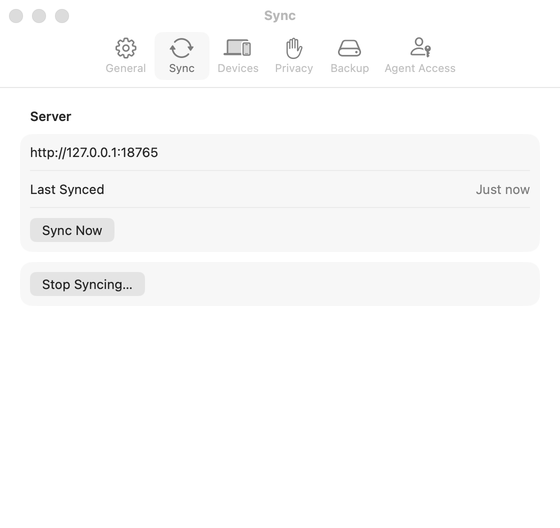
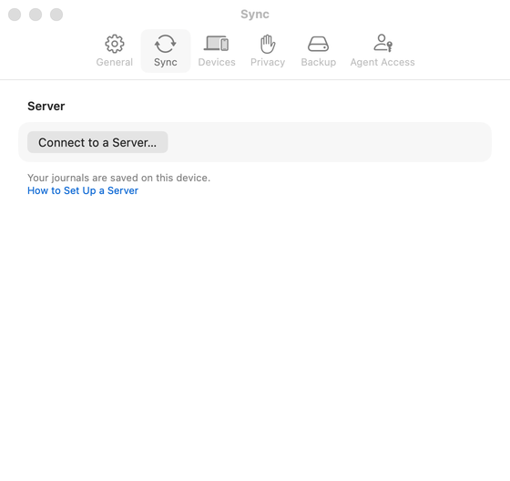
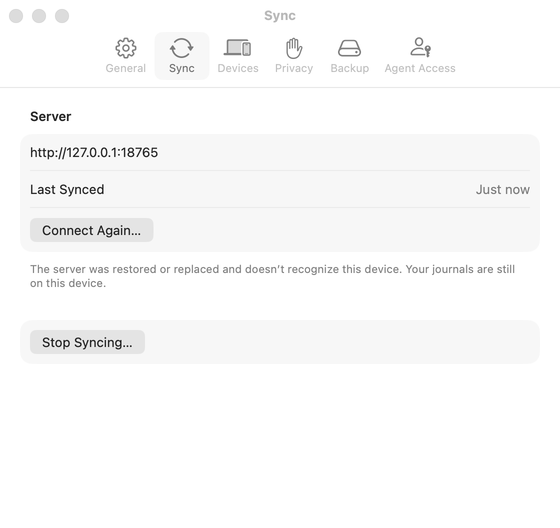

# Settings ▸ Sync (Apple)

The pane is `SettingsView.syncSettings` in `SettingsView.swift`, with its Last Synced, Not on Server Yet and action rows in `SyncNowRows.swift`. It is one `Form` with `.formStyle(.grouped)` on all three devices; what differs is the container around it (see Layout). Spec: [settings-sync](../../../screens/settings-sync.md). Settings conventions: [platform.md](../platform.md#10-settings).

## Controls

Model types: `AppModel` (`connection`, `syncError`, `syncHealth`, `serverRefusesThisDevice`, `saveFailure`, `libraryFooter`, `keptNotes`, `heldChangesNeedUpdate`, `configuration`), `SyncActivity` (`lastSynced`, `syncingNow`, `pendingItems`), `SyncStatusAction` (the single action: `.syncNow`, `.tryAgain`, `.checkAgain`, `.reconnect`). All three are in `Model/`. `syncSettings` builds the sections in this order: Server, Changed on Two Devices, Devices, Stop Syncing.

1. **Server section.** `Section` with header `settings.connect.server`.
   - Not connected: one `Button` `common.connectToServer`. It sets `connect = ConnectionRequest()`, which presents `ConnectionView` through `.sheet(item:)` on the Settings view ([connect-to-server](connect-to-server.md)). Each tap makes a new request value so a sheet that could not open during another transition never swallows later taps.
   - Connected: `Text(connection.address).textSelection(.enabled)` (the address exactly as typed, including `http://` for a local development server, as the screenshots show), then `SyncNowRows`:
     - **Last Synced** is a `LabeledContent` with `settings.sync.lastSynced`. It exists while `activity.syncingNow` or `activity.lastSynced != nil`. While syncing the value is `settings.sync.syncing` plus a small `ProgressView` that is hidden from accessibility. Otherwise the value is a `TimelineView(.everyMinute)` around `SyncActivity.description(of:now:)`: `settings.sync.lastSynced.justNow` under 60 seconds; under 24 hours a `RelativeDateTimeFormatter` (`.named`, `.full`, `.beginningOfSentence`, so "5 minutes ago", "2 hours ago"); `settings.sync.lastSynced.yesterday` for the previous calendar day; otherwise `settings.sync.lastSynced.date` with `day().month(.abbreviated)`, plus `.year()` when the year differs. Formatting follows the device locale, so a non-English or US-region device orders and spells the date its own way.
     - **Not on Server Yet** is a `LabeledContent` with `settings.sync.notOnServerYet` and the value `common.itemCount` (built by `SyncNowRows.items(_:)`: "1 item", "n items"), present only when `activity.pendingItems > 0`. The count is read by `model.refreshPendingItems()` in a `.task` on the action button (so when the pane appears) and after every `AppModel.sync()`.
     - **The action button** is `Button(action.title)` where `action = model.syncStatusAction`. The title is one of `messages.sync.action.syncNow`, `common.tryAgain`, `messages.sync.action.checkAgain`, `common.reconnect`. `model.perform(action, presentConnection:)` calls `syncNow()` for the first three and shows the sheet, titled Reconnect, for `.reconnect` (`syncStatusAction` returns it for `serverChanged` and `noAccess`). Disabled while `activity.syncingNow`; a non-connecting action is also disabled when `model.canSyncNow` is false (locked, library being replaced, a save has failed, no sync engine). Connecting actions stay enabled in those cases because they do not sync.
   - **Footer** (one `Text` in the section's `footer:`, first match wins, as the spec lists): `messages.sync.pausedForSaveFailure` (`SyncPauseNotice.saveFailed`) when connected and `model.saveFailure`; else `model.syncError` (set by `AppModel.sync()` from `model.syncMessage(of:)`, which calls `SyncHealth.message(host:hasPassword:)` with the library's mode, or the report's item-level problem such as `messages.sync.recordRefused`); else, not connected, `notConnectedFooter`; else `model.libraryFooter` (`messages.library.needsUpdate`). The not-connected footer is `settings.sync.footer.notConnected` ("Your journals are saved on this device. To sync them with your other devices, connect to a server."), a newline, then a tappable link (`AboutLink.link`, an `AttributedString` with a `.link` attribute inside the same `Text`) `settings.sync.footer.howToSetUp` to the sync guide. On the Mac only, when `configuration.stoppedSyncingWithFormerMacServer == true`, it is `settings.sync.footer.formerMacServer`, a newline and the link `settings.sync.footer.learnMore`.
   - **Held line**: while `AppModel.heldChangesNeedUpdate` is true (a conflict of an entry, template, journal or permanent deletion is held, from `JournalStore.heldConflictIDs()`), the Server section's footer text gets one more paragraph, `messages.conflict.kept.updateNeeded`, whatever else shows in it (connected or not).
   - Empty, loading, offline and error states: there is no separate view. Not connected is the Connect button plus footer. Syncing is the Last Synced value. Offline, unreachable and every other failure is the footer text plus the action button's title; nothing else on the pane changes.
2. **Changed on Two Devices section** (`KeptNotesSection` in `KeptNotesSection.swift`), a `Section` right after the Server section, shown only when `!model.locked` and `model.keptNoteRows` (built in `ConflictNotes.swift` from the `KeptNote` values of the sealed “kept-notes” key, read with the refresh snapshot, and the items as they are now) is not empty; header `messages.conflict.kept.section`, footer `messages.conflict.kept.footer`. One row per note, newest first: a row that opens something (the copy of an entry or template kept as two, `messages.conflict.kept.entry` or `messages.conflict.kept.entryNewer`; or an entry or template saved next to a permanent deletion, `messages.conflict.kept.deletedAndChanged`) is a single `Button` whose label is a `VStack` of the title (the copy’s current title), the sentence and the date and time (`.dateTime`), with a `chevron.right` disclosure indicator on iPhone and iPad, and `.accessibilityElement(children: .ignore)` with a combined label (title, sentence, date and time, in that order) and the hint `messages.conflict.kept.rowHint`; activating it (`open-kept-note`) closes the Settings sheet first on iPhone and iPad and then selects the item through `AppModel.openKeptNote` (Recently Deleted, Templates or Unavailable Journals opens when that is where it is) and marks the note seen; on the Mac it brings the library window forward and selects it. A journal rename (`messages.conflict.kept.journalRenamed`) and a journal against a permanent deletion (`messages.conflict.kept.journalDeleted`) are plain `Text` rows, combined into one element. The last row is a plain `Button` `messages.conflict.kept.clear` (`clear-kept-notes`) that removes every note at once, without a dialog. A row whose item is gone is dropped when the list is built.
3. **Devices section** (`DevicesSection` in `DevicesSection.swift`), built only while `model.connection != nil && !model.serverRefusesThisDevice` ([settings-devices](settings-devices.md)). It takes `reload`, which `SettingsView` raises when the Connect or Reconnect sheet it presents is dismissed.
4. **Stop Syncing section** (`StopSyncingSection`, only while `model.connection != nil`), last. A `Section` holding `Button` `settings.sync.stopSyncing`, plain role (not `.destructive`), disabled while `model.replacingVault`. The confirmation is a `.confirmationDialog(title, isPresented:, titleVisibility: .visible)` attached to the section: title `settings.sync.stopSyncing.title` with `model.connectionHost` (host plus port when not the default, from `ServerAddress.host`); message `settings.sync.stopSyncing.message`, with `settings.sync.stopSyncing.messageUnsent` (plural, from `activity.pendingItems`) appended after a space; buttons `settings.sync.stopSyncing.confirm` (calls `model.stopSyncing()`) and `common.cancel` with `role: .cancel`. See [stop-syncing](../flows/stop-syncing.md).
5. **Locked** and **library problem**: `SettingsView.body` replaces the whole Settings content with plain secondary text when `model.locked` (`settings.locked`) or `model.showsLibraryProblem` (the text `settings.libraryProblem`, "Settings are available once your journals open.", is hard-coded in `SettingsView.swift`); this pane is not built then.

## Layout

- **iPhone (compact):** `SettingsView` is presented by `RootView` as `.sheet(isPresented: $model.settingsPresented)`. Inside, `NavigationStack(path: $panes)` holds a `List` of panes; Sync is a `NavigationLink(value: AppSettingsTab.sync)` row (symbol `arrow.triangle.2.circlepath`) and is pushed with an inline navigation title. A pushed pane has the system back button; Done sits on the root list only.
- **iPad (regular):** the same sheet and `NavigationStack`, shown by UIKit as a centred form sheet (about 580 points wide in the captures) above the three-column window. Nothing in this pane reads the horizontal size class.
- **Mac:** `JournalApp` declares `Settings { SettingsView() }`. `settings` is a `TabView(selection: $model.settingsTab)`; the Sync tab is `.tabItem { Label("Sync", systemImage: "arrow.triangle.2.circlepath") }` (`settings.pane.sync`). Each tab is `.frame(width: 560)`, `minHeight: 440` (the General tab has no minimum), `maxHeight` the main screen's visible height minus 120, `.fixedSize()`, with `scrollBounceBehavior(.basedOnSize)` on macOS 13.3 and later, so the window is as tall as the tab and a long pane scrolls. The Sync tab is the exception: a fixed `min(640, maxPaneHeight)` that scrolls inside, so the window does not jump when Devices appears or goes. The window title follows the tab ("Sync"). Opening Settings on this tab from Sync Status sets `model.settingsTab = .sync` and `settingsPresented = true`; `SettingsPresenter` calls `openSettings()` (macOS 14) or sends `showSettingsWindow:`.
- **Dynamic Type:** nothing here sets a size; the grouped `Form`, `LabeledContent` and footers wrap with the system text size. At accessibility sizes `LabeledContent` stacks label over value, which is the system behaviour, not code in this app.
- **Opening at Sync (iPhone, iPad):** `model.openSyncSettings()` sets `settingsRequestedTab = .sync`; `SettingsView`'s `NavigationStack.onAppear` turns it into `panes = [.sync]`, so the sheet appears already on Sync. It is read once when the sheet appears; if Settings is already open the request is not applied.

## Commands and shortcuts

| Command | Placement | Shortcut | Enabled when |
| --- | --- | --- | --- |
| `connect-to-server` | Server section button (not connected), as in [commands.md](../commands.md) | none | always while unlocked |
| `sync-now` | Last button of the Server section (titles Sync Now, Try Again, Check Again) | none | not while `syncingNow`; needs `canSyncNow` |
| `sync-reconnect` | Same button (title Reconnect…), the only reconnect control of the pane | none | not while `syncingNow` |
| `add-device`, `revoke-device`, `devices-try-again` | Buttons of the Devices section ([settings-devices](settings-devices.md)) | none | connected, not refused; see that page |
| `stop-syncing` | Button of the Stop Syncing section | none | not while `replacingVault` |
| `open-kept-note`, `clear-kept-notes` | Row and last row of Changed on Two Devices | none | unlocked |
| `open-setup-guide` | Link in the not-connected footer | none | always |
| `open-former-server-guide` | Link in the former-server footer (Mac only) | none | always |
| `settings-open-pane` | The Sync row (iPhone, iPad) or tab (Mac) | none | always |

No pane-specific shortcuts. Return and Escape are the system's; the pane defines no key handling of its own.

## Copy differences

None for this pane's own text: the Swift source uses one string per element on all devices. The only Mac-specific element is the former-server footer (`settings.sync.footer.formerMacServer`, `settings.sync.footer.learnMore`), which exists only inside `#if os(macOS)`. The pane title is `settings.pane.sync` everywhere.

## Accessibility

- Last Synced and Not on Server Yet each use `.accessibilityElement(children: .combine)`, so VoiceOver reads label and value as one element. The `ProgressView` next to "Syncing…" is `accessibilityHidden(true)`.
- After Sync Now, Try Again or Check Again finishes, `AppModel.syncNow()` calls `JournalAccessibility.announce(syncError ?? (synced ? "Synced" : "Couldn’t sync."))` (`messages.sync.announce.synced`, `messages.sync.announce.failed`). Nothing is announced when the sync could not run. Automatic syncs announce nothing.
- The action button's title is its accessibility label; the connecting titles end with an ellipsis because they open a sheet.
- A Changed on Two Devices row is one element: label title, sentence, date and time; hint `messages.conflict.kept.rowHint` only when it opens something. Nothing is announced when a note is added.
- The Stop Syncing dialog has `titleVisibility: .visible`, so its title is on screen and read first.
- The footer link ("How to Set Up a Server", "Learn More") is a link inside the footer text; VoiceOver exposes it through the links rotor.
- Reduce Motion, Increase Contrast and Reduce Transparency need nothing here; the pane uses system `Form` styling and no animation of its own.

## Differences between iPhone, iPad and Mac

- Container: a pushed pane in a sheet (iPhone, iPad) versus a tab of the Settings window (Mac). The platform's own idiom: iOS Settings pushes panes, macOS Settings uses toolbar tabs ([platform.md](../platform.md#10-settings)).
- A Changed on Two Devices row that opens something has the disclosure chevron on iPhone and iPad and is a button on the Mac, where a grouped form has no chevron rows; the label and hint are the same.
- Buttons: plain tinted rows on iPhone and iPad, bordered buttons on the Mac. Both come from `Button` in a grouped `Form`; there is no custom style.
- The former-Mac-server footer exists only on the Mac, because only the Mac ever ran its own server ([docs/design/client-only-mac-lists-markdown-2026-10-05.md](../../../../docs/design/client-only-mac-lists-markdown-2026-10-05.md)).
- Stop Syncing confirmation: the captures (iOS 26) show a small popover anchored to the Stop Syncing row on both iPhone and iPad, without a visible Cancel button, and a window-modal dialog with Cancel and Stop Syncing on the Mac. `confirmationDialog` presents as an action sheet on earlier iPhone systems (the app supports iOS 16 and later); only the iOS 26 form was captured.
- Opening at Sync works differently: the Mac changes the selected tab, iPhone and iPad push the pane when the sheet appears.

## Screenshots

Sample library. The "connected" captures use a local development server (`http://127.0.0.1:18765`), so the address row shows plain HTTP; the iPad "connected" capture is behind an empty library. The "default" state is not connected.

| Device | State | Capture |
| --- | --- | --- |
| iPhone | Connected: address, Last Synced "Just now", Sync Now (this capture predates the Devices section, which now follows the Server section, with Stop Syncing… last) |  |
| iPhone | Not connected: Connect to a Server… and the footer with the How to Set Up a Server link |  |
| iPad | Connected, in the form sheet |  |
| iPad | Not connected |  |
| Mac | Connected, Sync tab (window 560 points wide) |  |
| Mac | Not connected |  |

Not captured: Syncing…, Not on Server Yet, an error footer or an action other than Sync Now, Changed on Two Devices (including the new entry and template rows), the former-server footer, a locked pane.

-  Mac: Settings ▸ Sync when the server was replaced: the explanation and its single action (the capture shows the label it had before 1.1, Connect Again…; the action is now Reconnect…).

## Source files

View:
- `apps/apple/JournalApp/Views/SettingsView.swift`: Settings container per device, `syncSettings`, the not-connected footer, the sheet for Connect to a Server, and the lists.
- `apps/apple/JournalApp/Views/SyncNowRows.swift`: Last Synced, Not on Server Yet, the action button, `StopSyncingSection` and its dialog, `SyncPauseNotice`.
- `apps/apple/JournalApp/Views/KeptNotesSection.swift` and `apps/apple/JournalApp/Model/ConflictNotes.swift`: the Changed on Two Devices section and its rows (`keptNoteRows`).
- `apps/apple/JournalApp/Views/DevicesSection.swift`: the Devices section and `DeviceDescriptions`.
- `apps/apple/JournalApp/Views/AboutLinks.swift`: footer link helper and the guide addresses.

Model:
- `apps/apple/JournalApp/Model/SyncHealthOperations.swift`: `SyncStatusAction`, `syncStatusAction`, `serverRefusesThisDevice`, `learnWhyAccessWasRefused`, `syncMessage(of:)`, `perform`, `stopSyncing`, `openSyncSettings`, `refreshPendingItems`.
- `apps/apple/JournalApp/Model/SyncSchedule.swift`: `SyncActivity` (Last Synced storage and wording), `syncNow()`, automatic sync pace.
- `apps/apple/JournalApp/Model/LibraryOperations.swift`: `libraryFooter`.
- `apps/apple/JournalApp/Model/FormerMacServer.swift`: the Mac-only one-time stop for the removed built-in server.
- `apps/apple/JournalApp/Model/AppModel.swift`: `sync(retryingRefused:waitingForWritingPause:)` sets `syncError`, `syncHealth`, `pendingSync`.

Core:
- `apps/apple/Packages/JournalCore/Sources/JournalCore/SyncHealth.swift`: the states, their messages and kinds.

Design records: [sync-now-and-done.md](../../../../docs/design/sync-now-and-done.md), [sync-health-and-recovery.md](../../../../docs/design/sync-health-and-recovery.md), [quiet-sync-and-title-alignment.md](../../../../docs/design/quiet-sync-and-title-alignment.md), [client-only-mac-lists-markdown-2026-10-05.md](../../../../docs/design/client-only-mac-lists-markdown-2026-10-05.md).

## Open questions

See [open-questions.md](../../../open-questions.md). The text of `SyncHealth.localDataUnreadable` and the `localDataUnavailable` state are now in the spec (`messages.sync.localDataUnreadable`, `messages.sync.localDataUnavailable`; [sync-recovery](../flows/sync-recovery.md)).
